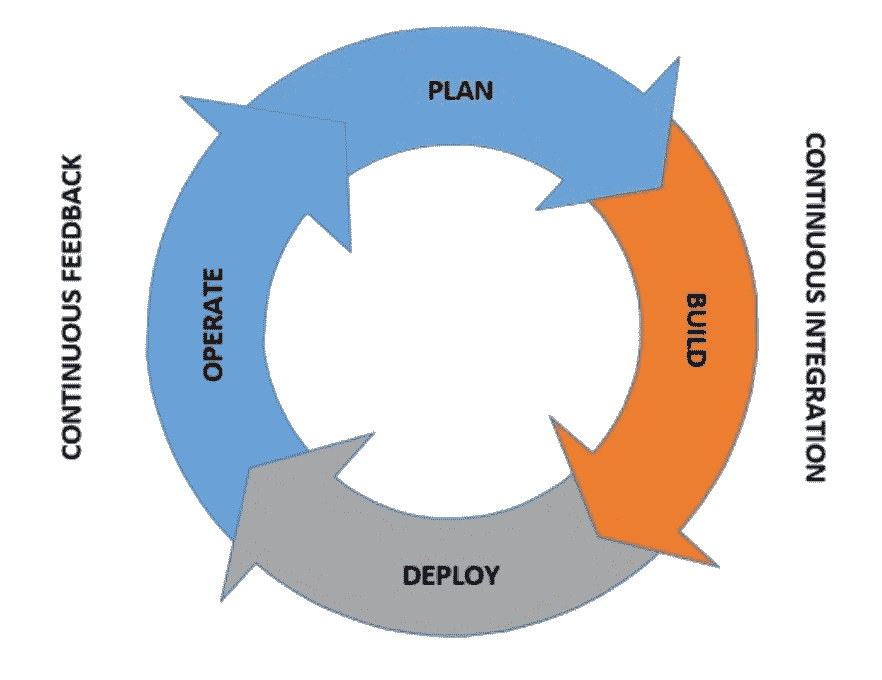

# DevOps 概述

> 原文:[https://web . archive . org/web/20220930061024/https://www . bael dung . com/ops/devo PS-overview](https://web.archive.org/web/20220930061024/https://www.baeldung.com/ops/devops-overview)

## 1.概观

在本文中，我们将了解 DevOps 原则和实践的基础。我们将看到为什么这在软件开发中是相关的和有帮助的。我们还将了解如何有意义地采用 DevOps，以及在这个过程中有哪些工具可以帮助我们。

## 2.历史关联

如果不回顾一下历史，我们就无法欣赏今天的 DevOps。软件开发的早期主要以我们称之为瀑布方法为特征。这实际上意味着**软件被概念化，设计，开发，测试，并连续发布**。

每一步都尽可能的详细，因为回去是非常昂贵的。这实际上意味着思想和行动之间有更长的等待时间。然而，这并不是一个大问题，因为技术领域的不稳定性要小得多，而且中断也不会太普遍。

有趣的是，这种模式并没有持续多久。随着技术步伐的改变，中断开始频繁发生，企业开始感受到压力。他们需要更快地测试新想法。这意味着包括软件在内的业务各个方面都将发生更快的变化。

这催生了一个全新的软件开发方法的世界，它被松散地放在敏捷的保护伞下。敏捷宣言为**软件交付提出了一套要遵循的原则，以更快的反馈循环**小增量交付。实践中有几个敏捷框架，像 [Scrum](https://web.archive.org/web/20220523133328/https://www.scrum.org/resources/what-is-scrum) 和[看板](https://web.archive.org/web/20220523133328/https://kanbanize.com/kanban-resources/getting-started/what-is-kanban/)。

## 3.什么是`DevOps`？

我们已经看到，具有更快反馈的增量开发已经成为今天软件交付的基石。但是我们如何做到这一点呢？虽然传统的敏捷方法将我们带到了一个合理的点，但它仍然不理想。

敏捷方法在不断努力打破孤岛的过程中不断完善自己。

传统上，我们总是有不同的团队负责开发和交付软件。这些团队经常各自为政。这有效地转化为更长的反馈周期，这不是我们对敏捷方法的期望。

因此，不需要太多的推理就可以理解，集成良好的、跨职能的敏捷团队更适合实现他们的目标。DevOps 是**鼓励软件开发和运营团队之间的沟通、协作、集成和自动化的实践**。这更好地使我们能够以更快的反馈实现增量开发。

下图解释了练习 DevOps 的可能工作流程:

 

虽然我们将在本教程的后面详细介绍这些步骤，但是让我们了解 DevOps 的一些关键原则:

*   以价值为中心的方法(由最终用户实现)
*   协作文化(通过有效的沟通、流程和工具)
*   流程自动化(提高效率和减少错误)
*   可衡量的结果(根据目标进行衡量)
*   持续反馈(有快速改进的趋势)

## 4.如何开始旅程？

虽然这一理论简单明了且颇具吸引力，但真正的挑战在于有意义地实践 DevOps。正如我们到目前为止所收集到的， **DevOps 主要是关于人，而不是团队**。

共同的目标、有效的沟通和跨职能的技能是这种团队的标志。由于这种变化很大一部分是文化上的，所以它通常是缓慢的，而且并非没有摩擦。

### 4.1.动机

仅仅因为有一个流行的实践并不一定适合我们。我们需要理解我们任何转变的动机——如果我们正在向敏捷转变，就更需要理解。通过定义我们想要实现的目标来着手是很有用的。

任何组织中 DevOps 的目标都依赖于该组织的抱负、文化和成熟度。以下是一些更常见的 DevOps 目标:

*   为最终用户提供更好的体验
*   更快上市
*   平均恢复时间缩短

### 4.2.采用

请记住，DevOps 不是最终状态，而是实现目标的持续改进过程。因此，团队中的每个人都必须努力**识别障碍并迅速排除它们**。这里有一些活动可以帮助我们开始:

*   清楚地了解构思到生产周期的当前状态
*   收集一些明显的瓶颈，并使用指标来做出实际的决策
*   对消除后将增加最大价值的瓶颈进行优先排序
*   定义一个迭代计划，为优先化的项目增量地交付价值
*   遵循开发-部署-测量的短周期来实现目标

## 5.DevOps 实践

有几种做法可以遵循，但这种想法不应该使用任何作为黄金标准。我们应该在我们的状态和目标的背景下仔细检查每一个实践，然后做出明智的决定。然而，几乎所有的实践都倾向于尽可能地将过程自动化。

### 5.1.敏捷规划

敏捷计划是在短时间内定义工作的实践。虽然最终目标应该是明确的，但没有必要预先定义和详述整个应用程序。这里的关键是**根据 it 能够交付的价值来确定工作的优先级**。

然后，它应该在一个短而有效的增量迭代中被打破。

### 5.2.基础设施代码(IaC)

这是通过机器可读的配置文件管理和供应基础设施的**实践。我们还在版本控制系统中管理这些配置，就像管理我们的代码库一样。有许多特定于领域的语言可用于以声明方式创建这些配置文件。**

### 5.3.测试自动化

传统上，软件测试是一项手工工作，通常在小仓库中进行。这不符合敏捷原则。因此，当务之急是我们尝试**在所有层面上自动化软件测试，比如单元测试、功能测试、安全测试和性能测试**。

### 5.4.持续集成

持续集成是将工作代码更频繁地以小增量合并到共享存储库的实践。通常，在这个共享存储库上经常运行自动构建和检查，以尽快提醒我们任何代码中断。

### 5.5.持续交付/部署(CD)

连续交付是指一旦通过所有检查就以小增量发布软件的**实践。这通常与持续集成一起实践，并且可以受益于自动化发布机制(称为持续部署)。**

### 5.6.连续监视

监控——也许是开发运维的核心——可以实现更快的反馈循环。确定正确的指标来监控软件的所有方面，包括基础设施，是至关重要的。拥有正确的指标，加上实时有效的分析，有助于更快地发现和解决问题。此外，它直接反馈到敏捷计划中。

这个列表远非完整，而且还在不断发展。实践 DevOps 的团队不断地找出更好的方法来实现他们的目标。其他一些值得一提的实践包括容器化、云原生开发和微服务等等。

## 6.贸易工具

不讨论工具，关于 DevOps 的讨论就不完整。这是一个在过去几年里爆发的领域。当我们读完这篇教程的时候，可能会有一个新的工具出现！虽然这很诱人，同时也让人不知所措，但还是有必要谨慎行事。

我们不能在开始开发之旅时，首先想到的就是工具。在找到合适的工具之前，我们必须探索并建立我们的目标、人员(文化)和实践。清楚这一点后，让我们看看有哪些经过时间考验的工具可供我们使用。

### 6.1.规划

正如我们已经看到的，一个成熟的 DevOps 总是从敏捷规划开始。虽然目标很明确，但是只需要为几个短的迭代划分优先级和定义工作。来自这些早期迭代的反馈对于最终塑造未来的迭代和整个软件是无价的。一个有效的工具可以帮助我们轻松地完成这个过程。

**[【吉拉】](https://web.archive.org/web/20220523133328/https://www.atlassian.com/software/jira)是 Atlassian 开发的顶级问题跟踪产品。**它有许多内置的敏捷规划和监控工具。很大程度上，它是一个商业产品，我们既可以在内部运行，也可以用作托管应用程序。

### 6.2.发展

敏捷背后的想法是更快地构建原型，并寻求对实际软件的反馈。开发人员必须做出更改，并更快地合并到软件的共享版本中。团队成员之间的交流更加流畅和快速。

让我们看看这个领域中一些无处不在的工具。

**[Git](https://web.archive.org/web/20220523133328/https://git-scm.com/) 是一个分布式版本控制系统。**它相当受欢迎，并且有许多提供 git 存储库和增值功能的托管服务。最初由 Linus Torvalds 开发，它使得软件开发人员之间的协作非常方便。

**[Confluence](https://web.archive.org/web/20220523133328/https://www.atlassian.com/software/confluence) 是 Atlassian** 开发的协作工具。协作是任何敏捷团队成功的关键。协作的实际语义是非常上下文相关的，但是一个使工作无缝的工具仍然是非常宝贵的。汇流正好符合这一点。此外，它与吉拉融合得很好！

**[Slack](https://web.archive.org/web/20220523133328/https://slack.com/intl/en-in/) 是由 Slack Technologies 开发的即时通讯平台。**正如我们所讨论的，敏捷**团队应该能够协作和交流，最好是实时的**。除了即时通讯之外，Slack 还提供了许多与单个用户或一组用户交流的方式——并且它与其他工具如吉拉和 GitHub 集成得很好！

### 6.3.综合

由开发人员合并的变更应该被持续地检查是否符合。构成法规遵从性的内容是特定于团队和应用程序的。然而，将静态和动态代码分析，以及功能性和非功能性的度量标准视为符合性的组成部分是很常见的。

让我们简单看一下几个流行的集成工具。

詹金斯是一款引人注目的开源免费自动化服务器。它在行业中已经存在多年，并且已经足够成熟，可以为大量自动化用例提供服务。它提供了一种定义自动化例程的声明性方法，以及多种自动或手动触发它的方法。此外，它有一个丰富的插件集，提供几个额外的功能来创建强大的自动化管道。

**[sonar cube](https://web.archive.org/web/20220523133328/https://www.sonarqube.org/)是 SonarSource 开发的开源连续检测平台。**sonar cube 为许多编程语言提供了丰富的静态分析规则。这有助于尽早发现代码气味。此外，SonarQube 提供了一个仪表板，可以集成其他指标，如代码覆盖率、代码复杂性等等。并且，它与 Jenkins 服务器配合得很好。

### 6.4.交付

快速交付软件的变更和新特性是很重要的。一旦我们确定了存储库中合并的变更符合我们的标准和策略，我们就应该能够快速地将其交付给最终用户。这有助于我们收集反馈，更好地塑造软件。

这里有几个工具可以帮助我们自动化交付的某些方面，直到我们实现连续部署。

Docker 是一个流行的工具，可以快速地封装任何类型的应用程序。它利用操作系统级虚拟化将软件隔离在称为容器的包中。容器化**在更可靠的软件交付方面有直接的好处**。Docker 容器通过定义明确的通道相互对话。此外，与虚拟机等其他隔离方式相比，这是相当轻量级的。

**[厨师](https://web.archive.org/web/20220523133328/https://www.chef.io/) / [木偶](https://web.archive.org/web/20220523133328/https://puppet.com/) / [替身](https://web.archive.org/web/20220523133328/https://www.ansible.com/)都是配置管理工具。众所周知，软件应用程序的实际运行实例是代码库构建及其配置的组合。虽然代码库的构建通常在不同的环境中是不可变的，但是配置却不是。这就是**我们需要一个配置管理工具来轻松快速地部署我们的应用的地方**。在这个领域有几个流行的工具，每个工具都有自己的特点，但是 Chef、Puppet 和 Ansible 基本上都涵盖了。**

**[HashiCorp Terraform](https://web.archive.org/web/20220523133328/https://www.terraform.io/) 可以帮助我们进行基础设施配置**，自私有数据中心时代以来，这一直是一项繁琐而耗时的任务。但是，随着越来越多的人采用云，基础架构通常被视为一次性和可重复的构造。然而，这只有在我们拥有**这个工具的情况下才能实现，通过这个工具，我们可以明确地定义从简单到复杂的基础设施，并且只需点击一个按钮**就可以创建它。这听起来可能像一个梦想序列，但 Terraform 正在积极尝试弥合这一差距！

### 6.5.监视

最后，能够观察部署并根据目标对其进行测量是至关重要的。我们可以从系统和应用程序中收集大量指标。这些包括一些特定于我们的应用程序的业务指标。

这里的想法是能够几乎实时地收集、管理、存储和分析这些指标。在这一领域有几个新产品，包括开源产品和商业产品。

**[【Elastic-Logstash-Kibana(ELK)](https://web.archive.org/web/20220523133328/https://www.elastic.co/what-is/elk-stack)是三个开源项目** — Elasticsearch、Logstash 和 ki Bana 的堆栈。Elasticsearch 是一个高度可扩展的搜索和分析引擎。Logstash 为我们提供了一个服务器端数据处理管道，能够使用来自各种来源的数据。最后，Kibana 帮助我们将这些数据可视化。总之，这个堆栈可以**用于聚集来自所有应用程序的日志等数据，并对它们进行实时分析**。

**[普罗米修斯](https://web.archive.org/web/20220523133328/https://prometheus.io/)是一款开源的系统监控和警报工具**，最初由 SoundCloud 开发。它带有一个多维数据模型，一种灵活的查询语言，并且可以通过 HTTP 拉时序数据。 **[Grafana](https://web.archive.org/web/20220523133328/https://grafana.com/grafana/) 是另一个开源的分析和监控解决方案**，可以与多个数据库协同工作。普罗米修斯和格拉夫纳一起可以**给我们一个实时处理我们的系统能够产生的几乎任何指标的方法**。

## 7.DevOps 扩展(还是真的！)

我们已经看到，DevOp，从根本上来说，是一个为更快和迭代的基于价值的软件交付消除障碍的持续努力。现在，一个直接的结论是，这里不可能有最终状态。

人们意识到的开发和运营团队之间的摩擦并不是唯一的摩擦。打破组织内的孤岛以增加协作是中心思想。现在，人们很快开始意识到**类似的摩擦存在于开发和测试团队之间，以及开发和安全团队之间**。许多传统机构都有专门的安全和性能团队。

DevOps 的全部潜力永远无法实现，除非我们能够打破团队之间几乎所有的界限，并帮助他们更有效地协作。这本质上意味着将测试、安全和性能等团队纳入进来。

混乱主要在于它的命名。DevOps 让我们明白它主要是关于开发和运营团队的。因此，随着时间的推移，新的术语出现了，涵盖了其他团队。但很大程度上，这只是 DevOps 被更有效地实现了！

### 7.1.开发测试平台

DevOps 的基石是**以小增量**和更频繁地交付高质量的软件。这里强调质量有很多方面。在某种意义上，我们经常假设我们采用的 DevOps 实践将帮助我们实现这一点。此外，我们之前讨论的许多实践都关注于始终确保高质量，这也是事实。

但是软件的功能测试有更广泛的范围。很多时候，我们倾向于在软件交付的最后进行更高阶的测试，比如端到端测试。更重要的是，这通常是在过程后期参与的单独团队的责任。这就是事情开始偏离 DevOps 原则的地方。

我们更应该做的是**从最开始**就在所有级别上整合软件测试。从计划阶段开始，软件测试就应该被认为是交付的一个组成部分。此外，同一个团队应该负责开发和测试软件。这就是 DevTestOps 广为人知的做法。这通常也被称为连续测试和左移。

### 7.2.DevSecOps

安全性是任何软件开发不可或缺的一部分，也有其复杂性。这通常意味着我们有一个独立的安全专家团队，当我们准备好发布产品时，我们就与他们合作。他们在这个阶段发现的漏洞修复起来可能会很昂贵。这再次与 DevOps 的原则不一致。

到这个时候，我们应该已经有了我们需要应用的解决方案，那就是我们应该**在游戏的早期**考虑安全问题和人员。我们应该激励团队在每个阶段都考虑安全性。毫无疑问，安全性是一个非常专业的领域，因此我们可能需要在团队中引入一名专家。但是这里的想法是从一开始就考虑一些最佳实践。

随着我们的发展，有几种工具可以自动扫描大量的漏洞。我们还可以将此插入到我们的持续集成周期中，以获得快速反馈！现在，我们不能将所有东西都集成到持续集成中，因为我们必须保持它的轻量级，但总是可以有其他定期扫描单独运行。

## 8.结论

在本文中，我们介绍了 DevOps 的基本原则、实践和可用的工具。我们了解 DevOps 的相关背景，以及它对我们有用的原因。我们还简要讨论了在采用 DevOps 的过程中从哪里开始。

此外，我们还谈到了一些流行的实践和工具，可供我们在这个过程中使用。我们还了解了 DevOps 的一些其他流行术语，如 DevTestOps 和 DevSecOps。

最后，我们必须明白 DevOps 不是一个最终状态，而是一个可能永远不会结束的旅程！但有趣的是旅程本身。与此同时，我们绝不能忘记我们的目标，我们应该把重点放在关键原则上。很容易被行业中流行的工具或术语所吸引。但我们必须永远记住，任何东西只有在帮助我们更有效地向受众传递价值时才是有用的。