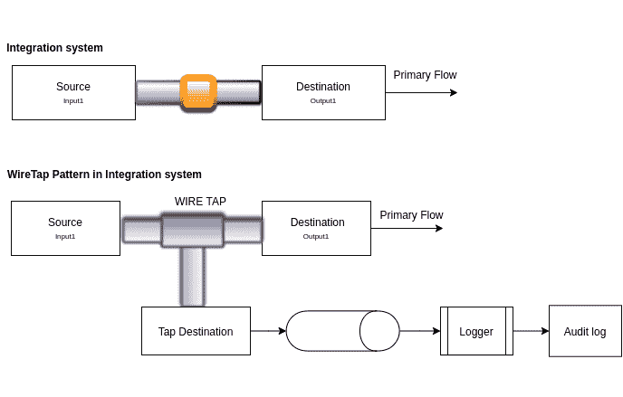

# 丝锥企业集成模式

> 原文：<https://web.archive.org/web/20220930061024/https://www.baeldung.com/wiretap-pattern>

## 1.概观

在本教程中，我们将介绍 Wire Tap 企业集成模式(EIP)，它帮助我们监控流经系统的消息。

这种模式允许我们 **拦截消息，而不会永久地消耗掉通道** 中的消息。

## 2.丝锥图案

窃听检查在点对点信道上传输的信息。它接收消息，制作副本，并将其发送到 Tap 目的地:

为了更好地理解这一点，让我们用 [ActiveMQ](/web/20220523135938/https://www.baeldung.com/spring-remoting-jms) 和[骆驼](/web/20220523135938/https://www.baeldung.com/apache-camel-intro)创建一个 Spring Boot 应用程序。

## 3.Maven 依赖性

我们来补充一下`camel-spring-boot-dependencies`:

[PRE0]

现在，我们将添加`camel-spring-boot-starter`:

[PRE1]

要查看流经某条路线的消息，我们还需要包含`ActiveMQ`:

[PRE2]

## 4.消息交换

让我们创建一个消息对象:

[PRE3]

我们将向`direct:source`发送此消息以启动路由:

[PRE4]

接下来，我们将添加路线并点击目的地。

## 5.窃听交换机

我们将使用**`wireTap`**的方法来设置点击目的地的端点 URI 。Camel 不等待来自`wireTap`的响应，因为它**将** **消息交换模式设置为`InOnly`** 。丝锥处理器**在** **独立线程**上处理:

[PRE5]

Camel 的 Wire Tap 节点在分接交换时支持两种方式:

### 5.1.传统丝锥

让我们添加一个传统的接线路径:

[PRE6]

在这里，骆驼将 **只复制了`Exchange`**–**它不会做深度克隆** 。所有副本可以共享来自原始交换的对象。

**并发处理多条消息时，存在****损坏最终净荷** 的可能性。为了防止这种情况，我们可以在将有效负载传递到 Tap 目的地之前创建一个深度克隆。

### 5.2.发送新的交换

窃听 EIP 支持一个 `Expression` 或 `Processor`，  预填充一个交换副本。一个 `Expression`只能用来设置消息体。

`Processor`变体完全控制如何填充交换(设置属性、标题等)。

让我们在有效载荷 : 中实现深度克隆

[PRE7]

现在，让我们实现 `Processor` 类，使用原始交换的副本作为输入:

[PRE8]

我们就在`wireTap` : 之后用 `onPrepare` 来称呼它

[PRE9]

## 6.结论

在本文中，我们实现了一个监听模式来监控通过某些消息端点的消息。使用 Apache Camel 的 `wireTap` ，我们复制消息并将其发送到不同的端点，而不改变现有的流。

Camel 支持两种利用交易所的方式。在传统的有线窃听中，原始交换被复制。第二，我们可以创建一个新的交易所。我们可以使用一个 `Expression`用消息体的新值填充这个新的交换，或者我们可以使用一个 `Processor`设置消息头和可选的消息体。

在 GitHub 上有 [的代码样本。](https://web.archive.org/web/20220523135938/https://github.com/eugenp/tutorials/tree/master/patterns/enterprise-patterns/wire-tap)