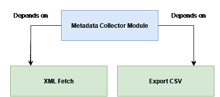
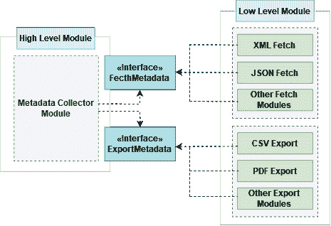

# Java 中的耦合

> 原文:[https://web . archive . org/web/20220930061024/https://www . bael dung . com/Java-coupling-classes-tight-loose](https://web.archive.org/web/20220930061024/https://www.baeldung.com/java-coupling-classes-tight-loose)

## 1.介绍

在本教程中，我们将学习 Java 中的耦合，包括类型和对每种类型的描述。最后，我们简要描述了[依赖反转](/web/20230101100129/https://www.baeldung.com/solid-principles)原理和控制反转以及它们与耦合的关系。

## 2.Java 中的耦合

当我们谈到耦合时，我们描述了系统中的类相互依赖的程度。我们在开发过程中的目标是减少耦合。

考虑下面的场景。我们正在设计一个元数据收集器应用程序。这个应用程序为我们收集元数据。它获取 XML 格式的元数据，然后将获取的元数据导出到 CSV 文件，就这样。正如我们在设计中所看到的，最初的方法可以是:

[](/web/20230101100129/https://www.baeldung.com/wp-content/uploads/2022/10/start-01.png)

我们的模块负责获取、处理和导出数据。然而，这是一个糟糕的设计。这种设计违反了[单一责任原则](/web/20230101100129/https://www.baeldung.com/solid-principles)。因此，为了改进我们的第一个设计，我们需要分离关注点。更改后，我们的设计看起来像这样:

[](/web/20230101100129/https://www.baeldung.com/wp-content/uploads/2022/10/02.png)

现在，我们的设计被分解成两个新模块，`XML Fetch`和`Export CSV`。与此同时，`Metadata Collector Module`依赖于这两者。这个设计比我们最初的方法要好，但它仍然是一项正在进行的工作。在接下来的章节中，我们将会注意到如何基于良好的耦合实践来改进我们的设计。

## 3.紧密结合

当一组类高度相互依赖时，或者我们的类承担了很多责任时，就称为紧耦合。另一种情况是一个对象创建另一个对象供其使用。紧密耦合的代码很难维护。

因此，让我们使用基本应用程序来看看这种行为。让我们进入一些代码定义。首先，我们的`XMLFetch`课:

```
public class XMLFetch {
    public List<Object> fetchMetadata() {
        List<Object> metadata = new ArrayList<>();
        // Do some stuff
        return metadata;
    }
}
```

接下来，`CSVExport`类:

```
public class CSVExport {
    public File export(List<Object> metadata) {
        System.out.println("Exporting data...");
        // Export Metadata
        File outputCSV = null;
        return outputCSV;
    }
}
```

最后，我们的`MetadataCollector` 类:

```
public class MetadataCollector {
    private XMLFetch xmlFetch = new XMLFetch();
    private CSVExport csvExport = new CSVExport();
    public void collectMetadata() {
        List<Object> metadata = xmlFetch.fetchMetadata();
        csvExport.export(metadata);
    }
}
```

正如我们所注意到的，我们的`MetadataCollector`类依赖于`XMLFecth`和`CSVExport`类。此外，它还负责创建它们。

如果我们需要改进我们的收集器，可能需要添加一个新的数据 JSON 获取器并以 PDF 格式导出数据，我们需要在我们的类中包含这些新元素。让我们编写新的“改进”类:

```
public class MetadataCollector {
    ...
    private CSVExport csvExport = new CSVExport();
    private PDFExport pdfExport = new PDFExport();
    public void collectMetadata(int inputType, int outputType) {
        if (outputType == 1) {
            List<Object> metadata = null;
            if (inputType == 1) {
                metadata = xmlFetch.fetchMetadata();
            } else {
                metadata = jsonFetch.fetchMetadata();
            }
            csvExport.export(metadata);
        } else {
            List<Object> metadata = null;
            if (inputType == 1) {
                metadata = xmlFetch.fetchMetadata();
            } else {
                metadata = jsonFetch.fetchMetadata();
            }
            pdfExport.export(metadata);
        }
    }
} 
```

`Metadata Collector Module`需要一些标志来处理新的功能。基于标志值，相应的子模块将被实例化。然而，每一个新的功能不仅使我们的代码更加复杂，也使维护更加困难。这是紧耦合的标志，我们必须避免它。

## 4.松耦合

在开发过程中，我们所有类之间的关系数量需要尽可能的少。这被称为松耦合。**松耦合是指一个对象从外部来源获得要使用的对象**。我们的对象是相互独立的。松散耦合的代码减少了维护工作量。此外，它为系统提供了更大的灵活性。

松散耦合通过依赖倒置原则来表达。在下一节中，我们将描述它。

## 5.从属倒置原则

**[依赖倒置原则](/web/20230101100129/https://www.baeldung.com/solid-principles#d) (DIP)是指高层模块在职责上不应该依赖于低层模块**。**两者都要靠抽象**。

在我们的设计中，这是根本问题。元数据收集器(高级)模块依赖于获取 XML 和导出 CSV 数据(低级)模块。

但是我们能做些什么来改进我们的设计呢？DIP 向我们展示了解决方案，但并没有谈到如何实现。在这种情况下，是控制反转(IoC)采取行动的时候。IoC 指明了在我们的模块之间定义抽象的方式。总结一下，就是 DIP 的实现方式。

因此，让我们将 DIP 和 IoC 应用到我们当前的示例中。首先，我们需要定义一个获取数据的接口和另一个导出数据的接口。让我们跳到代码中来看看如何做到这一点:

```
public interface FetchMetadata {
    List<Object> fetchMetadata();
}
```

很简单，不是吗？现在我们定义导出接口:

```
public interface ExportMetadata {
    File export(List<Object> metadata);
}
```

此外，我们需要在相应的类中实现这些接口。简而言之，我们需要更新我们当前的类:

```
public class XMLFetch implements FetchMetadata {
    @Override
    public List<Object> fetchMetadata() {
        List<Object> metadata = new ArrayList<>();
        // Do some stuff
        return metadata;
    }
}
```

接下来，我们需要更新`CSVExport`类:

```
public class CSVExport implements ExportMetadata {
    @Override
    public File export(List<Object> metadata) {
        System.out.println("Exporting data...");
        // Export Metadata
        File outputCSV = null;
        return outputCSV;
    }
}
```

此外，我们更新了主模块的代码以支持新的设计变更。让我们看看它是什么样子的:

```
public class MetadataCollector {
    private FetchMetadata fetchMetadata;
    private ExportMetadata exportMetadata;
    public MetadataCollector(FetchMetadata fetchMetadata, ExportMetadata exportMetadata) {
        this.fetchMetadata = fetchMetadata;
        this.exportMetadata = exportMetadata;
    }
    public void collectMetadata() {
        List<Object> metadata = fetchMetadata.fetchMetadata();
        exportMetadata.export(metadata);
    }
}
```

我们可以观察到代码中的两个主要变化。首先，类只依赖于抽象，而不是具体的类型。另一方面，我们消除了对底层模块的依赖。不需要在收集器模块中保留任何与低级模块创建相关的逻辑。与这些模块的交互是通过标准接口进行的。这种设计的优点是我们可以添加新的模块来获取和导出数据，并且我们的收集器代码不会改变。

通过应用 DIP 和 IoC，我们改进了我们的系统设计。通过反转(改变)控制，应用程序变得解耦、可测试、可扩展和可维护。下图向我们展示了当前设计的外观:

[](/web/20230101100129/https://www.baeldung.com/wp-content/uploads/2022/10/03.png) 最后，我们从我们的代码库中移除任何紧密耦合的代码，并使用带有 IoC 的 DIP 使用松散耦合的代码来增强初始设计。

## 6.结论

在本文中，我们讨论了 Java 中的耦合。我们首先浏览了一般的耦合定义。然后，我们观察了紧耦合和松耦合之间的差异。后来我们学会了用 IoC 应用 DIP，得到一个松耦合的代码。这个演练是按照一个示例设计完成的。我们可以通过应用好的设计模式来观察我们的代码在每一步中是如何改进的。

像往常一样，我们的代码在 GitHub 上[可用。](https://web.archive.org/web/20230101100129/https://github.com/eugenp/tutorials/tree/master/patterns-modules/coupling)