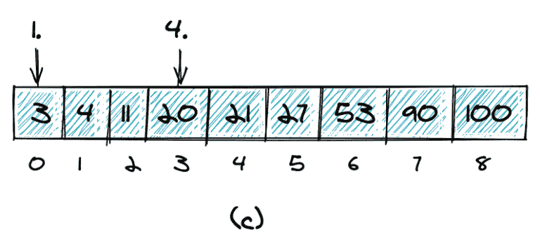
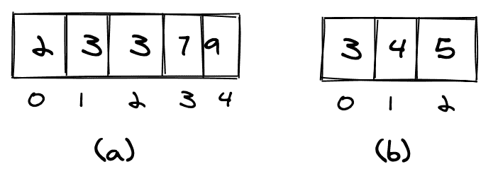
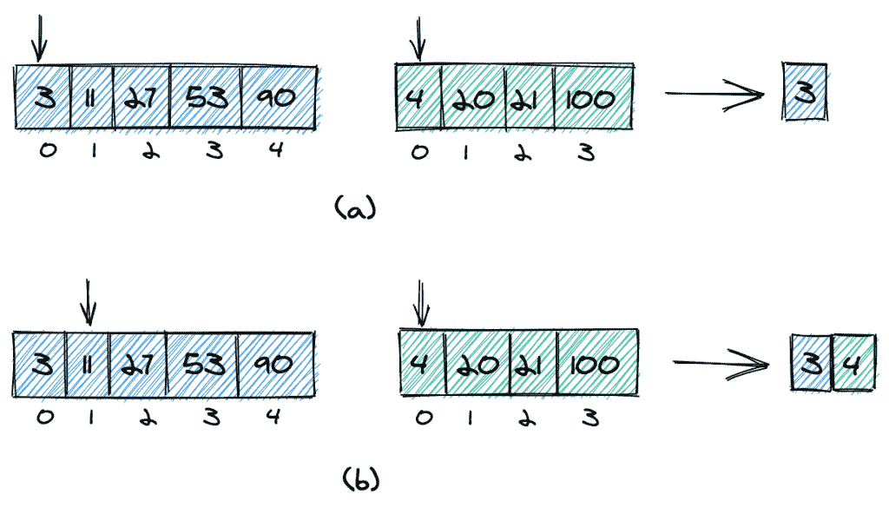
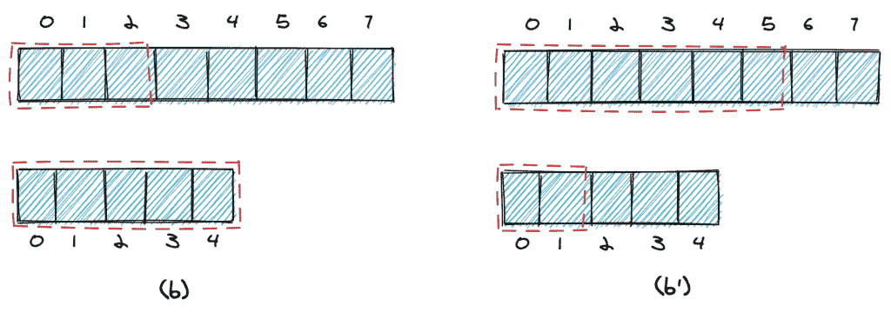
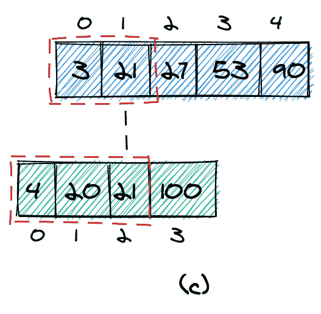
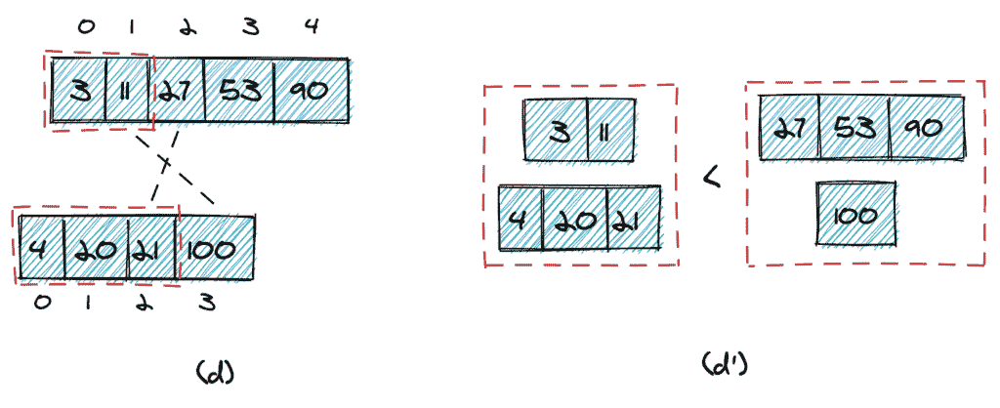
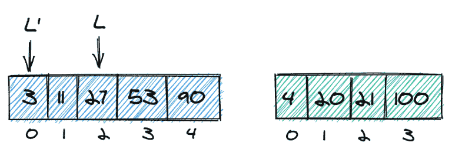

# 在 Java 中找到两个排序数组中第 k 个最小的元素

> 原文：<https://web.archive.org/web/20220930061024/https://www.baeldung.com/java-kth-smallest-element-in-sorted-arrays>

## 1.介绍

在本文中，我们将看到如何**在两个有序数组的联合中找到第`k`个最小的元素。**

首先，我们将定义确切的问题。第二，我们将看到两个低效但简单的解决方案。第三，我们将看看基于两个阵列上的二分搜索法的高效解决方案。最后，我们将通过一些测试来验证我们的算法是否有效。

我们还将看到算法所有部分的 Java 代码片段。为了简单起见，我们的实现将只对整数进行操作。然而，所描述的算法适用于所有可比较的数据类型，甚至可以使用泛型来实现。

## 2.两个排序数组的并集中第`K`个最小的元素是什么？

### 2.1.第`K`个最小元素

为了找到数组中第`k`个最小的元素，也称为第`k`阶统计量，我们通常使用[选择算法](/web/20220926193846/https://www.baeldung.com/java-kth-largest-element)。**然而，这些算法在单个未排序的数组上操作，而在本文中，我们想要在两个排序的数组中找到第`k`个最小的元素。**

在我们看到这个问题的几种解决方案之前，让我们确切地定义一下我们想要达到的目标。为此，让我们直接看一个例子。

我们得到了两个排序的数组(`a`和`b`)，它们不一定需要有相同数量的元素:

在这两个数组中，我们想找到第`k`个最小的元素。更具体地说，我们希望找到组合排序数组中的第`k`个最小元素:

在我们的例子中，组合排序后的数组如(c)所示。`1st`最小元素是`3`,`4th`最小元素是`20`。

### 2.2.重复值

我们还需要定义如何处理重复值。一个元素可以在其中一个数组中出现多次(数组`a`中的元素`3`)，也可以在第二个数组中再次出现(`b`)。

如果我们只计算一次重复，我们将如(c)所示进行计算。如果我们计算一个元素的所有出现次数，我们将如(d)所示进行计算。

在本文的剩余部分，我们将如(d)所示计算重复项，这样就像计算不同的元素一样。

## 3.两种简单但效率较低的方法

### 3.1.连接两个数组，然后对其进行排序

找到第`k`个最小元素的最简单方法是连接数组，对它们进行排序，并返回结果数组的第`k`个元素:

[PRE0]

用`n`作为第一个数组的长度，m 作为第二个数组的长度，我们得到组合长度`c = n + m`。

因为排序的复杂度是`O(c log c)`，所以这种方法的总复杂度是`O(n log n)`。

这种方法的缺点是我们需要创建数组的副本，这导致需要更多的空间。

### 3.2.合并两个数组

类似于[合并排序](/web/20220926193846/https://www.baeldung.com/java-merge-sort)排序算法的一个步骤，我们可以[合并](/web/20220926193846/https://www.baeldung.com/java-merge-sorted-arrays)两个数组，然后直接检索第`k`个元素。

合并算法的基本思想是从两个指针开始，分别指向第一个和第二个数组的第一个元素(a)。

然后，我们比较指针处的两个元素(`3`和`4`)，将较小的一个(`3`)添加到结果中，并将指针向前移动一个位置(b)。同样，我们比较指针处的元素，并将较小的一个(`4`)添加到结果中。

我们以同样的方式继续，直到所有的元素都被添加到结果数组中。如果其中一个输入数组没有更多元素，我们只需将另一个输入数组的所有剩余元素复制到结果数组中。

**如果我们不复制完整的数组，而是在结果数组有`k`个元素时停止，我们可以提高性能。我们甚至不需要为合并后的数组创建额外的数组，而是可以只对原始数组进行操作。**

下面是一个 Java 实现:

[PRE1]

很容易理解这个算法的时间复杂度是 O( `k`)。**这种算法的一个优点是，它可以很容易地适应只考虑一次重复元素**。

## 4.两个阵列上的二分搜索法

我们能做得比 O( `k`)更好吗？答案是我们可以。**基本思想是对两个数组**进行二分搜索法算法。

要做到这一点，我们需要一个数据结构来提供对其所有元素的恒定时间读访问。在 Java 中，这可能是一个数组或一个`ArrayList`。

让我们为将要实现的方法定义框架:

[PRE2]

这里，我们将`k`和两个数组作为参数传递。首先，我们将验证输入；第二，我们处理一些特殊情况，然后做二分搜索法。在接下来的三个部分中，我们将以相反的顺序来看这三个步骤，首先，我们将看到二分搜索法，其次，特殊情况，最后，参数验证。

### 4.1.二分搜索法

在标准二分搜索法中，我们寻找一个特定的元素，有两种可能的结果:要么我们找到了我们要寻找的元素，搜索成功，要么我们没有找到它，搜索不成功。**这与我们的情况不同，我们想要找到第`k`个最小的元素。在这里，我们总是有一个结果。**

让我们看看如何实现它。

#### 4.1.1。从两个数组中找到正确数量的元素

我们从第一个数组中的一定数量的元素开始搜索。让我们称那个数字为`nElementsList1`。由于我们总共需要`k`个元素，所以数量`nElementsList1 is:`

[PRE3]

举个例子，就说`k = 8`。我们从第一个数组中的四个元素和第二个数组(a)中的四个元素开始。

如果第一个数组中的第 4 个元素大于第二个数组中的第 4 个元素，我们知道我们从第一个数组中获取了太多的元素，可以减少`nElementsList1` (b)。否则，我们知道我们取的元素太少，可以增加`nElementsList1`(b’)。

我们继续，直到达到停止标准。在我们看这是什么之前，让我们先看一下目前为止我们所描述的代码:

[PRE4]

#### 4.1.2。停止标准

我们可以在两种情况下停止。首先，如果我们从第一个数组中获取的最大元素等于我们从第二个数组(c)中获取的最大元素，我们可以停止。在这种情况下，我们可以简单地返回该元素。

其次，如果满足以下两个条件，我们可以停止(d):

*   从第一个数组中取出的最大元素小于我们没有从第二个数组中取出的最小元素(`11 < 100`)。
*   从第二个数组中取出的最大元素小于我们没有从第一个数组中取出的最小元素(`21 < 27`)。

很容易想象(d ')为什么这个条件有效:我们从两个数组中取出的所有元素肯定比两个数组中的任何其他元素都小。

以下是停止标准的代码:

[PRE5]

#### 4.1.3。返回值

最后，我们需要返回正确的值。这里，我们有三种可能的情况:

*   我们没有从第二个数组中获取元素，因此目标值在第一个数组(e)中
*   目标值在第一个数组(e’)中
*   目标值在第二个数组(e ")中

让我们看看代码:

[PRE6]

注意，我们不需要处理不从第一个数组中获取任何元素的情况——我们将在后面处理特殊情况时排除这种情况。

### 4.2.左边界和右边界的初始值

到目前为止，我们用`k`和`0`初始化了第一个数组的右边界和左边界:

[PRE7]

然而，根据`k`的值，我们需要调整这些边界。

首先，如果`k`超过了第一个数组的长度，我们需要把最后一个元素作为右边界。这样做的原因很简单，因为我们不能从数组中获取比实际更多的元素。

第二，如果`k`大于第二个数组中的元素数，我们可以确定我们至少需要从第一个数组中取出`(k – length(list2))`。举个例子，让我们说`k = 7`。由于第二个数组只有四个元素，我们知道至少需要从第一个数组中取出`3`个元素，所以我们可以将`L`设置为`2:`

以下是调整后的左右边框的代码:

[PRE8]

### 4.3.特殊情况的处理

在我们进行实际的二分搜索法之前，我们可以处理一些特殊情况，使算法稍微简单一些，并避免异常。下面是注释中有解释的代码:

[PRE9]

### 4.4.输入验证

让我们先来看看输入验证。例如，为了防止算法失败并抛出一个`NullPointerException`或`ArrayIndexOutOfBoundsException, `，我们希望确保这三个参数满足以下条件:

*   两个数组都不能是`null`并且至少有一个元素
*   `k`必须是`>= 0`，并且不能大于两个数组的长度之和

下面是我们的代码验证:

[PRE10]

### 4.5.完整代码

这是我们刚刚描述的算法的完整代码:

[PRE11]

## 5.测试算法

在我们的 GitHub 资源库中，有许多测试案例，涵盖了许多可能的输入数组和许多角落案例。

这里，我们只指出其中一个测试，它不是针对静态输入数组进行测试，而是将我们的双二分搜索法算法的结果与简单的连接排序算法的结果进行比较。输入由两个随机数组组成:

[PRE12]

以下方法执行一个单一测试:

[PRE13]

我们可以调用上面的方法来运行大量这样的测试:

[PRE14]

## 6.结论

在本文中，我们看到了在两个有序数组的并集中寻找第`k`个最小元素的几种方法。首先，我们看到了简单明了的`O(n log n)`算法，然后是复杂的`O(n)`版本，最后是运行在`O(log n)`中的算法。

我们看到的最后一个算法是一个很好的理论练习；然而，出于最实际的目的，我们应该考虑使用前两个算法中的一个，这比两个数组上的二分搜索法简单得多。当然，如果性能是一个问题，二分搜索法可能是一个解决方案。

本文中的所有代码都可以在 GitHub 上获得。