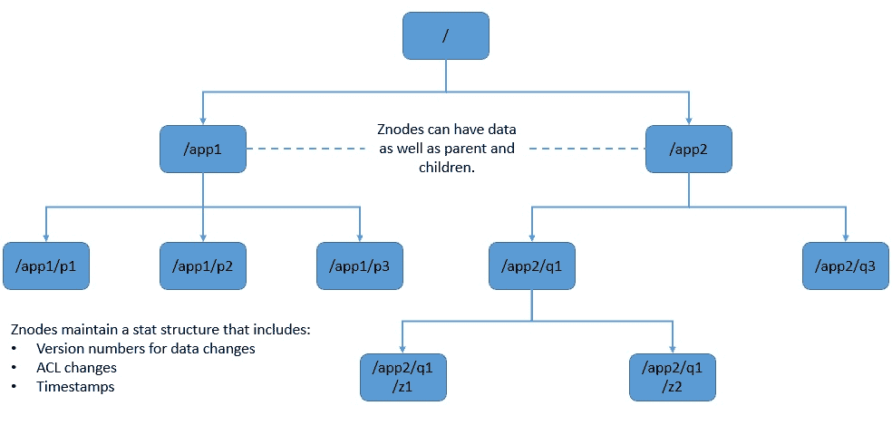
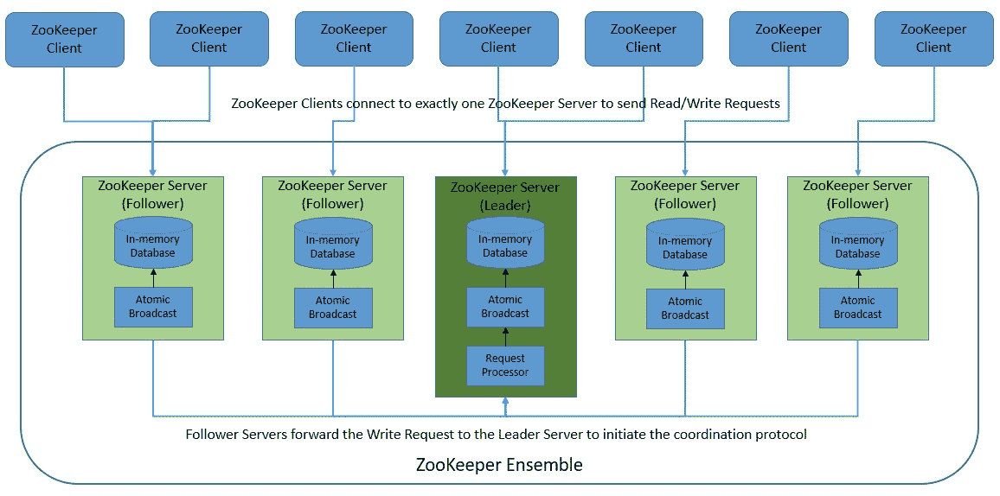
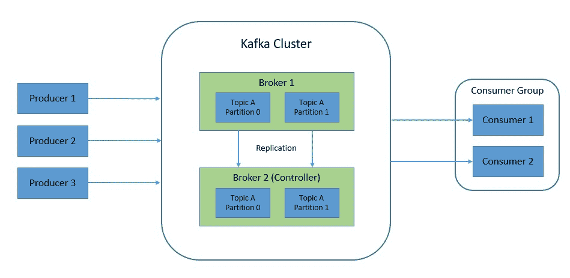
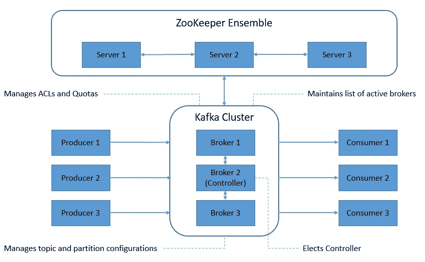
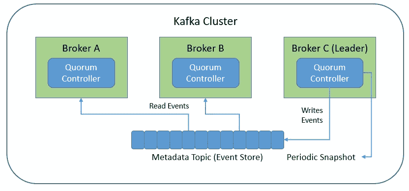

# 卡夫卡从动物园管理员到卡夫的转变

> 原文:[https://web . archive . org/web/20220930061024/https://www . bael dung . com/Kafka-shift-from-zookeeper-to-kraft](https://web.archive.org/web/20220930061024/https://www.baeldung.com/kafka-shift-from-zookeeper-to-kraft)

## 1.介绍

在其架构中，Kafka 最近从 ZooKeeper 转变为基于法定人数的控制器，该控制器使用一种新的共识协议，称为 Kafka Raft，缩写为 Kraft(发音为“craft”)。

在本教程中，我们将研究 Kafka 做出这一决定的原因，以及这一改变如何简化其架构并使其使用起来更加强大。

## 2.动物园管理员概述

[ZooKeeper](https://web.archive.org/web/20221118043330/https://zookeeper.apache.org/) 是一个**服务，支持高度可靠的分布式协调**。它最初是由雅虎开发的。简化在大数据集群上运行的流程。它最初是 Hadoop 的一个子项目，但后来在 2008 年成为一个独立的 Apache Foundation 项目。它被广泛用于大型分布式系统中的多个用例。

### 2.1.动物园管理员建筑

ZooKeeper **将数据存储在分层的名称空间**中，类似于标准的文件系统。名称空间由称为 znodes 的[数据寄存器组成。名称是由斜杠分隔的一系列路径元素。](/web/20221118043330/https://www.baeldung.com/java-zookeeper)

命名空间中的每个节点都由路径标识:

在 ZooKeeper 名称空间中可以有三种类型的 znodes:

*   第一种是 persistent，这是默认类型，在删除之前一直保留在 ZooKeeper 中。
*   第二个是临时的，如果创建 znode 的会话断开，它就会被删除。此外，短暂的 znodes 不能有孩子。
*   第三种是顺序的，我们可以用它来创建类似 id 的顺序号。

通过其简单的架构，ZooKeeper **提供了一个具有快速处理和可伸缩性的可靠系统**。它旨在通过一组名为 ensemble 的服务器进行复制。每台服务器都在内存中维护该状态的映像，以及持久性存储中的转换日志和快照:

ZooKeeper 客户端只连接到一个服务器，但如果服务器不可用，可以故障转移到另一个服务器。读取请求由每个服务器数据库的本地副本提供服务。写请求由协议协议处理。这涉及到**将所有这样的请求转发给主服务器**，主服务器使用 [ZooKeeper 原子广播(ZAB)协议](https://web.archive.org/web/20221118043330/https://zookeeper.apache.org/doc/r3.4.13/zookeeperInternals.html#sc_atomicBroadcast)来协调它们。

基本上，原子消息是 ZooKeeper 的核心，它使所有的服务器保持同步。它确保消息的可靠传递。它还确保消息以完全因果的顺序传递。消息传递系统基本上在利用 TCP 进行通信的服务器之间建立点对点 FIFO 通道。

### 2.2.动物园管理员用法

ZooKeeper 为来自客户端的所有更新提供顺序一致性和原子性。此外，它不允许并发写入。此外，无论客户端连接到哪个服务器，它总是看到相同的服务视图。总的来说，ZooKeeper 为高性能、高可用性和严格有序的访问提供了极好的保证。

ZooKeeper 还实现了非常高的吞吐量和低延迟数字。这些属性使它非常适合解决大型分布式系统中的几个协调问题。这些用例包括命名服务、配置管理、数据同步、领导者选举、消息队列和通知系统。

## 3.卡夫卡中的动物园管理员

[Kafka](https://web.archive.org/web/20221118043330/https://kafka.apache.org/) 是一个**分布式事件存储和流处理平台**。它最初是在 LinkedIn 开发的，随后于 2011 年在 Apache Software Foundation 下开源。Kafka 为处理实时数据馈送提供了一个高吞吐量和低延迟的平台。它广泛用于高性能用例，如流分析和数据集成。

### 3.1.卡夫卡建筑

Kafka 是一个分布式系统[，由服务器和客户端](/web/20221118043330/https://www.baeldung.com/spring-kafka)组成，**使用基于二进制 TCP 的协议**进行通信。它意味着作为一个或多个服务器的集群运行，也称为代理。代理还充当事件的存储层。

卡夫卡以主题持久地组织事件。主题可以有零个、一个或多个生产者和消费者。主题也被**划分并分布在不同的代理**上，以实现高可伸缩性。此外，每个主题还可以跨集群复制:

在 Kafka 集群中，**其中一个代理充当控制器**。控制器负责管理分区和副本的状态，并执行管理任务，如重新分配分区。在任一时间点，群集中只能有一个控制器。

客户端支持应用并行、大规模、容错地读取、写入和处理事件流。生产者是将事件发布到 Kafka 的客户端应用程序。同时，消费者是那些从卡夫卡那里订阅这些事件的人。

### 3.2.动物园管理员的角色

Kafka 的设计属性使其具有高可用性和容错性。但是，作为一个分布式系统，Kafka **需要一种机制来协调所有活跃代理之间的多个决策**。它还要求维护群集及其配置的一致视图。Kafka 已经使用 ZooKeeper 很长时间了。

基本上，直到最近更换为 Kraft， **ZooKeeper 一直作为 Kafka 的元数据管理工具**来完成几个关键功能: 

*   **控制者选举**:控制者选举严重依赖 ZooKeeper。为了选举控制器，每个代理都试图在 ZooKeeper 中创建一个临时节点。创建这个短暂节点的第一个代理承担控制器角色，并被分配一个控制器时期。
*   集群成员资格 : ZooKeeper 在管理集群中代理的成员资格方面扮演着重要的角色。当代理连接到 ZooKeeper 实例时，会在组 znode 下创建一个临时 znode。如果代理失败，这个短暂的 znode 将被删除。
*   **主题配置** : Kafka 在 ZooKeeper 中为每个主题维护了一套配置。这些配置可以是基于主题的，也可以是全局的。它还存储详细信息，如现有主题列表、每个主题的分区数量以及副本的位置。
*   **访问控制列表(ACL)**:Kafka 还维护 ZooKeeper 中所有主题的 ACL。这有助于决定谁或什么可以阅读或写每个主题。它还保存了消费者组和每个消费者组成员的列表等信息。
*   配额:Kafka 经纪人可以控制客户可以使用的经纪人资源。这作为配额存储在 ZooKeeper 中。有两种类型的配额:由字节速率阈值定义的网络带宽配额和由 CPU 利用率阈值定义的请求速率配额。

### 3.3.动物园管理员的问题

正如我们到目前为止所看到的,《动物园管理员》在很长一段时间里，在卡夫卡的架构中扮演了一个相当成功的重要角色。那么，他们为什么决定改变它呢？简单明了地说， **ZooKeeper 为卡夫卡**多加了一个管理层。管理分布式系统是一项复杂的任务，即使它像 ZooKeeper 一样简单和健壮。

Kafka 并不是唯一一个需要在成员间协调任务的分布式系统。还有其他几个，像 MongoDB、Cassandra 和 Elasticsearch，它们都以自己的方式解决了这个问题。然而，它们不依赖于像 ZooKeeper 这样的外部工具来进行元数据管理。基本上，它们**依靠内部机制来实现这个目的**。

除了其他优势之外，它还使部署和运营管理变得更加简单。想象一下，如果我们只需要管理一个分布式系统，而不是两个！此外，由于更有效的元数据处理，这也**提高了可伸缩性。在 Kafka 内部存储元数据而不是在 ZooKeeper 内部存储元数据使管理它变得更容易，并提供了更好的保证。**

## 4.Kafka Raft (Kraft)协议

受到 Kafka 与 ZooKeeper 的复杂性的启发，Kafka 改进提案(KIP)被提交给**用自我管理的元数据定额**替换 ZooKeeper。虽然基地 [KIP 500](https://web.archive.org/web/20221118043330/https://cwiki.apache.org/confluence/display/KAFKA/KIP-500%3A+Replace+ZooKeeper+with+a+Self-Managed+Metadata+Quorum) 定义了愿景，但随后几个 KIP 讨论了细节。自我管理模式最初是作为 Kafka 2.8 的一部分作为早期访问版本提供的。

自我管理模式整合了 Kafka 中的元数据管理职责。这种模式利用了 Kafka 中新的法定控制器服务。**法定控制器使用基于事件的存储模型**。此外，它使用 Kafka Raft (Kraft)作为共识协议，以确保元数据在 quorum 中准确复制。

Kraft 基本上是 raft 共识协议的基于事件的变体。它也类似于 ZAB 协议，一个显著的区别是它使用事件驱动的架构。quorum controller 使用事件日志来存储状态，该日志会定期缩减为快照，以防止其无限增长:

其中一个定额控制器充当领导者，在 Kafka 的元数据主题中创建事件。定额中的其他控制器通过响应这些事件来跟随领导者控制器。当其中一个代理由于分区而失败时，它可以在重新加入时从日志中补上错过的事件。这减少了不可用性窗口。

与基于 ZooKeeper 的控制器不同，**quorum 控制器不需要从 ZooKeeper** 加载状态。当领导层发生变化时，新的活动控制器已经在内存中拥有了所有提交的元数据记录。此外，还使用相同的事件驱动机制来跟踪集群中的所有元数据。

## 5.一个简化的更好的卡夫卡！

基于法定人数的控制器的改变应该会给卡夫卡社区带来显著的缓解。首先，系统管理员会发现监控、管理和支持 Kafka 变得更加容易。开发者将不得不为整个系统处理一个单一的安全模型。此外，我们有一个轻量级的单进程部署来开始使用 Kafka。

新的元数据管理还显著提高了 Kafka 的控制平面性能。首先，它允许控制器更快地进行故障转移。基于 ZooKeeper 的元数据管理已经成为集群范围分区限制的瓶颈。新的 quorum controller 被设计为在每个集群中处理更多的分区。

自 Kafka 版本 2.8 起，自管理(Kraft)模式与 ZooKeeper 一起可用。它是作为 3.0 版本的预览功能发布的。最后，经过几处改进，它已经在 3.3.1 版中发布了。卡夫卡可能会在 3.4 版本中弃用 ZooKeeper。不过可以肯定的说**使用 Kafka 的体验明显提升**！

## 6.结论

在这篇文章中，我们讨论了动物园管理员的细节和它在卡夫卡中扮演的角色。此外，我们还讨论了这种架构的复杂性，以及为什么 Kafka 选择用基于定额的控制器取代 ZooKeeper。

最后，我们讨论了这种变化在简化架构和更好的可伸缩性方面给 Kafka 带来的好处。