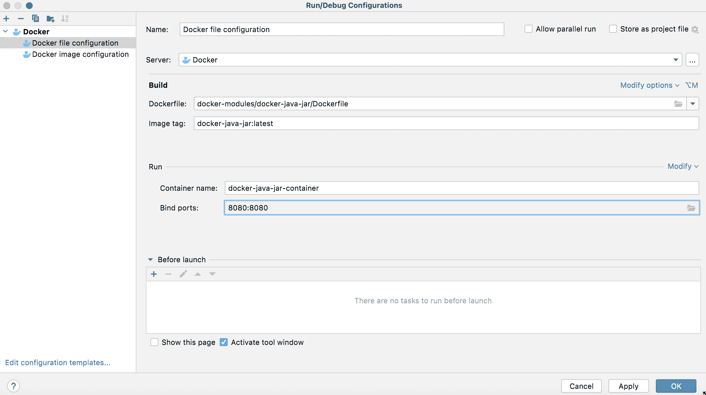
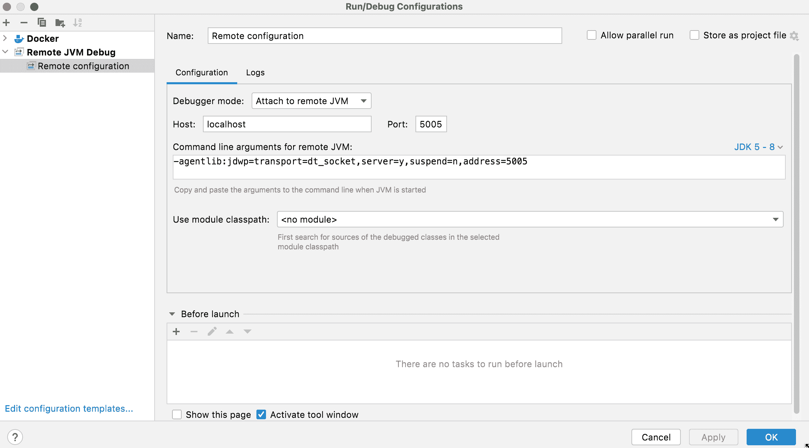

# 用 IntelliJ IDEA 调试 Docker 中运行的应用程序

> 原文:[https://web . archive . org/web/20220930061024/https://www . bael dung . com/docker-debug-app-with-intellij](https://web.archive.org/web/20220930061024/https://www.baeldung.com/docker-debug-app-with-intellij)

## 1.概观

在本教程中，**我们将看到如何在 IntelliJ** 中 **调试 Docker 容器。我们假设我们有一个 Docker 映像准备好进行测试。[建立码头工人形象](/web/20220823130659/https://www.baeldung.com/spring-boot-docker-images)的方式多种多样。**

IntelliJ 可以从其[官网](https://web.archive.org/web/20220823130659/https://www.jetbrains.com/idea/download)下载。

对于本文，我们将引用这个[基于单个类的 Java 应用程序](https://web.archive.org/web/20220823130659/https://github.com/eugenp/tutorials/tree/master/docker-modules/docker-java-jar)。它可以很容易地[对接，建立和测试](/web/20220823130659/https://www.baeldung.com/java-dockerize-app)。

在开始测试之前，我们需要确保 Docker 引擎已经启动并且正在我们的计算机上运行。

## 2.使用`Dockerfile`配置

当使用 Docker 文件配置时，**我们需要简单地选择我们的`Dockerfile `，并为图像名称、图像标签、容器名称和配置名称提供适当的名称。**我们还可以添加端口映射，如果有的话:

[](/web/20220823130659/https://www.baeldung.com/wp-content/uploads/2022/08/configuration-using-docker-file.png)

保存此配置后，我们可以从 debug 选项中选择此配置，然后单击 debug。它首先构建映像，在 Docker 引擎中注册映像，然后运行 Docker 化的应用程序。

## 3.使用 Docker 映像配置

当使用 Docker 图像配置时，**我们需要提供预先构建的应用程序的图像名称、图像标签和容器名称。**我们可以使用标准的 Docker 命令来构建映像，并在 Docker 引擎中注册容器。如果有的话，我们还可以添加端口映射:

[](/web/20220823130659/https://www.baeldung.com/wp-content/uploads/2022/08/configuration-using-docker-image.png)

保存此配置后，我们可以从 debug 选项中选择此配置，然后单击 debug。它只是选择预构建的 Docker 映像和容器并运行它。

## 4.使用远程 JVM 调试配置

远程 JVM 配置附加到任何预先运行的 Java 进程。所以我们需要首先单独运行 Docker 容器。

以下是运行 Java 8 Docker 映像的命令:

```
docker run -d -p 8080:8080  -p 5005:5005 -e JAVA_TOOL_OPTIONS="-agentlib:jdwp=transport=dt_socket,address=5005,server=y,suspend=n" docker-java-jar:latest
```

如果我们使用的是 Java 11，我们将使用以下命令:

```
docker run -d -p 8080:8080  -p 5005:5005 -e JAVA_TOOL_OPTIONS="-agentlib:jdwp=transport=dt_socket,address=*:5005,server=y,suspend=n" docker-java-jar:latest
```

这里`docker-java-jar`是我们的图像名，`latest`是它的标签。除了正常的 HTTP 端口 8080 之外，我们还映射了一个额外的端口 5005 `,` ，用于使用`-p`扩展进行远程调试。我们使用`-d`扩展**在分离模式下运行 docker，使用`-e`将`JAVA_TOOL_OPTIONS`作为环境变量传递给 Java 进程**。

在`JAVA_TOOL_OPTIONS `中，我们将值`-agentlib:jdwp=transport=dt_shmem,address=,server=y,suspend=n`传递给**，允许 Java 进程启动一个 [`JDB`](https://web.archive.org/web/20220823130659/https://www.tutorialspoint.com/jdb/jdb_quick_guide.htm) 调试会话**，并传递值`address=*:5005`来指定 5005 将是我们的远程调试端口。

因此，上面的命令启动了我们的 Docker 容器，现在我们可以配置远程调试配置来连接它:

[](/web/20220823130659/https://www.baeldung.com/wp-content/uploads/2022/08/configuration-using-remote-jvm-debug.png)

我们可以看到，在配置中，我们已经指定它使用 5005 端口连接到远程 JVM。

现在，如果我们从调试选项中选择这个配置并单击 debug，它将通过附加到已经运行的 Docker 容器来启动一个调试会话。

## 5.结论

在本文中，我们学习了不同的配置选项，可以用来调试 IntelliJ 中的 dockerized 应用程序。