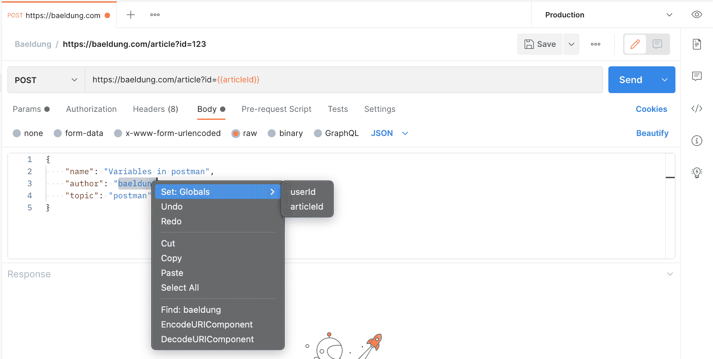

# 邮差中的变量指南

> 原文：<https://web.archive.org/web/20220930061024/https://www.baeldung.com/java-postman-variables>

## 1.概观

在 Postman 中，变量让我们保存值，并根据需要在不同的 API 中使用它们。我们可以通过将这些值传递给集合、环境或任何请求来引用它们。它基本上使使用这些变量更有效地访问存储值变得更容易。我们还可以**与多个队友合作，或者使用这些变量**通过 Postman 设置[动态工作流](/web/20221207195056/https://www.baeldung.com/postman-load-testing)。

在本文中，我们将深入了解变量、它们的类型，以及如何将它们嵌入到我们的 API 中。

## 2.什么是变量？

变量象征着数据表示，让我们无需在需要时手动输入就能访问一个值。当我们不得不在多个地方使用相同的值时，它们会很有用。一些实例包括基本 URL、令牌和路径变量。此外，使用它们还会使请求更加灵活，因为改变变量会在使用这些变量的所有地方自动进行改变。

我们可以在 Postman 中将变量定义为键值对。**键定义了变量名，允许我们使用这个键**直接访问它的值。

此外，还可以使用环境来设置一组变量。根据环境的不同，这些变量会有不同的值。

让我们深入研究变量，理解不同的变量范围。

### 2.1.可变范围

有多个范围让我们在不同的环境中用不同的值来处理 API 的开发和测试。下面是从覆盖的最宽到最窄区域定义的可变范围:

*   全局变量:**这些变量在整个工作空间中都可以访问，在 Postman** 中范围最广。它们可以在工作区内的多个请求和集合中的任何地方使用。
*   集合变量:**这些变量只能在某个集合**中访问。它们适用于集合中的所有请求。此外，它们不会根据所选的环境而改变。
*   环境变量:**这些变量让我们根据不同的环境确定工作范围**。它们随着我们工作环境的变化而变化，如本地环境、试运行或生产环境。
*   数据变量:这些类型的变量是外部变量，在使用收集运行器运行收集时定义数据集。我们可以从 CSV 或 JSON 文件中提取这些内容。它们的当前值在请求或集合执行后不再持续。
*   局部变量:这些变量也被称为**临时变量，只能通过请求脚本**访问。它们仅在当前请求或集合之前有作用域。一旦执行完成，它们就不再可用。

### 2.2.变量类型

全局变量和环境变量可以根据它们的类型进一步分类。我们可以这样配置它们:

*   默认类型:默认情况下，变量属于这些类型。这些显示为没有附加属性的纯文本。
*   秘密类型:这些变量隐藏所有工作区的初始值和当前值，类似于密码。它们让我们能够防止敏感数据的任何无意泄露。

## 3.用范围定义变量

正如我们上面讨论的，我们可以定义多种类型和范围的变量。**变量可以在请求生成器的任何范围内定义。**

首先，我们选择文本并点击`Set as a variable`。一旦完成，我们必须将它存储为一个新变量。然后，我们为该值输入一个键，并从 Postman 中可用的不同范围中进行选择:

### 3.1.将响应主体设置为变量

**来自请求响应主体的值也可以设置到变量**中，并在集合中进一步使用。这有助于按顺序运行多个请求，并创建特定的流。

首先，让我们选择想要保存的文本，并按下`right-click`或`Control-click` 按钮将其保存为一个变量。

完成后，我们必须从可能的选项中选择相关范围，即环境、本地或全局，并命名变量以保存它:

### 3.2.定义全局变量

让我们看看在 Postman 中设置全局变量的步骤:

1.  我们从点击全局变量部分的`Add a new variable`开始，然后输入变量名直接存储为全局变量。
2.  另一个选项是通过选择全局选项作为类型来选择值和存储变量。
3.  一旦完成，我们不应该忘记标记保存并确认更改。

我们还可以通过以下步骤下载全局变量并与其他人共享:

1.  首先，让我们转到 Postman，在侧栏中选择环境类型 Global。
2.  然后，我们可以点击 **`Export`按钮，将变量导出到一个文件中。**
3.  我们可以通过点击系统上的 `Save`来存储文件，并根据需要进行共享。

### 3.3.定义环境变量

我们可以通过以下步骤在 Postman 中保存环境变量:

1.  首先，我们点击`Add a new variable`，输入变量名。
2.  在保存变量之前，我们可以**选择变量类型作为环境。**
3.  变量需要指定初始值和当前值。
4.  完成后，我们必须点击保存以确认更改。

### 3.4.定义集合变量

Postman 还提供了添加集合变量并根据需要使用它们的机会。

我们必须点击并选择侧边栏中的`Collections`。完成后，让我们选择`Variables`选项卡来存储集合变量:

### 3.5 在脚本中定义变量

类似于在集合、环境或全局中定义变量，我们也可以在请求脚本中以编程方式设置变量。

所有这些方法都接受(`variable_key`，`variable_value`)作为输入:

1.  `pm.globals` : **该方法用于定义请求脚本**中的全局变量，例如`pm.globals.set(“variable_key”, “variable_value”);`
2.  `pm.collectionVariables`:我们可以用这个方法定义**一个作用域为‘集合’的变量，**例如`pm.collectionVariables.set(“variable_key”, “variable_value”);`
3.  `pm.environment`:可用于**定义一个范围为当前环境的环境变量**，如`pm.environment.set(“variable_key”, “variable_value”);`
4.  `pm.variables` : **用局部/临时范围**定义局部变量，例如`pm.variables.set(“variable_key”, “variable_value”);`
5.  `unset` : **该方法可用于删除设定变量**。可以用上述变量实例根据其作用域来定义未设置，例如`pm.environment.unset(“variable_key”, “variable_value”);`

### 3.6 在脚本中使用变量

我们通过使用上述方法将变量存储在脚本中。因此，我们可以使用这些方法检索它们的当前值:

1.  `pm.variables.get(“variable_key”)`:这将访问任何范围的变量，包括局部变量。
2.  `pm.globals.get(“variable_key”)`:这可以访问一个全局变量
3.  `pm.collectionVariables.get(“variable_key”)`:可以访问集合变量。
4.  `pm.environment.get(“variable_key”)`:可以访问一个环境变量。

这里，我们可以使用`variable_key`来检索值。对象表示范围级别，而`get()`方法检索值。

`pm.variables.get()`方法还提供了在不影响脚本功能的情况下改变变量范围的选项。它返回当前优先级最高的变量。

## 4.使用变量

现在，我们已经定义了不同的变量范围，并学习了如何在 Postman 中存储它们。让我们看看如何在请求路径和请求体中使用这些变量。

为了在 Postman 中引用一个变量，我们应该在变量的名字两边加上双花括号。它自动从定义的不同变量中取值。这是所有 Postman 的标准，不依赖于变量类型和范围:

[PRE0]

此外，运行 CURL 或点击请求会解析变量并用当前值更新变量。以下请求 URL 引用了变量:

[PRE1]

我们假设`studentName`是“约翰”。Postman 从其变量中检索值，并发送当前存储在那里的任何值。因此，在通过 Postman 点击上述请求时，它会自动将其转换为请求:

[PRE2]

## 5.结论

在本教程中，**我们通过 GUI 模式**使用 Postman 变量进行基本初始化。

此外，我们还了解了它们的类型和范围。此外，我们还查看了可以初始化它们的不同位置，如 URIs、请求体和头。显然，这让我们不用多次初始化相同的值，从而节省了时间和空间。