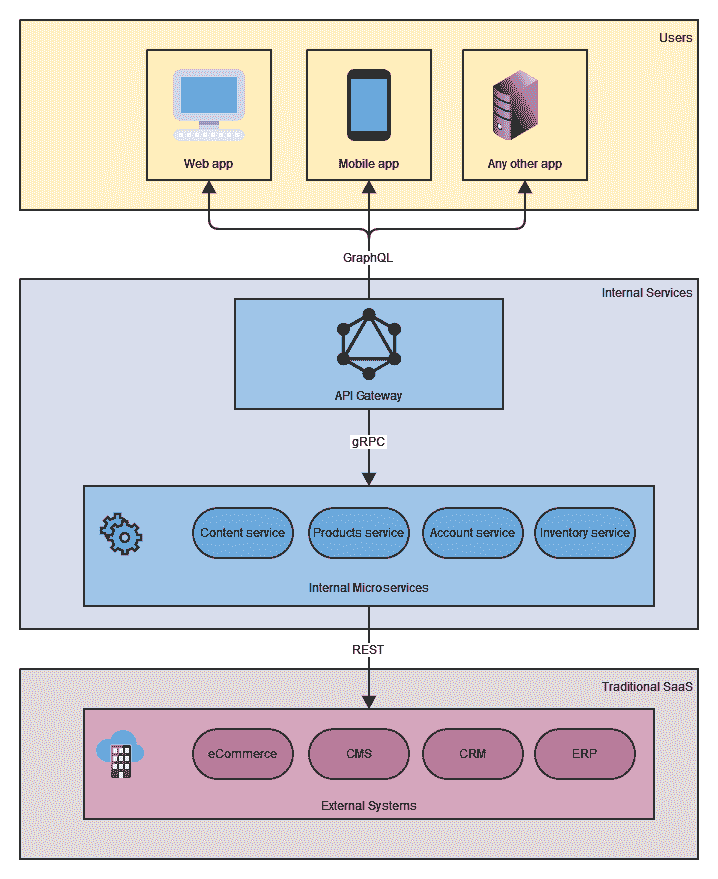

# REST vs . graph QL vs . gRPC——选择哪个 API？

> 原文：<https://web.archive.org/web/20220930061024/https://www.baeldung.com/rest-vs-graphql-vs-grpc>

## 1.概观

多年来，REST 一直是设计 web APIs 的事实上的行业标准架构风格。然而，最近出现了 GraphQL 和 gRPC，以解决 REST 的一些限制。这些 **API 方法中的每一种都有很大的好处和一些权衡**。

在本教程中，我们将首先看看每一种 API 设计方法。然后，我们将在 Spring Boot 使用三种不同的方法构建一个简单的服务。接下来，我们将通过查看在决定一个标准之前应该考虑的几个标准来比较它们。

最后，由于没有一种通用的方法，我们将看到不同的方法如何在不同的应用程序层上混合使用。

## 2.休息

表述性状态转移(REST)是全世界最常用的 API 架构风格。早在 2000 年，罗伊·菲尔丁就对其进行了定义。

### 2.1.建筑风格

REST 不是一个框架或库，而是一种基于 URL 结构和 HTTP 协议描述接口的架构风格。它描述了一个无状态的、可缓存的、基于约定的客户端-服务器交互架构。它使用 URL 来寻址适当的资源，并使用 HTTP 方法来表示要采取的操作:

*   GET 用于获取一个现有资源或多个资源
*   POST 用于创建新资源
*   PUT 用于更新资源或在资源不存在时创建它
*   删除用于删除资源
*   补丁用于部分更新现有资源

REST 可以用各种编程语言实现，并支持多种数据格式，如 JSON 和 XML。

### 2.2.示例服务

我们可以在 Spring 中通过**使用 [`@RestController`](/web/20221205162726/https://www.baeldung.com/spring-controller-vs-restcontroller) 注释**定义一个控制器类来构建一个 REST 服务。接下来，我们通过`[@GetMapping](/web/20221205162726/https://www.baeldung.com/spring-new-requestmapping-shortcuts)`注释定义一个对应于 HTTP 方法的函数，例如 GET。最后，在 annotation 参数中，我们提供了一个应该触发该方法的资源路径:

[PRE0]

[`MockMvc`](/web/20221205162726/https://www.baeldung.com/integration-testing-in-spring) 支持 Spring 中 REST 服务的集成测试。它封装了所有 web 应用程序 beans，并使它们可用于测试:

[PRE1]

由于 REST 服务是基于 HTTP 的，所以可以在浏览器中或者使用类似于 [Postman](/web/20221205162726/https://www.baeldung.com/postman-testing-collections) 或 [CURL](/web/20221205162726/https://www.baeldung.com/curl-rest) 的工具来测试它们:

[PRE2]

### 2.3.利弊

REST 最大的优势是它是技术世界中最成熟的 API 架构风格。由于它的流行，许多开发人员已经熟悉了 REST，并发现它很容易使用。然而，由于其灵活性，REST 在不同的开发人员之间可以有不同的解释。

鉴于每个资源通常位于一个唯一的 URL 后面，很容易监控和限制 API 的速率。REST 还通过利用 HTTP 使缓存变得简单。通过缓存 HTTP 响应，我们的客户机和服务器不需要不断地相互交互。

REST 容易出现欠取和过取。例如，为了获取嵌套的实体，我们可能需要发出多个请求。另一方面，在 REST APIs 中，通常不可能只获取特定的实体数据。客户端总是接收请求的端点被配置为返回的所有数据。

## 3.GraphQL

GraphQL 是一种由脸书开发的用于 API 的开源查询语言。

### 3.1.建筑风格

GraphQL 提供了一种**查询语言，用于开发带有框架的 API，以满足这些查询**。它不依赖 HTTP 方法来操作数据，主要使用 POST。相比之下，GraphQL 利用查询、变异和订阅:

*   查询用于从服务器请求数据
*   突变用于修改服务器上的数据
*   订阅用于在数据更改时获取实时更新

GraphQL 是客户端驱动的，因为它使其客户端能够准确定义特定用例所需的数据。然后，在一次往返中从服务器检索请求的数据。

### 3.2.示例服务

在 GraphQL 中，**数据用定义对象、它们的字段和类型**的模式来表示。因此，我们将首先为我们的示例服务定义一个 GraphQL 模式:

[PRE3]

通过使用`@RestController` 类注释，我们可以在 Spring 中构建类似于 REST 服务的 GraphQL 服务。接下来，我们用 [`@QueryMapping`](/web/20221205162726/https://www.baeldung.com/spring-graphql) 注释我们的函数，将其标记为一个 GraphQL 数据获取组件:

[PRE4]

`HttpGraphQlTester`为 Spring 中 GraphQL 服务的集成测试提供支持。它封装了所有 web 应用程序 beans，并使它们可用于测试:

[PRE5]

GraphQL 服务可以用 Postman 或 CURL 之类的工具来测试。但是，它们要求在 POST 主体中指定查询:

[PRE6]

### 3.3.利弊

GraphQL 对它的客户端非常灵活，因为它**只允许获取和传递请求的数据**。由于没有不必要的数据通过网络发送，GraphQL 可以带来更好的性能。

与 REST 的模糊性相比，它使用了更严格的规范。此外，GraphQL 为调试目的提供了详细的错误描述，并自动生成关于 API 更改的文档。

由于每个查询可能不同，GraphQL 打破了中间代理缓存，使得缓存实现更加困难。此外，由于 GraphQL 查询可能会执行大型复杂的服务器端操作，因此查询通常会受到复杂性的限制，以避免服务器过载。

## 4\. gRPC

RPC 代表远程过程调用， [gRPC](/web/20221205162726/https://www.baeldung.com/grpc-introduction) 是 Google 创建的高性能开源 RPC 框架。

### 4.1.建筑风格

gRPC 框架基于远程过程调用的客户机-服务器模型。客户端应用程序可以直接调用服务器应用程序上的方法，就像它是一个本地对象一样。这是一种基于契约的严格方法，其中客户机和服务器都需要访问相同的模式定义。

在 gRPC 中，一种称为协议缓冲语言的 DSL 定义了请求和响应类型。然后，协议缓冲编译器生成服务器和客户机代码工件。我们可以用定制的业务逻辑扩展生成的服务器代码，并提供响应数据。

该框架支持几种类型的客户端-服务器交互:

*   传统的请求-响应交互
*   服务器流，来自客户端的一个请求可能产生多个响应
*   客户端流，来自客户端的多个请求产生一个响应

客户端和服务器使用紧凑的二进制格式通过 HTTP/2 进行通信，这使得 gRPC 消息的编码和解码非常高效。

### 4.2.示例服务

与 GraphQL 类似，**我们从定义一个模式开始，该模式定义了服务、请求和响应，包括它们的字段和类型**:

[PRE7]

然后，我们需要将我们的协议缓冲文件传递给协议缓冲编译器，以便生成所需的代码。我们可以选择使用预编译的二进制文件之一手动执行该操作，或者使用 [`protobuf-maven-plugin`](https://web.archive.org/web/20221205162726/https://search.maven.org/classic/#search%7Cga%7C1%7Cg%3A%22org.xolstice.maven.plugins%22%20AND%20a%3A%22protobuf-maven-plugin%22) 使其成为构建过程的一部分:

[PRE8]

现在，我们可以扩展生成的`BooksServiceImplBase`类，用`@GrpcService`注释对其进行注释，并覆盖`books`方法:

[PRE9]

Spring 中 gRPC 服务的集成测试是可能的，但还没有 REST 和 GraphQL 那样成熟:

[PRE10]

为了使这个集成测试工作，我们需要用下面的内容来注释我们的测试类:

*   `@SpringBootTest`配置客户端连接到所谓的 gRPC `“in process”` 测试服务器
*   `@SpringJUnitConfig`准备并提供应用 beans
*   `@DirtiesContext`确保服务器在每次测试后正确关闭

Postman 最近增加了对测试 gRPC 服务的支持。与 CURL 类似，一个名为 [`grpcurl`](https://web.archive.org/web/20221205162726/https://github.com/fullstorydev/grpcurl) 的命令行工具使我们能够与 gRPC 服务器进行交互:

[PRE11]

该工具使用 JSON 编码来使协议缓冲区编码更便于测试。

### 4.3.利弊

gRPC 最大的优势是性能，这是通过一种**紧凑的数据格式、快速的消息编码和解码以及 HTTP/2** 的使用来实现的。此外，它的代码生成特性支持多种编程语言，并帮助我们节省一些编写样板代码的时间。

通过要求 HTTP 2 和 TLS/SSL，gRPC 为流提供了更好的安全默认值和内置支持。接口契约的语言无关定义支持用不同编程语言编写的服务之间的通信。

然而，目前，gRPC 在开发人员社区中的受欢迎程度远远低于 REST。它的数据格式对人类来说是不可读的，因此需要额外的工具来分析有效载荷和执行调试。此外，HTTP/2 仅在最新版本的现代浏览器中通过 TLS 得到支持。

## 5.选择哪个 API

现在我们已经熟悉了所有三种 API 设计方法，让我们看看在决定采用哪种方法之前应该考虑的几个标准。

### 5.1.数据格式

就请求和响应数据格式而言，REST 是最灵活的方法。我们可以**实现 REST 服务来支持一种或多种数据格式**,比如 JSON 和 XML。

另一方面，GraphQL 定义了自己的查询语言，在请求数据时需要使用这种语言。GraphQL 服务以 JSON 格式响应。虽然可以将响应转换成另一种格式，但这并不常见，而且可能会影响性能。

gRPC 框架使用协议缓冲区，这是一种定制的二进制格式。它对人类来说是不可读的，但这也是 gRPC 如此高性能的主要原因之一。尽管多种编程语言都支持这种格式，但无法对其进行自定义。

### 5.2.取数据

GraphQL 是从服务器获取数据的最有效的 API 方法。因为它允许客户端选择获取哪些数据，所以通常不会通过网络发送额外的数据。

REST 和 gRPC 都不支持这样的高级客户端查询。因此，除非在服务器上开发和部署新的端点或过滤器，否则服务器可能会返回额外的数据。

### 5.3.浏览器支持

所有现代浏览器都支持 REST 和 GraphQL APIs】。通常，JavaScript 客户机代码用于将 HTTP 请求从浏览器发送到服务器 API。

gRPC APIs 的浏览器支持并不是现成的。但是，gRPC 的 web 扩展是可用的。它基于 HTTP 1.1。，但不提供所有 gRPC 功能。与 Java 客户端类似，gRPC for web 需要浏览器客户端代码从协议缓冲区模式生成 gRPC 客户端。

### 5.4.代码生成

GraphQL 需要将额外的[库](/web/20221205162726/https://www.baeldung.com/spring-graphql)添加到 Spring 这样的核心框架中。这些库增加了对 GraphQL 模式处理、基于注释的编程和 GraphQL 请求的服务器处理的支持。从 GraphQL 模式生成代码是可能的，但不是必需的。**可以使用任何匹配模式中定义的 GraphQL 类型的定制 POJO】。**

gRPC 框架还需要将额外的[库](/web/20221205162726/https://www.baeldung.com/grpc-introduction)添加到核心框架中，以及一个强制性的代码生成步骤。协议缓冲编译器生成服务器和客户机样板代码，然后我们可以对其进行扩展。如果我们使用定制的 POJOs，它们将需要被映射到自动生成的协议缓冲区类型。

REST 是一种架构风格，可以使用任何编程语言和各种 HTTP 库来实现。它不使用预定义的模式，也不需要任何代码生成。也就是说，利用 Swagger 或 [OpenAPI](/web/20221205162726/https://www.baeldung.com/java-openapi-generator-server) 允许我们定义一个模式，并根据需要生成代码。

### 5.5.响应时间

得益于其优化的二进制格式， **gRPC 的响应时间比 REST 和 GraphQL** 要快得多。此外，负载平衡可以在所有三种方法中使用，以便在多个服务器之间均匀地分配客户端请求。

然而，此外，gRPC 默认使用 HTTP 2.0，这使得 gRPC 中的延迟低于 REST 和 GraphQL APIs。使用 HTTP 2.0，几个客户端可以同时发送多个请求，而无需建立新的 TCP 连接。大多数性能测试表明 gRPC 比 REST 快 5 到 10 倍。

### 5.6.贮藏

用 **REST 缓存请求和响应既简单又成熟，因为它允许在 HTTP 级别**缓存数据。每个 GET 请求都暴露了应用程序资源，这些资源很容易被浏览器、代理服务器或[cdn](/web/20221205162726/https://www.baeldung.com/cs/cdn)缓存。

由于 GraphQL 默认使用 POST 方法，并且每个查询可能不同，这使得缓存实现更加困难。当客户机和服务器在地理上相距很远时尤其如此。此问题的一个可能的解决方法是通过 GET 进行查询，并使用预先计算并存储在服务器上的持久化查询。一些 GraphQL 中间件服务也提供缓存。

目前，默认情况下，gRPC 不支持缓存请求和响应。然而，可以实现一个定制的中间件层来缓存响应。

### 5.7.预期用途

REST 非常适合于**域，可以很容易地描述为一组资源**而不是动作。利用 HTTP 方法可以在这些资源上实现标准的 CRUD 操作。由于依赖于 HTTP 语义，它对调用者来说是直观的，这使得它非常适合面向公众的接口。对 REST 良好的缓存支持使其适合具有稳定使用模式和地理分布用户的 API。

GraphQL 非常适合公共 API，其中**多个客户端需要不同的数据集**。因此，GraphQL 客户机可以通过一种标准化的查询语言来指定它们想要的确切数据。对于从多个来源聚合数据，然后将其提供给多个客户端的 API 来说，这也是一个不错的选择。

gRPC 框架非常适合开发微服务之间**频繁交互的内部 API。它通常用于从不同物联网设备等低级代理收集数据。然而，其有限的浏览器支持使其难以在面向客户的 web 应用程序中使用。**

## 6.混合搭配

三种 API 架构风格各有其优点。然而，没有放之四海而皆准的方法，我们选择哪种方法将取决于我们的使用案例。

我们不必每次都做单一的选择。我们还可以**在我们的解决方案架构中混合搭配不同的风格**:

在上面的示例架构图中，我们展示了不同的 API 风格如何应用于不同的应用层。

## 7.结论

在本文中，我们探讨了设计 web APIs 的三种流行的架构风格:REST、GraphQL 和 gRPC。我们查看了每种不同风格的用例，并描述了它们的优点和缺点。

我们探索了如何在 Spring Boot 使用所有三种不同的方法构建一个简单的服务。此外，我们通过查看在决定方法之前应该考虑的几个标准来比较它们。最后，由于没有一种通用的方法，我们看到了如何在不同的应用程序层中混合和匹配不同的方法。

和往常一样，完整的源代码可以在 GitHub 上找到[。](https://web.archive.org/web/20221205162726/https://github.com/eugenp/tutorials/tree/master/spring-boot-modules/spring-boot-graphql)