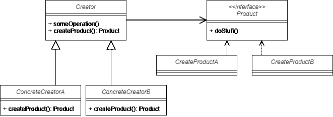
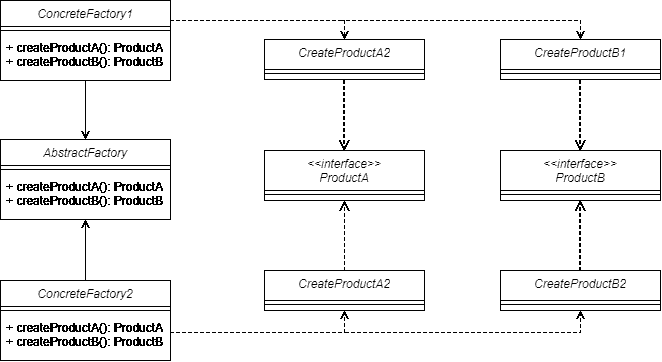

# Java 中的工厂设计模式

> 原文：<https://web.archive.org/web/20220930061024/https://www.baeldung.com/java-factory-pattern>

## 1.概观

在本教程中，我们将解释 Java 中的工厂设计模式。我们描述两种模式:工厂方法和抽象工厂。两者都是创造性的设计模式。我们将用一个例子来说明这些模式。

## 2.工厂方法模式

首先，我们需要定义一个例子。我们正在为一家汽车制造商开发一款应用程序。最初，我们只有一个客户。这位客户制造了只使用燃油发动机的车辆。因此，为了遵循[单一责任原则](/web/20221116222751/https://www.baeldung.com/solid-principles#s) (SRP)和[开闭原则](/web/20221116222751/https://www.baeldung.com/solid-principles#o) (OCP)，我们使用工厂方法设计模式。

在我们进入一些代码之前，我们为这个模式定义一个默认的 [UML](/web/20221116222751/https://www.baeldung.com/java-composition-aggregation-association) 图:

[](/web/20221116222751/https://www.baeldung.com/wp-content/uploads/2022/11/factory_design_pattern_base.png)

使用上面的 UML 图作为参考，我们定义一些与这个模式相关的主要概念。**工厂方法模式通过将我们的`Product`的构造代码从使用这个`Product`** 的代码中分离出来，从而放松了耦合代码。这种设计使得从应用程序的其余部分中独立提取`Product`构造变得容易。此外，它允许在不破坏现有代码的情况下引入新产品。

让我们直接进入代码。首先，在我们的示例应用程序中，我们定义了`MotorVehicle`接口。这个接口只有一个方法`build()`。这种方法用于制造特定的机动车辆。该界面的代码片段:

```
public interface MotorVehicle {
    void build();
}
```

下一步是实现实现`MotorVehicle`接口的具体类。我们创建两种类型:`Motorcycle`和`Car`。第一个的代码是:

```
public class Motorcycle implements MotorVehicle {
    @Override
    public void build() {
        System.out.println("Build Motorcycle");
    }
}
```

对于`Car`类，代码是:

```
public class Car implements MotorVehicle {
    @Override
    public void build() {
        System.out.println("Build Car");
    }
}
```

然后，我们创建了`MotorVehicleFactory`类。这个类负责创建每个新的车辆实例。这是一个抽象类，因为它为特定的工厂制造特定的车辆。这个类的代码是:

```
public abstract class MotorVehicleFactory {
    public MotorVehicle create() {
        MotorVehicle vehicle = createMotorVehicle();
        vehicle.build();
        return vehicle;
    }
    protected abstract MotorVehicle createMotorVehicle();
}
```

正如您所注意到的，方法`create() `调用抽象方法`createMotorVehicle() `来创建特定类型的机动车。这就是为什么每一个特定的汽车制造厂必须实现其正确的`MotorVehicle`类型。之前，我们实现了两种`MotorVehicle`类型，`Motorcycle`和`Car`。现在，我们从基类`MotorVehicleFactory `扩展来实现这两者。

一、`MotorcycleFactory` 类:

```
public class MotorcycleFactory extends MotorVehicleFactory {
    @Override
    protected MotorVehicle createMotorVehicle() {
        return new Motorcycle();
    }
}
```

然后，`CarFactory`类:

```
public class CarFactory extends MotorVehicleFactory {
    @Override
    protected MotorVehicle createMotorVehicle() {
        return new Car();
    }
}
```

仅此而已。我们的应用程序是使用工厂方法模式设计的。我们现在可以随心所欲地增加新的机动车。最后，我们需要使用 [UML](/web/20221116222751/https://www.baeldung.com/java-composition-aggregation-association) 符号来看看我们的最终设计是什么样子:

[](/web/20221116222751/https://www.baeldung.com/wp-content/uploads/2022/11/factory_design_pattern_result.png)

## 3.抽象工厂模式

在我们的第一次 app 迭代之后，有两家新的车辆品牌公司对我们的系统感兴趣:`NextGen`和`FutureVehicle`。这些新公司不仅生产纯燃料汽车，还生产电动汽车。每个公司都有自己的车辆设计。

我们当前的系统还没有准备好应对这些新的情况。我们必须支持电动汽车，并考虑到每个公司都有自己的设计。为了解决这些问题，我们可以使用[抽象工厂模式](/web/20221116222751/https://www.baeldung.com/java-abstract-factory-pattern)。**当我们开始使用工厂方法模式时，通常使用这种模式，我们需要将我们的系统发展成一个更复杂的系统**。**它将产品创建代码集中在一个地方**。UML 表示为:

[](/web/20221116222751/https://www.baeldung.com/wp-content/uploads/2022/11/abstract_factory_design_pattern_base.png)

我们已经有了`MotorVehicle`接口。此外，我们必须添加一个接口来表示电动汽车。新接口的代码片段如下:

```
public interface ElectricVehicle {
    void build();
}
```

接下来，我们创建抽象工厂。新类是抽象的，因为对象创建的责任将由我们的具体工厂承担。该行为遵循 [OCP](/web/20221116222751/https://www.baeldung.com/solid-principles#o) 和 [SRP](/web/20221116222751/https://www.baeldung.com/solid-principles#s) 。让我们跳到类定义:

```
public abstract class Corporation {
    public abstract MotorVehicle createMotorVehicle();
    public abstract ElectricVehicle createElectricVehicle();
}
```

在我们为每个公司创建混凝土工厂之前，我们必须为我们的新公司实现一些工具。让我们为`FutureVehicle`公司制作一些新的班级。

```
public class FutureVehicleMotorcycle implements MotorVehicle {
    @Override
    public void build() {
        System.out.println("Future Vehicle Motorcycle");
    }
}
```

然后，电动汽车的实例:

```
public class FutureVehicleElectricCar implements ElectricVehicle {
    @Override
    public void build() {
        System.out.println("Future Vehicle Electric Car");
    }
} 
```

我们为`NexGen`公司做同样的事情:

```
public class NextGenMotorcycle implements MotorVehicle {
    @Override
    public void build() {
        System.out.println("NextGen Motorcycle");
    }
}
```

此外，其他电动汽车的具体实现:

```
public class NextGenElectricCar implements ElectricVehicle {
    @Override
    public void build() {
        System.out.println("NextGen Electric Car");
    }
}
```

最后，我们准备建造我们的混凝土工厂。第一，`FutureVehicle `工厂:

```
public class FutureVehicleCorporation extends Corporation {
    @Override
    public MotorVehicle createMotorVehicle() {
        return new FutureVehicleMotorcycle();
    }
    @Override
    public ElectricVehicle createElectricVehicle() {
        return new FutureVehicleElectricCar();
    }
}
```

接下来，另一个:

```
public class NextGenCorporation extends Corporation {
    @Override
    public MotorVehicle createMotorVehicle() {
        return new NextGenMotorcycle();
    }
    @Override
    public ElectricVehicle createElectricVehicle() {
        return new NextGenElectricCar();
    }
}
```

一切都结束了。我们使用[抽象工厂模式](/web/20221116222751/https://www.baeldung.com/java-abstract-factory-pattern)完成实现。下面是我们定制实现的 UML 图:

[](/web/20221116222751/https://www.baeldung.com/wp-content/uploads/2022/11/abstract_factory_design_pattern_result.png)

## 4.工厂方法与抽象工厂

综上所述，**工厂方法使用继承作为设计工具**。同时，**抽象工厂使用委托**。第一个依赖于派生类来实现，而基类提供预期的行为。另外，**是超方法而不是超一个档次**。另一方面，**抽象工厂应用于一个类**。**两者都遵循 [OCP](/web/20221116222751/https://www.baeldung.com/solid-principles#o) 和[SRP](/web/20221116222751/https://www.baeldung.com/solid-principles#s)，产生一个松散耦合的代码，为我们代码库的未来变化提供更多的灵活性。创建代码在一个地方。**

## 5.结论

总之，我们做了工厂设计模式的演练。我们描述了工厂方法和抽象工厂。我们提供了一个示例系统来说明这些模式的使用。此外，我们简要比较了这两种模式。

像往常一样，代码片段在 GitHub 上[结束。](https://web.archive.org/web/20221116222751/https://github.com/eugenp/tutorials/tree/master/patterns-modules/design-patterns-creational)