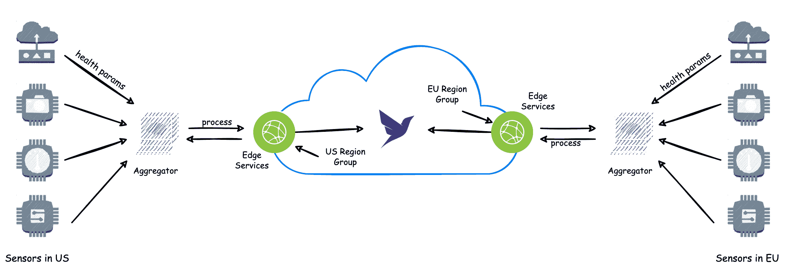
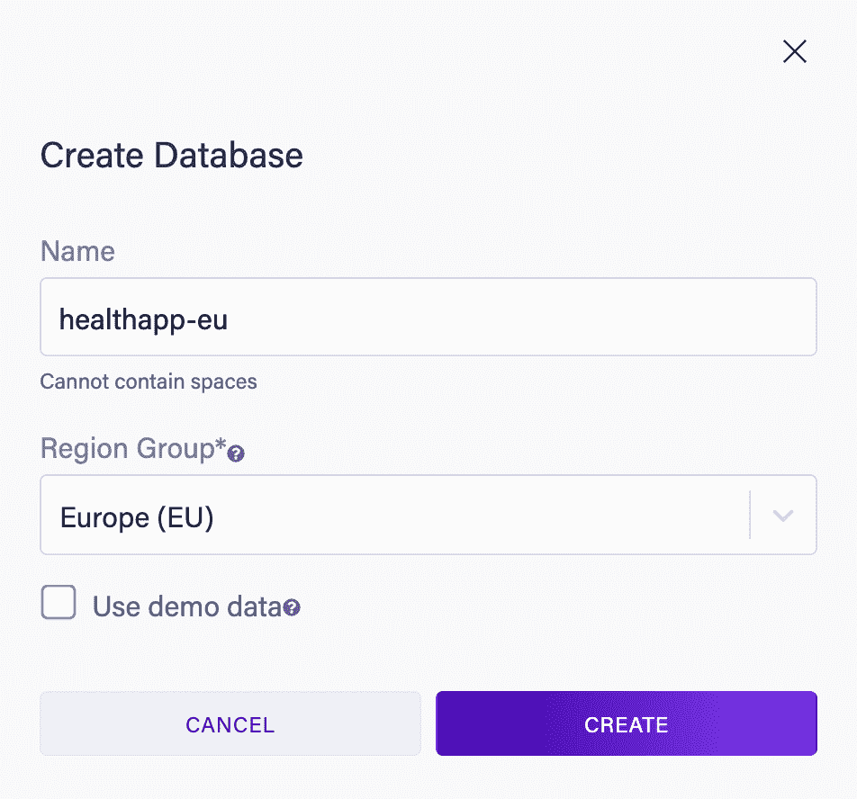
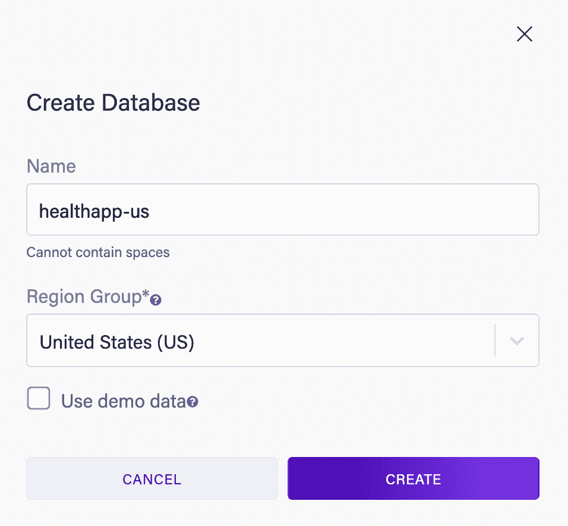
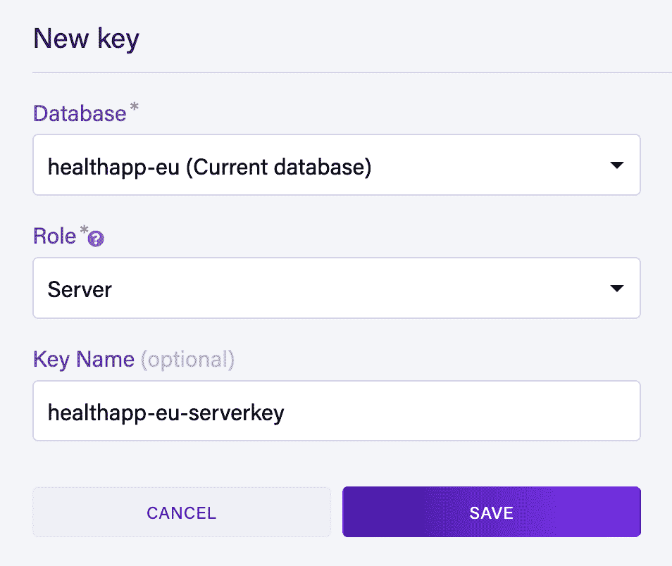
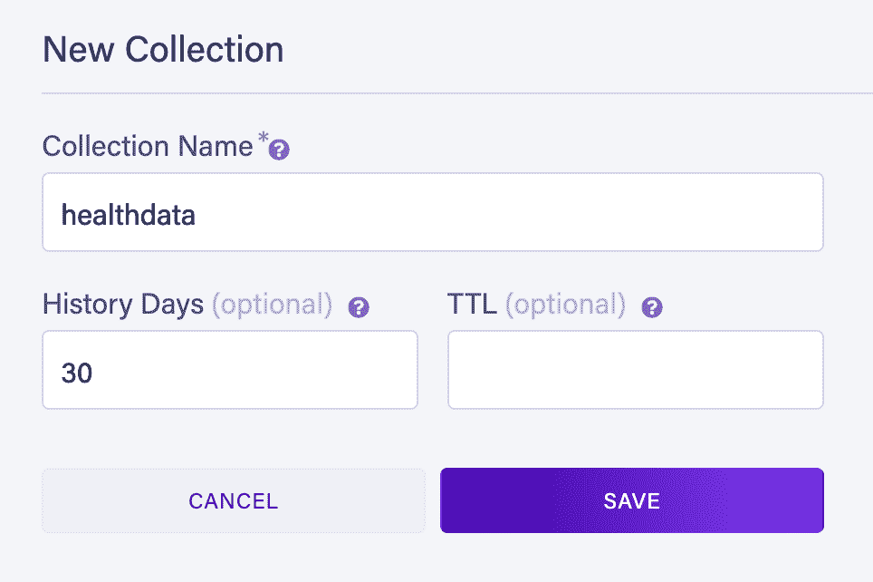
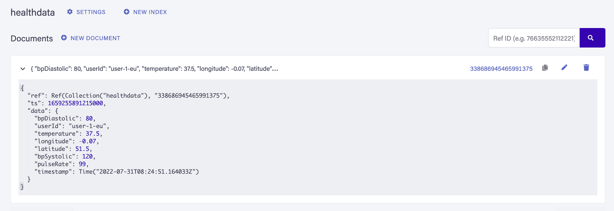

# 使用动物群和 Spring 构建物联网应用

> 原文：<https://web.archive.org/web/20220930061024/https://www.baeldung.com/fauna-spring-building-iot-applications>

## 1.介绍

在本文中，我们将构建一个由[动物群](/web/20221001115717/https://www.baeldung.com/fauna-app)和 Spring 支持的物联网应用。

## 2.物联网应用——快速边缘和分布式数据库

物联网应用离用户很近。他们负责以低延迟消耗和处理大量实时数据。他们需要快速边缘计算服务器和分布式数据库来实现低延迟和最高性能。

此外，物联网应用程序处理非结构化数据，主要是因为它们使用的来源各不相同。物联网应用需要能够高效处理这些非结构化数据的数据库。

在本文中，我们将构建一个物联网应用的后端，负责处理和存储个人的健康生命体征，如温度、心率、血氧水平等。这种物联网应用程序可以通过智能手表等可穿戴设备从相机、红外扫描仪或传感器中消耗健康生命体征。

## 3.将动物群用于物联网应用

在上一节中，我们了解了典型物联网应用的特征，也了解了人们对用于物联网领域的数据库的期望。

动物群具有以下特征，最适合用作物联网应用中的数据库:

**分布式:** **当我们在动物群中创建一个应用程序时，它会自动分布在多个云区域。**对于使用 Cloudflare Workers 或 [Fastly Compute @ Edge](/web/20221001115717/https://www.baeldung.com/fauna-build) 等技术的边缘计算应用来说，这是非常有益的。对于我们的使用案例，该功能可以帮助我们以最小的延迟快速访问、处理和存储分布在全球各地的个人的健康生命体征。

**文档-关系:****fana 将 JSON 文档的灵活性和熟悉性与传统关系数据库的关系和查询能力结合起来**。这种能力有助于大规模处理非结构化物联网数据。

**无服务器:**有了动物群，我们可以专注于构建我们的应用程序，**，而不是与数据库相关的管理和基础设施开销**。

## 4.应用程序的高级请求流

概括地说，我们的应用程序的请求流将是这样的:

[](/web/20221001115717/https://www.baeldung.com/wp-content/uploads/2022/08/request-flow.png)

这里的`Aggregator`是一个简单的应用程序，它汇总了从各种传感器接收到的数据。在本文中，我们不会关注构建`Aggregator`，但是我们可以通过部署在云上的一个简单的 Lambda 函数来解决它的用途。

接下来，我们将使用 Spring Boot 构建 Edge 服务，并使用不同的区域组建立动物群数据库，以处理来自不同区域的请求。

## 5.创建边缘服务–使用 Spring Boot

让我们使用 Spring Boot 创建边缘服务，该服务将使用来自健康传感器的数据，并将其推送到适当的动物区域。

在我们之前的动物群教程中，[使用 Spring 介绍 FaunaDB】和](/web/20221001115717/https://www.baeldung.com/faunadb-spring)[使用动物群和 Spring 为您的第一个网络代理客户端构建一个网络应用](/web/20221001115717/https://www.baeldung.com/faunadb-spring-web-app)，我们探讨了如何创建一个与动物群连接的 Spring Boot 应用。请随意阅读这些文章，了解更多细节。

### 5.1.领域

让我们首先了解我们的边缘服务的领域。

如前所述，我们的边缘服务将消费和处理健康生命体征，让我们创建一个包含个人基本健康生命体征的记录:

```
public record HealthData(

    String userId,

    float temperature, 
    float pulseRate,
    int bpSystolic,
    int bpDiastolic,

    double latitude, 
    double longitude, 
    ZonedDateTime timestamp) {
}
```

### 5.2.公共医疗卫生服务

**我们的健康服务将负责处理健康数据，从请求中识别区域，并将其发送到适当的动物区域:**

```
public interface HealthService {
    void process(HealthData healthData);
}
```

让我们开始构建实现:

```
public class DefaultHealthService implements HealthService {

    @Override
    public void process(HealthData healthData) {
        // ...
    }
}
```

**接下来，让我们添加识别请求区域的代码，即从哪里触发请求。**

Java 中有几个库可以识别地理位置。但是，对于本文，我们将添加一个简单的实现，为所有请求返回区域“US”。

让我们添加接口:

```
public interface GeoLocationService {
    String getRegion(double latitude, double longitude);
}
```

以及为所有请求返回“US”地区的实现:

```
public class DefaultGeoLocationService implements GeoLocationService {

    @Override
    public String getRegion(double latitude, double longitude) {
        return "US";
    }
}
```

接下来，让我们在我们的`HealthService;` 中使用这个`GeoLocationService`让我们注入它:

```
@Autowired
private GeoLocationService geoLocationService;
```

并在`process`方法中使用它来提取区域:

```
public void process(HealthData healthData) {

    String region = geoLocationService.getRegion(
        healthData.latitude(), 
        healthData.longitude());

    // ...
}
```

**一旦我们有了区域，我们必须查询适当的动物群区域组来存储数据**，但是在我们开始之前，让我们用区域组建立动物群数据库。之后我们将继续整合。

## 6.区域群动物群-设置

让我们从建立新的动物数据库开始。如果我们还没有账户，我们需要[创建一个账户](/web/20221001115717/https://www.baeldung.com/fauna-register2)。

### 6.1.创建数据库

登录后，让我们创建一个新的数据库:

[](/web/20221001115717/https://www.baeldung.com/wp-content/uploads/2022/08/fauna-create-db.png)

这里，我们在欧洲(EU)地区创建这个数据库；让我们在美国地区创建相同的数据库来处理来自美国的请求:

[](/web/20221001115717/https://www.baeldung.com/wp-content/uploads/2022/08/fauna-db-us.png)

接下来，我们需要一个安全密钥来从外部访问我们的数据库，在我们的例子中，是从我们创建的边缘服务访问。我们将为两个数据库分别创建密钥:

[](/web/20221001115717/https://www.baeldung.com/wp-content/uploads/2022/08/fauna-key.png)

类似地，我们将创建用于访问`healthapp-us`数据库的密钥。关于在动物群中创建数据库和安全键的更多详细说明，请阅读我们的[关于使用 Spring 的 FaunaDB 简介](/web/20221001115717/https://www.baeldung.com/faunadb-spring)文章。

创建密钥后，让我们将特定区域的动物群连接 URL 和安全密钥存储在我们的 Spring Boot 服务的`application.properties`中:

```
fauna-connections.EU=https://db.eu.fauna.com/
fauna-secrets.EU=eu-secret
fauna-connections.US=https://db.us.fauna.com/
fauna-secrets.US=us-secret
```

当我们使用这些属性来配置动物群客户端以连接动物群数据库时，我们将需要这些属性。

### 6.2.创建`HealthData`收藏

接下来，让我们创建动物群中的`HealthData`集合来存储个体的健康生命体征。

让我们通过导航到数据库仪表板中的“Collections”选项卡并单击“New Collection”按钮来添加集合:

[](/web/20221001115717/https://www.baeldung.com/wp-content/uploads/2022/08/fauna-collection.png)

接下来，让我们单击下一个屏幕上的“New Document”按钮，插入一个示例文档，并在 JavaScript 控制台中添加以下 JSON:

```
{
  "userId": "baeldung-user",
  "temperature": "37.2",
  "pulseRate": "90",
  "bpSystolic": "120",
  "bpDiastolic": "80",
  "latitude": "40.758896",
  "longitude": "-73.985130",
  "timestamp": Now()
}
```

`Now() `函数将在`timestamp`字段中插入当前时间戳。

当我们点击保存时，上面的数据被插入，我们可以在我们的`healthdata`集合中的集合选项卡中查看所有插入的文档:

[](/web/20221001115717/https://www.baeldung.com/wp-content/uploads/2022/08/fauna-collection-view.png)

现在我们已经创建了数据库、密钥和集合，让我们继续将我们的 Edge 服务与我们的动物群数据库集成，并对它们执行操作。

## 7.将边缘服务与动物群相结合

为了将我们的 Spring Boot 应用程序与动物群集成，我们需要将 Java 的动物群驱动程序添加到项目中。让我们添加依赖关系:

```
<dependency>
    <groupId>com.faunadb</groupId>
    <artifactId>faunadb-java</artifactId>
    <version>4.2.0</version>
    <scope>compile</scope>
</dependency>
```

我们总能在这里找到`faunadb-java` [的最新版本。](https://web.archive.org/web/20221001115717/https://mvnrepository.com/artifact/com.faunadb/faunadb-java)

### 7.1.创建特定区域的动物客户

这个驱动程序为我们提供了`FaunaClient`,我们可以使用给定的连接端点和密码轻松地进行配置:

```
FaunaClient client = FaunaClient.builder()
    .withEndpoint("connection-url")
    .withSecret("secret")
    .build();
```

在我们的应用程序中，根据请求的来源，我们需要连接 Fauna 的欧盟和美国地区。我们可以通过分别为两个区域预配置不同的`FaunaClient `实例或者在运行时动态配置客户端来解决这个问题。让我们研究第二种方法。

让我们创建一个新类`FaunaClients,` ，它接受一个区域并返回正确配置的`FaunaClient`:

```
public class FaunaClients {

    public FaunaClient getFaunaClient(String region) {
        // ...
    }
}
```

我们已经在`application.properties; we`中存储了动物群的特定区域端点和秘密，可以将端点和秘密作为地图注入:

```
@ConfigurationProperties
public class FaunaClients {

    private final Map<String, String> faunaConnections = new HashMap<>();
    private final Map<String, String> faunaSecrets = new HashMap<>();

    public Map<String, String> getFaunaConnections() {
        return faunaConnections;
    }

    public Map<String, String> getFaunaSecrets() {
        return faunaSecrets;
    }
}
```

这里，我们使用了`@ConfigurationProperties,` ，它在我们的类中注入了配置属性。要启用此注释，我们还需要添加:

```
<dependency>
    <groupId>org.springframework.boot</groupId>
    <artifactId>spring-boot-configuration-processor</artifactId>
    <optional>true</optional>
</dependency>
```

最后，我们需要从各自的映射中提取正确的连接端点和秘密，并相应地使用它们来创建`FaunaClient`:

```
public FaunaClient getFaunaClient(String region) {

    String faunaUrl = faunaConnections.get(region);
    String faunaSecret = faunaSecrets.get(region);

    log.info("Creating Fauna Client for Region: {} with URL: {}", region, faunaUrl);

    return FaunaClient.builder()
        .withEndpoint(faunaUrl)
        .withSecret(faunaSecret)
        .build();
}
```

我们还添加了一个日志来检查在创建客户端时是否选择了正确的动物 URL。

### 7.2.在卫生服务中使用特定区域的动物客户

一旦我们的客户准备好了，让我们在我们的健康服务中使用它们来发送健康数据给动物。

让我们注射`FaunaClients`:

```
public class DefaultHealthService implements HealthService {

    @Autowired
    private FaunaClients faunaClients;

    // ...
}
```

接下来，让我们通过传入先前从`GeoLocationService`中提取的区域来获得特定于区域的`FaunaClient`:

```
public void process(HealthData healthData) {

    String region = geoLocationService.getRegion(
        healthData.latitude(), 
        healthData.longitude());

    FaunaClient faunaClient = faunaClients.getFaunaClient(region);
}
```

一旦我们有了特定于地区的`FaunaClient`，让我们用它将健康数据插入特定的数据库。

我们将基于我们现有的 [Faunadb Spring Web App](/web/20221001115717/https://www.baeldung.com/faunadb-spring-web-app) 文章，其中我们用 FQL(动物群查询语言)编写了几个 CRUD 查询来与动物群集成。

让我们添加查询来创建动物群的健康数据；我们将以关键字`Create` 开始，并提及我们要插入数据的集合名称:

```
Value queryResponse = faunaClient.query(
    Create(Collection("healthdata"), //)
    ).get();
```

接下来，我们将创建要插入的实际数据对象。我们将把对象的属性和它的值定义为一个`Map`的条目，并使用 FQL 的`Value`关键字包装它:

```
Create(Collection("healthdata"), 
    Obj("data", 
        Obj(Map.of(
            "userId", Value(healthData.userId())))))
)
```

在这里，我们从健康数据记录中读取`userId`，并将其映射到我们插入的文档中的*用户 Id* 字段。

类似地，我们可以对所有剩余的属性进行操作:

```
Create(Collection("healthdata"), 
    Obj("data", 
        Obj(Map.of(
            "userId", Value(healthData.userId()), 
            "temperature", Value(healthData.temperature()),
            "pulseRate", Value(healthData.pulseRate()),
            "bpSystolic", Value(healthData.bpSystolic()),
            "bpDiastolic", Value(healthData.bpDiastolic()),
            "latitude", Value(healthData.latitude()),
            "longitude", Value(healthData.longitude()),
            "timestamp", Now()))))
```

最后，让我们记录查询的响应，以便了解查询执行过程中的任何问题:

```
log.info("Query response received from Fauna: {}", queryResponse); 
```

**注意**:出于本文的目的，我们已经将 Edge 服务构建为一个 Spring Boot 应用程序。在生产中，这些服务可以用任何语言构建，并由边缘提供商在全球网络中部署，如 [Fastly](https://web.archive.org/web/20221001115717/https://www.fastly.com/edge-cloud-network/) 、 [Cloudflare Workers](https://web.archive.org/web/20221001115717/https://workers.cloudflare.com/) 、[、、【电子邮件保护】、](https://web.archive.org/web/20221001115717/https://aws.amazon.com/lambda/edge/)等。

我们的整合已经完成；让我们用一个集成测试来测试整个流程。

## 8.测试端到端集成

让我们添加一个测试来验证我们的集成端到端地工作，并且我们的请求被发送到正确的动物区域。我们将模拟`GeoLocationService`来切换我们测试的区域:

```
@SpringBootTest
class DefaultHealthServiceTest {

    @Autowired
    private DefaultHealthService defaultHealthService;

    @MockBean
    private GeoLocationService geoLocationService;

    // ...
} 
```

让我们为欧盟地区添加一个测试:

```
@Test
void givenEURegion_whenProcess_thenRequestSentToEURegion() {

    HealthData healthData = new HealthData("user-1-eu",
        37.5f,
        99f,
        120, 80,
        51.50, -0.07,
        ZonedDateTime.now());

    // ...
}
```

接下来，让我们模拟该区域并调用`process`方法:

```
when(geoLocationService.getRegion(51.50, -0.07)).thenReturn("EU");

defaultHealthService.process(healthData);
```

当我们运行测试时，我们可以在日志中检查是否获取了正确的 URL 来创建`FaunaClient`:

```
Creating Fauna Client for Region:EU with URL:https://db.eu.fauna.com/
```

我们还可以检查从动物群服务器返回的确认记录创建正确的响应:

```
Query response received from Fauna: 
{
ref: ref(id = "338686945465991375", 
collection = ref(id = "healthdata", collection = ref(id = "collections"))), 
ts: 1659255891215000, 
data: {bpDiastolic: 80, 
userId: "user-1-eu", 
temperature: 37.5, 
longitude: -0.07, latitude: 51.5, 
bpSystolic: 120, 
pulseRate: 99.0, 
timestamp: 2022-07-31T08:24:51.164033Z}}
```

我们还可以在欧盟数据库的`HealthData`集合下的动物仪表板中验证相同的记录:

[](/web/20221001115717/https://www.baeldung.com/wp-content/uploads/2022/08/fauna-dashboard-collection.png)

类似地，我们可以为美国地区添加测试:

```
@Test
void givenUSRegion_whenProcess_thenRequestSentToUSRegion() {

    HealthData healthData = new HealthData("user-1-us", //
        38.0f, //
        100f, //
        115, 85, //
        40.75, -74.30, //
        ZonedDateTime.now());

    when(geoLocationService.getRegion(40.75, -74.30)).thenReturn("US");

    defaultHealthService.process(healthData);
}
```

## 9.结论

在本文中，我们探索了如何利用 Fauna 的[分布式](https://web.archive.org/web/20221001115717/https://docs.fauna.com/fauna/current/learn/introduction/what_is_fauna#how-does-fauna-address-these-requirements)、[文档关系型](https://web.archive.org/web/20221001115717/https://docs.fauna.com/fauna/current/learn/introduction/document_relational)和无服务器特性，将其用作物联网应用的数据库。[动物群的区域组](https://web.archive.org/web/20221001115717/https://docs.fauna.com/fauna/current/learn/understanding/region_groups)基础设施解决了位置问题，并缓解了边缘服务器的延迟问题。

您还可以查看动物群的[点播网络研讨会](/web/20221001115717/https://www.baeldung.com/fauna-webinar)，了解动物群如何减少边缘应用的延迟。

这里显示的所有代码都可以在 Github 的[上找到。](https://web.archive.org/web/20221001115717/https://github.com/eugenp/tutorials/tree/master/persistence-modules/fauna)