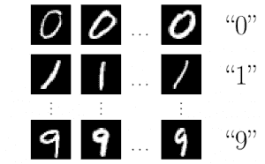

# Java 中的逻辑回归

> 原文：<https://web.archive.org/web/20220930061024/https://www.baeldung.com/java-logistic-regression>

## 1.介绍

逻辑回归是机器学习从业者工具箱中的一个重要工具。

在本教程中，**我们将探索逻辑回归**背后的主要思想。

首先，让我们从 ML 范例和算法的简要概述开始。

## 2.概观

ML 允许我们用对人类友好的方式来解决问题。然而，这一事实可能对美国软件开发商来说是一个挑战。我们已经习惯于用计算机友好的术语来解决我们可以公式化的问题。例如，作为人类，我们可以很容易地察觉到照片上的物体或建立一个短语的语气。我们如何为计算机制定这样一个问题？

为了想出解决方案，**在 ML 中有一个特殊的阶段叫做`training`** 。在这一阶段，我们将输入数据输入到我们的算法中，以便它尝试得出一组最佳参数(所谓的权重)。我们提供给算法的输入数据越多，我们从算法中得到的预测就越精确。

**培训是迭代 ML 工作流程的一部分:**

 
我们从获取数据开始。通常，数据来自不同的来源。因此，我们必须使它具有相同的格式。我们还应该控制数据集公平地代表研究领域。如果模型从未在红苹果上训练过，它几乎无法预测。

接下来，我们应该建立一个模型，这个模型将消耗数据并能够做出预测。在 ML 中，没有在所有情况下都能很好工作的预定义模型。

在寻找正确的模型时，我们可能很容易建立一个模型，训练它，查看它的预测，然后因为我们对它做出的预测不满意而放弃这个模型。在这种情况下，我们应该后退一步，建立另一个模型，再次重复这个过程。

## 3.ML 范例

在 ML 中，基于我们所拥有的输入数据的类型，我们可以挑选出三种主要的范例:

*   监督学习(图像分类、对象识别、情感分析)
*   无监督学习(异常检测)
*   强化学习(游戏策略)

我们将在本教程中描述的**案例属于监督学习。**

## 4.ML 工具箱

在 ML 中，有一套我们可以在构建模型时应用的工具。让我们举几个例子:

*   线性回归
*   逻辑回归
*   神经网络
*   支持向量机
*   k-最近邻

当建立一个具有高度预测性的模型时，我们可以结合几种工具。事实上，对于本教程，我们的模型将使用逻辑回归和神经网络。

## 5.ML 库

尽管 Java 不是最流行的 ML 模型原型语言，但它在包括 ML 在内的许多领域都被认为是创建健壮软件的可靠工具。因此，我们可能会发现用 Java 编写的 ML 库。

在这种情况下，我们可以提到事实上的标准库 [Tensorflow](https://web.archive.org/web/20221205113526/https://www.tensorflow.org/install/lang_java) ，它也有 Java 版本。另一个值得一提的是一个名为 [Deeplearning4j](/web/20221205113526/https://www.baeldung.com/deeplearning4j) 的深度学习库。这是一个非常强大的工具，我们也将在本教程中使用它。

## 6.数字识别的逻辑回归

逻辑回归的主要思想是建立一个模型，尽可能精确地预测输入数据的标签。

我们训练模型，直到所谓的损失函数或目标函数达到某个最小值。损失函数取决于实际模型预测和预期模型预测(输入数据的标签)。我们的目标是最小化实际模型预测和预期预测的差异。

如果我们对这个最小值不满意，我们应该构建另一个模型并再次执行训练。

为了看到逻辑回归的作用，我们用手写数字的识别来说明它。这个问题已经成为一个经典问题。Deeplearning4j 库有一系列现实的[例子](https://web.archive.org/web/20221205113526/https://github.com/deeplearning4j/dl4j-examples/tree/master/dl4j-examples/src/main/java/org/deeplearning4j/examples)，展示了如何使用它的 API。本教程中与代码相关的部分大量基于 [`MNIST Classifier`](https://web.archive.org/web/20221205113526/https://github.com/eclipse/deeplearning4j-examples/tree/master/dl4j-examples/src/main/java/org/deeplearning4j/examples/quickstart/modeling/convolution) 。

### 6.1.输入数据

作为输入数据，我们使用众所周知的手写数字的 [MNIST 数据库](https://web.archive.org/web/20221205113526/https://en.wikipedia.org/wiki/MNIST_database)。作为输入数据，我们有 28×28 像素的灰度图像。每个图像都有一个自然标签，它是图像所代表的数字:

**为了评估我们将要构建的模型的效率，我们将输入数据分成训练集和测试集:**

[PRE0]

一旦我们将输入图像标记并分成两组，“数据加工”阶段就结束了，我们可以进入“模型构建”阶段。

### 6.2.模型结构

正如我们所提到的，没有在每种情况下都能很好工作的模型。尽管如此，经过多年对 ML 的研究，科学家们已经找到了在识别手写数字方面表现非常好的模型。在这里，我们使用所谓的 [LeNet-5](https://web.archive.org/web/20221205113526/http://yann.lecun.com/exdb/lenet/) 模型。

LeNet-5 是一种神经网络，由一系列层组成，将 28×28 像素图像转换为十维向量:

 
十维输出向量包含输入图像的标签为 0、1、2 等的概率。

例如，如果输出向量具有以下形式:

[PRE1]

这意味着输入图像为零的概率是 0.1，为一的概率是 0，为二的概率是 0.3，等等。我们看到最大概率(0.3)对应于标签 3。

让我们深入模型构建的细节。我们省略了特定于 Java 的细节，专注于 ML 概念。

我们通过创建一个`MultiLayerNetwork`对象来建立模型:

[PRE2]

在它的构造函数中，我们应该传递一个`MultiLayerConfiguration`对象。这正是描述神经网络几何的对象。为了定义网络几何，我们应该定义每一层。

让我们展示一下我们是如何使用第一个和第二个来实现这一点的:

[PRE3]

我们看到，各层的定义包含了大量对整个网络性能有重大影响的特定参数。这正是我们在所有模式中找到一个好模式的能力变得至关重要的地方。

现在，我们准备构建`MultiLayerConfiguration`对象:

[PRE4]

我们将其传递给*多层网络*构造函数。

### 6.3.培养

我们构建的模型包含 431080 个参数或权重。我们不会在这里给出这个数字的精确计算，但是我们应该知道第一层的权重超过 24x24x20 = 11520。

培训阶段非常简单:

[PRE5]

最初，431080 参数具有一些随机值，但是在训练之后，它们获得一些决定模型性能的值。我们可以评估模型的预测性:

[PRE6]

LeNet-5 模型甚至在仅仅一次训练迭代(历元)中就实现了几乎 99%的相当高的准确度。如果我们想要达到更高的精度，我们应该使用简单的`for-loop`进行更多的迭代:

[PRE7]

### 6.4.预言；预测；预告

现在，由于我们训练了该模型，并且我们对其在测试数据上的预测感到满意，我们可以在一些全新的输入上尝试该模型。为此，让我们创建一个新的类`MnistPrediction`，在这个类中，我们将从文件系统中选择的一个文件中加载一个图像:

[PRE8]

变量`image`包含我们被缩小到 28×28 灰度的图片。我们可以把它输入到我们的模型中:

[PRE9]

变量`output`将包含图像为零、一、二等的概率。

现在让我们玩一会儿，写一个数字 2，将这个图像数字化并输入模型。我们可能会得到这样的结果:

 
我们看到，最大值为 0.99 的分量有指标二。这意味着模型已经正确地识别了我们的手写数字。

## 7.结论

在本教程中，我们描述了机器学习的一般概念。我们用一个应用于手写数字识别的逻辑回归例子来说明这些概念。

和往常一样，我们可能会在我们的 [GitHub 库](https://web.archive.org/web/20221205113526/https://github.com/eugenp/tutorials/tree/master/deeplearning4j)上找到相应的代码片段。