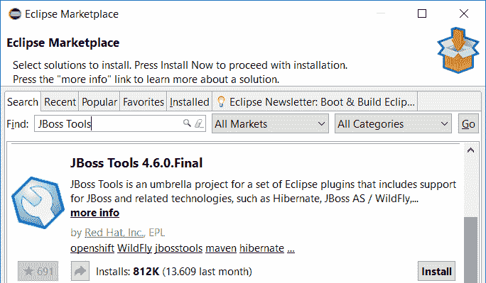
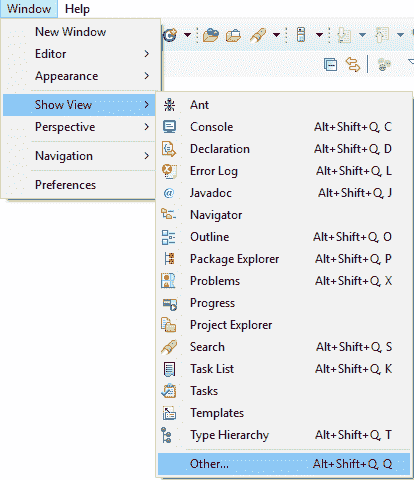
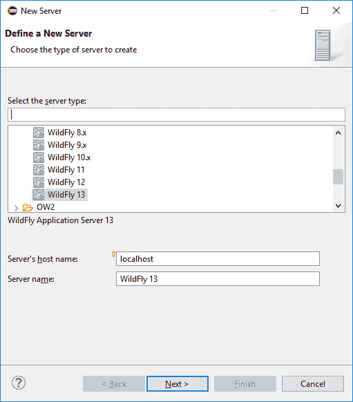
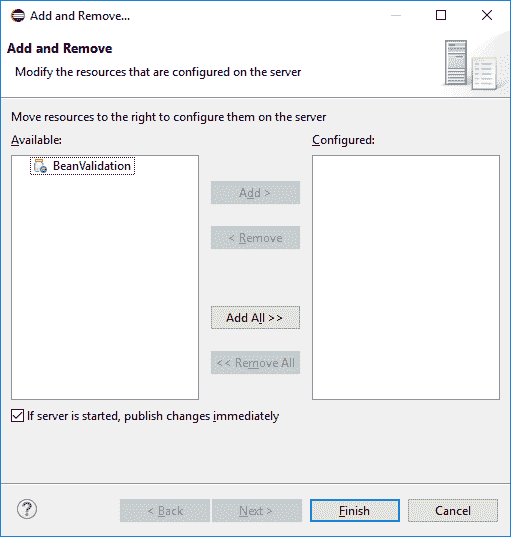
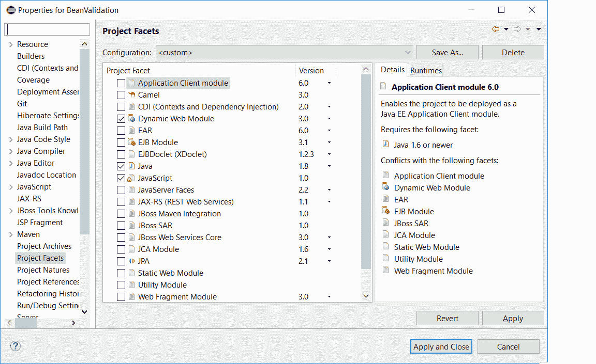

# Eclipse 的 WildFly 安装和设置

> 原文:[https://web . archive . org/web/20220930061024/https://www . bael dung . com/eclipse-wildly-configuration](https://web.archive.org/web/20220930061024/https://www.baeldung.com/eclipse-wildfly-configuration)

## 1.概观

在本文中，我们将直接从 Eclipse IDE 运行和调试 WildFly 上的应用程序。

我们可以独立使用 WildFly 应用服务器和 Eclipse 来构建和运行应用程序。作为第一步，我们可以[自己启动和停止应用服务器](/web/20220627183431/https://www.baeldung.com/jboss-start-stop)。但是，当我们将两者整合时，开发会更快。例如，当我们在调试模式下更改代码时，这些更改会自动部署。

请注意，截图是用 Eclipse Photon 拍摄的，在其他版本或操作系统中可能会有所不同。

## 2.要求

首先，我们从安装以下软件开始:

*   [Java](https://web.archive.org/web/20220627183431/https://openjdk.java.net/)
*   [月食](https://web.archive.org/web/20220627183431/https://www.eclipse.org/)
*   [野生鸟类](https://web.archive.org/web/20220627183431/http://wildfly.org/)

然后，我们验证一切是否配置正确。如果 Eclipse 和 WildFly 都工作正常，那么我们可以继续我们的配置。

## 3.安装 JBoss 工具插件

我们将为 Eclipse 使用 JBoss 工具插件。JBoss Tools 提供了 Eclipse 和 WildFly 之间的集成。

安装插件有两种方式:

*   我们可以通过[网站](https://web.archive.org/web/20220627183431/https://marketplace.eclipse.org/content/jboss-tools)安装
*   我们可以通过 Eclipse Marketplace 安装它
    *   打开 Eclipse
    *   点击`Help`，然后点击`Eclipse Marketplace`
    *   搜索`JBoss Tools`
    *   点击 JBoss 工具解决方案旁边的`Install`
    *   遵循向导的其余部分

## 4.在 Eclipse 中配置应用服务器

我们从将 WildFly 服务器添加到 Eclipse 开始。

首先，我们在 Eclipse 中添加一个新的`View`。请点击`Window` / `Show View` / `Other`:

接下来，请点击`Server` / `Servers`。现在 Eclipse 显示了一个`Servers`选项卡:

之后，我们可以通过点击`Servers`选项卡中的`No servers are available. Click this link to create a new server…`来添加服务器:

下一步，我们展开`JBoss Community`类别并选择与 WildFly 安装相匹配的 WildFly 版本。对于其余的，我们只需按照向导:

当您安装的版本不可用时，请选择最新版本。但是一定要升级`JBoss Tools`,当他们有一个新的支持特定版本的版本时:

## 5.向 WildFly 添加应用程序

**配置应用服务器后，我们将向服务器添加一个应用**:

*   右键单击`Servers`选项卡中的 WildFly 实例
*   点击`Add and Remove
    ` 
*   选择要部署的应用程序
*   点击`Add`
*   点击`Finish`

如果存在 Servlet API 版本不匹配，将显示消息'`There are no resources that can be added or removed from the server'`。

因此，首先我们要确保 Servlet API 版本与 WildFly 安装打包的 Servlet API 版本相匹配:

*   右键单击该项目
*   点击属性
*   单击项目方面
*   如果项目还不是多面形式
    *   点击`Convert to faceted form…`
    *   启用“动态 Web 模块”

配置完成后，我们可以在 WildFly 服务器实例下看到应用程序:

## 6.运行应用程序

**我们终于可以从 Eclipse 启动 WildFly 和应用程序了。**右击野花实例，然后点击`Start`。应用程序正在启动，我们可以使用它:

我们可以通过手动部署应用程序或使用构建工具来获得相同的结果。但是，从 IDE 中启动应用服务器有一些优点，比如可以调试应用程序。

## 7.调试应用程序

首先，我们点击`Servers`或`Console`选项卡上的“停止服务器”按钮(红色方块)来停止服务器:

**然后我们在调试模式下启动应用程序，方法是右键单击 WildFly 实例，然后单击`Debug`。**

当我们更改代码时，它会自动部署。如果我们做了更大的改动，那么我们会从 Eclipse 得到一条消息，告诉我们重新启动。我们还可以通过右键单击实例，然后单击`Restart in Debug`，手动重启应用服务器。

通常调试器还没有源代码。导致以下消息:`Source not found`。如果是这种情况，我们可以简单地提供源:

*   点击`Edit Source Lookup Path`
*   点击`Add
    ` 
*   选择`Java Project
    ` 
*   选择项目
*   跟着向导走

## 8.结论

在本文中，我们使用 JBoss Tools 插件来集成 WildFly 和 Eclipse。通过组合这些工具，我们可以更容易地部署我们的应用程序。

然而，最大的优势是，通过这种设置，我们可以在调试模式下启动应用程序，代码更改立即可见。这样，我们使我们的开发过程更快、更有效。