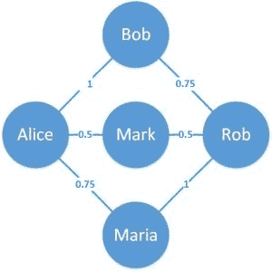
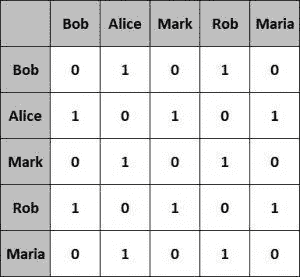
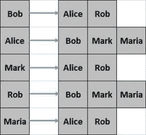

# Java 中的图形

> 原文：<https://web.archive.org/web/20220930061024/https://www.baeldung.com/java-graphs>

## **1。概述**

在本教程中，**我们将看看作为数据结构的[图的基本概念](/web/20220929075916/https://www.baeldung.com/cs/graphs)。**

我们还将探索它在 Java 中的实现，以及可能在图上进行的各种操作。我们还将讨论提供图形实现的 Java 库。

## 延伸阅读:

## [检查 Java 图是否有循环](/web/20220929075916/https://www.baeldung.com/java-graph-has-a-cycle)

Learn how to check if a cycle exists in a given directed graph in Java.[Read more](/web/20220929075916/https://www.baeldung.com/java-graph-has-a-cycle) →

## [Java 中的 Dijkstra 最短路径算法](/web/20220929075916/https://www.baeldung.com/java-dijkstra)

An explanation and implementation of the Dijkstra Algorithm in Java[Read more](/web/20220929075916/https://www.baeldung.com/java-dijkstra) →

## [JGraphT 简介](/web/20220929075916/https://www.baeldung.com/jgrapht)

Learn how to use JGraphT to create graphs and explore the variety of graph algorithms.[Read more](/web/20220929075916/https://www.baeldung.com/jgrapht) →

## **2。图形数据结构**

图是一种**数据结构，用于存储连接的数据**，例如社交媒体平台上的人际网络。

图由顶点和边组成。**一个顶点代表实体**(例如，人)**一条边代表实体之间的关系**(例如，一个人的友谊)。

让我们定义一个简单的图表来更好地理解这一点:

[](/web/20220929075916/https://www.baeldung.com/wp-content/uploads/2018/11/graph1.jpg) [](/web/20220929075916/https://www.baeldung.com/wp-content/uploads/2018/11/graph1.jpg)

这里我们定义了一个有五个顶点和六条边的简单图形。圆圈是表示人的顶点，连接两个顶点的线是表示在线门户上的朋友的边。

根据边的属性，这个简单的图有一些变化。让我们在接下来的部分中简要地浏览一下它们。

然而，在本教程中，我们将只关注这里为 Java 示例提供的简单图表。

### **2.1。有向图**

到目前为止，我们定义的图有没有任何方向的边。如果这些**边的特征是其中有一个方向**，那么得到的图被称为[有向图](/web/20220929075916/https://www.baeldung.com/cs/graphs-directed-vs-undirected-graph)。

这种情况的一个例子可以是在在线门户上的友谊中表示谁发送了朋友请求:

[](/web/20220929075916/https://www.baeldung.com/wp-content/uploads/2018/11/graph2.jpg)

这里我们可以看到边有一个固定的方向。边缘也可以是双向的。

### **2.2。加权图**

同样，我们的简单图有无偏或未加权的边。

相反，如果这些**边带有相对权重**，则该图称为加权图。

这种实际应用的一个例子可以是在在线门户上表示一段友谊的相对历史:

[](/web/20220929075916/https://www.baeldung.com/wp-content/uploads/2018/11/graph3.jpg)

在这里，我们可以看到边都有与之相关的权重。这提供了这些边的相对意义。

## 3.**图形表示法**

图可以用不同的形式表示，如邻接矩阵和邻接表。在不同的设置中，每一种都有其优点和缺点。

我们将在本节中介绍这些图形表示。

### **3.1。邻接矩阵**

邻接矩阵是一个正方形矩阵，其维数等于图中顶点数。

矩阵的元素通常具有值 0 或 1。值 1 表示行和列中的顶点之间相邻，否则值为 0。

让我们看看上一节中简单图形的邻接矩阵是什么样的:

[](/web/20220929075916/https://www.baeldung.com/wp-content/uploads/2018/11/graph4.jpg)

这种表示很容易实现，查询起来也很有效。然而，就占用空间而言，它的**效率较低。**

### **3.2。邻接表**

邻接表只不过是一组列表。数组的大小相当于图中顶点的数量。

**数组中特定索引处的列表表示该数组索引所代表的顶点的相邻顶点。**

让我们看看上一节中简单图形的邻接表是什么样子的:

[](/web/20220929075916/https://www.baeldung.com/wp-content/uploads/2018/11/graph5.jpg)

这种表示相对难以创建，并且查询效率较低。然而，它为 T2 提供了更好的空间效率。

在本教程中，我们将使用邻接表来表示图。

## **4。Java 中的图形**

Java 没有图形数据结构的默认实现。

然而，我们可以使用 Java 集合来实现这个图。

让我们从定义一个顶点开始:

```
class Vertex {
    String label;
    Vertex(String label) {
        this.label = label;
    }

    // equals and hashCode
}
```

上面的顶点定义只是以一个标签为特征，但这可以表示任何可能的实体，如`Person`或 `City`。

另外，请注意，**我们必须覆盖`equals()`和`hashCode()`方法，因为它们是处理 Java 集合所必需的。**

正如我们前面所讨论的，图只不过是顶点和边的集合，可以用邻接矩阵或邻接表来表示。

让我们看看如何使用邻接表来定义它:

```
class Graph {
    private Map<Vertex, List<Vertex>> adjVertices;

    // standard constructor, getters, setters
}
```

正如我们所看到的，类`Graph`使用 Java 集合中的`Map`来定义邻接表。

在图形数据结构上有几种可能的操作，例如通过图形创建、更新或搜索****。****

我们将讨论一些更常见的操作，看看如何用 Java 实现它们。

## **5。图形变异操作**

首先，我们将定义一些方法来改变图形数据结构。

让我们定义添加和移除顶点的方法:

```
void addVertex(String label) {
    adjVertices.putIfAbsent(new Vertex(label), new ArrayList<>());
}

void removeVertex(String label) {
    Vertex v = new Vertex(label);
    adjVertices.values().stream().forEach(e -> e.remove(v));
    adjVertices.remove(new Vertex(label));
}
```

这些方法简单地从顶点 `Set`添加和移除元素。

现在，让我们也定义一个添加边的方法:

```
void addEdge(String label1, String label2) {
    Vertex v1 = new Vertex(label1);
    Vertex v2 = new Vertex(label2);
    adjVertices.get(v1).add(v2);
    adjVertices.get(v2).add(v1);
}
```

这个方法创建一个新的`Edge`并更新相邻的顶点`Map`。

以类似的方式，我们将定义`removeEdge()`方法:

```
void removeEdge(String label1, String label2) {
    Vertex v1 = new Vertex(label1);
    Vertex v2 = new Vertex(label2);
    List<Vertex> eV1 = adjVertices.get(v1);
    List<Vertex> eV2 = adjVertices.get(v2);
    if (eV1 != null)
        eV1.remove(v2);
    if (eV2 != null)
        eV2.remove(v1);
}
```

接下来，让我们看看如何使用我们到目前为止定义的方法来创建我们之前绘制的简单图形:

```
Graph createGraph() {
    Graph graph = new Graph();
    graph.addVertex("Bob");
    graph.addVertex("Alice");
    graph.addVertex("Mark");
    graph.addVertex("Rob");
    graph.addVertex("Maria");
    graph.addEdge("Bob", "Alice");
    graph.addEdge("Bob", "Rob");
    graph.addEdge("Alice", "Mark");
    graph.addEdge("Rob", "Mark");
    graph.addEdge("Alice", "Maria");
    graph.addEdge("Rob", "Maria");
    return graph;
}
```

最后，我们将定义一种方法来获取特定顶点的相邻顶点:

```
List<Vertex> getAdjVertices(String label) {
    return adjVertices.get(new Vertex(label));
}
```

## **6。遍历图形**

既然我们已经定义了图形数据结构和函数来创建和更新它，我们可以定义一些额外的函数来遍历图形。

我们需要遍历一个图来执行任何有意义的操作，比如在图中搜索。

遍历一个图有两种可能的方法:深度优先遍历和广度优先遍历。

### 6.1.深度优先遍历

一个[深度优先遍历](/web/20220929075916/https://www.baeldung.com/cs/depth-first-traversal-methods)从任意一个根顶点开始，**在探索同一层的顶点之前，沿着每个分支探索尽可能深的顶点。**

让我们定义一个方法来执行深度优先遍历:

```
Set<String> depthFirstTraversal(Graph graph, String root) {
    Set<String> visited = new LinkedHashSet<String>();
    Stack<String> stack = new Stack<String>();
    stack.push(root);
    while (!stack.isEmpty()) {
        String vertex = stack.pop();
        if (!visited.contains(vertex)) {
            visited.add(vertex);
            for (Vertex v : graph.getAdjVertices(vertex)) {              
                stack.push(v.label);
            }
        }
    }
    return visited;
}
```

这里，**我们使用一个`Stack`来存储需要遍历的顶点。**

让我们在上一小节中创建的图表上运行它:

```
assertEquals("[Bob, Rob, Maria, Alice, Mark]", depthFirstTraversal(graph, "Bob").toString());
```

请注意，我们在这里使用顶点“Bob”作为遍历的根，但是它可以是任何其他的顶点。

### 6.2。广度优先遍历

相比之下，广度优先遍历从任意根顶点开始，**在深入图中的**之前探索同一层的所有相邻顶点。

现在让我们定义一个方法来执行广度优先遍历:

```
Set<String> breadthFirstTraversal(Graph graph, String root) {
    Set<String> visited = new LinkedHashSet<String>();
    Queue<String> queue = new LinkedList<String>();
    queue.add(root);
    visited.add(root);
    while (!queue.isEmpty()) {
        String vertex = queue.poll();
        for (Vertex v : graph.getAdjVertices(vertex)) {
            if (!visited.contains(v.label)) {
                visited.add(v.label);
                queue.add(v.label);
            }
        }
    }
    return visited;
}
```

注意广度优先遍历**利用`Queue`来存储需要遍历的顶点。**

让我们再次在同一个图上运行这个遍历:

```
assertEquals(
  "[Bob, Alice, Rob, Mark, Maria]", breadthFirstTraversal(graph, "Bob").toString());
```

同样，根顶点(这里是“Bob ”)也可以是任何其他顶点。

## **7。Java 图形库**

在 Java 中，没有必要总是从头开始实现图形。有几个开源和成熟的库提供了图形实现。

在接下来的几个小节中，我们将浏览其中的一些库。

### 7.1。JGraphT

JGraphT 是 Java 中最流行的图形数据结构库之一。它允许创建一个简单的图形，有向图和加权图，等等。

此外，它提供了图形数据结构的许多可能的算法。我们之前的一个教程更加详细地介绍了[JGraphT](/web/20220929075916/https://www.baeldung.com/jgrapht)。

### 7.2。谷歌番石榴

Google Guava 是一组 Java 库，提供了一系列功能，包括图形数据结构及其算法。

支持创建简单的`Graph`、`ValueGraph`和`Network`。这些可以定义为`Mutable`或`Immutable`。

### **7.3 .Apache common〔t1〕**

Apache Commons 是一个 Apache 项目，提供可重用的 Java 组件。这包括 Commons Graph，它提供了一个工具包来创建和管理图形数据结构。这也提供了对数据结构进行操作的通用图形算法。

### 7.4。Sourceforge JUNG

[Java Universal Network/Graph(JUNG)](https://web.archive.org/web/20220929075916/http://jung.sourceforge.net/)是一个 Java 框架，提供可扩展语言，用于对任何可以用图形表示的数据进行建模、分析和可视化。

JUNG 支持许多算法，包括聚类、分解和优化等例程。

这些库提供了许多基于图形数据结构的实现。还有更强大的基于图表的框架，比如 T2 的 Apache Giraph 和 T4 的 Apache TinkerPop，前者目前在脸书用于分析用户形成的图表，后者通常用于图表数据库。

## **8。结论**

在本文中，我们讨论了作为数据结构的图及其表示。我们使用 Java 集合在 Java 中定义了一个非常简单的图形，还为该图形定义了公共遍历。

我们还简要地讨论了 Java 平台之外提供图形实现的各种可用的 Java 库。

和往常一样，这些例子的代码可以在 GitHub 的[上找到。](https://web.archive.org/web/20220929075916/https://github.com/eugenp/tutorials/tree/master/data-structures)