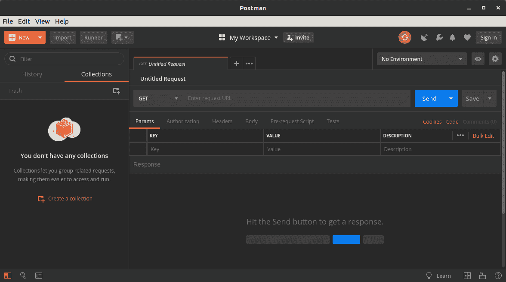
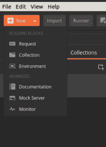
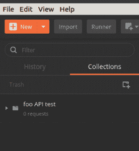
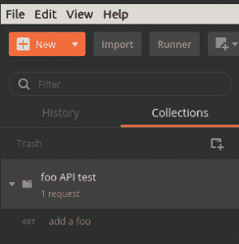
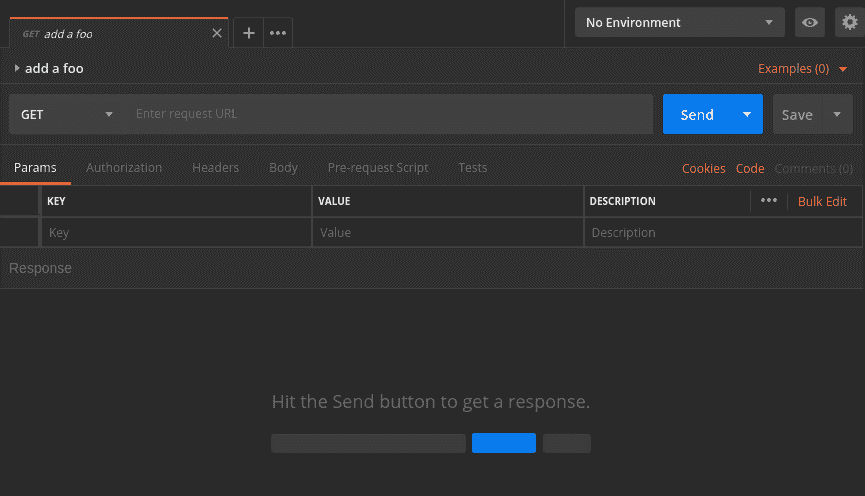
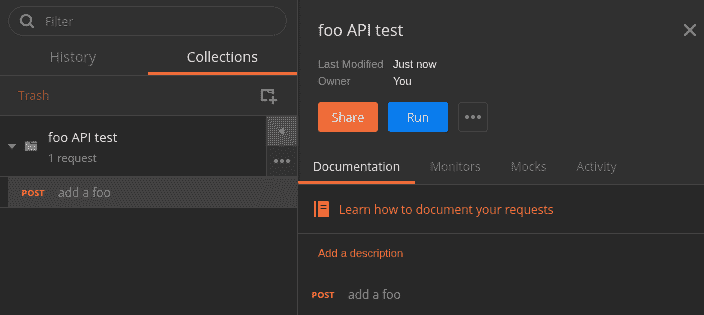
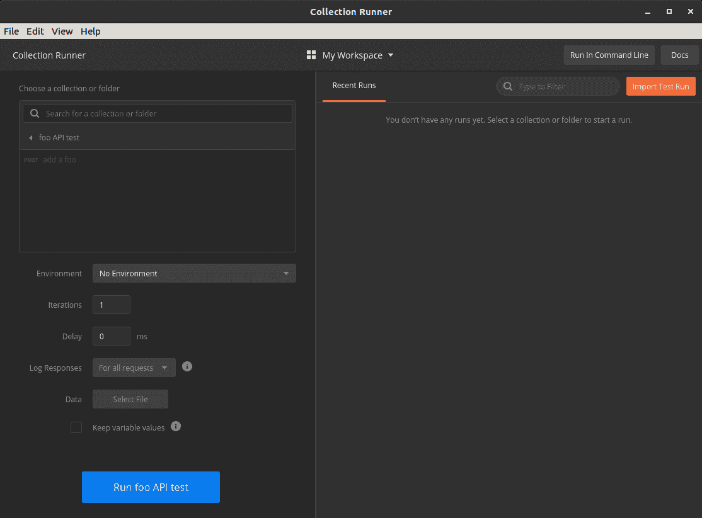
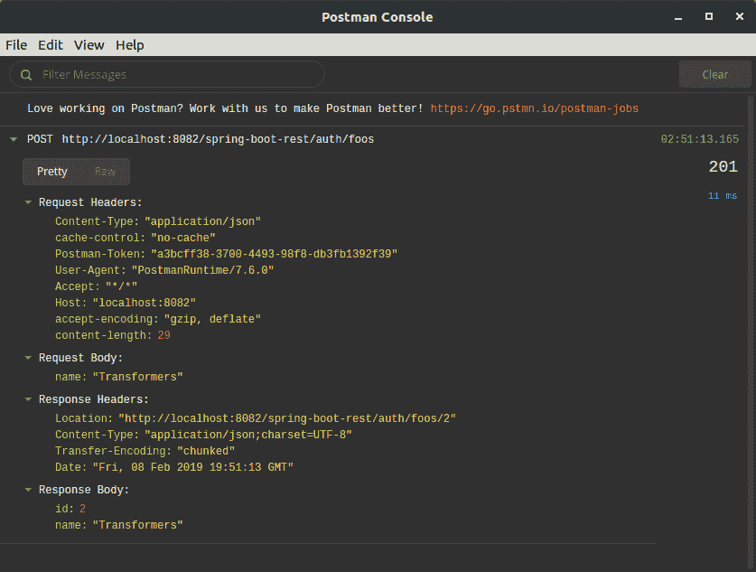
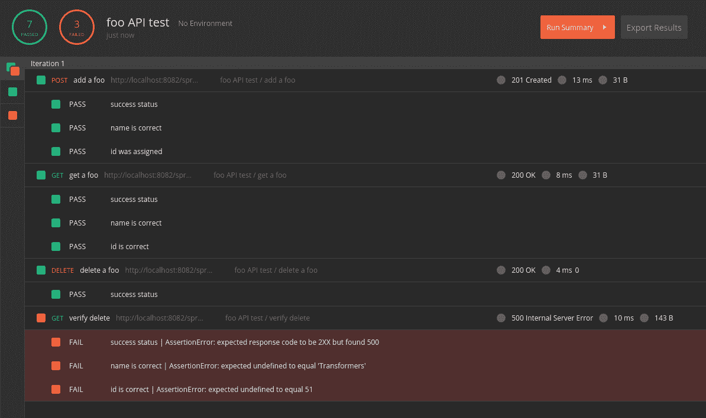
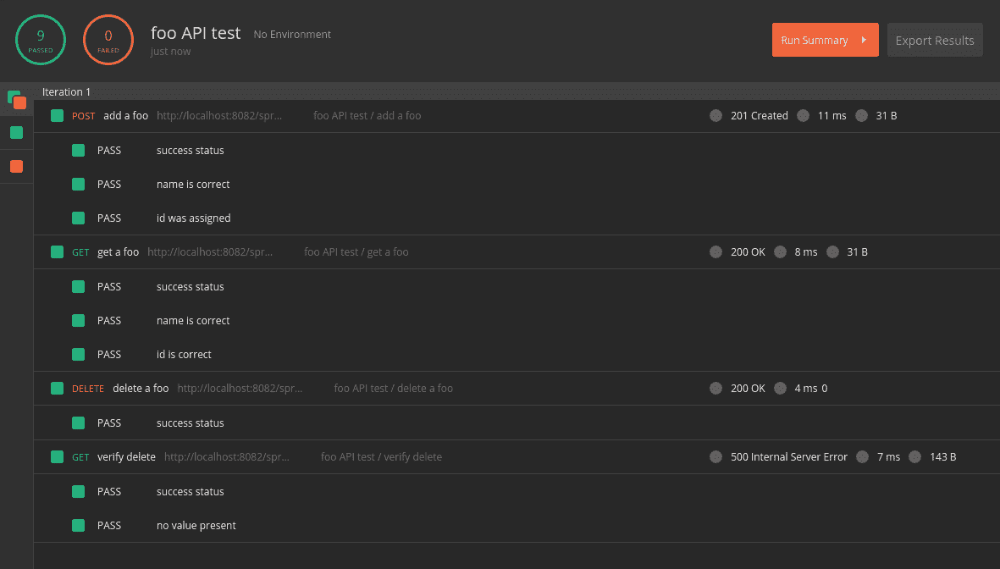

# 用邮递员集合测试 Web APIs

> 原文：<https://web.archive.org/web/20220930061024/https://www.baeldung.com/postman-testing-collections>

## **1。简介**

为了彻底测试 web API，我们需要某种 web 客户端来访问 API 的端点。Postman 是一个独立的工具，它通过从服务外部发出 HTTP 请求来运行 web APIs。

在使用 Postman 时，我们不需要仅仅为了测试而编写任何 HTTP 客户端基础设施代码。相反，我们创建称为集合的测试套件，并让 Postman 与我们的 API 进行交互。

在本教程中，我们将看到如何创建一个可以测试 REST API 的 Postman 集合。

## **2。设置**

在开始收集之前，我们需要设置环境。

### **2.1。安装邮递员**

Postman 适用于 Linux、Mac 和 Windows。该工具可以从[邮差网站](https://web.archive.org/web/20220626200521/https://www.getpostman.com/downloads/)下载安装。

关闭闪屏后，我们可以看到用户界面:

### **2.2。运行服务器**

**Postman 需要一个活动的 HTTP 服务器来处理它的请求**。对于本教程，我们将使用以前的 Baeldung 项目，`spring-boot-rest,`，它可以在 [GitHub](https://web.archive.org/web/20220626200521/https://github.com/eugenp/tutorials/tree/master/spring-boot-modules/spring-boot-mvc-2) 上获得。

正如我们从标题中所猜测的，`spring-boot-rest`是一个 Spring Boot 应用程序。我们用 Maven 的目标`install`构建应用程序。一旦构建完成，我们就启动带有定制 Maven 目标`spring-boot:run`的服务器。

要验证服务器是否正在运行，我们可以在浏览器中点击以下 URL:

[PRE0]

该服务使用内存数据库。服务器停止时，所有记录都会被清除。

## **3。创建邮递员集合**

Postman 中的集合是一系列 HTTP 请求。Postman 保存请求的每个方面，包括标题和消息正文。因此，**我们可以按顺序运行请求，作为半自动测试**。

让我们从创建一个新集合开始。我们可以点击`New`按钮上的下拉箭头，选择`Collection`:

当`CREATE A NEW COLLECTION`对话框出现时，我们可以将我们的集合命名为“`foo API test`”。最后，我们单击`Create`按钮，看到我们的新系列出现在左侧列表中:

一旦我们的集合被创建，我们可以将光标悬停在它上面以显示两个菜单按钮。箭头按钮打开一个右拉面板，提供对`Collection Runner`的访问。相反，省略号按钮会打开一个下拉菜单，其中包含对集合的许多操作。

## **4。添加发布请求**

### **4.1。创建新请求**

现在我们有了一个空的集合，让我们添加一个命中我们的 API 的请求。具体来说，让我们向 URI `/auth/foos.`发送一条 POST 消息，**我们打开集合上的省略号菜单并选择`Add Request.`**

当`SAVE REQUEST` 对话框出现时，让我们提供一个描述性的名称，比如“`add a` foo”。然后，点击`Save to foo API test`按钮。

一旦请求被创建，我们可以看到我们的集合指示`one request`。但是，如果我们的集合没有被扩展，那么我们还看不到请求。在这种情况下，我们可以单击集合将其展开。

现在，我们应该看到新的请求列在我们的集合下。我们可以观察到，默认情况下，新请求是一个 HTTP GET，这不是我们想要的。我们将在下一节中解决这个问题:

### **4.2。编辑请求**

要编辑请求，让我们单击它，从而将它加载到请求编辑器选项卡中:

尽管请求编辑器有许多选项，但我们现在只需要其中的几个。

首先，让我们使用下拉菜单将方法从 GET 改为 POST。

其次，我们需要一个 URL。方法下拉列表的右侧是请求 URL 的文本框。那么，让我们现在输入:

[PRE1]

最后一步是提供消息体。URL 地址下面是一行选项卡标题。我们将点击`Body` 选项卡标题进入正文编辑器。

在`Body`标签中，就在文本区域的上方，有一行单选按钮和一个下拉菜单。这些控制请求的格式和内容类型。

**我们的服务接受 JSON 数据，所以我们选择`raw`单选按钮**。**在右边的下拉列表中，我们应用了`JSON (application/json)`内容类型**。

一旦设置了编码和内容类型，我们就将 JSON 内容添加到文本区域:

[PRE2]

最后，让我们确保通过按下`Ctrl-S` 或点击`Save`按钮来保存我们的更改。`Save`按钮位于`Send`按钮的右侧。一旦我们保存，我们可以看到请求已经更新到左边列表中的帖子:

## **5。运行请求**

### **5.1。运行单个请求**

**要运行一个请求，我们只需点击 URL 地址右边的`Send`按钮**。单击`Send,`后，响应面板将在请求面板下方打开。可能需要向下滚动才能看到它:

让我们检查我们的结果。具体来说，在标题栏中，我们看到我们的请求成功了，状态为`201 Created`。此外，响应体显示我们的`Transformers`记录收到了一个 id 1。

### 5.2。使用收集运行器

**与`Send` 按钮相反，收款员可以执行整个收款**。要启动集合运行器，我们将光标悬停在我们的`foo API test` 集合上，并单击向右拉箭头。在右拉面板中，我们可以看到一个`Run`按钮，让我们点击它:

当我们单击`Run` 按钮时，收集运行器将在新窗口中打开。因为我们是从我们的集合中启动它的，所以 runner 已经在我们的集合中初始化了:

collection runner 提供了影响测试运行的选项，但是在这个练习中我们不需要它们。让我们直接点击底部的`Run foo API test`按钮。

当我们运行收集时，视图变为`Run Results`。在这个视图中，**我们看到一个测试列表，绿色表示成功，红色表示失败。**

即使我们的请求被发送了，运行者仍然指出零个测试通过，零个测试失败。这是因为我们还没有向我们的请求中添加测试:

## **6。测试响应**

### **6.1。向请求添加测试**

为了创建一个测试，让我们返回到我们构建 POST 方法的请求编辑面板。我们单击位于 URL 下的`Tests`选项卡。当我们这样做时，测试面板出现:

在 Tests 面板中，我们编写了当从服务器收到响应时将执行的 JavaScript。

**Postman 提供了内置变量，用于访问请求和响应**。此外，可以使用`require()`语法导入许多 JavaScript 库。

本教程中涉及的脚本特性太多了。然而，[官方邮递员文档](https://web.archive.org/web/20220626200521/https://learning.getpostman.com/docs/postman/scripts/test_scripts)是关于这个主题的极好资源。

让我们继续向我们的请求添加三个测试:

[PRE3]

正如我们所见，**这些测试利用了邮递员**提供的全局`pm`模块。特别是，测试使用了`pm.test(), pm.expect()`和`pm.response`。

`pm.test()` 函数接受一个标签和一个断言函数`,`，比如 `expect()`。我们使用`pm.expect()` 断言响应 JSON 内容的条件。

`pm.response`对象提供对从服务器返回的响应的各种属性和操作的访问。可用的属性包括响应状态和 JSON 内容等。

像往常一样，我们用`Ctrl-S`或`Save` 按钮保存我们的更改。

### 6.2。运行测试

现在我们已经有了测试，让我们再次运行请求。按下`Send` 按钮，在响应面板的`Test Results`选项卡中显示结果:

同样，收集运行器现在显示我们的测试结果。具体来说，左上方的摘要显示了更新后的`passed`和`failed`总数。摘要下方的列表显示了每个测试及其状态:

### 6.3。查看邮递员控制台

`Postman Console`是创建和调试脚本的有用工具。我们可以在`View`菜单下找到项目名称为`Show Postman Console`的控制台。启动时，控制台会在新窗口中打开。

**当控制台打开时，它记录所有 HTTP 请求和响应**。此外，当脚本使用`console.log(),` 时，`Postman Console`会显示这些消息:

## 7 .**。创建一系列请求**

到目前为止，我们只关注了一个 HTTP 请求。现在，让我们看看如何处理多个请求。通过将一系列请求链接在一起，我们可以模拟和测试客户端-服务器工作流。

在本节中，让我们应用我们所学的知识来创建一个请求序列。具体来说，我们将在已经创建的 POST 请求之后再添加三个要执行的请求。这将是一个 GET，一个 DELETE，最后是另一个 GET。

### 7.1。捕捉变量中的响应值

在我们创建新请求之前，让我们对现有的 POST 请求进行修改。因为我们不知道服务器将为每个`foo`实例分配哪个 id，所以我们可以使用一个变量来捕获服务器返回的 id。

为了获取这个 id，我们将在 POST 请求的测试脚本的末尾再添加一行:

[PRE4]

**`pm.variables.set()`函数获取一个值，并将其赋给一个临时变量**。在本例中，我们创建了一个`id`变量来存储对象的 id 值。一旦设置好，我们就可以在以后的请求中访问这个变量。

### 7.2。添加获取请求

现在，使用前几节中的技术，让我们在 POST 请求之后添加一个 GET 请求。

**通过这个 GET 请求，我们将检索 POST 请求创建的同一个`foo`实例**。让我们将这个 GET 请求命名为“`get a foo`”。

GET 请求的 URL 是:

[PRE5]

在这个 URL 中，我们引用了之前在 POST 请求中设置的`id` 变量。因此，GET 请求应该检索 POST 创建的同一个实例。

当变量出现在脚本之外时，使用双括号语法`{{id}}`来引用。

因为没有 GET 请求的主体，所以让我们直接进入`Tests`选项卡。因为测试是相似的，我们可以从 POST 请求中复制测试，然后做一些修改。

首先，**我们不需要再次设置`id`变量**，所以我们不要复制那一行。

其次，我们知道这次要期待哪个 id，所以让我们验证那个 id。我们可以使用`id`变量来做到这一点:

[PRE6]

**由于双括号语法不是有效的 JavaScript，我们使用`pm.variables.get()`函数来访问`id`变量**。

最后，让我们像以前一样保存更改。

### 7.3。添加删除请求

接下来，我们将添加一个删除请求，从服务器中删除`foo`对象。

我们将继续在 GET 之后添加一个新请求，并将其方法设置为 DELETE。我们可以将这个请求命名为“`delete a foo`”。

删除的 URL 与获取的 URL 相同:

[PRE7]

**响应没有要测试的主体，但是我们可以测试响应代码**。因此，删除请求将只有一个测试:

[PRE8]

### 7.4。验证删除

最后，让我们添加 GET 请求的另一个副本，以验证删除确实有效。这一次，让我们复制第一个 GET 请求，而不是从头开始创建请求。

要复制请求，我们右键单击请求以显示下拉菜单。然后，我们选择`Duplicate`。

重复的请求将在名称后附加单词`Copy` 。为避免混淆，我们将其重命名为“`verify delete`”。右键单击请求可以使用`Rename` 选项。

默认情况下，重复请求紧跟在原始请求之后出现。因此，我们需要将它拖到删除请求的下方。

最后一步是修改测试。然而，在我们这样做之前，让我们抓住机会看看一个失败的测试。

我们已经复制了 GET 请求，并在删除之后移动了它，但是我们还没有更新测试。因为删除请求应该已经删除了对象，所以测试应该会失败。

让我们确保保存我们所有的请求，然后在集合运行器中点击`Retry`。不出所料，我们的测试失败了:

既然我们短暂的迂回已经完成，让我们来修复测试。

通过检查失败的测试，我们可以看到服务器以 500 状态响应。因此，我们将在测试中更改状态。

此外，通过查看`Postman Console`中的失败响应，我们了解到该响应包含一个`cause`属性。此外，`cause`属性包含字符串“`No value present`”。我们也可以测试一下:

[PRE9]

### **7.5。运行完整收集**

现在我们已经添加了所有的请求，让我们在收集运行器中运行完整的收集:

如果一切按计划进行，我们应该有九次成功的测试。

## **8。导出和导入集合**

虽然 Postman 将我们的收藏存储在一个私人的本地位置，但我们可能希望共享这些收藏。**为此，我们将集合导出到一个 JSON 文件**。

在集合的省略号菜单中可以使用`Export`命令。当提示输入 JSON 文件版本时，让我们选择最新的推荐版本。

在我们选择文件版本后，Postman 将提示为导出的集合输入文件名和位置。例如，我们可以在 GitHub 项目中选择一个文件夹。

**要导入之前导出的收藏，我们使用`Import`按钮**。我们可以在邮递员主窗口的工具栏中找到它。当 Postman 提示输入文件位置时，我们可以导航到想要导入的 JSON 文件。

值得注意的是，Postman 不跟踪导出的文件。因此，在我们重新导入集合之前，Postman 不会显示外部更改。

## **9。结论**

在本文中，我们使用 Postman 为 REST API 创建了半自动测试。虽然这篇文章是对 Postman 基本特性的介绍，但我们仅仅触及了它的皮毛。邮递员在线文档是进行更深入探索的宝贵资源。

在本教程中创建的收藏可以在 [GitHub](https://web.archive.org/web/20220626200521/https://github.com/eugenp/tutorials/tree/master/spring-boot-modules/spring-boot-mvc-2) 上获得。