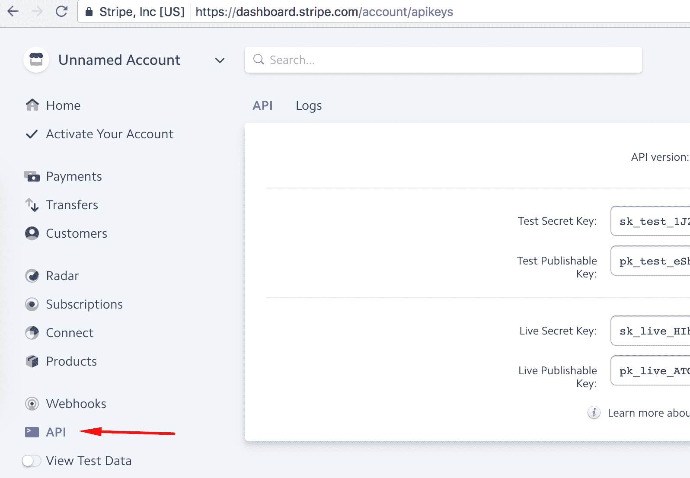
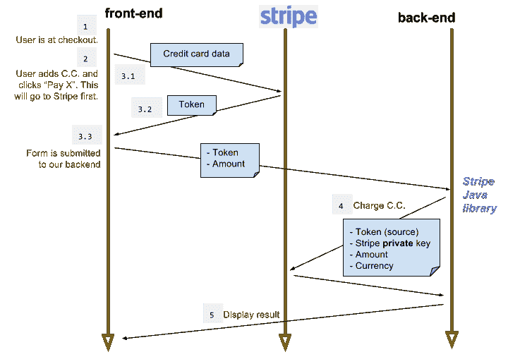
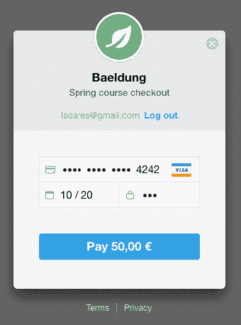

# Java Stripe API 简介

> 原文：<https://web.archive.org/web/20220930061024/https://www.baeldung.com/java-stripe-api>

## **1。概述**

[Stripe](https://web.archive.org/web/20221024195932/https://stripe.com/) 是一项基于云的服务，**使企业和个人能够通过互联网接收支付**，并提供客户端库(JavaScript 和 native mobile)和服务器端库(Java、Ruby、Node.js 等)。).

Stripe 提供了一个抽象层，降低了接收支付的复杂性。因此，**我们不需要直接处理信用卡细节，而是处理一个象征授权收费的令牌**。

在本教程中，我们将创建一个示例 Spring Boot 项目，允许用户输入信用卡，然后使用 Java 的[Stripe API](https://web.archive.org/web/20221024195932/https://stripe.com/docs/api?lang=java)向信用卡收取一定的费用。

## **2。依赖性**

为了在项目中使用 Java 的 [Stripe API，我们将相应的依赖项添加到我们的`pom.xml`:](https://web.archive.org/web/20221024195932/https://github.com/stripe/stripe-java)

[PRE0]

我们可以在 Maven 中央存储库中找到它的最新版本[。](https://web.archive.org/web/20221024195932/https://search.maven.org/classic/#search%7Cga%7C1%7Ca%3A%22stripe-java%22%20AND%20g%3A%22com.stripe%22)

对于我们的示例项目，我们将利用`spring-boot-starter-parent`:

[PRE1]

我们还将使用 [Lombok](/web/20221024195932/https://www.baeldung.com/intro-to-project-lombok) 来减少样板代码，而[百里香](/web/20221024195932/https://www.baeldung.com/thymeleaf-in-spring-mvc)将成为交付动态网页的模板引擎。

因为我们使用`spring-boot-starter-parent`来管理这些库的版本，所以我们不必在`pom.xml`中包含它们的版本:

[PRE2]

注意**如果你正在使用 NetBeans，你可能想在 1.16.16** 版本中明确使用 Lombok，因为 Spring Boot 1.5.2 提供的 Lombok 版本中的一个错误会导致 NetBeans 产生许多错误。

## **3。API 键**

在我们能够与 Stripe 通信并执行信用卡收费之前，我们需要 **[注册一个 Stripe 帐户](https://web.archive.org/web/20221024195932/https://dashboard.stripe.com/register)并获得秘密/公开的 Stripe API 密钥**。

确认账户后，我们将登录进入[条纹仪表盘](https://web.archive.org/web/20221024195932/https://dashboard.stripe.com/dashboard)。然后，我们在左侧菜单中选择“API keys ”:

将有两对秘密/公开密钥— [一对用于测试，一对用于实时](https://web.archive.org/web/20221024195932/https://stripe.com/docs/dashboard#livemode-and-testing)。让这个标签页保持打开状态，以便我们以后可以使用这些键。

## **4。一般流程**

信用卡收费将通过五个简单的步骤完成，包括前端(在浏览器中运行)、后端(我们的 Spring Boot 应用程序)和磁条:

1.  用户转到结帐页面，点击“用卡支付”。
2.  向用户呈现条带结帐覆盖对话框，在该对话框中填写信用卡细节。
3.  用户用“支付<amount>”确认，这将:</amount>
    *   将信用卡发送到磁条
    *   在响应中获取一个令牌，该令牌将被附加到现有表单中
    *   将带有金额、公共 API 密钥、电子邮件和令牌表单提交给我们的后端
4.  我们的后端联系人使用令牌、金额和秘密 API 密钥进行分类。
5.  后端检查条带响应，并向用户提供操作反馈。

我们将在接下来的章节中更详细地介绍每个步骤。

## **5。结账表单**

[Stripe Checkout](https://web.archive.org/web/20221024195932/https://stripe.com/checkout) 是一个[可定制、可移动、可本地化的小部件](https://web.archive.org/web/20221024195932/https://stripe.com/docs/checkout)，它呈现一个介绍信用卡详细信息的表单。通过“`checkout.js`”的包含和配置，它负责:

*   【用卡支付】按钮效果图
    
*   支付叠加对话框渲染(点击【用卡支付】后触发)
    
*   信用卡验证
*   “记住我”功能(将名片与手机号码相关联)
*   将信用卡发送到 Stripe 并替换为封装形式的令牌(在单击“支付<amount>”后触发)</amount>

如果我们需要对结帐表单进行比 Stripe Checkout 更多的控制，那么我们可以使用 [Stripe 元素](https://web.archive.org/web/20221024195932/https://stripe.com/docs/stripe-js#examples)。

接下来，我们将分析准备表单的控制器，然后分析表单本身。

### **5.1。控制器**

让我们从创建一个控制器开始，**用结帐表单需要的必要信息准备模型**。

首先，我们需要**从 Stripe 仪表板**中复制我们公钥的测试版本，并使用它将 STRIPE_PUBLIC_KEY 定义为一个环境变量。然后我们在`stripePublicKey`字段中使用这个值。

我们在这里手动设置`currency`和`amount`(以美分表示)仅仅是为了演示的目的，但是在实际的应用程序中，我们可能会设置一个产品/销售 id 来获取实际的值。

然后，我们将分派到保存签出表单的签出视图:

[PRE3]

关于条带 API 键，您可以将它们定义为每个应用程序的环境变量(测试与实时)。

与任何密码或敏感信息一样，最好不要将密钥放在版本控制系统中。

### 5.2。表单

“用卡支付”按钮和结帐对话框是通过添加一个内部带有脚本的表单来实现的，该表单正确配置了数据属性:

[PRE4]

“`checkout.js`”脚本在提交之前自动触发对条带的请求，然后附加条带令牌和条带用户电子邮件作为隐藏字段“`stripeToken`”和“`stripeEmail`”。

这些将与其他表单字段一起提交给我们的后端。不提交脚本数据属性。

我们使用百里香叶来渲染属性“`data-key`”、“`data-amount`”和“`data-currency`”。

金额(“`data-amount`”)仅用于显示目的(与“`data-currency`”)一起使用。它的单位是用过的货币的美分，所以我们用它除以 100 来显示。

在用户要求支付之后，Stripe 公钥被传递给 Stripe。不要在这里使用密钥，因为它会被发送到浏览器。

## **6。充电操作**

对于服务器端处理，我们需要定义结帐表单使用的 POST 请求处理程序。让我们来看看充电操作所需的类。

### **6.1。收费请求实体**

让我们定义一下在收费操作中我们将用作业务实体的`ChargeRequest` POJO:

[PRE5]

### 6.2。服务

让我们写一个`StripeService`类给**传达实际的充电操作给条带**:

[PRE6]

如`CheckoutController`、**所示，`secretKey`字段由我们从 STRIPE 仪表板**复制的 STRIPE_SECRET_KEY 环境变量填充。

服务初始化后，该密钥将用于所有后续条带化操作。

由条带库返回的对象代表[充电操作](https://web.archive.org/web/20221024195932/https://stripe.com/docs/api/charges/object?lang=java)，并包含有用的数据，如操作 id。

### 6.3。控制器

最后，让我们编写**控制器，它将接收结帐表单发出的 POST 请求，并通过我们的`StripeService`向 Stripe** 提交费用。

请注意，“`ChargeRequest`”参数会自动初始化为表单中包含的请求参数“`amount`”、“`stripeEmail`”和“`stripeToken`”:

[PRE7]

成功后，我们将状态、操作 id、费用 id 和余额事务 id 添加到模型中，以便稍后向用户显示它们(第 7 节)。这样做是为了说明[收费对象](https://web.archive.org/web/20221024195932/https://stripe.com/docs/api/charges/object)的一些内容。

我们的`ExceptionHandler`将处理在充电操作中抛出的`StripeException`类型的异常。

如果我们需要更细粒度的错误处理，我们可以为`StripeException`的子类添加单独的处理程序，比如`CardException`、`RateLimitException`或`AuthenticationException`。

“`result`”视图呈现充电操作的结果。

## **7。显示结果**

用于显示结果的 HTML 是一个基本的百里香模板，它显示一个 charge 操作的结果。`ChargeController`提示用户充电操作是否成功:

[PRE8]

成功后，用户将看到一些收费操作的详细信息:

出错时，用户将看到 Stripe 返回的错误消息:

## **8。结论**

在本教程中，我们展示了如何利用 Stripe Java API 对信用卡进行收费。将来，我们可以重用我们的服务器端代码来服务本地移动应用。

为了测试整个收费流程，我们不需要使用真正的信用卡(即使在测试模式下)。我们可以依靠[条纹测试卡](https://web.archive.org/web/20221024195932/https://stripe.com/docs/testing#cards)来代替。

收费操作是 Stripe Java API 提供的许多可能性之一。[官方 API 参考](https://web.archive.org/web/20221024195932/https://stripe.com/docs/api)将指导我们完成整套操作。

本教程中使用的示例代码可以在 [GitHub 项目](https://web.archive.org/web/20221024195932/https://github.com/eugenp/tutorials/tree/master/stripe)中找到。