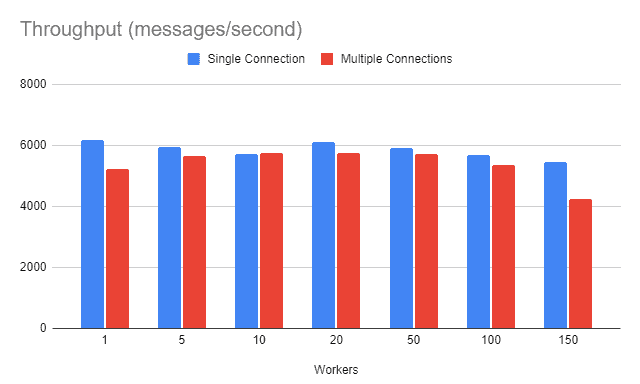

# RabbitMQ 中的渠道和连接

> 原文：<https://web.archive.org/web/20220930061024/https://www.baeldung.com/java-rabbitmq-channels-connections>

## 1.介绍

在这个快速教程中，我们将展示如何使用与两个核心概念相关的 [RabbitMQ 的](/web/20221023101403/https://www.baeldung.com/rabbitmq)API:连接和通道。

## 2.RabbitMQ 快速拨号

RabbitMQ 是 [AMQP](/web/20221023101403/https://www.baeldung.com/rabbitmq-spring-amqp) (高级消息队列协议)的一个流行实现，被各种规模的公司广泛用于处理他们的消息需求。

从应用程序的角度来看，我们通常关心 AMQP 的主要实体:虚拟主机、交换和队列。因为我们已经在以前的文章中讨论过这些概念，所以在这里，我们将关注两个较少讨论的概念的细节:连接和通道。

## 3.连接

客户与 RabbitMQ 经纪人互动的第一步是建立联系。 AMPQ 是一种应用层协议，因此这种连接发生在传输层协议之上。这可以是常规的 TCP 连接，也可以是使用 TLS 的加密连接。连接的主要作用是提供一个安全的管道，客户端可以通过它与代理进行交互。

这意味着在连接建立期间，客户端必须向服务器提供有效的凭据。服务器可以支持不同的凭证类型，包括常规用户名/密码、SASL、X.509 密码或任何支持的机制。

除了安全性之外，连接建立阶段还负责协商 AMPQ 协议的某些方面。此时，如果客户端和/或服务器无法就协议版本或调整参数值达成一致，连接将无法建立，传输级连接将被关闭。

### 3.1.在 Java 应用程序中创建连接

使用 Java 时，与 RabbitMQ 浏览器通信的标准方式是使用`amqp-client` Java 库。我们可以通过添加相应的 Maven 依赖项将这个库添加到我们的项目中:

[PRE0]

这个工件的最新版本可以在 [Maven Central](https://web.archive.org/web/20221023101403/https://search.maven.org/search?q=g:com.rabbitmq%20a:amqp-client) 上获得。

这个库使用[工厂](/web/20221023101403/https://www.baeldung.com/creational-design-patterns)模式来创建新的连接。首先，我们创建一个新的`ConnectionFactory`实例，并设置创建连接所需的所有参数。至少，这需要告知 RabbitMQ 主机的地址:

[PRE1]

一旦我们设置完这些参数，我们就使用`newConnection()`工厂方法来创建一个新的`Connection`实例:

[PRE2]

## 4.频道

简单地说，AMQP 通道是一种允许在单个连接上多路复用多个逻辑流的机制。这允许在客户端和服务器端更好地使用资源，因为建立连接是相对昂贵的操作。

客户端创建一个或多个通道，以便向代理发送命令。这包括与发送和/或接收消息相关的命令。

通道还提供了一些关于协议逻辑的附加保证:

*   给定通道的命令总是按照发送的顺序执行。
*   假设一个客户端通过一个连接打开多个通道，实现可以在它们之间分配可用的带宽
*   双方都可以发出流量控制命令，通知对方应该停止发送消息。

通道的一个关键方面是，它的生命周期与用于创建它的连接绑定在一起。这意味着如果我们关闭一个连接，所有相关的通道也将被关闭。

### 4.1.在 Java 应用程序中创建通道

使用`amqp-client`库的 Java 应用程序使用现有`Connection`的`createChannel()`方法创建一个新的`Channel`:

[PRE3]

一旦我们有了一个`Channel,`，我们就可以向服务器发送命令。例如，为了创建一个队列，我们使用了`queueDeclare()`方法:

[PRE4]

这段代码“声明”了一个队列，这是 AMQP 所说的“如果不存在就创建”。队列名称后面的附加参数定义了它的附加特征:

*   这个声明是持久的，意味着它将在服务器重启后继续存在
*   这个队列被限制在与声明它的通道相关的连接上
*   一旦不再使用，服务器将删除队列
*   `args:`带有用于调整队列行为的参数的可选映射；例如，我们可以使用这些参数来定义消息和死信行为的 TTL

现在，要使用默认交换向该队列发送消息，我们使用`basicPublish()`方法:

[PRE5]

这段代码使用队列名作为路由关键字，向默认的 exchange 发送一条消息。

## 5.渠道分配策略

让我们考虑一个使用消息传递系统的场景:CQRS(命令查询责任分离)应用程序。简而言之，基于 CQRS 的应用程序有两条独立的路径:命令和查询。命令可以更改数据，但永远不会返回值。另一方面，查询返回值，但从不修改它们。

因为命令路径从不返回任何数据，所以服务可以异步执行它们。在一个典型的实现中，我们有一个 HTTP POST 端点，它在内部构建一个消息，并将其发送到一个队列供以后处理。

**现在，对于一个必须处理数十甚至数百个并发请求的服务来说，每次都打开连接和通道并不是一个现实的选择**。相反，更好的方法是使用通道池。

当然，这导致了下一个问题:我们应该创建单个连接并从中创建通道还是使用多个连接？

### 5.1.单连接/多通道

在这个策略中，我们将使用一个连接，并创建一个通道池，其容量等于服务可以管理的最大并发连接数。对于传统的每请求线程模型，这应该设置为与请求处理程序线程池相同的大小。

这种策略的缺点是，在负载较重的情况下，我们必须通过相关通道一次发送一个命令，这意味着我们必须使用同步机制。这反过来又增加了命令路径中的额外延迟，我们希望最大限度地减少这种延迟。

### 5.2.每线程连接策略

另一个选择是走向另一个极端，使用一个`Connection`池，这样就不会有通道争用。对于每个`Connection`，我们将创建一个单独的`Channel` ，处理程序线程将使用它向服务器发出命令。

然而，我们从客户端移除同步的事实是有代价的。代理必须为每个连接分配额外的资源，比如套接字描述符和状态信息。此外，服务器必须在客户机之间分配可用的吞吐量。

## 6.基准战略

为了评估这些候选策略，让我们为每个策略运行一个简单的基准测试。**基准测试包括并行运行多个 workerss，每个 worker 发送一千条 4kb 的消息。**在构建时，工人接收到一个`Connection`，它将从中创建一个`Channel`来发送命令。它还接收迭代次数、有效负载大小和一个用于通知测试运行程序它已经完成发送消息的`CountDownLatch`:

[PRE6]

除了通过减少闩锁来指示它已经完成了它的工作之外，worker 还返回一个`WorkerResult`实例，其中包含发送所有消息所用的时间。虽然这里我们只有一个`long`值，但是我们可以使用扩展它来返回更多的细节。

控制器根据正在评估的策略创建连接工厂和工人。对于单个连接，它创建`Connection`实例，并将其传递给每个工作者:

[PRE7]

对于多连接策略，我们为每个工人创建一个新的`Connection`:

[PRE8]

`throughput`函数计算的基准度量将是完成所有工作所需的总时间除以工作人数:

[PRE9]

请注意，我们需要将分子乘以 1000，这样我们就得到了每秒的消息吞吐量。

## 7.运行基准测试

这些是我们对这两种策略进行基准测试的结果。对于每个工人计数，我们已经运行了 10 次基准测试，并使用平均值作为 tar 特定工人/策略的吞吐量度量。以今天的标准来看，环境本身是适度的:

*   CPU:双核 i7 戴尔笔记本电脑@ 3.0 GHz
*   总内存:16 GB
*   rabbitq:3 . 10 . 7 在坞站上运行(具有 4 GB ram 的坞站机器)

对于这个特定的环境，我们看到单一连接策略有一点优势。对于 150 名工人的情况，这种优势似乎增加了。

## 8.选择策略

鉴于基准测试的结果，我们不能指出一个明确的赢家。对于介于 5 和 100 之间的工人计数，结果大致相同。之后，与多个连接相关的开销似乎比在单个连接上处理多个通道要高。

此外，我们必须考虑到测试人员只做一件事:向队列发送固定的消息。现实世界中的应用程序，比如我们提到的 CQRS 应用程序，通常会在发送消息之前和/或之后做一些额外的工作。**因此，要选择最佳策略，推荐的方法是使用尽可能接近生产环境的配置运行您自己的基准测试**。

## 9.结论

在本文中，我们探讨了 RabbitMQ 中的通道和连接的概念，以及如何以不同的方式使用它们。像往常一样，完整的代码可以在 GitHub 上的[处获得。](https://web.archive.org/web/20221023101403/https://github.com/eugenp/tutorials/tree/master/rabbitmq)