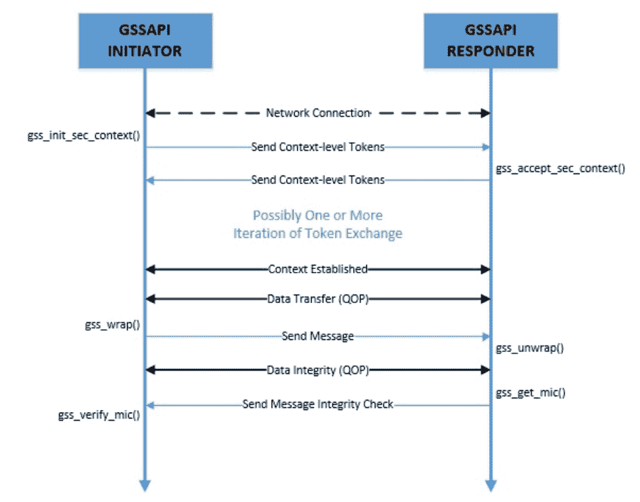

# Java GSS 应用编程接口指南

> 原文：<https://web.archive.org/web/20220930061024/https://www.baeldung.com/java-gss>

## 1.概观

在本教程中，我们将了解[通用安全服务 API (GSS API)](https://web.archive.org/web/20221025183651/https://www.ietf.org/rfc/rfc2743.txt) 以及我们如何用 Java 实现它。我们将看到如何使用 Java 中的 GSS API 来保护网络通信。

在这个过程中，我们将创建简单的客户端和服务器组件，用 GSS API 保护它们。

## 2.什么是`GSS` API？

那么，什么是通用安全服务 API 呢？GSS API 为应用程序提供了一个通用框架，以可插拔的方式使用不同的安全机制，如 Kerberos、NTLM 和 SPNEGO。因此，它有助于应用程序直接从安全机制中分离出来。

澄清一下，这里的安全性涵盖了**认证、数据完整性和机密性。**

### 2.1.我们为什么需要`GSS` API？

像 Kerberos、NTLM 和 Digest-MD5 这样的安全机制在功能和实现上有很大的不同。通常，支持其中一种机制的应用程序会发现切换到另一种机制非常困难。

这就是像 GSS API 这样的通用框架为应用程序提供抽象的地方。因此，使用 GSS API 的应用程序可以协商合适的安全机制，并使用该机制进行通信。所有这些都不需要实际实现任何特定于机制的细节。

### 2.2.`GSS` API 是如何工作的？

GSS API 是一种基于令牌的机制。它的工作原理是**对等点之间的安全令牌交换**。这种交换通常发生在网络上，但是 GSS API 不知道这些细节。

这些令牌由 GSS API 的特定实现生成和处理。这些令牌的**语法和语义特定于对等体之间协商的安全机制**:

GSS API 的中心主题围绕着安全上下文。我们可以通过交换令牌在对等体之间建立这种上下文。我们**可能需要在对等体**之间多次交换令牌来建立上下文。

一旦在两端成功建立，我们就可以使用安全上下文安全地交换数据。这可能包括数据完整性检查和数据加密，具体取决于底层的安全机制。

## 3.Java 中的 GSS API 支持

Java 支持 GSS API，它是“org.ietf.jgss”包的一部分。这个包的名字可能看起来很奇怪。那是因为 GSS API 的 **Java 绑定是在一个 [IETF 规范](https://web.archive.org/web/20221025183651/https://www.ietf.org/rfc/rfc2853.txt)T3 中定义的。规范本身独立于安全机制。**

一个流行的 Java GSS 安全机制是 Kerberos v5。

### 3.1.Java GSS API

让我们试着理解一些构建 Java GSS 的核心 API:

*   `GSSContext` 封装 GSS API 安全上下文，并提供上下文下可用的服务
*   `GSSCredential`封装建立安全上下文所需的实体的 GSS API 证书
*   封装了 GSS API 主体实体，该实体为底层机制使用的不同名称空间提供了抽象

除了上述接口之外，还有一些其他重要的类需要注意:

*   `GSSManager`作为其他重要的 GSS API 类的工厂类，如`GSSName`、`GSSCredential`和`GSSContext`
*   `Oid`代表通用对象标识符(oid ),它是 GSS API 中用于标识机制和名称格式的分层标识符
*   `MessageProp`包装属性来表示 GSSContext，例如数据交换的保护质量(QoP)和机密性
*   `ChannelBinding`封装可选的信道绑定信息，用于增强对等实体认证的质量

### 3.2.Java GSS 安全提供程序

虽然 Java GSS 定义了用 Java 实现 GSS API 的核心框架，但它并没有提供实现。Java 为包括 Java GSS 在内的安全服务采用了基于 **`Provider`的可插拔实现。**

可以有一个或多个这样的**安全提供者向 Java 加密体系结构** (JCA)注册。每个安全提供者可以实现一个或多个安全服务，比如 Java GSSAPI 和底层的安全机制。

JDK 附带了一个默认的 GSS 提供程序。但是，我们可以使用其他特定于供应商的具有不同安全机制的 GSS 提供程序。一个这样的供应商是 IBM Java GSS 公司。我们必须向 JCA 注册这样的安全提供者才能使用它们。

此外，如果需要的话，我们**可以用可能的定制安全机制**实现我们自己的安全提供者。然而，这在实践中几乎是不需要的。

## 4.GSS API 通过一个例子

现在，我们将通过一个例子来看看 Java GSS 的运行情况。我们将创建一个简单的客户机和服务器应用程序。在 GSS，客户端通常被称为发起者，服务器被称为接受者。我们将在底层使用 Java GSS 和 Kerberos v5 进行认证。

### 4.1.客户端和服务器的 GSS 上下文

首先，我们必须**在应用程序的服务器端和客户端**建立一个`GSSContext`。

让我们首先看看如何在客户端做到这一点:

[PRE0]

这里发生了很多事情，让我们来分解一下:

*   我们首先创建一个`GSSManager`的实例
*   然后我们使用这个实例创建`GSSContext`，传递:
    *   一个代表服务器主体的`GSSName`，注意这里的**是 Kerberos 特有的主体名称**
    *   要使用的机制的`Oid`，这里是 Kerberos v5
    *   发起方的凭证，`null`在这里表示将使用默认凭证
    *   已建立上下文的生存期
*   最后，我们准备**相互认证、机密性和数据完整性的上下文**

类似地，我们必须定义服务器端上下文:

[PRE1]

正如我们所看到的，这比客户端上下文简单得多。这里唯一的区别是我们需要承兑人的凭证，我们已经用它作为`null`。和以前一样， ***null* 表示将使用默认凭证。**

### 4.2.GSS API 认证

虽然我们已经创建了服务器和客户端`GSSContext`，但是请注意，在这个阶段它们还没有建立。

为了建立这些上下文，我们需要交换特定于指定安全机制的令牌，即 Kerberos v5:

[PRE2]

这最终使上下文在两端建立起来:

[PRE3]

### 4.3.GSS API 安全通信

现在，我们已经在两端建立了上下文，**我们可以开始发送具有完整性和机密性的数据了**:

[PRE4]

这里发生了一些事情，让我们来分析一下:

*   `MessageProp`被客户端用来设置**方法和生成令牌**
*   方法`wrap`还添加了数据的加密 MIC，MIC 被捆绑为令牌的一部分
*   该令牌被发送到服务器(可能通过网络调用)
*   服务器再次利用`MessageProp`来设置 **`unwrap`方法并取回数据**
*   此外，方法`unwrap`验证接收数据的 MIC，确保数据完整性

因此，客户端和服务器能够交换完整性和机密性的数据。

### 4.4.示例的 Kerberos 设置

现在，像 **Kerberos 这样的 GSS 机制通常会从现有的`Subject`** 中获取凭证。这里的类`Subject`是一个 JAAS 抽象，代表一个实体，比如一个人或一项服务。这通常在基于 JAAS 的身份验证过程中填充。

然而，在我们的例子中，我们不会直接使用基于 JAAS 的认证。我们将让 Kerberos 直接获取凭证，在我们的例子中使用 keytab 文件。有一个 JVM 系统参数可以实现这一点:

[PRE5]

然而，Sun Microsystem 提供的缺省 Kerberos 实现依赖于 JAAS 来提供认证。

这听起来可能与我们刚刚讨论的相反。请注意，我们可以在应用程序中显式使用 JAAS，它将填充`Subject`。或者让底层机制直接进行身份验证，不管怎样，它都会使用 JAAS。因此，我们需要为底层机制提供一个 JAAS 配置文件:

[PRE6]

这个配置非常简单，我们将 Kerberos 定义为发起者和接受者所需的登录模块。此外，我们已经配置为使用 keytab 文件中的各个主体。我们可以将这个 JAAS 配置作为系统参数传递给 JVM:

[PRE7]

这里，假设我们可以访问 Kerberos KDC。在 KDC 中，我们已经设置了所需的主体并获得了要使用的 keytab 文件，比如说`“example.keytab”.`

此外，我们需要 Kerberos 配置文件指向正确的 KDC:

[PRE8]

这个简单的配置定义了一个运行在端口 52135 上的 KDC，默认领域为 EXAMPLE.COM。我们可以将它作为系统参数传递给 JVM:

[PRE9]

### 4.5.运行示例

要运行这个例子，我们必须**利用上一节**中讨论的 Kerberos 工件。

此外，我们需要传递所需的 JVM 参数:

[PRE10]

这足以让 Kerberos 使用来自 keytab 和 GSS 的凭证来执行身份验证，从而建立上下文。

## 5.现实世界中的 GSS API

虽然 GSS API 承诺通过可插拔机制解决大量安全问题，但很少有使用案例被更广泛地采用:

*   它在 SASL 被广泛用作一种安全机制，尤其是当 Kerberos 是首选的底层机制时。Kerberos 是一种广泛使用的身份验证机制，尤其是在企业网络中。利用 Kerberised 化的基础设施来认证新的应用程序非常有用。因此，GSS API 很好地弥合了这一差距。
*   当事先不知道安全机制时，它还与 SPNEGO 结合使用来协商安全机制。就此而言，SPNEGO 在某种意义上是 GSS API 的伪机制。这在所有现代浏览器中得到广泛支持，使它们能够利用基于 Kerberos 的身份验证。

## 6.GSS API 比较

GSS API 以可插拔的方式为应用程序提供安全服务，非常有效。然而，在 Java 中实现这一点并不是唯一的选择。

让我们了解一下 Java 还能提供什么，以及它们与 GSS API 相比如何:

*   [Java 安全套接字扩展](https://web.archive.org/web/20221025183651/https://docs.oracle.com/javase/9/security/java-secure-socket-extension-jsse-reference-guide.htm) (JSSE): **JSSE 是 Java 中实现 Java 安全套接字层(SSL)的一组包**。它提供数据加密、客户端和服务器身份验证以及消息完整性。与 GSS API 不同，JSSE 依赖于公钥基础设施(PKI)来工作。因此，GSS API 比 JSSE 更加灵活和轻量级。
*   [Java 简单认证和安全层](https://web.archive.org/web/20221025183651/https://docs.oracle.com/javase/9/security/introduction-java-sasl-api.htm) (SASL): **SASL 是一个用于互联网协议认证和数据安全的框架**，它将互联网协议与特定的认证机制相分离。这在范围上类似于 GSS API。然而，Java GSS 通过可用的安全提供程序对底层安全机制的支持有限。

总的来说，GSS API 在以与机制无关的方式提供安全服务方面非常强大。然而，Java 对更多安全机制的支持将进一步推动这一应用。

## 7.结论

总之，在本教程中，我们了解了作为安全框架的 GSS API 的基础。我们浏览了 GSS 的 Java API，了解了如何利用它们。在这个过程中，我们创建了简单的客户端和服务器组件，它们执行相互身份验证并安全地交换数据。

此外，我们还看到了 GSS API 的实际应用，以及 Java 中有哪些可供选择的应用。

和往常一样，代码可以在 GitHub 上找到[。](https://web.archive.org/web/20221025183651/https://github.com/eugenp/tutorials/tree/master/core-java-modules/core-java-security)