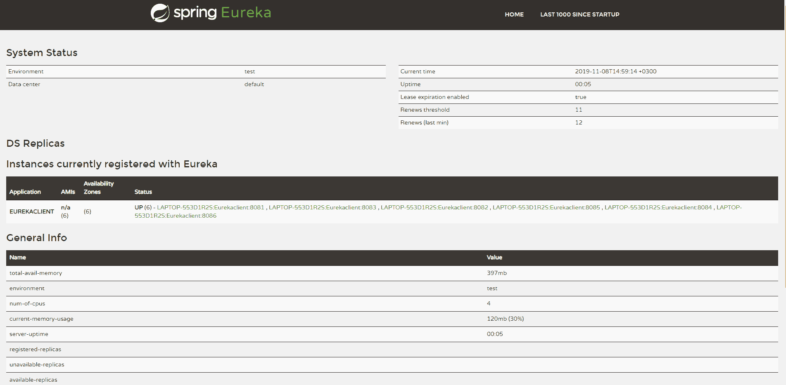

# 尤里卡自我保护和更新指南

> 原文:[https://web . archive . org/web/20220930061024/https://www . bael dung . com/eureka-self-preservation-renewal](https://web.archive.org/web/20220930061024/https://www.baeldung.com/eureka-self-preservation-renewal)

## **1。概述**

在本教程中，我们将学习[尤里卡](/web/20220524025209/https://www.baeldung.com/spring-cloud-netflix-eureka)自我保存和更新。

我们将从创建一个 Eureka 服务器和多个 Eureka 客户机实例开始。

然后，我们将这些客户端注册到我们的 Eureka 服务器，以展示自我保护是如何工作的。

## **2。尤里卡自保**

在讨论自我保存之前，让我们了解一下 Eureka 服务器是如何维护客户机实例注册表的。

在启动过程中，客户机通过 Eureka 服务器触发一个 **REST 调用，向服务器的实例注册中心进行自我注册。**当使用后发生正常关机时，客户端触发另一个 REST 调用，以便服务器可以清除与调用者相关的所有数据。

为了处理不适当的客户端关闭，服务器需要客户端以特定的时间间隔发送心跳。这叫`renewal`。如果服务器在指定的时间内停止接收心跳，那么它将开始驱逐过时的实例。

当心跳低于预期阈值时**停止驱逐实例的机制被称为`self-preservation`。这可能发生在网络分区不佳的情况下，此时实例仍在运行，但暂时无法访问，或者发生在客户端突然关闭的情况下。**

并且当服务器激活自保存模式时，它保持实例驱逐，直到更新率回到预期阈值之上。

让我们来看看实际情况。

## **3。创建服务器**

首先，通过用`@EnableEurekaServer`注释我们的 Spring Boot 主类来创建 Eureka 服务器:

```
@SpringBootApplication
@EnableEurekaServer
public class EurekaServerApplication {
    public static void main(String[] args) {
        SpringApplication.run(EurekaServerApplication.class, args);
    }
}
```

但是现在，让我们添加启动服务器的基本配置:

```
eureka.client.registerWithEureka=false
eureka.client.fetchRegistry=false
eureka.instance.hostname=localhost
```

因为我们不希望我们的 Eureka 服务器向自己注册，所以我们将属性`eureka.client.registerWithEureka`设置为`false`。这里属性`eureka.instance.hostname=localhost`特别重要，因为我们在本地机器上运行它。否则，我们可能会在 Eureka 服务器中创建一个不可用的副本，从而打乱客户端的心跳计数。

现在，让我们在下一节看看所有的配置及其与自我保护的关系。

### **3.1。自保配置**

默认情况下，Eureka 服务器运行时会启用自我保护。

然而，为了便于理解，让我们在服务器端逐一查看这些配置。

*   `eureka.server.enable-self-preservation`:禁用自保配置——默认值为`true`
*   `eureka.server.expected-client-renewal-interval-seconds`:服务器期望客户机以此属性配置的时间间隔进行心跳——缺省值为`30`
*   `eureka.instance.lease-expiration-duration-in-seconds`:表示 Eureka 服务器在从其注册表中删除客户端之前，从收到客户端的最后一个心跳开始等待的时间(以秒为单位)——默认值为`90`
*   `eureka.server.eviction-interval-timer-in-ms`:这个属性告诉 Eureka 服务器以这个频率运行一个任务来驱逐过期的客户端——缺省值是`60` `seconds`
*   `eureka.server.renewal-percent-threshold`:基于该属性，服务器计算所有已注册客户端每分钟的预期心跳数——默认值为`0.85`
*   `eureka.server.renewal-threshold-update-interval-ms`:这个属性告诉 Eureka 服务器以这个频率运行一个作业，以计算所有注册客户机在这一分钟的预期心跳——缺省值是`15 minutes`

在大多数情况下，默认配置就足够了。但是对于特定的需求，我们可能想要改变这些配置。**在这些情况下需要极其小心**以避免意外的后果，如**错误的更新阈值计算或延迟的自保模式激活**。

## **4。注册客户端**

现在，让我们创建一个 Eureka 客户端并旋转六个实例:

```
@SpringBootApplication
@EnableEurekaClient
public class EurekaClientApplication {

    public static void main(String[] args) {
        SpringApplication.run(EurekaClientApplication.class, args);
    }
}
```

以下是客户端的配置:

```
spring.application.name=Eurekaclient
server.port=${PORT:0}
eureka.client.serviceUrl.defaultZone=http://localhost:8761/eureka
eureka.instance.preferIpAddress=true
eureka.instance.lease-renewal-interval-in-seconds=30
```

这种配置允许我们用`PORT`程序参数启动同一个客户机的多个实例。配置`eureka.instance.lease-renewal-interval-in-seconds`表示客户端发送给服务器的心跳间隔。默认值为 30 秒，这意味着客户端将每 30 秒发送一次心跳。

现在让我们用从 8081 到 8086 的端口号启动这六个客户机实例，并导航到`[http://localhost:8761](https://web.archive.org/web/20220524025209/http://localhost:8761/)`来检查这些实例是否注册到了 Eureka 服务器。

[](/web/20220524025209/https://www.baeldung.com/wp-content/uploads/2019/11/Eureka_Registered_Instances_1.png)

从屏幕截图中，我们可以看到我们的 Eureka 服务器有 6 个注册的客户端实例，总续订阈值是 11。阈值计算基于三个因素:

*   注册的客户端实例总数–6
*   配置的客户端续订间隔–30 秒
*   配置的续订百分比阈值–0.85

考虑到所有这些因素，在我们的例子中，阈值是 11。

## **5。测试自我保护**

为了模拟一个临时的网络问题，让我们在客户端将属性`eureka.client.should-unregister-on-shutdown`设置为`false`，并停止我们的一个客户端实例。因为我们将`should-unregister-on-shutdown`标志设置为`false`，**，所以客户端不会调用取消注册调用，服务器认为这是一次不恰当的关机**。

现在让我们等待 90 秒，由我们的`eureka.instance.lease-expiration-duration-in-seconds`属性设置，并再次导航到 [http://localhost:8761](https://web.archive.org/web/20220524025209/http://localhost:8761/) 。红色粗体文本表示 Eureka 服务器现在处于自我保护模式，并停止驱逐实例。

现在让我们检查注册实例部分，看看停止的实例是否仍然可用。如我们所见，它是可用的，但状态为`DOWN`:

[](/web/20220524025209/https://www.baeldung.com/wp-content/uploads/2019/11/Eureka_Self_Preserve_Mode_2.png)

服务器****脱离自我保护模式的唯一方法是启动停止的实例或者禁用自我保护本身。**如果我们通过将标志`eureka.server.enable-self-preservation`设置为`false`来重复相同的步骤，那么在配置的租约到期持续时间属性之后，Eureka 服务器将从注册表中清除停止的实例。**

 **## **6。结论**

在本教程中，我们已经了解了 Eureka 自我保护是如何工作的，以及我们如何配置与自我保护相关的不同选项。

我们在这里展示的所有例子都可以在 GitHub 上找到[。](https://web.archive.org/web/20220524025209/https://github.com/eugenp/tutorials/tree/master/spring-cloud/spring-cloud-eureka-self-preservation)**