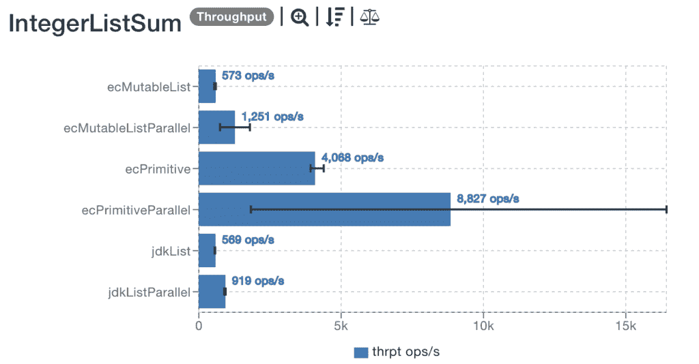
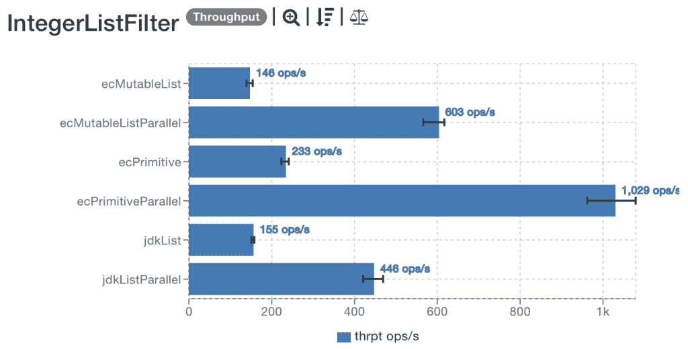

# 基准 JDK 集合与 Eclipse 集合

> 原文：<https://web.archive.org/web/20220930061024/https://www.baeldung.com/jdk-collections-vs-eclipse-collections>

## 1.介绍

在本教程中，我们将比较传统的 JDK 集合和 Eclipse 集合的性能。我们将创建不同的场景并探索结果。

## 2.配置

首先，请注意，对于本文，我们将使用默认配置来运行测试。我们的基准测试不会设置任何标志或其他参数。

我们将使用以下硬件和库:

*   JDK 11.0.3，Java HotSpot(TM) 64 位服务器虚拟机，11.0.3+12-LTS。
*   MacPro 2.6GHz 6 核 i7，配 16GB DDR4。
*   Eclipse 集合 10.0.0 (撰写本文时最新的版本)
*   我们将利用 [JMH (Java 微基准测试工具)](/web/20221206030803/https://www.baeldung.com/java-microbenchmark-harness)来运行我们的基准测试
*   [JMH 可视化器](https://web.archive.org/web/20221206030803/http://jmh.morethan.io/)从 JMH 结果生成图表

创建项目最简单的方法是通过命令行:

```
mvn archetype:generate \
  -DinteractiveMode=false \
  -DarchetypeGroupId=org.openjdk.jmh \
  -DarchetypeArtifactId=jmh-java-benchmark-archetype \
  -DgroupId=com.baeldung \
  -DartifactId=benchmark \
  -Dversion=1.0
```

之后，我们可以使用我们最喜欢的 IDE 打开项目并编辑`pom.xml`来添加[Eclipse 集合依赖项](https://web.archive.org/web/20221206030803/https://search.maven.org/search?q=a:eclipse-collections):

```
<dependency>
    <groupId>org.eclipse.collections</groupId>
    <artifactId>eclipse-collections</artifactId>
    <version>10.0.0</version>
</dependency>
<dependency>
    <groupId>org.eclipse.collections</groupId>
    <artifactId>eclipse-collections-api</artifactId>
    <version>10.0.0</version>
</dependency>
```

## 3.第一个基准

我们的第一个基准很简单。我们想计算先前创建的 `Integers`的总和`List` 。

我们将以串行和并行方式测试六种不同的组合:

```
private List<Integer> jdkIntList;
private MutableList<Integer> ecMutableList;
private ExecutorService executor;
private IntList ecIntList;

@Setup
public void setup() {
    PrimitiveIterator.OfInt iterator = new Random(1L).ints(-10000, 10000).iterator();
    ecMutableList = FastList.newWithNValues(1_000_000, iterator::nextInt);
    jdkIntList = new ArrayList<>(1_000_000);
    jdkIntList.addAll(ecMutableList);
    ecIntList = ecMutableList.collectInt(i -> i, new IntArrayList(1_000_000));
    executor = Executors.newWorkStealingPool();
}

@Benchmark
public long jdkList() {
    return jdkIntList.stream().mapToLong(i -> i).sum();
}

@Benchmark
public long ecMutableList() {
    return ecMutableList.sumOfInt(i -> i);
}

@Benchmark
public long jdkListParallel() {
    return jdkIntList.parallelStream().mapToLong(i -> i).sum();
}

@Benchmark
public long ecMutableListParallel() {
    return ecMutableList.asParallel(executor, 100_000).sumOfInt(i -> i);
}

@Benchmark
public long ecPrimitive() { 
    return this.ecIntList.sum(); 
}

@Benchmark
public long ecPrimitiveParallel() {
    return this.ecIntList.primitiveParallelStream().sum(); 
}
```

要运行我们的第一个基准测试，我们需要执行:

```
mvn clean install
java -jar target/benchmarks.jar IntegerListSum -rf json
```

这将在我们的`IntegerListSum`类中触发基准，并将结果保存到一个 JSON 文件中。

**我们将在测试中测量吞吐量或每秒操作数，因此越高越好:**

```
Benchmark                              Mode  Cnt     Score       Error  Units
IntegerListSum.ecMutableList          thrpt   10   573.016 ±    35.865  ops/s
IntegerListSum.ecMutableListParallel  thrpt   10  1251.353 ±   705.196  ops/s
IntegerListSum.ecPrimitive            thrpt   10  4067.901 ±   258.574  ops/s
IntegerListSum.ecPrimitiveParallel    thrpt   10  8827.092 ± 11143.823  ops/s
IntegerListSum.jdkList                thrpt   10   568.696 ±     7.951  ops/s
IntegerListSum.jdkListParallel        thrpt   10   918.512 ±    27.487  ops/s
```

根据我们的测试，Eclipse 集合的并行原语列表具有最高的吞吐量。此外，它是最高效的，性能比并行运行的 Java JDK 快 10 倍。

当然，一部分原因可以解释为，当使用[原语列表](/web/20221206030803/https://www.baeldung.com/java-eclipse-primitive-collections)时，我们没有与装箱和拆箱相关的成本。

我们可以使用 JMH 可视化工具来分析我们的结果。下图显示了更好的可视化效果:

[](/web/20221206030803/https://www.baeldung.com/wp-content/uploads/2019/11/IntegerListSum-jdk11-1.png)

## 4.过滤

接下来，我们将修改我们的列表以获取所有 5 的倍数的元素。我们将重用之前的大部分基准和过滤函数:

```
private List<Integer> jdkIntList;
private MutableList<Integer> ecMutableList;
private IntList ecIntList;
private ExecutorService executor;

@Setup
public void setup() {
    PrimitiveIterator.OfInt iterator = new Random(1L).ints(-10000, 10000).iterator();
    ecMutableList = FastList.newWithNValues(1_000_000, iterator::nextInt);
    jdkIntList = new ArrayList<>(1_000_000);
    jdkIntList.addAll(ecMutableList);
    ecIntList = ecMutableList.collectInt(i -> i, new IntArrayList(1_000_000));
    executor = Executors.newWorkStealingPool();
}

@Benchmark
public List<Integer> jdkList() {
    return jdkIntList.stream().filter(i -> i % 5 == 0).collect(Collectors.toList());
}

@Benchmark
public MutableList<Integer> ecMutableList() {
    return ecMutableList.select(i -> i % 5 == 0);
}

@Benchmark
public List<Integer> jdkListParallel() {
    return jdkIntList.parallelStream().filter(i -> i % 5 == 0).collect(Collectors.toList());
}

@Benchmark
public MutableList<Integer> ecMutableListParallel() {
    return ecMutableList.asParallel(executor, 100_000).select(i -> i % 5 == 0).toList();
}

@Benchmark
public IntList ecPrimitive() {
    return this.ecIntList.select(i -> i % 5 == 0);
}

@Benchmark
public IntList ecPrimitiveParallel() {
    return this.ecIntList.primitiveParallelStream()
      .filter(i -> i % 5 == 0)
      .collect(IntLists.mutable::empty, MutableIntList::add, MutableIntList::addAll);
}
```

我们将像之前一样执行测试:

```
mvn clean install
java -jar target/benchmarks.jar IntegerListFilter -rf json
```

结果是:

```
Benchmark                                 Mode  Cnt     Score    Error  Units
IntegerListFilter.ecMutableList          thrpt   10   145.733 ±  7.000  ops/s
IntegerListFilter.ecMutableListParallel  thrpt   10   603.191 ± 24.799  ops/s
IntegerListFilter.ecPrimitive            thrpt   10   232.873 ±  8.032  ops/s
IntegerListFilter.ecPrimitiveParallel    thrpt   10  1029.481 ± 50.570  ops/s
IntegerListFilter.jdkList                thrpt   10   155.284 ±  4.562  ops/s
IntegerListFilter.jdkListParallel        thrpt   10   445.737 ± 23.685  ops/s
```

正如我们所看到的，Eclipse Collections 原语再次胜出。其吞吐量比 JDK 并行列表快 2 倍以上。

**注意，对于滤波，并行处理的效果更明显。求和对于 CPU 来说是一种廉价的操作，我们不会看到串行和并行之间的相同差异。**

此外，Eclipse 集合原语列表早先获得的性能提升开始消失，因为对每个元素所做的工作开始超过装箱和拆箱的成本。

最后，我们可以看到原语上的操作比对象更快:

[](/web/20221206030803/https://www.baeldung.com/wp-content/uploads/2019/11/IntegerListFilter-jdk11.png)

## 5.结论

在本文中，我们创建了几个基准来比较 Java 集合和 Eclipse 集合。我们利用 JMH 来尽量减少环境偏见。

和往常一样，源代码可以在 GitHub 上的[处获得。](https://web.archive.org/web/20221206030803/https://github.com/eugenp/tutorials/tree/master/core-java-modules/core-java-11)