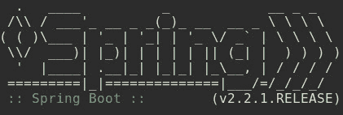

# 启动时禁用 Spring Boot 横幅

> 原文:[https://web . archive . org/web/20220930061024/https://www . bael dung . com/spring-boot-disable-banner](https://web.archive.org/web/20220930061024/https://www.baeldung.com/spring-boot-disable-banner)

## 1.介绍

Spring Boot 是创建 Java web 应用程序的一种很好的方式，但是它的一些默认行为可能并不适合所有人。

一个特别的功能是启动时打印的 Spring Boot 横幅:

[](/web/20220627181738/https://www.baeldung.com/wp-content/uploads/2019/11/spring-boot-banner-1.jpg)

虽然该横幅通常是无害的，**但在某些情况下，可能需要禁用它**。例如，通过自定义日志记录配置来防止错误，或者通过远程日志聚合系统来节省带宽。

在本教程中，我们将看看一些不同的方法来禁用 Spring Boot 横幅启动。

## 2.使用配置

使用配置是禁用启动横幅最灵活的方法。**它不需要修改代码，如果需要可以很容易地恢复**。

我们可以使用`application.properties`禁用启动横幅:

```
spring.main.banner-mode=off
```

或者如果我们使用`application.yaml`:

```
spring:
  main:
    banner-mode: "off"
```

最后，由于 Spring Boot 的[外部化配置](https://web.archive.org/web/20220627181738/https://docs.spring.io/spring-boot/docs/current/reference/html/spring-boot-features.html#boot-features-external-config)支持，我们还可以通过设置一个环境变量来禁用它:

```
SPRING_MAIN_BANNER-MODE=off
```

## 3.使用代码

除了配置之外，还有多种方法可以使用代码禁用 Spring Boot 横幅。使用代码的缺点是**我们需要为每个应用程序都这样做，并且需要修改代码才能恢复。**

使用`SpringApplicationBuilder`时:

```
new SpringApplicationBuilder(MyApplication.class)
    .bannerMode(Banner.Mode.OFF)
    .run(args)
```

使用`SpringApplication`时:

```
SpringApplication app = new SpringApplication(MyApplication.class);
app.setBannerMode(Banner.Mode.OFF);
app.run(args);
```

## 4.使用 IDE

大多数现代的 ide 都包含了一种无需配置或代码就能禁用 Spring Boot 横幅的方法。

IntelliJ 为 Spring Boot 运行配置提供了一个复选框，用于禁用横幅:

[](/web/20220627181738/https://www.baeldung.com/wp-content/uploads/2019/11/disable-spring-boot-banner-intellij.jpg)

## 5.更改横幅文本

禁用 Spring Boot 启动横幅的另一种方法是**将横幅文本更改为空文件**。

我们首先在 application.properties 中指定一个自定义文件:

```
spring.banner.location=classpath:/banner.txt
```

或者，如果我们用 YAML:

```
spring:
  banner:
    location: classpath:/banner.txt
```

然后我们在`src/main/resources`中创建新的空文件，名为`banner.txt`。

## 6.结论

在本教程中，我们已经看到了使用配置或代码的组合来禁用 Spring Boot 横幅的各种方法。