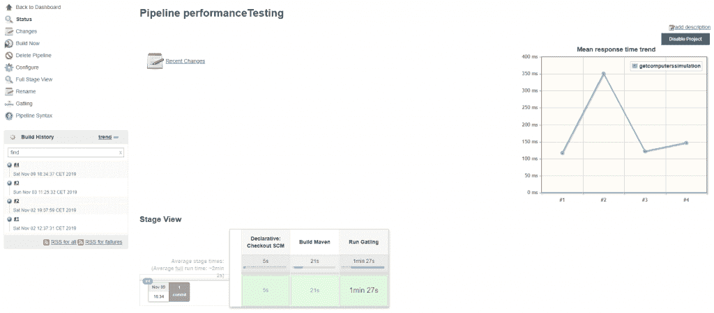
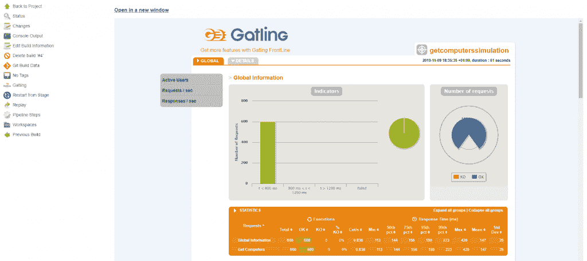

# 运行詹金斯的加特林测试

> 原文:[https://web . archive . org/web/20220930061024/https://www . bael dung . com/ops/Jenkins-run-Gatling-tests](https://web.archive.org/web/20220930061024/https://www.baeldung.com/ops/jenkins-run-gatling-tests)

## 1.概观

在本教程中，我们将使用[加特林](https://web.archive.org/web/20220523144310/https://gatling.io/)在 Jenkins 管道中集成一个负载测试。首先，让我们确保熟悉 [加特林的概念。](/web/20220523144310/https://www.baeldung.com/introduction-to-gatling)

## 2.用 Maven 创建一个 Gatling 项目

我们的目标是在 Jenkins CI/CD 管道中插入使用 Gatling 的负载测试。为了自动化这个验证步骤，我们可以使用 Maven 打包这个工具。

### 2.1.属国

Gatling 提供了一个插件 Gatling Maven 插件——它允许我们在项目的 Maven 构建阶段使用 Gatling 启动负载测试。这样，就有可能将负载测试集成到任何持续集成工具中。

那么，让我们将加特林集成到一个样例 Maven 项目中。首先，我们需要在我们的`pom.xml` 文件中有以下依赖项:

```
<dependency>
    <groupId>io.gatling.highcharts</groupId>
    <artifactId>gatling-charts-highcharts</artifactId>
    <version>3.3.1</version>
</dependency>
<dependency>
    <groupId>io.gatling</groupId>
    <artifactId>gatling-app</artifactId>
    <version>3.3.1</version>
</dependency>
<dependency>
    <groupId>io.gatling</groupId>
    <artifactId>gatling-recorder</artifactId>
    <version>3.3.1</version>
</dependency>
```

除了前面的依赖项，我们需要在`pom.xml` : 的插件部分指定`gatling-maven-plugin`

```
<plugin>
    <groupId>io.gatling</groupId>
    <artifactId>gatling-maven-plugin</artifactId>
    <version>3.0.5</version>
    <configuration>
        <simulationClass>org.baeldung.${SimulationClass}</simulationClass>
    </configuration>
</plugin>
```

`SimulationClass`值表示用于执行负载测试的模拟类。加特林版本和加特林 Maven 插件版本不必相同。在这里，我们可以找到[最新版本的加特林](https://web.archive.org/web/20220523144310/https://search.maven.org/classic/#search%7Cga%7C1%7CGatling)，而在下面的链接我们可以找到[最新版本的加特林 Maven 插件。](https://web.archive.org/web/20220523144310/https://search.maven.org/classic/#search%7Cga%7C1%7CGatling%20Maven%20Plugin)

### 2.2.创建场景

一个模拟由一个场景组成，该场景可以包含几个请求的执行。

**仿真是用 [Scala](/web/20220523144310/https://www.baeldung.com/scala-intro) 写的，用的是加特林的 DSL，简单直观。**

### 2.3.运行场景

一旦我们编写了执行负载测试所需的代码，**我们就可以构建项目并运行模拟:**

```
mvn clean package
mvn gatling:test
```

在生成的目标文件夹中，我们可以找到由 Gatling 执行的负载测试的报告。

## 3.把加特林和詹金斯结合起来

**将加特林集成到詹金斯流水线中，允许我们在执行过程中进行负载测试**。

通过这种方式，我们可以验证在我们发布的代码中所做的改变不会导致性能的显著下降。

这增加了即将颁布的新法规的可靠性和信心。

### 3.1.创建 Jenkinsfile

在我们的项目中，我们创建了一个`Jenkinsfile`来指导它如何运行加特林:

```
pipeline {
    agent any
    stages {
        stage("Build Maven") {
            steps {
                sh 'mvn -B clean package'
            }
        }
        stage("Run Gatling") {
            steps {
                sh 'mvn gatling:test'
            }
            post {
                always {
                    gatlingArchive()
                }
            }
        }
    }
}
```

剧本分为两个阶段:

*   构建项目(Maven)
*   运行并归档我们的场景(加特林)

接下来，我们将测试代码提交并推送到我们的源代码管理系统。配置完成后，Jenkins 将能够读取和执行新创建的脚本。

### 3.2.创建管道

使用这个`JenkinsFile,` 我们将创建自己的管道。 在 Jenkins 中创建管道很简单。

让我们首先导航到 Jenkins 主页，点击`New Item`，选择`Pipeline`，并给它起一个有意义的名字。要了解更多关于在 Jenkins 中创建管道的信息，我们可以访问我们的教程。

让我们配置新创建的管道。在`Pipeline`部分，我们选择脚本的源。

具体来说，让我们从下拉菜单`Pipeline script from SCM`中选择，设置我们的存储库的 URL，设置检索源代码所需的凭证，提供接收脚本的分支，最后指出找到我们新创建的`Jenkinsfile`的路径。

窗口应该如下所示:

[](/web/20220523144310/https://www.baeldung.com/wp-content/uploads/2019/11/PipelineSCM-1.png)

### 3.3.加特林詹金斯插件

在运行新创建的管道之前，我们需要安装 Gatling Jenkins 插件。

该插件允许我们:

*   获得并发布每次管道运行的详细报告
*   跟踪每个模拟并提供趋势图

插入管道的`gatlingArchive()`命令是这个插件的一部分，它允许我们启用刚才提到的报告。

让我们安装插件并重启 Jenkins。

**此时，** **带负荷测试的管道准备运行**。

### 3.4.分离负载生成

从资源的角度来看，生成大量的调用来执行测试是一项非常昂贵的操作。由于这个原因，在运行管道的主 Jenkins 节点上执行这些操作并不是一个好主意。

我们将使用一个 Jenkins 从节点来执行管道中的一些步骤。

假设我们已经在 Jenkins 上正确配置了一个或多个从节点；插入到新创建的管道中的`agent any`命令允许我们分配一个执行器节点，并在该节点上运行指定的代码。

## 4.运行管道

是时候运行我们的管道了。

在 Jenkins 主页上，我们选择新创建的管道，然后单击`Build Now`。然后，我们等待管道运行。在执行的最后，我们应该会看到一个类似这样的图表:

[](/web/20220523144310/https://www.baeldung.com/wp-content/uploads/2019/11/PipelineRun-1024x450.png)

## 5.查看结果

在我们管道的执行页面中，我们可以看到一个图表是如何生成的，它显示了我们的负载测试生成的平均响应时间。**该图由加特林詹金斯插件生成。它将包含最近 15 次构建的数据，以便给出我们发布的性能趋势的直接证据。**

如果我们点击左侧菜单中的`Gatling`按钮，在我们管道的执行页面中，我们将看到显示我们最近 15 次构建趋势的图表。

具体来说，我们将获得以下信息:

*   平均响应时间
*   响应时间的第 95 百分位，以及
*   处于“高”状态(即“不正常”)的请求的百分比

在页面底部，在刚刚提到的图表之后，我们会找到为每个构建生成的加特林报告的链接。

通过点击链接，我们可以直接在 Jenkins 中查看已经生成的加特林报告:

[](/web/20220523144310/https://www.baeldung.com/wp-content/uploads/2019/11/GatlingReport-1024x457.png)

## 6.结论

在本教程中，我们已经看到了如何将使用 Gatling 执行的负载测试插入到 Jenkins 管道中。我们首先解释了如何用 Gatling 生成负载测试，如何创建一个`Jenkinsfile`来运行它，以及如何将它集成到 Jenkins 管道中。

最后，我们展示了 Gatling Jenkins 插件如何在我们的 Jenkins 部署中直接生成 Gatling 报告。

要了解更多关于如何构建测试场景来监控网站性能的信息，让我们访问[我们的另一个加特林教程](/web/20220523144310/https://www.baeldung.com/load-test-a-website-with-gatling)。

与往常一样，该教程的完整源代码可以在 GitHub 的[上获得。](https://web.archive.org/web/20220523144310/https://github.com/eugenp/tutorials/tree/master/testing-modules/gatling)