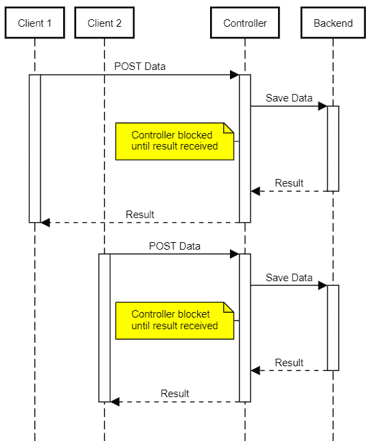

# 带 Java 的 AWS S3–响应式支持

> 原文：<https://web.archive.org/web/20220930061024/https://www.baeldung.com/java-aws-s3-reactive>

## 1.介绍

AWS 通过它的许多 API 提供许多服务，我们可以使用他们的官方 SDK 从 Java 访问这些 API。直到最近，这个 SDK 还没有提供对反应式操作的支持，并且只对异步访问提供了有限的支持。

随着 AWS SDK for Java 2.0 的发布，**由于采用了 Reactive Streams 标准，我们现在可以在完全非阻塞的 I/O 模式下使用这些 APIs】。**

在本教程中，我们将通过在 Spring Boot 实现一个简单的 blob store REST API 来探索这些新特性，该 API 使用众所周知的 S3 服务作为其存储后端。

## 2.AWS S3 运营概述

在开始实现之前，让我们先快速概述一下我们想要实现的目标。典型的 blob 存储服务展示前端应用程序使用的 CRUD 操作，以允许最终用户上传、列出、下载和删除几种类型的内容，例如音频、图片和文档。

传统实施必须处理的一个常见问题是如何有效处理大文件或慢速连接。在早期版本(servlet 3.0 之前)中，JavaEE 规范必须提供的只是一个阻塞 API，所以我们需要为每个并发 blob 存储客户端提供一个线程。这种模式的缺点是需要更多的服务器资源(因此，更大的机器),并使它们更容易受到 DoS 类型的攻击:

 

**通过使用反应式堆栈，对于相同数量的客户端，我们可以降低服务的资源消耗**。reactor 实现使用少量线程来响应 I/O 完成事件，例如新数据对`read`的可用性或前一个`write`的完成。

这意味着同一个线程继续处理这些事件——这些事件可能来自任何活动的客户端连接——直到没有更多可用的工作可做。这种方法极大地减少了上下文切换的次数(这是一种非常昂贵的操作),并允许非常有效地使用可用资源:

## 3.项目设置

我们的演示项目是一个标准的 [Spring Boot WebFlux](/web/20220628094846/https://www.baeldung.com/spring-webflux) 应用程序，它包括通常的支持依赖项，比如 Lombok 和 JUnit。

除了这些库，我们还需要引入 AWS SDK for Java V2 依赖项:

[PRE0]

AWS SDK [提供了定义所有依赖项所需版本的 BOM](https://web.archive.org/web/20220628094846/https://search.maven.org/search?q=g:software.amazon.awssdk%20a:bom) ，因此我们不需要在 POM 文件的依赖项部分指定它们。

我们添加了 S3 客户端库，这将带来 SDK 的其他核心依赖项。我们还需要 Netty 客户端库，因为我们将使用异步 API 与 AWS 进行交互。

官方 AWS 文档包含更多可用传输的详细信息。

## 4.AWS S3 客户端创建

**S3 操作的入口点是`S3AsyncClient`类**，我们将使用它来启动新的 API 调用。

因为我们只需要这个类的一个实例，所以让我们用构建它的`@Bean`方法创建一个`@Configuration`类，这样我们就可以在任何需要的地方注入它:

[PRE1]

对于这个演示，我们使用了一个最小的`@ConfigurationProperties`类(可以在我们的存储库中获得),它保存了访问 S3 服务所需的以下信息:

*   `region:` 有效的 AWS 区域标识符，如`us-east-1`
*   `accessKeyId/secretAccessKey`:我们的 AWS API 密钥和标识符
*   一个可选的 URI，我们可以用它来覆盖 S3 的默认服务端点。主要用例是将演示代码与提供 S3 兼容 API 的备选存储解决方案一起使用(minio 和 localstack 就是例子)
*   `bucket`:存储上传文件的桶名

关于客户端的初始化代码，有几点值得一提。首先，我们禁用了写超时并增加了最大并发性，因此即使在低带宽的情况下也可以完成上传。

其次，我们禁用校验和验证，启用分块编码。我们这样做是因为我们希望在数据以流的方式到达我们的服务时就开始将数据上传到 bucket。

最后，我们不处理 bucket 创建本身，因为我们假设管理员已经创建并配置了它。

至于凭证，我们提供了一个定制的`AwsCredentialsProvider `，可以从 Spring 属性中恢复凭证。**这开启了通过 Spring 的`Environment`抽象**和所有支持的`PropertySource `实现注入那些值的可能性，比如 Vault 或 Config Server:

[PRE2]

## 5.上传服务概述

我们现在将实现一个上传服务，我们可以通过`/inbox`路径到达它。

到这个资源路径的一个`POST`将把文件存储在我们随机生成的密钥下的 S3 桶中。我们将原始文件名存储为元数据键，这样我们就可以用它来为浏览器生成适当的 HTTP 下载头。

我们需要处理两种不同的场景:简单上传和多部分上传。让我们继续创建一个`@RestController`并添加方法来处理这些场景:

[PRE3]

处理程序签名反映了两种情况之间的主要区别:在简单的情况下，主体包含文件内容本身，而在多部分的情况下，它可以有多个“部分”，每个部分对应于一个文件或表单数据。

为了方便起见，我们将使用 POST 或 PUT 方法支持多部分上传。原因是一些工具(特别是 [cURL](/web/20220628094846/https://www.baeldung.com/linux/curl-wget) )在用`-F`选项上传文件时默认使用后者。

在这两种情况下，我们都将返回一个包含操作结果和生成的文件密钥的`UploadResult`,客户端应该使用这些密钥来恢复原始文件——稍后将详细介绍！

## 6.单个文件上传

在这种情况下，客户端通过简单的 POST 操作发送内容，请求正文包含原始数据。要在一个反应式 Web 应用程序中接收这些内容，我们所要做的就是声明一个接受`Flux<ByteBuffer> `参数的`@PostMapping`方法。

在这种情况下，将这种通量流式传输到一个新的 S3 文件是很简单的。

我们只需要用生成的密钥、文件长度、MIME 内容类型构建一个`PutObjectRequest`,并将其传递给我们的 S3 客户端中的`putObject()`方法:

[PRE4]

这里的关键点是我们如何将传入的`Flux`传递给`putObject() `方法。

这个方法需要一个`AsyncRequestBody`对象来按需提供内容。基本上就是常规的`Publisher`加上一些额外的方便方法。在我们的例子中，我们将从`fromPublisher` `()`方法中获益，将我们的`Flux`转换成所需的类型。

此外，我们假设客户端将发送带有正确值的`Content-Length` HTTP 头。如果没有这些信息，呼叫将会失败，因为这是一个必填字段。

SDK V2 中的异步方法总是返回一个`CompletableFuture`对象。我们用它的`fromFuture()`工厂方法把它改造成一个`Mono `。这被映射到最终的`UploadResult`对象。

## 7.上传多个文件

处理一个`multipart/form-data`上传`may`似乎很容易，特别是当使用为我们处理所有细节的库时。那么，我们可以简单地对每个上传的文件使用前面的方法吗？是的，但这是有代价的:缓冲。

要使用前面的方法，我们需要部分的长度，但是分块文件传输并不总是包括这个信息。一种方法是将零件存储在一个临时文件中，然后将其发送到 AWS，但这会降低总上传时间。这也意味着我们的服务器需要额外的存储空间。

**作为替代，这里我们将使用 AWS 多部分上传**。此功能允许将单个文件的上传分成多个块，我们可以并行和无序地发送这些块。

步骤如下，我们需要发送:

*   `createMultipartUpload` 请求——AWS 用一个我们将在接下来的调用中使用的`uploadId`进行响应
*   包含`uploadId`、序列号和内容的文件块–AWS 为每个部分响应一个`ETag`标识符
*   包含收到的`uploadId`和所有`ETag`的`completeUpload`请求

请注意:**我们将对收到的`FilePart`重复这些步骤`each` ！**

### 7.1.顶级管道

毫不奇怪，我们的`@Controller`类中的`multipartUploadHandler`负责处理多部分文件上传。在这个上下文中，每个部分可以有任何类型的数据，由它的 MIME-type 标识。反应式 Web 框架将这些部分作为实现`Part`接口的对象的`Flux`交付给我们的处理程序，我们将依次处理这些部分:

[PRE5]

这个管道从过滤对应于实际上传文件的部分开始，它总是一个实现`FilePart`接口的对象。然后每个部分被传递给`saveFile `方法，该方法处理单个文件的实际上传并返回生成的文件密钥。

我们收集一个`List`中的所有键，最后，构建最终的`UploadResult`。我们总是在创建一个新的资源，所以我们将返回一个更具描述性的`CREATED`状态(202)而不是常规的`OK.`

### 7.2.处理单个文件上传

我们已经概述了使用 AWS 的多部分方法上传文件所需的步骤。不过，有一个问题:S3 服务要求每个部分，除了最后一部分，必须有一个给定的最小大小——目前是 5 兆字节。

这意味着我们不能只接受收到的数据块，然后马上发送出去。相反，我们需要在本地缓冲它们，直到达到最小大小或数据结尾。因为我们还需要一个地方来跟踪我们已经发送了多少部分以及产生的`CompletedPart`结果，我们将创建一个简单的`UploadState` 内部类来保存这个状态:

[PRE6]

考虑到所需的步骤和缓冲，我们最终的实现乍一看可能有点吓人:

[PRE7]

我们首先收集一些文件元数据，并使用它来创建一个由`createMultipartUpload()` API 调用所需的请求对象。这个调用返回一个`CompletableFuture`，它是我们流式管道的起点。

让我们回顾一下这个管道的每一步是做什么的:

*   收到包含 S3 生成的`uploadId`的初始结果后，我们将它保存在上传状态对象中，并开始流式传输文件的主体。注意这里使用的`flatMapMany`，它将`Mono`变成了`Flux`
*   我们使用`bufferUntil()`来累积所需的字节数。此时流水线从`DataBuffer`对象的`Flux` 变为`List<DataBuffer>` 对象的`Flux `
*   将每个`List<DataBuffer>`转换成一个`ByteBuffer`
*   将`ByteBuffer `发送到 S3(见下一节),并向下游返回结果`CompletedPart`值
*   将得到的`CompletedPart`值减少到`uploadState`
*   向 S3 发出信号，表示我们已经完成了上传(稍后将详细介绍)
*   返回生成的文件密钥

### 7.3.上传文件部件

让我们再一次弄清楚，**这里的“文件部分”是指单个文件**的一部分(例如，100MB 文件的前 5MB)，而不是恰好是文件的消息的一部分，因为它在顶级流中！

文件上传管道调用带有两个参数的`uploadPart()`方法:上传状态和一个`ByteBuffer`。从那里，我们构建一个`UploadPartRequest`实例，并使用我们的`S3AsyncClient`中可用的`uploadPart()`方法发送数据:

[PRE8]

这里，我们使用来自`uploadPart()`请求的返回值来构建一个`CompletedPart`实例。这是一个 AWS SDK 类型，我们稍后在构建关闭上传的最终请求时会用到它。

### 7.4.完成上传

最后，但同样重要的是，我们需要通过向 S3 发送一个`completeMultipartUpload()`请求来完成多部分文件的上传。这很容易，因为上传管道将我们需要的所有信息作为参数传递:

[PRE9]

## 8.从 AWS 下载文件

**与多部分上传相比，从 S3 桶中下载对象是一项简单得多的任务**。在这种情况下，我们不必担心大块或类似的事情。SDK API 提供了接受两个参数的`getObject()`方法:

*   一个包含所请求的桶和文件密钥的`GetObjectRequest`对象
*   一个`AsyncResponseTransformer`，它允许我们将传入的流响应映射到其他东西

SDK 提供了后者的几个实现，使得流适应于`Flux, `成为可能，但是，同样是有代价的:**它们在数组缓冲区**内部缓冲数据。由于这种缓冲导致我们的演示服务的客户端响应时间很短，我们将实现自己的适配器——正如我们将看到的，这不是什么大问题。

### 8.1.下载控制器

我们的下载控制器是一个标准的 Spring Reactive `@RestController`，用一个单独的`@GetMapping`方法来处理下载请求。我们希望通过一个`@PathVariable`参数得到文件密钥，我们将返回一个包含文件内容的异步`ResponseEntity`:

[PRE10]

这里，`getMetadataItem()`只是一个 helper 方法，它以不区分大小写的方式在响应中查找给定的元数据键。

这是一个重要的细节: **S3 使用特殊的 HTTP 头返回元数据信息，但是那些头是不区分大小写的(参见 [RFC 7230，第 3.2 节](https://web.archive.org/web/20220628094846/https://tools.ietf.org/html/rfc7230#section-3.2) )** 。这意味着实现可以随意改变给定项目的大小写——这在使用 [MinIO](https://web.archive.org/web/20220628094846/https://min.io/) 时确实发生了。

### 8.2.`FluxResponseProvider`实施

我们的`FluxReponseProvider`必须实现`AsyncResponseTransformer`接口，它只有四个方法:

*   `prepare()`，我们可以在这里进行任何必要的设置
*   当 S3 返回响应状态和元数据时调用
*   `onStream() `当响应有正文时调用，总是在`onResponse()`之后
*   发生错误时调用()

这个提供者的工作是处理这些事件并创建一个 `FluxResponse`实例，包含提供的`GetObjectResponse`实例和作为流的响应体:

[PRE11]

最后，让我们快速看一下`FluxResponse`类:

[PRE12]

## 9.结论

在本教程中，我们已经介绍了使用 AWS SDK V2 库中可用的反应式扩展的基础知识。这里我们关注的是 AWS S3 服务，但是我们可以将相同的技术扩展到其他支持反应的服务，比如 DynamoDB。

像往常一样，GitHub 上的所有代码[都是可用的。](https://web.archive.org/web/20220628094846/https://github.com/eugenp/tutorials/tree/master/aws-modules/aws-reactive)