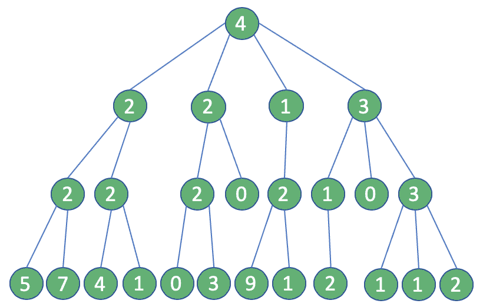
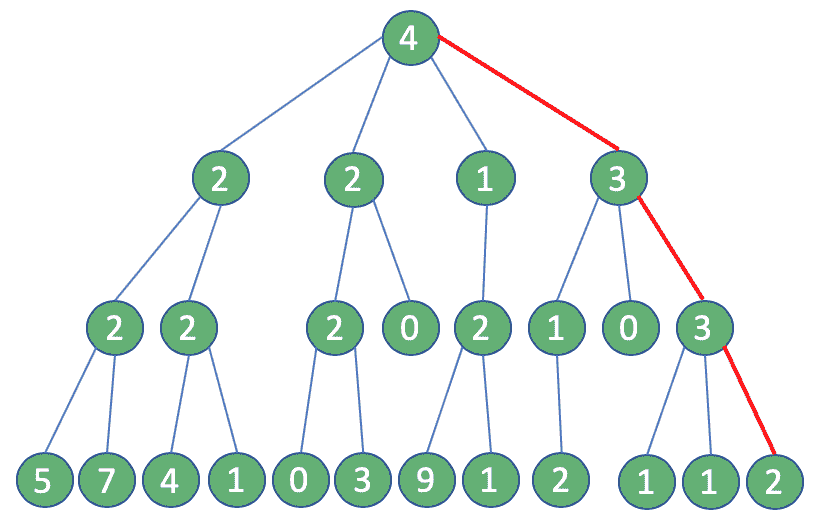

# Java 贪婪算法简介

> 原文：<https://web.archive.org/web/20220930061024/https://www.baeldung.com/java-greedy-algorithms>

## 1.介绍

在本教程中，我们将 **[介绍 Java 生态系统中的贪婪算法](/web/20221129200855/https://www.baeldung.com/cs/greedy-approach-vs-dynamic-programming)。**

## 2.贪婪问题

当面对一个数学问题时，可能有几种方法来设计解决方案。我们可以实现一个迭代解决方案，或者一些高级技术，比如分治原则(例如[快速排序算法](/web/20221129200855/https://www.baeldung.com/java-quicksort))或者动态规划方法(例如[背包问题](/web/20221129200855/https://www.baeldung.com/java-knapsack))等等。

大多数时候，我们都在寻找一个最优的解决方案，但可悲的是，我们并不总是得到这样的结果。然而，在有些情况下，即使是次优的结果也是有价值的。借助一些特定的策略，或者启发式我们可能会为自己赢得这样一份珍贵的奖励。

在这种情况下，给定一个可分问题，**在过程的每个阶段采取局部最优选择或“贪婪选择”[的策略称为贪婪算法。](/web/20221129200855/https://www.baeldung.com/cs/greedy-approach-vs-dynamic-programming)**

我们说过，我们应该解决一个“可分的”问题:一种可以被描述为一组具有几乎相同特征的子问题的情况。因此，大多数时候，**贪婪算法将被实现为递归算法**。

一个贪婪的算法可以是一种方法，尽管环境恶劣，也能引导我们找到一个合理的解决方案；缺少计算资源、执行时间约束、API 限制或任何其他种类的限制。

### 2.1.方案

在这个简短的教程中，我们将实施一个贪婪策略，使用社交网络的 API 从社交网络中提取数据。

假设我们希望在“小蓝鸟”社交网站上接触到更多的用户。实现我们目标的最佳方式是发布原创内容或转发一些能够引起广大受众兴趣的内容。

我们如何找到这样的观众？嗯，我们必须找到一个有很多追随者的账户，并为他们发布一些内容。

### 2.2.经典与贪婪

我们考虑以下情况:我们的帐户有四个关注者，如下图所示，每个关注者分别有 2、2、1 和 3 个关注者，依此类推:

[](/web/20221129200855/https://www.baeldung.com/wp-content/uploads/2020/01/alg1.png)

怀着这个目的，我们将选择我们帐户的追随者中拥有更多追随者的那个。然后，我们将重复这个过程两次以上，直到我们达到第三级连接(共四步)。

通过这种方式，我们定义了一条由用户构成的道路，将我们引向最大的关注者——来自我们账户的基础。如果我们能向他们介绍一些内容，他们肯定会访问我们的页面。

我们可以从“传统”方法开始。在每一步，我们将执行一个查询来获取一个帐户的追随者。由于我们的选择过程，帐户的数量将增加每一步。

令人惊讶的是，我们最终总共执行了 25 个查询:

[](/web/20221129200855/https://www.baeldung.com/wp-content/uploads/2020/01/alg3.png)

这里出现了一个问题:例如，Twitter API 将这种类型的查询限制为每 15 分钟 15 次。如果我们试图执行比允许的更多的调用，我们将得到一个“`Rate limit exceeded code – 88`”或“`Returned in API v1.1 when a request cannot be served due to the application's rate limit having been exhausted for the resource`”。怎样才能克服这样的限制？

好吧，答案就在眼前:一个贪婪的算法。如果我们使用这种方法，在每一步，我们可以假设拥有最多追随者的用户是唯一需要考虑的:最终，我们只需要四个查询。相当大的进步！

[](/web/20221129200855/https://www.baeldung.com/wp-content/uploads/2020/01/alg2.png)

这两种方法的结果会有所不同。在第一种情况下，我们得到 16 个最优解，而在后一种情况下，可到达的追随者的最大数量只有 12 个。

这种差异会有这么大的价值吗？我们以后再决定。

## 3.履行

为了实现上面的逻辑，我们初始化一个小的 Java 程序，其中我们将模仿 Twitter API。我们还将利用[龙目岛](/web/20221129200855/https://www.baeldung.com/intro-to-project-lombok)图书馆。

现在，让我们定义组件`SocialConnector` ，我们将在其中实现我们的逻辑。请注意，我们将设置一个计数器来模拟通话限制，但我们会将其降低到 4:

```
public class SocialConnector {
    private boolean isCounterEnabled = true;
    private int counter = 4;
    @Getter @Setter
    List users;

    public SocialConnector() {
        users = new ArrayList<>();
    }

    public boolean switchCounter() {
        this.isCounterEnabled = !this.isCounterEnabled;
        return this.isCounterEnabled;
    }
} 
```

然后，我们将添加一个方法来检索特定帐户的关注者列表:

```
public List getFollowers(String account) {
    if (counter < 0) {
        throw new IllegalStateException ("API limit reached");
    } else {
        if (this.isCounterEnabled) {
            counter--;
        }
        for (SocialUser user : users) {
            if (user.getUsername().equals(account)) {
                return user.getFollowers();
            }
        }
     }
     return new ArrayList<>();
} 
```

为了支持我们的流程，我们需要一些类来建模我们的用户实体:

```
public class SocialUser {
    @Getter
    private String username;
    @Getter
    private List<SocialUser> followers;

    @Override
    public boolean equals(Object obj) {
        return ((SocialUser) obj).getUsername().equals(username);
    }

    public SocialUser(String username) {
        this.username = username;
        this.followers = new ArrayList<>();
    }

    public SocialUser(String username, List<SocialUser> followers) {
        this.username = username;
        this.followers = followers;
    }

    public void addFollowers(List<SocialUser> followers) {
        this.followers.addAll(followers);
    }
}
```

### 3.1.贪婪算法

最后，是时候实现我们的贪婪策略了，所以让我们添加一个新的组件——`GreedyAlgorithm`——我们将在其中执行递归:

```
public class GreedyAlgorithm {
    int currentLevel = 0;
    final int maxLevel = 3;
    SocialConnector sc;
    public GreedyAlgorithm(SocialConnector sc) {
        this.sc = sc;
    }
}
```

然后我们需要插入一个方法`findMostFollowersPath`，在这个方法中我们将找到拥有最多追随者的用户，对他们进行计数，然后继续下一步:

```
public long findMostFollowersPath(String account) {
    long max = 0;
    SocialUser toFollow = null;

    List followers = sc.getFollowers(account);
    for (SocialUser el : followers) {
        long followersCount = el.getFollowersCount();
        if (followersCount > max) {
            toFollow = el;
            max = followersCount;
        }
    }
    if (currentLevel < maxLevel - 1) {
        currentLevel++;
        max += findMostFollowersPath(toFollow.getUsername());
    } 
    return max;
}
```

记住:**这里是我们执行贪婪选择的地方。**因此，每次我们调用这个方法，**我们将从列表中选择一个并且只有一个元素**并继续前进:我们永远不会收回我们的决定！

完美！我们已经准备好了，我们可以测试我们的应用程序。在此之前，我们需要记住填充我们的小网络，最后，执行下面的单元测试:

```
public void greedyAlgorithmTest() {
    GreedyAlgorithm ga = new GreedyAlgorithm(prepareNetwork());
    assertEquals(ga.findMostFollowersPath("root"), 5);
}
```

### 3.2.非贪婪算法

让我们创建一个非贪婪的方法，仅仅用我们的眼睛检查发生了什么。因此，我们需要从构建一个`NonGreedyAlgorithm`类开始:

```
public class NonGreedyAlgorithm {
    int currentLevel = 0;
    final int maxLevel = 3; 
    SocialConnector tc;

    public NonGreedyAlgorithm(SocialConnector tc, int level) {
        this.tc = tc;
        this.currentLevel = level;
    }
}
```

让我们创建一个等价的方法来检索追随者:

```
public long findMostFollowersPath(String account) {		
    List<SocialUser> followers = tc.getFollowers(account);
    long total = currentLevel > 0 ? followers.size() : 0;

    if (currentLevel < maxLevel ) {
        currentLevel++;
        long[] count = new long[followers.size()];
        int i = 0;
        for (SocialUser el : followers) {
            NonGreedyAlgorithm sub = new NonGreedyAlgorithm(tc, currentLevel);
            count[i] = sub.findMostFollowersPath(el.getUsername());
            i++;
        }

        long max = 0;
        for (; i > 0; i--) {
            if (count[i-1] > max) {
                max = count[i-1];
            }
        }		
        return total + max;
     }	
     return total;
}
```

当我们的类准备好了，我们可以准备一些单元测试:一个验证调用限制是否超出，另一个检查使用非贪婪策略返回的值:

```
public void nongreedyAlgorithmTest() {
    NonGreedyAlgorithm nga = new NonGreedyAlgorithm(prepareNetwork(), 0);
    Assertions.assertThrows(IllegalStateException.class, () -> {
        nga.findMostFollowersPath("root");
    });
}

public void nongreedyAlgorithmUnboundedTest() {
    SocialConnector sc = prepareNetwork();
    sc.switchCounter();
    NonGreedyAlgorithm nga = new NonGreedyAlgorithm(sc, 0);
    assertEquals(nga.findMostFollowersPath("root"), 6);
}
```

## 4.结果

是时候回顾我们的工作了！

首先，我们尝试了我们的贪婪策略，检查其有效性。然后，我们通过彻底的搜索验证了这种情况，有和没有 API 限制。

我们的快速贪婪过程，每次都做出局部最优选择，返回一个数值。另一方面，由于环境限制，我们没有从非贪婪算法中得到任何东西。

比较两种方法的输出，我们可以理解我们的贪婪策略如何拯救了我们，即使检索到的值不是最优的。我们可以称之为局部最优。

## 5.结论

在像社交媒体这样多变和快速变化的环境中，需要找到最佳解决方案的问题可能会成为一个可怕的幻想:难以实现，同时也不现实。

克服限制和优化 API 调用是一个相当重要的主题，但是，正如我们已经讨论过的，贪婪策略是有效的。选择这种方法可以省去我们很多痛苦，并返回有价值的结果。

请记住，不是每种情况都适合:我们每次都需要评估我们的环境。

和往常一样，本教程的示例代码可以在 [GitHub](https://web.archive.org/web/20221129200855/https://github.com/eugenp/tutorials/tree/master/algorithms-modules/algorithms-miscellaneous-6) 上找到。