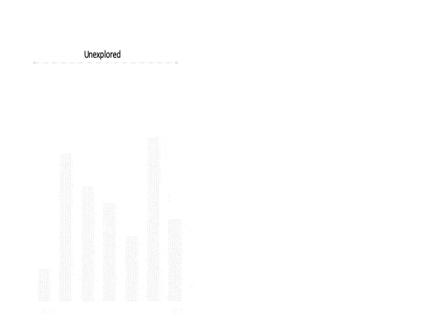
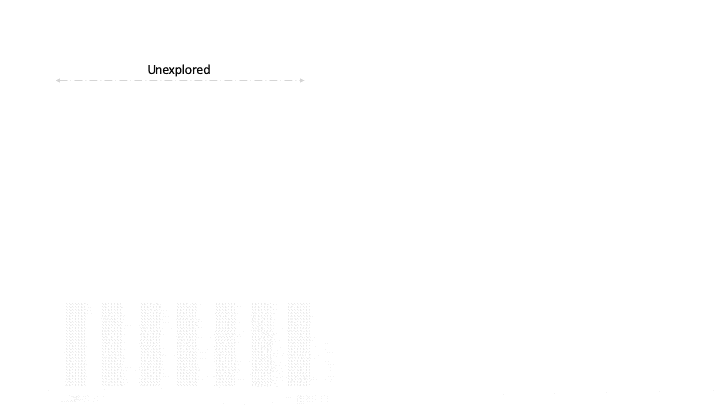

# 使用 Java 示例对具有许多重复条目的数组进行分区和排序

> 原文：<https://web.archive.org/web/20220930061024/https://www.baeldung.com/java-sorting-arrays-with-repeated-entries>

## 1.概观

算法的运行时复杂性通常取决于输入的性质。

在本教程中，我们将看到快速排序算法的**平凡实现如何对重复元素**表现不佳。

此外，我们将学习一些 Quicksort 变体，以便有效地对具有高密度重复键的输入进行分区和排序。

## 2.琐碎的快速排序

[Quicksort](/web/20221208033740/https://www.baeldung.com/java-quicksort) 是一种基于分而治之范式的高效排序算法。从功能上来说，它**在输入数组上就地操作，并通过简单的比较和交换操作**重新排列元素。

### 2.1.单枢轴分区

快速排序算法的一个简单实现严重依赖于单支点分区过程。换句话说，分区将数组 A=[a <sub>p</sub> ，a <sub>p+1</sub> ，a <sub>p+2</sub> ，…，a <sub>r</sub> 分成两部分 A[p..q]和 A[q+1..r]这样:

*   第一个分区中的所有元素， **A[p..q]小于或等于枢轴值 A[q]**
*   第二个分区中的所有元素， **A[q+1..r]大于或等于枢轴值 A[q]**

[](/web/20221208033740/https://www.baeldung.com/wp-content/uploads/2020/01/trivial_quicksort.png)

之后，这两个分区被视为独立的输入数组，并将其自身提供给快速排序算法。让我们来看看 [Lomuto 的快速排序](/web/20221208033740/https://www.baeldung.com/algorithm-quicksort#1-lomuto-partitioning)的运行情况:

[](/web/20221208033740/https://www.baeldung.com/wp-content/uploads/2020/01/quicksort-trivial-demo.gif)

### 2.2.重复元素的性能

假设我们有一个数组 A = [4，4，4，4，4，4]，它包含所有相等的元素。

在使用单支点分区方案对此阵列进行分区时，我们将得到两个分区。第一个分区将是空的，而第二个分区将有 N-1 个元素。此外，**分区过程的每个后续调用将仅减少一个**的输入大小。让我们看看它是如何工作的:

[](/web/20221208033740/https://www.baeldung.com/wp-content/uploads/2020/01/quicksort_trivial_duplicates.gif)

由于划分过程具有线性时间复杂度，在这种情况下，总时间复杂度是二次的。这是我们的输入数组的最坏情况。

## 3.三向分区

为了有效地对具有大量重复键的数组进行排序，我们可以选择更负责任地处理相等的键。这个想法是当我们第一次遇到它们时，把它们放在正确的位置上。因此，我们要寻找的是阵列的三个分区状态:

*   最左边的分区包含严格小于分区键的元素
*   ****中间分区包含等于分区键**的所有元素**
***   最右边的分区包含所有严格大于分区键的元素**

**[](/web/20221208033740/https://www.baeldung.com/wp-content/uploads/2020/01/3-way-partition-preview.png)

现在，我们将更深入地研究几种可以用来实现三向分区的方法。

## 4.迪克斯特拉的方法

Dijkstra 的方法是进行三路划分的有效方式。为了理解这一点，让我们来看看一个经典的编程问题。

### 4.1.荷兰国旗问题

受荷兰三色[国旗的启发，](https://web.archive.org/web/20221208033740/https://en.wikipedia.org/wiki/Flag_of_the_Netherlands) [Edsger Dijkstra](https://web.archive.org/web/20221208033740/https://en.wikipedia.org/wiki/Edsger_Dijkstra "Edsger Dijkstra") 提出了一个叫做[荷兰国旗问题](https://web.archive.org/web/20221208033740/https://en.wikipedia.org/wiki/Dutch_national_flag_problem) (DNF)的编程问题。

简而言之，这是一个**重排问题，给我们三种颜色的球随机排成一行，我们被要求将相同颜色的球组合在一起**。此外，重新排列必须确保组遵循正确的顺序。

有趣的是，DNF 问题与具有重复元素的数组的三分划有着惊人的相似之处。

我们可以根据给定的键将数组中的所有数字分为三组:

*   红色组包含严格小于键的所有元素
*   白色组包含与该键相等的所有元素
*   蓝色组包含所有严格大于键的元素

[](/web/20221208033740/https://www.baeldung.com/wp-content/uploads/2020/01/DNF_Partition_1.png)

### 4.2.算法

解决 DNF 问题的方法之一是选取第一个元素作为分区键，从左到右扫描数组。当我们检查每个元素时，我们将它移动到正确的组，即较小、相等和较大。

为了跟踪我们的分区进度，我们需要三个指针的帮助，即`lt`、`current`和`gt.` 、**，在任何时间点，`lt`左边的元素将严格小于分区键，`gt`右边的元素将严格大于键**。

此外，我们将使用`current`指针进行扫描，这意味着位于`current`和`gt`指针之间的所有元素都有待探索:

[](/web/20221208033740/https://www.baeldung.com/wp-content/uploads/2020/01/DNF_Invariant.png)

首先，我们可以在数组的最开始设置`lt`和`current`指针，在数组的最末尾设置`gt`指针:

[](/web/20221208033740/https://www.baeldung.com/wp-content/uploads/2020/01/DNF_Algo_1.png)

对于通过`current`指针读取的每个元素，我们将其与分区键进行比较，并采取三个复合动作之一:

*   如果`input[current] < key`，那么我们交换`input[current]`和`input[lt]`，并增加`current`和`lt `指针
*   如果`input[current]` == `key`，那么我们递增`current`指针
*   如果`input[current] > key`，那么我们交换`input[current]`和`input[gt]`并递减`gt`

最终，**当`current`和`gt`指针交叉**时，我们将停止。这样，未探索区域的大小减少到零，我们将只剩下三个所需的分区。

最后，让我们来看看这个算法是如何在具有重复元素的输入数组上工作的:

[](/web/20221208033740/https://www.baeldung.com/wp-content/uploads/2020/01/quicksort_dnf.gif)

### 4.3.履行

首先，让我们编写一个名为`compare()`的实用程序，对两个数字进行三向比较:

```
public static int compare(int num1, int num2) {
    if (num1 > num2)
        return 1;
    else if (num1 < num2)
        return -1;
    else
        return 0;
}
```

接下来，让我们添加一个名为`swap()`的方法来交换同一数组的两个索引处的元素:

```
public static void swap(int[] array, int position1, int position2) {
    if (position1 != position2) {
        int temp = array[position1];
        array[position1] = array[position2];
        array[position2] = temp;
    }
}
```

为了惟一地标识数组中的一个分区，我们需要它的左右边界索引。所以，让我们继续创建一个`Partition`类:

```
public class Partition {
    private int left;
    private int right;
}
```

现在，我们准备编写我们的三方`partition()`过程:

```
public static Partition partition(int[] input, int begin, int end) {
    int lt = begin, current = begin, gt = end;
    int partitioningValue = input[begin];

    while (current <= gt) {
        int compareCurrent = compare(input[current], partitioningValue);
        switch (compareCurrent) {
            case -1:
                swap(input, current++, lt++);
                break;
            case 0:
                current++;
                break;
            case 1:
                swap(input, current, gt--);
                break;
        }
    }
    return new Partition(lt, gt);
}
```

最后，让我们编写一个 **`quicksort()`方法，该方法利用我们的 3 路分区方案来递归地对左右分区进行排序**:

```
public static void quicksort(int[] input, int begin, int end) {
    if (end <= begin)
        return;

    Partition middlePartition = partition(input, begin, end);

    quicksort(input, begin, middlePartition.getLeft() - 1);
    quicksort(input, middlePartition.getRight() + 1, end);
}
```

## 5.本特利-麦克洛伊方法

乔恩·本特利和 T2【道格拉斯·麦克洛伊合著了一个**优化版的快速排序算法**。让我们理解并用 Java 实现这个变体:

### 5.1.划分方案

该算法的关键是基于迭代的划分方案。一开始，所有的数字对我们来说都是未知的领域:

[](/web/20221208033740/https://www.baeldung.com/wp-content/uploads/2020/01/Bentley-Unexplored.png)

然后，我们开始从左右方向探索数组的元素。每当我们进入或离开探索的循环时，**我们可以将阵列想象成五个区域的组合**:

*   在极端的两端，存在具有等于分割值的元素的区域
*   未探索的区域保持在中心，并且它的大小随着每次迭代而不断缩小
*   在未探索区域的左边是小于分割值的所有元素
*   未探索区域的右侧是大于分区值的元素

[](/web/20221208033740/https://www.baeldung.com/wp-content/uploads/2020/01/Bentley-Partitioning-Invariant.png)

最终，当没有任何元素需要探索时，我们的探索循环就终止了。在这个阶段，未探索区域的**大小实际上为零**，我们只剩下四个区域:

[](/web/20221208033740/https://www.baeldung.com/wp-content/uploads/2020/01/Bentley-loop-termination.png)

接下来，我们**移动中心**的两个相等区域中的所有元素，以便在中心只有一个相等区域被左边的较小区域和右边的较大区域包围。为此，首先，我们将左侧相等区域中的元素与较小区域右端的元素进行交换。类似地，右侧相等区域中的元素与较大区域左端的元素交换。

[](/web/20221208033740/https://www.baeldung.com/wp-content/uploads/2020/01/Bentley-partition.png)

最后，我们将**只剩下三个分区**，我们可以进一步使用相同的方法来划分更小和更大的区域。

### 5.2.履行

在三向快速排序的递归实现中，我们需要为具有不同的上下限的子数组调用我们的分区过程。因此，我们的`partition()`方法必须接受三个输入，即数组及其左右边界。

```
public static Partition partition(int input[], int begin, int end){
	// returns partition window
}
```

为了简单起见，我们可以**选择分区值作为数组**的最后一个元素。同样，让我们定义两个变量`left=begin`和`right=end` 来向内探索数组。

此外，我们还需要**跟踪位于最左边和最右边**的相等元素的数量。因此，让我们初始化`leftEqualKeysCount=0`和`rightEqualKeysCount=0`，我们现在准备好探索和分区阵列。

首先，我们从两个方向开始移动，**找到一个反转**，其中左边的元素不小于分区值，右边的元素不大于分区值。然后，除非左右两个指针交叉，否则我们交换这两个元素。

在每次迭代中，我们向两端移动等于`partitioningValue`的元素，并递增适当的计数器:

```
while (true) {
    while (input[left] < partitioningValue) left++; 

    while (input[right] > partitioningValue) {
        if (right == begin)
            break;
        right--;
    }

    if (left == right && input[left] == partitioningValue) {
        swap(input, begin + leftEqualKeysCount, left);
        leftEqualKeysCount++;
        left++;
    }

    if (left >= right) {
        break;
    }

    swap(input, left, right);

    if (input[left] == partitioningValue) {
        swap(input, begin + leftEqualKeysCount, left);
        leftEqualKeysCount++;
    }

    if (input[right] == partitioningValue) {
        swap(input, right, end - rightEqualKeysCount);
        rightEqualKeysCount++;
    }
    left++; right--;
}
```

在下一个阶段，我们需要**从中心**的两端移动所有相等的元素。在我们退出循环后，左指针将位于一个值不小于`partitioningValue`的元素处。利用这个事实，我们开始从两端向中心移动相等的元素:

```
right = left - 1;
for (int k = begin; k < begin + leftEqualKeysCount; k++, right--) { 
    if (right >= begin + leftEqualKeysCount)
        swap(input, k, right);
}
for (int k = end; k > end - rightEqualKeysCount; k--, left++) {
    if (left <= end - rightEqualKeysCount)
        swap(input, left, k);
} 
```

在最后一个阶段，我们可以返回中间分区的边界:

```
return new Partition(right + 1, left - 1);
```

最后，让我们来看一个示例输入的实现演示

[](/web/20221208033740/https://www.baeldung.com/wp-content/uploads/2020/01/quicksort_bentley.gif)

## 6.算法分析

一般来说，快速排序算法的平均情况时间复杂度为 O(n*log(n))，最坏情况时间复杂度为 O(n <sup>2</sup> )。由于重复键的密度很高，我们几乎总是在 Quicksort 的简单实现中获得最差的性能。

然而，当我们使用 Quicksort 的三向分区变体时，比如 DNF 分区或 Bentley 分区，我们能够防止重复键的负面影响。此外，随着重复键密度的增加，我们的算法的性能也提高了。因此，当所有键都相等时，我们获得了最佳情况的性能，并且我们在线性时间内获得了包含所有相等键的单个分区。

然而，我们必须注意，当我们从琐碎的单支点分区切换到三向分区模式时，我们实际上增加了开销。

对于基于 DNF 的方法，开销不依赖于重复键的密度。因此，如果我们对所有唯一键的数组使用 DNF 分区，那么与我们优化选择支点的简单实现相比，我们的性能会很差。

但是，本特利-麦克洛伊的方法做了一件聪明的事情，因为从两个极端移动相等的键的开销取决于它们的计数。因此，如果我们对所有唯一键的数组使用这种算法，即使这样，我们也会获得相当好的性能。

总之，单枢轴分区和三向分区算法的最坏情况时间复杂度都是`O(nlog(n))`。然而，**真正的好处在最好的场景**中是可见的，我们看到时间复杂度从单支点分区的`O(nlog(n))`到三向分区的 `O(n)`。

## 7.结论

在本教程中，我们了解了当输入有大量重复元素时，快速排序算法的简单实现的性能问题。

为了解决这个问题，我们**学习了不同的三路分区方案**以及如何在 Java 中实现它们。

和往常一样，本文中使用的 Java 实现的完整源代码可以在 [GitHub](https://web.archive.org/web/20221208033740/https://github.com/eugenp/tutorials/tree/master/algorithms-modules/algorithms-sorting-2) 上获得。**