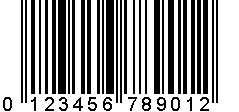
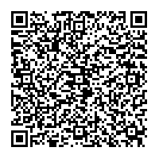

# 用 Java 生成条形码和 QR 码

> 原文:[https://web . archive . org/web/20220930061024/https://www . bael dung . com/Java-generating-barcodes-QR-codes](https://web.archive.org/web/20220930061024/https://www.baeldung.com/java-generating-barcodes-qr-codes)

## 1.概观

条形码用于视觉传达信息。我们很可能会在网页、电子邮件或可打印文档中提供适当的条形码图像。

在本教程中，我们将看看如何在 Java 中生成最常见类型的条形码。

首先，我们将了解几种条形码的内部原理。接下来，我们将探索用于生成条形码的最流行的 Java 库。最后，我们将看到如何通过使用 Spring Boot 从 [web 服务](/web/20220926181229/https://www.baeldung.com/building-a-restful-web-service-with-spring-and-java-based-configuration)提供条形码来将条形码集成到我们的应用程序中。

## 2.条形码的类型

**条形码对产品编号、序列号和批号等信息进行编码。**此外，它们使零售商、制造商和运输提供商等各方能够跟踪整个供应链中的资产。

我们可以将许多不同的条形码符号体系分为两个主要类别:

*   线性条形码
*   2D 条形码

### 2.1.UPC(通用产品代码)代码

UPC 码是一些最常用的 1D 条形码，我们主要在美国找到它们。

**UPC-A 是一个纯数字代码，包含 12 位数字**:一个制造商标识号(6 位)、一个项目号(5 位)和一个校验位。还有一种 UPC-E 码只有 8 位，用于小包装。

### 2.2 .EAN 码

EAN 编码在世界范围内被称为欧洲商品编号和国际商品编号。它们是为销售点扫描设计的。EAN 代码也有一些不同的变体，包括 EAN-13、EAN-8、JAN-13 和 ISBN。

EAN-13 码是最常用的 EAN 标准，类似于 UPC 码。它由 13 个数字组成——开头是“0 ”,后面是 UPC-A 代码。

### 2.3.代码 128

**Code 128 条形码是一种紧凑的高密度线性码**，用于物流和运输行业的订购和配送。**可以编码 ASCII** 的全部 128 个字符，长度可变。

### 2.4.PDF417

**PDF417 是一种堆叠式线性条形码，由多个 1D 条形码堆叠而成。因此，它可以使用传统的线性扫描仪。**

我们可能期望在各种应用中找到它，例如旅行(登机牌)、身份证和库存管理。

**PDF417 使用里德-所罗门纠错**代替校验位。这种误差校正允许符号在不导致数据丢失的情况下承受一些损坏。然而，它的大小可能会很大，比其他 2D 条形码(如 Datamatrix 和 QR 码)大 4 倍。

### 2.5.二维码

QR 码正在成为全球最广泛认可的 2D 条形码。二维码的最大好处是我们可以在有限的空间里存储大量数据。

他们使用四种标准化的[编码模式](https://web.archive.org/web/20220926181229/https://en.wikipedia.org/wiki/QR_code)来高效地存储数据:

*   数字的
*   含字母和数字的
*   字节/二进制
*   日本汉字

此外，它们的尺寸灵活，很容易用智能手机扫描。与 PDF417 类似，QR 码可以承受一些损坏，而不会导致数据丢失。

## 3.条形码库

我们将探索几个图书馆:

*   户外烧烤
*   条形码 4j
*   兹兴
*   QRGen

[**烤肉**](https://web.archive.org/web/20220926181229/http://barbecue.sourceforge.net/) 是一个开源的 Java 库，支持一组广泛的 1D 条形码格式。此外，条形码可以输出为 PNG、GIF、JPEG 和 SVG。

[**Barcode4j**](https://web.archive.org/web/20220926181229/http://barcode4j.sourceforge.net/) 也是一个开源库。此外，它还提供 2D 条形码格式(如 DataMatrix 和 PDF417)和更多输出格式。PDF417 格式在两个库中都可用。但是，与 Barcode4j 不同，Barbecue 认为它是线性条形码。

**[ZXing](https://web.archive.org/web/20220926181229/https://github.com/zxing/zxing)** 【斑马线】(zebra crossing)是一个用 Java 实现的开源、多格式的 1D/2D 条形码图像处理库，可以移植到其他语言。这是 Java 中支持二维码的**主库。**

[**QRGen**](https://web.archive.org/web/20220926181229/https://github.com/kenglxn/QRGen) 库提供了一个简单的二维码生成 API，构建在 ZXing 之上。它为 Java 和 Android 提供了独立的模块。

## 4.生成线性条形码

让我们为每个库和条形码对创建一个条形码图像生成器。我们将以 PNG 格式检索图像，但我们也可以使用其他格式，如 GIF 或 JPEG。

### 4.1.使用烧烤图书馆

正如我们将看到的，Barbecue 为生成条形码提供了最简单的 API。**我们只需要提供条形码文本作为最少的输入。**但是我们可以选择设置字体和分辨率(每英寸点数)。关于字体，我们可以用它来显示图像下的条形码文本。

首先，我们需要添加[烧烤](https://web.archive.org/web/20220926181229/https://search.maven.org/search?q=g:net.sourceforge.barbecue%20AND%20a:barbecue) Maven 依赖项:

```
<dependency>
    <groupId>net.sourceforge.barbecue</groupId>
    <artifactId>barbecue</artifactId>
    <version>1.5-beta1</version>
</dependency>
```

让我们为 EAN13 条形码创建一个生成器:

```
public static BufferedImage generateEAN13BarcodeImage(String barcodeText) throws Exception {
    Barcode barcode = BarcodeFactory.createEAN13(barcodeText);
    barcode.setFont(BARCODE_TEXT_FONT);

    return BarcodeImageHandler.getImage(barcode);
}
```

我们可以以类似的方式为其余的线性条形码类型生成图像。

我们应该注意，我们不需要为 EAN/UPC 条形码提供校验和位，因为它是由库自动添加的。

### 4.2.使用条形码 4j 库

让我们从添加 [Barcode4j](https://web.archive.org/web/20220926181229/https://search.maven.org/search?q=g:net.sf.barcode4j%20AND%20a:barcode4j) Maven 依赖项开始:

```
<dependency>
    <groupId>net.sf.barcode4j</groupId>
    <artifactId>barcode4j</artifactId>
    <version>2.1</version>
</dependency>
```

同样，让我们为 EAN13 条形码构建一个生成器:

```
public static BufferedImage generateEAN13BarcodeImage(String barcodeText) {
    EAN13Bean barcodeGenerator = new EAN13Bean();
    BitmapCanvasProvider canvas = 
      new BitmapCanvasProvider(160, BufferedImage.TYPE_BYTE_BINARY, false, 0);

    barcodeGenerator.generateBarcode(canvas, barcodeText);
    return canvas.getBufferedImage();
}
```

`BitmapCanvasProvider`构造函数接受几个参数:分辨率、图像类型、是否启用抗锯齿和图像方向。此外，我们不需要设置字体，因为默认情况下**图像下的文本显示为**。

### 4.3.使用 ZXing 库

这里，我们需要添加两个 Maven 依赖项:[核心映像库](https://web.archive.org/web/20220926181229/https://search.maven.org/search?q=g:com.google.zxing%20AND%20a:core)和 [Java 客户端](https://web.archive.org/web/20220926181229/https://search.maven.org/search?q=g:com.google.zxing%20AND%20a:javase):

```
<dependency>
    <groupId>com.google.zxing</groupId>
    <artifactId>core</artifactId>
    <version>3.3.0</version>
</dependency>
<dependency>
    <groupId>com.google.zxing</groupId>
    <artifactId>javase</artifactId>
    <version>3.3.0</version>
</dependency>
```

让我们创建一个 EAN13 生成器:

```
public static BufferedImage generateEAN13BarcodeImage(String barcodeText) throws Exception {
    EAN13Writer barcodeWriter = new EAN13Writer();
    BitMatrix bitMatrix = barcodeWriter.encode(barcodeText, BarcodeFormat.EAN_13, 300, 150);

    return MatrixToImageWriter.toBufferedImage(bitMatrix);
}
```

这里，我们需要提供几个参数作为输入，比如条形码文本、条形码格式和条形码尺寸。与其他两个库不同，**我们还必须为 EAN 条形码添加校验和数字。**但是，对于 UPC-A 条形码，校验和是可选的。

此外，该库不会在图像下显示条形码文本。

## 5.生成 2D 条形码

### 5.1.使用 ZXing 库

我们将使用这个库来生成一个二维码。API 类似于线性条形码的 API:

```
public static BufferedImage generateQRCodeImage(String barcodeText) throws Exception {
    QRCodeWriter barcodeWriter = new QRCodeWriter();
    BitMatrix bitMatrix = 
      barcodeWriter.encode(barcodeText, BarcodeFormat.QR_CODE, 200, 200);

    return MatrixToImageWriter.toBufferedImage(bitMatrix);
}
```

### 5.2.使用 QRGen 库

这个库不再部署在 Maven Central 上，但是我们可以在 [jitpack.io](https://web.archive.org/web/20220926181229/https://jitpack.io/#kenglxn/QRGen/2.6.0) 上找到它。

首先，我们需要将 jitpack 存储库和 QRGen 依赖项添加到 pom.xml 中:

```
<repositories>
    <repository>
        <id>jitpack.io</id>
        <url>https://jitpack.io</url>
    </repository>
</repositories>

<dependencies>
    <dependency>
        <groupId>com.github.kenglxn.qrgen</groupId>
        <artifactId>javase</artifactId>
        <version>2.6.0</version>
    </dependency>
</dependencies>
```

让我们创建一个生成 QR 码的方法:

```
public static BufferedImage generateQRCodeImage(String barcodeText) throws Exception {
    ByteArrayOutputStream stream = QRCode
      .from(barcodeText)
      .withSize(250, 250)
      .stream();
    ByteArrayInputStream bis = new ByteArrayInputStream(stream.toByteArray());

    return ImageIO.read(bis);
}
```

正如我们所见，API 基于[构建器模式](/web/20220926181229/https://www.baeldung.com/creational-design-patterns#builder)，它提供两种类型的输出:`File`和`OutputStream`。我们可以使用`ImageIO`库将其转换为`BufferedImage`。

## 6.建立休息服务

现在我们可以选择使用条形码库，让我们看看如何从 Spring Boot web 服务提供条形码。

我们从一个`RestController`开始:

```
@RestController
@RequestMapping("/barcodes")
public class BarcodesController {

    @GetMapping(value = "/barbecue/ean13/{barcode}", produces = MediaType.IMAGE_PNG_VALUE)
    public ResponseEntity<BufferedImage> barbecueEAN13Barcode(@PathVariable("barcode") String barcode)
    throws Exception {
        return okResponse(BarbecueBarcodeGenerator.generateEAN13BarcodeImage(barcode));
    }
    //...
}
```

此外，我们需要手动**为 BufferedImage HTTP 响应**注册一个[消息转换器](/web/20220926181229/https://www.baeldung.com/spring-httpmessageconverter-rest)，因为没有缺省值:

```
@Bean
public HttpMessageConverter<BufferedImage> createImageHttpMessageConverter() {
    return new BufferedImageHttpMessageConverter();
}
```

最后，我们可以使用 Postman 或浏览器来查看生成的条形码。

### 6.1.生成 UPC-A 条形码

让我们使用烧烤库调用 UPC-A web 服务:

```
[GET] http://localhost:8080/barcodes/barbecue/upca/12345678901
```

结果如下:

[](/web/20220926181229/https://www.baeldung.com/wp-content/uploads/2020/01/upca-1.png)

### 6.2.生成 EAN13 条形码

类似地，我们将调用 EAN13 web 服务:

```
[GET] http://localhost:8080/barcodes/barbecue/ean13/012345678901
```

这是我们的条形码:

[](/web/20220926181229/https://www.baeldung.com/wp-content/uploads/2020/01/ean13-1.png)

### 6.3.生成 Code128 条形码

在这种情况下，我们将使用 POST 方法。让我们使用烧烤库调用 Code128 web 服务:

```
[POST] http://localhost:8080/barcodes/barbecue/code128
```

我们将提供包含数据的请求体:

```
Lorem ipsum dolor sit amet, consectetur adipiscing elit,
 sed do eiusmod tempor incididunt ut labore et dolore magna aliqua.
```

让我们看看结果:

[](/web/20220926181229/https://www.baeldung.com/wp-content/uploads/2020/01/code128-barbecue2-1024x53-1.png)

### 6.4.生成 PDF417 条形码

这里，我们将调用 PDF417 web 服务，它类似于 Code128:

```
[POST] http://localhost:8080/barcodes/barbecue/pdf417
```

我们将提供包含数据的请求体:

```
Lorem ipsum dolor sit amet, consectetur adipiscing elit,
 sed do eiusmod tempor incididunt ut labore et dolore magna aliqua.
```

这是生成的条形码:

[](/web/20220926181229/https://www.baeldung.com/wp-content/uploads/2020/01/pdf417-barbecue-3.png)

### 6.5.生成 QR Code 条形码

让我们使用 ZXing 库调用二维码 web 服务:

```
[POST] http://localhost:8080/barcodes/zxing/qrcode
```

我们将提供包含数据的请求体:

```
Lorem ipsum dolor sit amet, consectetur adipiscing elit,
 sed do eiusmod tempor incididunt ut labore et dolore magna aliqua. Ut enim ad minim veniam,
 quis nostrud exercitation ullamco laboris nisi ut aliquip ex ea commodo consequat.
```

这是我们的二维码:

[](/web/20220926181229/https://www.baeldung.com/wp-content/uploads/2020/01/qrcode-zxing3.png)

在这里，我们可以看到二维码在有限的空间内存储大量数据的威力。

## 7.结论

在本文中，我们学习了如何在 Java 中生成最常见类型的条形码。

首先，我们研究了几种线性和 2D 条形码的格式。接下来，我们探索了用于生成它们的最流行的 Java 库。尽管我们尝试了一些简单的例子，但我们可以进一步研究这些库，以获得更多定制的实现。

最后，我们看到了如何将条形码生成器集成到 REST 服务中，以及如何测试它们。

和往常一样，本教程的示例代码可以在 GitHub 上的[处获得。](https://web.archive.org/web/20220926181229/https://github.com/eugenp/tutorials/tree/master/spring-boot-modules/spring-boot-libraries)