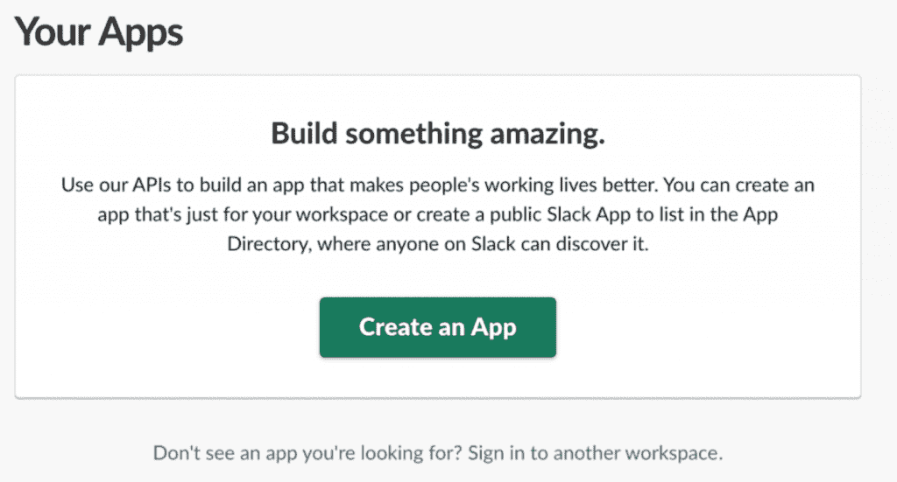
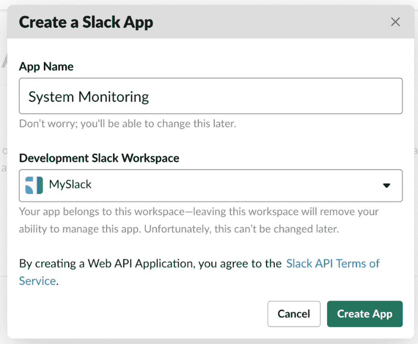
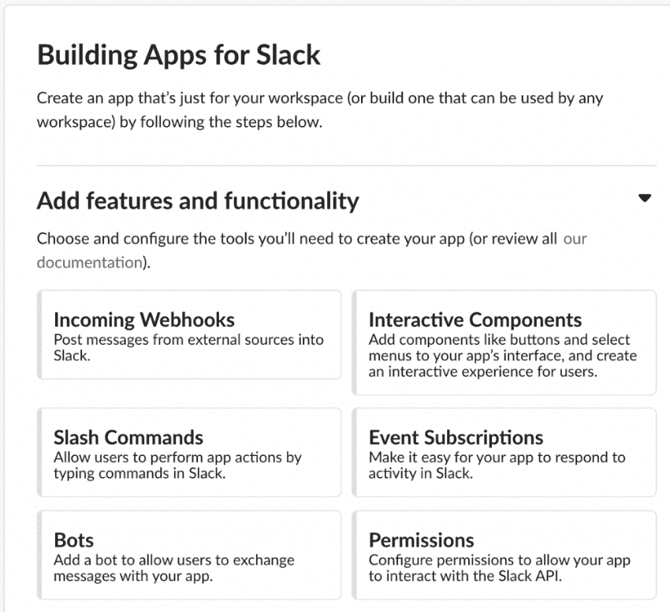

# 如何在 Java 中创建 Slack 插件

> 原文：<https://web.archive.org/web/20220930061024/https://www.baeldung.com/java-slack-plugin>

## **1。简介**

Slack 是一个流行的聊天系统，被世界各地的人和公司使用。它如此受欢迎的原因之一是能够编写我们自己的定制插件，可以在一个 slack 内与人和频道进行交互。这使用了他们的 HTTP API。

Slack 并没有提供官方的 SDK 来用 Java 编写插件。但是，有一个[官方认可的社区 SDK](https://web.archive.org/web/20221205180928/https://github.com/HubSpot/slack-client) 我们要用。这使得我们可以从 Java 代码库中访问几乎所有的 Slack API，而无需关心 API 的具体细节。

我们将利用这一点来构建一个小型系统监控机器人。这将定期检索本地计算机的磁盘空间，并在任何驱动器太满时提醒人们。

## **2。获取 API 证书**

在我们可以对 Slack 做任何事情之前，我们需要**创建一个新的应用程序和一个机器人，并将其连接到我们的频道**。

首先，让我们参观一下 https://api.slack.com/apps。这是我们管理 Slack 应用程序的基础。从这里我们可以创建一个新的应用程序。

当我们这样做时，我们需要为应用程序输入一个名称和一个 Slack 工作空间来创建它。

一旦我们完成了这些，应用程序就创建好了，可以开始使用了。下一个屏幕允许我们创建一个机器人。这是一个插件将扮演的假用户。

对于任何普通用户，我们需要给它一个显示名和用户名。这些是 Slack 工作区中的其他用户在与该 bot 用户交互时将看到的设置。

现在我们已经完成了，我们可以从侧边菜单中选择“安装应用程序”，然后**将应用程序添加到我们的 Slack 工作区**。一旦我们做到了这一点，应用程序就可以与我们的工作区进行交互。

这将给我们插件与 Slack 通信所需的令牌。

与不同的 Slack 工作空间交互的每个机器人将有一组不同的令牌。我们的应用程序在运行时需要“Bot 用户 OAuth 访问令牌”值。

最后，我们需要**邀请机器人到它应该参与**的任何频道。这是通过简单地从信道发送消息来实现的——在本例中为`@system_monitoring`。

## **3。给我们的项目添加时差**

在使用它之前，我们首先需要将 [Slack SDK 依赖项](https://web.archive.org/web/20221205180928/https://search.maven.org/search?q=g:com.hubspot.slack)添加到我们的`pom.xml`文件中:

[PRE0]

## **3。应用程序结构**

我们应用程序的核心是检查系统错误的能力。我们将用错误检查器的概念来表示这一点。这是一个具有单一方法的简单接口，用于检查错误并报告错误:

[PRE1]

我们还希望能够报告发现的任何错误。这是另一个简单的接口，它将接受问题陈述并适当地报告它:

[PRE2]

这里使用的界面允许我们以不同的方式报告问题。例如，我们可能有一个发送电子邮件，联系错误报告系统，或者向我们的 Slack 系统发送消息，以便人们获得即时通知。

这背后的设计是每个`ErrorChecker`实例都有自己的`ErrorReporter`可以使用。这使我们可以灵活地为不同的检查器使用不同的错误报告程序，因为有些错误可能比其他错误更重要。例如，如果磁盘超过 90%满，则可能需要向备用通道发送消息，但是如果磁盘超过 98%满，则我们可能改为向特定的人发送私人消息。

## **4。检查磁盘空间**

我们的错误检查器将检查本地系统上的磁盘空间量。任何可用空间少于特定百分比的文件系统都将被视为错误，并将被报告为错误。

我们将利用 Java 7 中引入的 NIO2 `FileStore` API 以跨平台的方式获取这些信息。

现在，让我们看看我们的错误检查器:

[PRE3]

这里，我们获取本地系统上所有文件存储的列表，然后逐个检查。任何小于我们定义的可用空间限制的都将使用我们的错误报告程序生成错误。

## **5。向松弛信道发送错误**

我们现在需要能够报告我们的错误。我们的第一个记者将向一个空闲频道发送消息。这允许频道中的任何人看到消息，希望有人会对此做出反应。

这使用了 Slack SDK 中的一个`SlackClient`，以及向其发送消息的通道的名称。它还实现了我们的`ErrorReporter`接口，这样我们就可以轻松地将它插入到任何一个错误检查器想要使用的接口中:

[PRE4]

## **6。应用布线**

我们现在可以连接应用程序并让它监控我们的系统了。出于本教程的考虑，我们将使用作为核心 JVM 一部分的 [Java `Timer`和`TimerTask`，但是我们也可以轻松地使用 Spring 或任何其他框架来构建它。](/web/20221205180928/https://www.baeldung.com/java-timer-and-timertask)

现在，它将有一个单独的`DiskSpaceErrorChecker`来报告我们的“通用”通道中可用率低于 10%的所有磁盘，并且每 5 分钟运行一次:

[PRE5]

我们需要用之前获得的令牌替换`<your api token>`，然后我们就可以运行了。一旦我们这样做了，如果一切都是正确的，我们的插件将检查本地驱动器，如果有任何错误的消息。

## **7。将错误作为私人消息发送**

接下来，我们将添加一个发送私有消息的错误报告程序。这对于更紧急的错误是有用的，因为它会**立即 ping 一个特定的用户，而不是依赖通道中的某个人来做出反应**。

我们这里的错误报告器更复杂，因为它需要与单个目标用户进行交互:

[PRE6]

我们在这里要做的是找到我们正在发送消息的用户——通过电子邮件地址查找，因为这是一件不能改变的事情。接下来，**我们向用户打开一个 IM 通道，然后将我们的错误消息发布到该通道**。

这可以在`main`方法中连接起来，我们将直接警告单个用户:

[PRE7]

一旦完成，我们就可以运行它，并获得错误的私有消息。

## **8。结论**

我们在这里已经看到了如何将 Slack 整合到我们的工具中，这样我们就可以将反馈发送给整个团队或单个成员。我们可以用 Slack API 做更多的事情，所以为什么不看看我们还能加入什么呢？

像往常一样，这篇文章的源代码可以在 GitHub 上找到[。](https://web.archive.org/web/20221205180928/https://github.com/eugenp/tutorials/tree/master/slack)