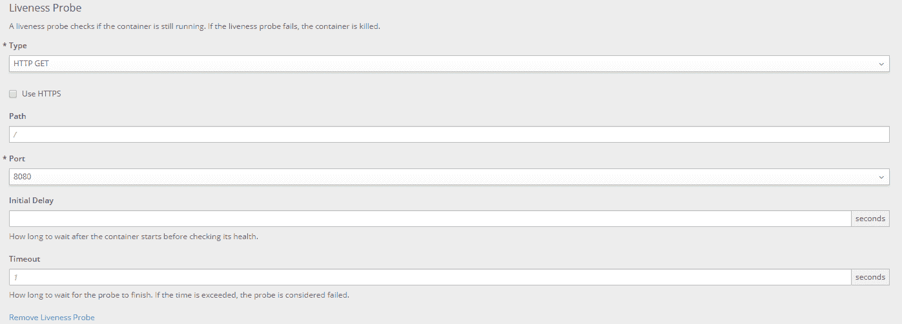
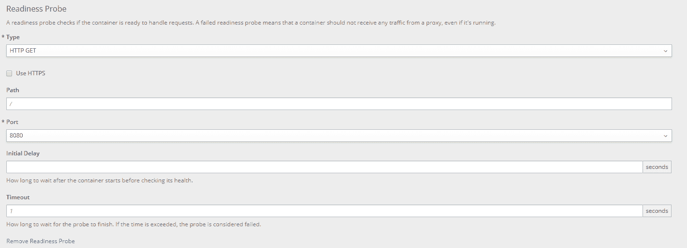
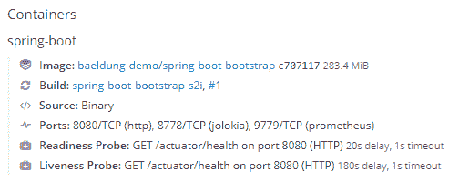
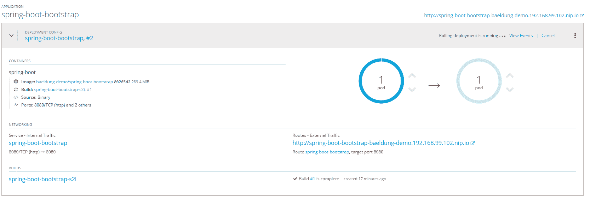
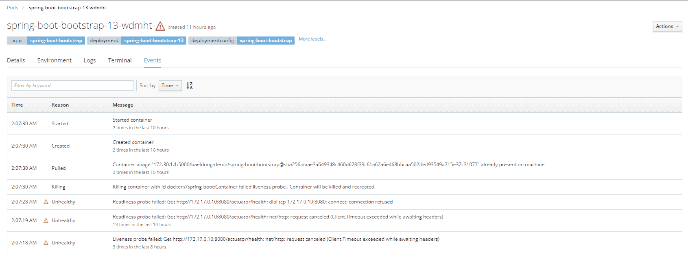

# 在 OpenShift 中实现健康检查

> 原文:[https://web . archive . org/web/20220930061024/https://www . bael dung . com/ops/open shift-health-checks](https://web.archive.org/web/20220930061024/https://www.baeldung.com/ops/openshift-health-checks)

## 1.概观

在本教程中，我们将展示如何让部署在 [OpenShift](https://web.archive.org/web/20221206055613/https://www.openshift.com/) 中的应用保持健康。

## 2.什么是健康的应用程序？

首先，让我们试着理解保持应用程序健康意味着什么。

pod 内的应用程序经常会遇到问题。特别是，应用程序可能会停止响应或开始不正确地响应。

应用程序可能会由于临时问题而变得不健康，例如配置错误或与外部组件(如数据库、存储或其他应用程序)的连接。

构建弹性应用程序的第一步是在 pod 上实现自动健康检查。如果出现问题，pod 将自动重启，无需手动干预。

## 3.使用探针进行健康检查

Kubernetes 和 OpenShift 提供了两种类型的探针:活性探针和就绪探针。

我们使用活性探测器来知道什么时候需要重启一个容器。当健康检查失败且 pod 变得不可用时，OpenShift 重新启动 pod。

**准备就绪探测器** **验证容器接受流量的可用性。**当所有的容器都准备好了，我们就认为一个容器准备好了。当 pod 未处于就绪状态时，服务负载平衡器会将其移除。

如果容器需要很长时间才能启动，该机制允许我们将连接路由到准备好接受所需流量的 pod。例如，当需要初始化数据集或建立到另一个容器或外部服务的连接时，就会出现这种情况。

我们可以用两种方式配置活性探测器:

*   编辑 pod 部署文件
*   使用 OpenShift 向导

在这两种情况下，获得的结果保持不变。第一个机制直接继承自 Kubernetes，[已经在另一个教程](/web/20221206055613/https://www.baeldung.com/spring-boot-kubernetes-self-healing-apps)中讨论过了。

在本教程中，我们将展示如何使用 OpenShift 图形用户界面配置探头。

## 4.活性探针

我们将活跃度探测器定义为部署配置文件中特定容器的参数。pod 内的所有容器都将继承此配置。

**如果探测器已经被创建为[HTTP 或 TCP 检查](/web/20221206055613/https://www.baeldung.com/spring-boot-kubernetes-self-healing-apps#2-probetypes)，探测器将从运行容器的节点**执行。当探测器作为脚本创建时，OpenShift 在容器内执行探测器。

因此，让我们为部署在 OpenShift 中的应用程序添加一个新的活跃度探测器:

1.  让我们选择应用程序所属的项目
2.  在左侧面板中，我们可以点击`Applications -> Deployments`
3.  让我们选择所选的应用程序
4.  在 Application Deployment Configuration 选项卡中，我们选择了`Add Health Checks`警报中的链接。只有在没有为应用程序配置运行状况检查的情况下，才会出现警报
5.  在新页面中，让我们选择`Add Liveness Probe`
6.  然后，让我们根据自己的喜好配置活动性探头:

让我们来分解一下这些活跃度探测器设置的含义:

*   `Type`:健康检查的类型。我们可以在 HTTP(S)检查、容器执行检查或套接字检查之间进行选择
*   `Use HTTPS`:仅当活跃度服务通过 HTTPS 公开时，选择此复选框
*   `Path`:应用程序暴露活跃度探测器的路径
*   `Port`:应用程序暴露活跃度探测器的端口
*   `Initial Delay`:容器启动后执行探测前的秒数——如果留空，默认为 0
*   `Timeout`:检测到探头超时后的秒数——如果为空，默认为 1 秒

OpenShift 为应用程序创建一个新的`DeploymentConfig`。新的`DeploymentConfig`将包含新配置的探针的定义。

## 5.就绪探测

我们可以配置就绪探测器，以确保容器在被视为活动之前已准备好接收流量。与活跃度探测不同，如果容器未通过就绪性检查，该容器将保持活动状态，但无法为流量提供服务。

**就绪性探测对于执行零停机部署至关重要。**

与活性探测器的情况一样，我们可以使用 OpenShift 向导或通过直接编辑 pod 部署文件来配置就绪探测器。

由于我们已经配置了活性探测器，现在让我们配置就绪探测器:

1.  选择应用程序所属的项目
2.  在左侧面板中，我们可以点击`Applications -> Deployments`
3.  让我们选择所选的应用程序
4.  在应用部署配置选项卡中，我们可以点击右上角的`Actions`按钮，选择`Edit Health Checks`
5.  在新页面中，让我们选择`Add Readiness Probe`
6.  然后，让我们根据自己的喜好配置就绪探测器:

如活性探针所示，可配置的参数如下:

*   `Type`:健康检查的类型。我们可以在 HTTP(S)检查、容器执行检查或套接字检查之间进行选择
*   `Use HTTPS`:仅当准备服务在 HTTPS 公开时，选择该复选框
*   `Path`:应用程序暴露就绪探测器的路径
*   `Port`:应用程序暴露准备就绪探测器的端口
*   `Initial Delay` : 容器启动后执行探测前的秒数(默认为 0)
*   `Timeout` : 探测超时后的秒数(默认为 1)

同样，OpenShift 为我们的应用程序创建了一个新的`DeploymentConfig`——包含就绪探针。

## 6.把它包起来

是时候检验我们展示的东西了。假设我们有一个 Spring Boot 应用程序要部署在 OpenShift 集群中。要做到这一点，我们可以参考我们的教程，其中测试应用程序是作为一步一步的部署呈现的。

一旦正确地部署了应用程序，我们就可以按照前面几段中介绍的内容，从设置探针开始。Spring Boot 应用程序使用 Spring Boot 执行器来公开运行状况检查端点。我们可以在我们的专用教程中找到关于配置致动器的更多信息。

在设置结束时，部署配置页面将显示有关新配置的探测器的信息:

现在是时候检查就绪性和活性探测是否正常工作了。

### 6.1.测试就绪探测器

让我们尝试模拟应用程序新版本的部署。就绪探针使我们能够在零停机的情况下进行部署。在这种情况下，当我们部署新版本时，OpenShift 将创建一个与新版本相对应的新 pod。旧的 pod 将继续服务流量，直到新的 pod 准备好接收流量，也就是说，直到新的 pod 的准备就绪探测返回肯定的结果。

从 OpenShift 仪表板，在我们项目的页面内，如果我们看到部署阶段的中间，我们可以看到零停机部署的表示:

### 6.2.测试活性探针

让我们模拟活性探测器的失败。

让我们假设应用程序此时执行的健康检查将返回一个否定的结果。这表明 pod 工作所需的资源不可用。

OpenShift 将杀死 pod `n`次(默认情况下，`n` 设置为 3)并重新创建它。如果问题在此阶段得到解决，pod 将恢复到其健康状态。否则，如果从属资源在尝试期间继续不可用，OpenShift 将认为 pod 处于`Failed`状态。

我们来验证一下这个行为。让我们打开包含与 pod 相关的事件列表的页面。我们应该会看到一个类似于下图的屏幕:

正如我们所看到的，OpenShift 记录了健康检查失败，杀死了 pod，并试图重新启动它。

## 7.结论

在本教程中，我们探讨了 OpenShift 的两种类型的探测器。

我们在同一个容器中并行使用了就绪性和活性探测器。我们使用这两种方法来确保 OpenShift 在出现问题时重启容器，并且在容器还没有准备好服务时不允许流量到达容器。我们这里例子的完整源代码一如既往地在 GitHub 的[上。](https://web.archive.org/web/20221206055613/https://github.com/eugenp/tutorials/tree/master/spring-boot-modules/spring-boot-bootstrap)