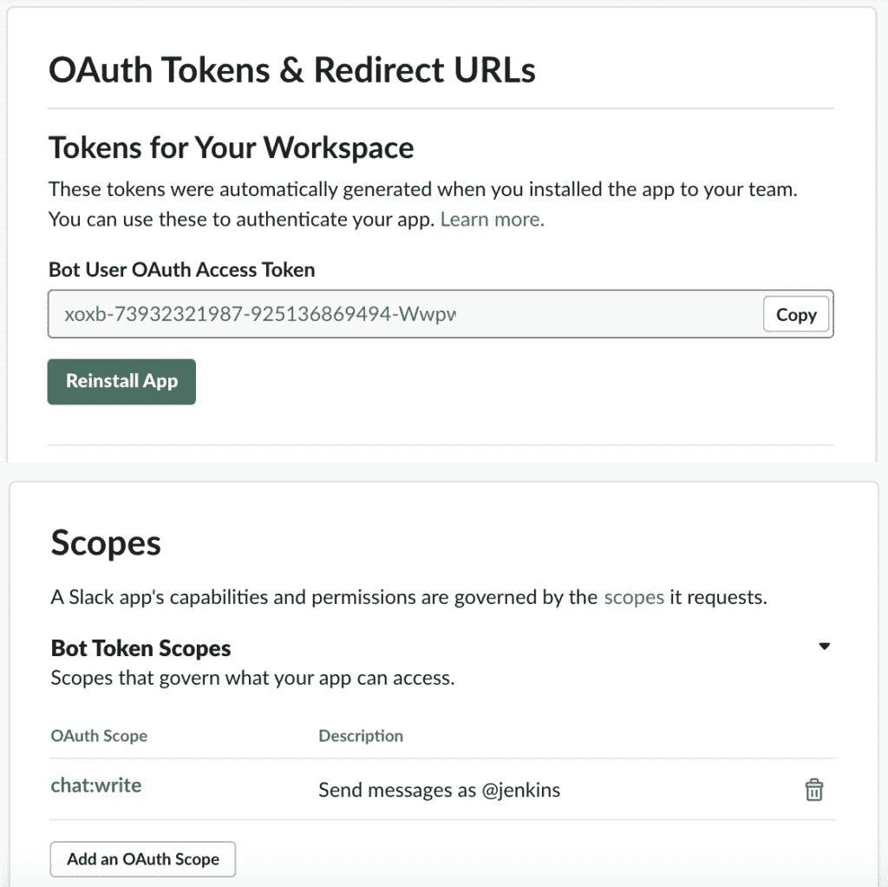
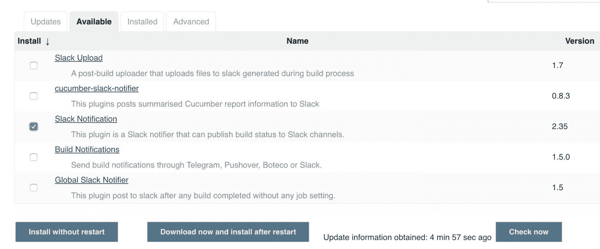
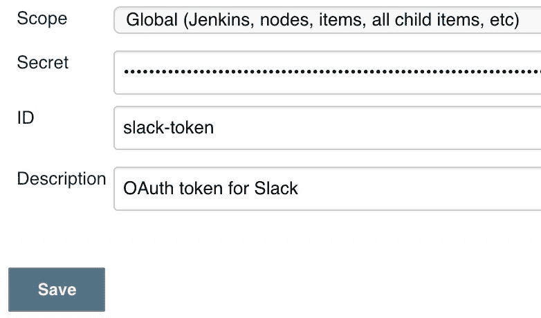
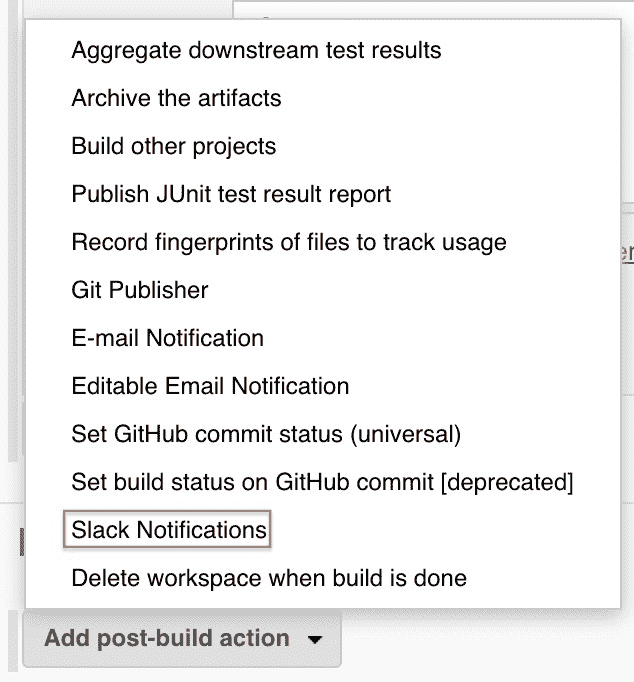
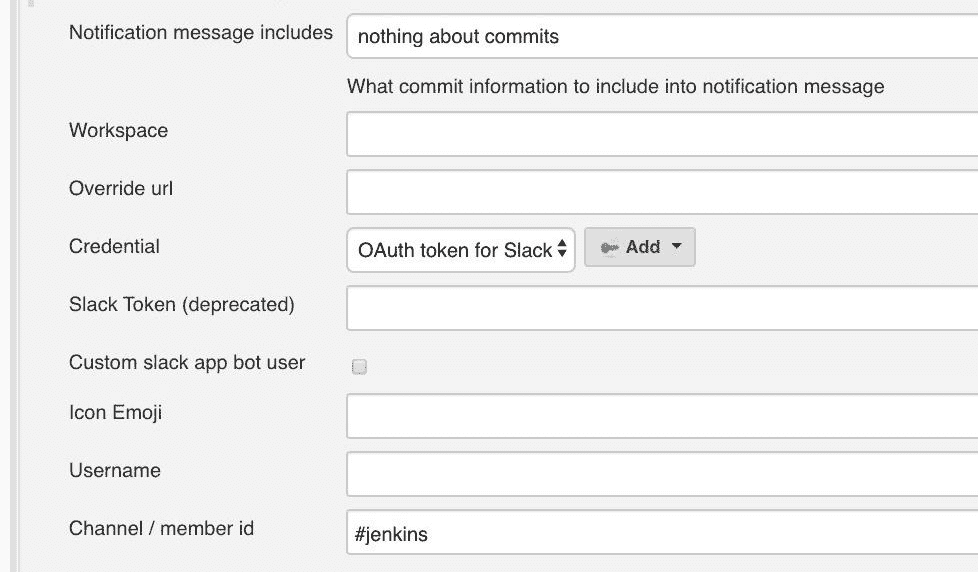

# 詹金斯松弛集成

> 原文：<https://web.archive.org/web/20220930061024/https://www.baeldung.com/ops/jenkins-slack-integration>

## 1.概观

当我们的团队负责 DevOps 实践时，我们经常需要监控构建和其他自动化工作。

在本教程中，我们将了解如何配置两个流行的平台， [Jenkins](/web/20220523134651/https://www.baeldung.com/jenkins-pipelines) 和 Slack，让它们协同工作，并告诉我们在 CI/CD 管道运行时发生了什么。

## 2.设置松弛时间

让我们从配置 Slack 开始，这样 Jenkins 就可以向它发送消息。为此，**我们将创建一个定制的 Slack 应用程序，它需要一个管理员帐户**。

在 Slack 中，我们将创建一个应用程序并生成一个 OAuth 令牌:

*   参观[https://api.slack.com](https://web.archive.org/web/20220523134651/https://api.slack.com/)
*   登录到所需的工作空间
*   点击`Start Building`按钮
*   将应用程序命名为`Jenkins`并点击`Create App`
*   点击`OAuth & Permissions`
*   在`Bot Token Scopes`部分，添加`chat:write`范围
*   点击`Install App to Workspace`按钮
*   点击`Accept`按钮

完成后，我们将看到一个摘要屏幕:

现在，我们需要注意 OAuth 令牌——我们稍后配置 Jenkins 时会用到它。我们应该将这些视为敏感凭证并妥善保管..

为了完成 Slack 设置，我们必须邀请新的 Jenkins 用户进入我们希望它使用的频道。一个简单的方法是在每个频道中使用`@`字符来提及新用户。

## 3.陷害詹金斯

要设置 Jenkins，**我们需要一个管理员帐户**。

首先，让我们登录 Jenkins 并导航到`Manage Jenkins` > `Plugin Manager`。

然后，在`Available`选项卡上，我们将搜索`Slack`:

让我们选中`Slack Notification`的复选框并点击`Install without restart`。

现在，我们需要配置新的凭证。让我们导航到`Jenkins > Credentials > System > Global Credentials`并添加一个新的`Secret text`凭证:

**我们将把 OAuth 令牌从 Slack 放入`Secret`字段**。我们还应该给这些凭证一个有意义的 ID 和描述，以帮助我们以后容易地识别它们。Jenkins 凭据存储是保存此令牌的安全位置。

一旦我们保存了凭证，还有一个全局配置需要设置。在 `Jenkins > Manage Jenkins > Configure System`下，我们需要勾选`Slack`部分下的`Custom slack app bot user`复选框:

现在我们已经完成了 Jenkins 设置，让我们看看如何配置 Jenkins 作业和管道来发送 Slack 消息。

## 4.配置传统的 Jenkins 作业

传统的 Jenkins 作业通常执行一个或多个操作来完成目标。这些都是通过 Jenkins 用户界面配置的。

为了将传统作业与 Slack 结合起来，**我们将使用一个构建后操作**。

让我们选择任何工作，或者创建一个新的工作。当我们下拉`Add post-build action`菜单时，我们会发现`Slack Notifications`:

一旦选定，就有许多可用的输入到时差通知操作中。一般来说，大多数默认值就足够了。但是，有一些必需的信息:

*   为哪个构建阶段发送消息(开始、成功、失败等)
*   要使用的凭据的名称，即我们之前添加的名称
*   向其发送消息的松弛通道名称或成员 ID

如果需要，我们还可以指定其他字段，例如用于 Jenkins 作业的提交信息、自定义消息、自定义机器人图标等等:

当通过 UI 进行设置时，我们可以使用`Test Connection`按钮来确保 Jenkins 可以到达 Slack。如果成功，我们将在 Slack 通道中看到来自 Jenkins 用户的测试消息:

如果该消息没有出现，Jenkins 日志文件对故障排除很有用。通常，我们需要**再次检查构建后操作是否包含所有必需的字段**，OAuth 令牌是否被正确复制，以及在我们配置 Slack 时令牌是否被授予了正确的范围。

## 5.配置 Jenkins 管道

詹金斯管道不同于传统工作。他们使用一个分成几个阶段的 Groovy 脚本来定义一个构建。**它们也没有后期构建操作，所以我们使用管道脚本本身来发送 Slack 消息**。【T2

以下代码片段从 Jenkins 管道向 Slack 发送了一条消息:

[PRE0]

就像传统的 Jenkins 作业设置一样，我们仍然必须指定要使用的通道名和凭证名。

通过 Jenkins 管道，我们还可以使用各种附加的 Slack 特性，比如文件上传、消息线程等等。

使用 Jenkins 管道的一个缺点是没有测试按钮。为了测试与 Slack 的集成，我们必须执行整个管道。

当第一次设置时，我们可以创建一个新的管道，它只包含 Slack 命令，同时让事情正常工作。

## 6.其他注意事项

现在我们已经将 Jenkins 和 Slack 连接起来，还有一些额外的考虑。

首先，**单个 Jenkins 实例可以与多个 Slack 工作空间**通信。我们所要做的就是创建一个定制的应用程序，并为每个工作区生成一个新的令牌。只要每个令牌在 Jenkins 中存储为自己的凭证，不同的作业就可以发布到不同的工作区。

同样地，**不同的 Jenkins 工作可以发布到不同的 Slack 频道**。这是我们配置的`post-build actions`中的每个作业的设置。例如，与软件构建相关的工作可以发布到开发专用频道。与测试或生产相关的工作可以进入他们自己的专用频道。

最后，虽然我们已经看到了 Jenkins 的一个更受欢迎的 Slack 插件，它提供了对发送内容的细粒度控制，但还有许多其他插件服务于不同的目的。例如，如果我们希望`every` Jenkins job 发送相同的通知，有一个`Global Slack Notifier`插件可能更适合这个。

## 7.结论

在本文中，我们看到了如何整合 Jenkins 和 Slack 来获得对 CI/CD 渠道的反馈。

使用一个 Jenkins 插件，以及一个定制的 Slack 应用程序，我们能够从 Jenkins 向 Slack 发送消息。这使得团队能够注意到 Jenkins jobs 的状态，并更快地解决问题。