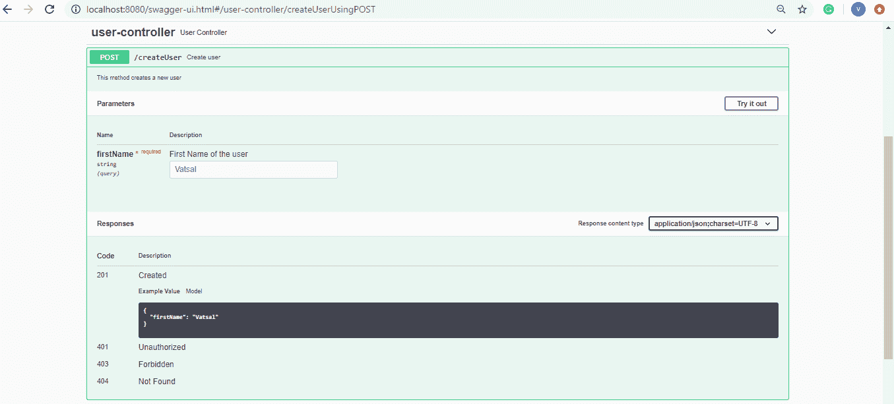

# swagger @ API param vs @ API model property

> 原文：<https://web.archive.org/web/20220930061024/https://www.baeldung.com/swagger-apiparam-vs-apimodelproperty>

## 1.概观

在本教程中，我们将简要地看一下斯瓦格的 [`@ApiParam`](https://web.archive.org/web/20221026123332/http://docs.swagger.io/swagger-core/v1.5.0/apidocs/io/swagger/annotations/ApiParam.html) 和 [`@ApiModelProperty`](https://web.archive.org/web/20221026123332/http://docs.swagger.io/swagger-core/v1.5.0/apidocs/io/swagger/annotations/ApiModelProperty.html) 注释。此外，我们将比较这些注释，并确定每个注释的正确用法。

## 2.关键的区别

**简单的说就是`, @ApiParam`和`@ApiModelProperty`标注给 Swagger 添加不同的元数据。**`@ApiParam`注释用于 API 资源请求的参数，而`@ApiModelProperty`用于模型的属性。

## 3.`@ApiParam`

`@ApiParam` 注释仅用于 [JAX-RS 1.x/2.x 参数](/web/20221026123332/https://www.baeldung.com/jersey-request-parameters)注释，如`@PathParam`、`@QueryParam`、`@HeaderParam`、`@FormParam`和`@BeanParam`。虽然默认情况下`swagger-core`会扫描这些注释，但是我们可以使用`@ApiParam`来添加更多关于参数的细节，或者在从代码中读取参数时更改参数值。

**`@ApiParam`注释有助于指定参数的名称、类型、描述(值)和示例值。**此外，我们可以指定参数是必需的还是可选的。

让我们来看看它的用法:

[PRE0]

让我们看一下 [Swagger UI](https://web.archive.org/web/20221026123332/https://swagger.io/tools/swagger-ui/) 的表示，作为我们`@ApiParam`的例子:

现在，我们来看看`@ApiModelProperty`。

## 4.`@ApiModelProperty`

`@ApiModelProperty`注释**允许我们控制特定于 Swagger 的定义，比如描述(值)、名称、数据类型、示例值和模型属性的允许值。**

此外，它还提供了额外的过滤属性，以防我们希望在某些情况下隐藏该属性。

让我们给`User's` `firstName`字段添加一些模型属性:

[PRE1]

现在，让我们来看看`User`模型在 Swagger UI 中的规格:

## 5.结论

在这篇简短的文章中，我们看到了两个 Swagger 注释，可以用来为参数和模型属性添加元数据。然后，我们查看了一些使用这些注释的示例代码，并在 Swagger UI 中看到了它们的表示。

和往常一样，所有这些代码示例都可以在 GitHub 上的[处获得。](https://web.archive.org/web/20221026123332/https://github.com/eugenp/tutorials/tree/master/spring-boot-modules/spring-boot-swagger-2)