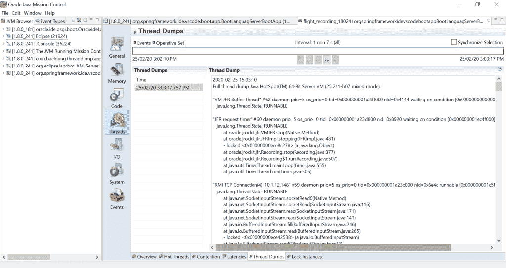
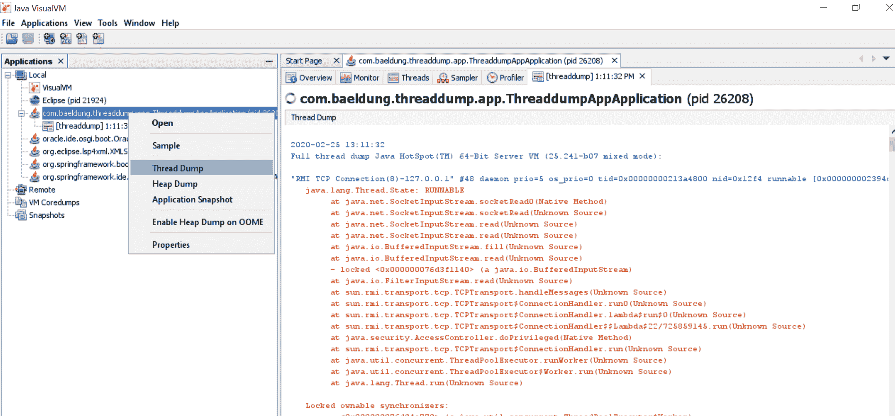
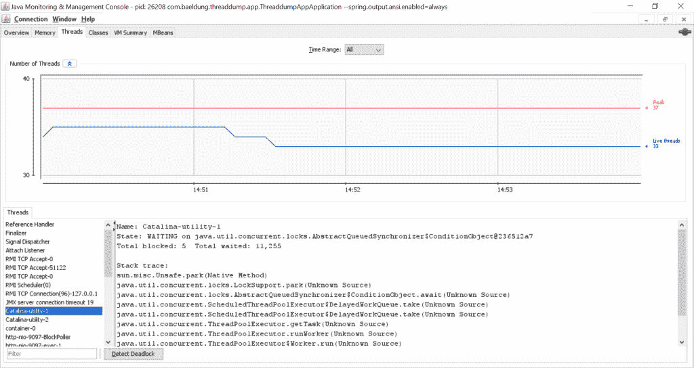

# 捕获 Java 线程转储

> 原文:[https://web . archive . org/web/20220930061024/https://www . bael dung . com/Java-thread-dump](https://web.archive.org/web/20220930061024/https://www.baeldung.com/java-thread-dump)

## 1.概观

在本教程中，我们将讨论捕捉 Java 应用程序线程转储的各种方法。

线程转储是 Java 进程所有线程状态的快照。每个线程的状态都有一个堆栈跟踪，显示线程堆栈的内容。线程转储对于诊断问题很有用，因为它显示线程的活动。**线程转储是以纯文本格式编写的，所以我们可以将它们的内容保存到一个文件中，稍后在文本编辑器中查看它们**。

在接下来的小节中，我们将通过多种工具和方法来生成线程转储。

## 2.使用 JDK 实用程序

JDK 提供了几个实用程序，可以捕获 Java 应用程序的线程转储。**所有的实用程序都位于 JDK 主目录**中的`bin`文件夹下。因此，只要这个目录在我们的系统路径中，我们就可以从命令行执行这些实用程序。

### 2.1.`jstack`

jstack 是一个命令行 JDK 工具，我们可以用它来捕获线程转储。它获取进程的`pid`,并在控制台中显示线程转储。或者，我们可以将其输出重定向到一个文件。

**让我们看看使用 jstack 捕获线程转储的基本命令语法:**

```
jstack [-F] [-l] [-m] <pid>
```

所有的标志都是可选的。让我们看看他们的意思:

*   `-F`选项强制线程转储；当`jstack pid`没有响应(进程被挂起)时方便使用
*   `-l`选项指示实用程序在堆和锁中寻找可拥有的同步器
*   `-m option` 除了 Java 堆栈帧之外，还打印本地堆栈帧(C & C++)

让我们通过捕获线程转储并将结果重定向到一个文件来使用这些知识:

```
jstack 17264 > /tmp/threaddump.txt
```

请记住，我们可以通过使用 [`jps `](https://web.archive.org/web/20220627183729/https://docs.oracle.com/en/java/javase/11/tools/jps.html) 命令轻松获得 Java 进程的`pid`。

### 2.2.Java 任务控制

**[Java Mission Control](https://web.archive.org/web/20220627183729/https://docs.oracle.com/javacomponents/jmc-5-5/jmc-user-guide/intro.htm#JMCCI109)(JMC)是一个从 Java 应用程序中收集和分析数据的 GUI 工具。**我们启动 JMC 后，它会显示本地机器上运行的 Java 进程列表。我们还可以通过 JMC 连接到远程 Java 进程。

我们可以右键点击流程，点击“`Start Flight Recording`”选项。此后，`Threads`选项卡显示线程转储:

[](/web/20220627183729/https://www.baeldung.com/wp-content/uploads/2020/03/JMC-1024x544-1.png)

### 2.3.**T2`jvisualvm`**

**[jvisualvm](https://web.archive.org/web/20220627183729/https://docs.oracle.com/javase/8/docs/technotes/tools/unix/jvisualvm.html) 是一个带有图形用户界面的工具，它让我们可以监控、排除故障和分析 Java 应用程序**。GUI 很简单，但是非常直观和易于使用。

它的许多选项之一允许我们捕获线程转储。如果我们右键单击一个 Java 进程并选择`“Thread Dump”`选项，该工具将创建一个线程转储并在一个新选项卡中打开它:

[](/web/20220627183729/https://www.baeldung.com/wp-content/uploads/2020/03/JVisualVM.png)

从 JDK 9 开始，Visual VM 不包括在 Oracle JDK 和开放 JDK 发行版中。因此，如果我们使用的是 Java 9 或更新的版本，我们可以从 VisualVM 开源[项目站点](https://web.archive.org/web/20220627183729/https://visualvm.github.io/)获得 JVM。

### 2.4.`jcmd`

jcmd 是一个通过向 JVM 发送命令请求来工作的工具。虽然功能强大，它**不包含任何远程功能；**我们必须在运行 Java 进程的同一台机器上使用它。

**它的众多命令之一就是` Thread.print`** 。我们可以用它来获得一个线程转储，只需指定进程的`pid`:

```
jcmd 17264 Thread.print
```

### 2.5.`jconsole`

[jconsole](https://web.archive.org/web/20220627183729/https://docs.oracle.com/en/java/javase/11/management/using-jconsole.html) 让我们检查每个线程的堆栈跟踪。如果我们打开`jconsole`并连接到一个正在运行的 Java 进程**，我们可以导航到*线程*选项卡并找到每个线程的堆栈跟踪**:

[](/web/20220627183729/https://www.baeldung.com/wp-content/uploads/2020/03/JConsole-1024x544-1.png)

### 2.6.摘要

事实证明，有许多方法可以使用 JDK 实用程序来捕获线程转储。让我们花一点时间来思考每一种方法，并概述它们的优缺点:

*   `jstack`:提供最快最简单的方法来捕获线程转储；然而，从 Java 8 开始有了更好的选择
*   增强的 JDK 剖析和诊断工具。它最大限度地减少了性能开销，这通常是分析工具的一个问题。
*   `jvisualvm`:轻量级开源剖析工具，具有出色的 GUI 控制台
*   `jcmd`:极其强大，推荐 Java 8 及以后版本。一个具有多种用途的工具:捕获线程转储(`jstack`)、堆转储(`jmap`)、系统属性和命令行参数(`jinfo`)
*   `jconsole`:让我们检查线程堆栈跟踪信息

## 3.从命令行

在企业应用服务器中，出于安全原因，只安装 JRE。因此，我们不能使用上述设施，因为它们是 JDK 的一部分。然而，有各种各样的命令行选项可以让我们轻松地捕获线程转储。

### 3.1.`kill` -3 命令(Linux/Unix)

在类 Unix 系统中捕获线程转储的最简单的方法是通过 [`kill `](https://web.archive.org/web/20220627183729/https://linux.die.net/man/3/kill) 命令，我们可以使用该命令向使用`kill() `系统调用的进程发送信号。在这个用例中，我们将向它发送`-3`信号。

使用前面例子中的相同的`pid`,让我们看看如何使用`kill`来捕获线程转储:

```
kill -3 17264
```

这样，接收信号的 Java 进程将在标准输出中打印线程转储。

如果我们使用下面的调优标志组合运行 Java 进程，那么它也会将线程转储重定向到给定的文件:

```
-XX:+UnlockDiagnosticVMOptions -XX:+LogVMOutput -XX:LogFile=~/jvm.log
```

现在，如果我们发送`-3 `信号，除了标准输出，转储将在`~/jvm.log `文件中可用。

### 3.2.Ctrl + Break (Windows)

**在 Windows 操作系统中，我们可以使用`CTRL`和`Break`组合键**来捕获线程转储。要进行线程转储，导航到用于启动 Java 应用程序的控制台，同时按下`CTRL`和`Break`键。

值得注意的是，在某些键盘上，`Break` 键是不可用的。因此，在这种情况下，可以同时使用`CTRL`、`SHIFT`和`Pause`键来捕获线程转储。

这两个命令都将线程转储打印到控制台。

## 4.使用`ThreadMxBean`以编程方式

本文中我们将讨论的最后一种方法是使用 [JMX](/web/20220627183729/https://www.baeldung.com/java-management-extensions) 。**我们将使用`ThreadMxBean`来捕获线程转储**。让我们看看它的代码:

```
private static String threadDump(boolean lockedMonitors, boolean lockedSynchronizers) {
    StringBuffer threadDump = new StringBuffer(System.lineSeparator());
    ThreadMXBean threadMXBean = ManagementFactory.getThreadMXBean();
    for(ThreadInfo threadInfo : threadMXBean.dumpAllThreads(lockedMonitors, lockedSynchronizers)) {
        threadDump.append(threadInfo.toString());
    }
    return threadDump.toString();
}
```

在上面的程序中，我们正在执行几个步骤:

1.  首先，初始化一个空的`StringBuffer `来保存每个线程的堆栈信息。
2.  然后我们使用`ManagementFactory` 类来获取`ThreadMxBean.` 的实例,`ManagementFactory `是一个工厂类，用于获取 Java 平台的托管 beans。另外，`ThreadMxBean `是 JVM 线程系统的管理接口。
3.  将`lockedMonitors`和`lockedSynchronizers` 的值设置为`true`表示在线程转储中捕获可拥有的同步器和所有锁定的监视器。

## 5.结论

在本文中，我们学习了捕获线程转储的多种方法。

首先，我们讨论了各种 JDK 实用工具，然后是命令行替代工具。最后，我们以使用 JMX 的编程方法结束。

和往常一样，这个例子的完整源代码可以从 GitHub 上的[处获得。](https://web.archive.org/web/20220627183729/https://github.com/eugenp/tutorials/tree/master/core-java-modules/core-java-perf)