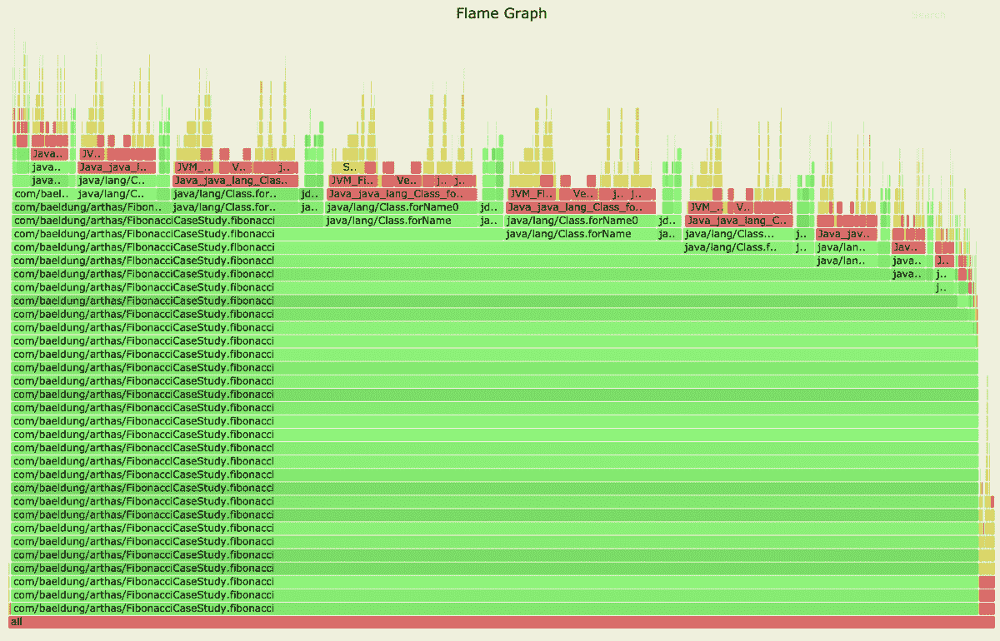

# 阿里巴巴阿尔萨斯简介

> 原文：<https://web.archive.org/web/20220930061024/https://www.baeldung.com/java-alibaba-arthas-intro>

## 1.介绍

Ali Arthas 是一个诊断工具，它使我们能够监控、分析和诊断我们的 Java 应用程序。使用 Arthas 的一个主要好处是，我们不需要修改代码，甚至不需要重启我们想要监控的 Java 服务。

在本教程中，我们将从安装 Arthas 开始，然后通过一个简单的案例研究来演示 Arthas 的一些关键特性。

最后，由于 Arthas 是用 Java 编写的，它是跨平台的，可以在 Linux、macOS 和 Windows 上愉快地运行。

## 2.下载和开始使用

首先，让我们通过[下载链接](https://web.archive.org/web/20221208143845/https://alibaba.github.io/arthas/arthas-boot.jar)或者使用`curl`直接下载阿尔萨斯库:

```
curl -O https://alibaba.github.io/arthas/arthas-boot.jar 
```

现在，让我们通过运行带有`-h`(帮助)选项的 Arthas 来测试它是否在运行:

```
java -jar arthas-boot.jar -h
```

如果成功，我们应该会看到显示的所有命令的帮助指南:

[](/web/20221208143845/https://www.baeldung.com/wp-content/uploads/2020/03/baeldung-arthas-help-command-900.png)

## 3.个案研究

在本教程中，我们将使用一个非常简单的应用程序，它基于使用递归的[斐波那契](/web/20221208143845/https://www.baeldung.com/java-fibonacci)序列的一个相当低效的实现:

```
public class FibonacciGenerator {

    public static void main(String[] args) {
        System.out.println("Press a key to continue");
        System.in.read();
        for (int i = 0; i < 100; i++) {
            long result = fibonacci(i);
            System.out.println(format("fib(%d): %d", i, result));
        }
    }

    public static long fibonacci(int n) {
        if (n == 0 || n == 1) {
            return 1L;
        } else {
            return fibonacci(n - 1) + fibonacci(n - 2);
        }
    }
} 
```

这个例子中最有趣的部分是遵循斐波那契数学定义的`fibonacci`方法。

在`main`方法中，我们使用一个`for`循环和相对较大的数字，这样我们的计算机将忙于更长的计算。当然，这正是我们想要展示阿尔萨斯的。

## 4.开始阿尔萨斯

现在让我们试试阿尔萨斯吧！我们需要做的第一件事是运行我们的小 Fibonacci 应用程序。为此，我们可以使用我们最喜欢的 IDE 或者直接在终端中运行它。它会要求按一个键来启动。在我们把进程连接到阿尔萨斯之后，我们可以按任意键。

现在，让我们运行 Arthas 可执行文件:

```
java -jar arthas-boot.jar
```

**阿尔萨斯提示一个菜单来选择我们想要附加到哪个进程:**

```
[INFO] arthas-boot version: 3.1.7
[INFO] Found existing java process, please choose one and hit RETURN.
* [1]: 25500 com.baeldung.arthas.FibonacciGenerator
...
```

让我们选择一个名字为`com.baeldung.arthas.FibonacciGenerator`的。只需输入列表中的数字，在本例中为“1”，然后按 enter 键。

阿尔萨斯现在将连接到这个进程并开始:

```
INFO] Try to attach process 25500
[INFO] Attach process 25500 success.
... 
```

启动阿尔萨斯后，我们会看到一个提示，可以在这里发出不同的命令。

我们可以使用`help`命令来获取关于可用选项的更多信息。而且，为了方便阿尔萨斯的使用，我们还可以使用 tab 键来自动完成它的命令。

将 Arthas 附加到我们的进程后，现在我们可以按一个键，程序开始打印 Fibonacci 数。

## 5.仪表盘

一旦阿尔萨斯启动，我们就可以使用仪表板。在这种情况下，我们通过键入`dashboard` 命令来继续。现在我们可以看到一个详细的屏幕，上面有几个窗格和许多关于 Java 流程的信息:

[](/web/20221208143845/https://www.baeldung.com/wp-content/uploads/2020/03/baeldung-arthas-dashboar-1200.png)

让我们更详细地看看其中的一些:

1.  **顶部专用于当前运行的线程**
2.  其中一个重要的列是每个线程的 CPU 消耗
3.  第 3 部分显示了每个线程的 CPU 时间
4.  另一个有趣的窗格是用于内存分析的。列出了不同的内存区域及其统计数据。在右边，我们有关于[垃圾收集器](/web/20221208143845/https://www.baeldung.com/jvm-garbage-collectors)的信息
5.  最后，在第 5 节中，我们有关于主机平台和 JVM 的信息

**我们可以通过按`q`** 退出仪表盘。

我们应该记住，即使我们退出，阿尔萨斯也会被附加到我们的进程中。**所以为了正确地解除它与我们流程的链接，我们需要运行** `**stop**` **命令** `. `

## 6.分析堆栈跟踪

在仪表板中，我们看到我们的`main`进程几乎占用了 100%的 CPU。这个过程的`ID`为 1，我们可以在第一列中看到。

现在我们已经退出了仪表板，我们可以通过**运行`thread`命令**来更详细地分析流程:

```
thread 1
```

作为参数传递的数字是线程 id。Arthas 打印出一个堆栈跟踪，不出所料，其中充斥着对`fibonacci`方法的调用。

如果堆栈跟踪很长，阅读起来很乏味，thread 命令允许我们使用管道:

```
thread 1 | grep 'main('
```

这将只打印与`grep `命令匹配的行:

```
[[[email protected]](/web/20221208143845/https://www.baeldung.com/cdn-cgi/l/email-protection)]$ thread 1 | grep 'main('
    at com.baeldung.arthas.FibonacciGenerator.main(FibonacciGenerator.java:10)
```

## 7.反编译 Java 类

让我们设想一个场景，我们正在分析一个我们知之甚少或一无所知的 Java 应用程序，突然发现堆栈中散布着重复的调用类型:

```
[[[email protected]](/web/20221208143845/https://www.baeldung.com/cdn-cgi/l/email-protection)]$ thread 1
"main" Id=1 RUNNABLE
  at app//com.baeldung.arthas.FibonacciGenerator.fibonacci(FibonacciGenerator.java:18)
  at app//com.baeldung.arthas.FibonacciGenerator.fibonacci(FibonacciGenerator.java:18)
  ... 
```

因为我们正在运行 Arthas，**我们可以反编译一个类来查看它的内容。**要实现这一点，我们可以使用 [`jad`](https://web.archive.org/web/20221208143845/https://alibaba.github.io/arthas/en/jad) 命令，传递限定类名作为参数:

```
jad com.baeldung.arthas.FibonacciGenerator

ClassLoader:
[[email protected]](/web/20221208143845/https://www.baeldung.com/cdn-cgi/l/email-protection)
  [[email protected]](/web/20221208143845/https://www.baeldung.com/cdn-cgi/l/email-protection)

Location:
/home/amoreno/work/baeldung/tutorials/libraries-3/target/
```

```
/*
 * Decompiled with CFR.
 */
package com.baeldung.arthas;

import java.io.IOException;
import java.io.InputStream;
import java.io.PrintStream;

public class FibonacciGenerator {
    public static void main(String[] arrstring) throws IOException {
```

输出是反编译的 Java 类和一些有用的元数据，比如类的位置。这是一个非常有用和强大的功能。

## 8.搜索类别和搜索方法

在搜索 JVM 中加载的类时，search class 命令非常方便。**我们可以通过键入`sc`并传递一个模式(带或不带通配符)作为参数**来使用它:

```
[[[email protected]](/web/20221208143845/https://www.baeldung.com/cdn-cgi/l/email-protection)]$ sc *Fibonacci*
com.baeldung.arthas.FibonacciGenerator
Affect(row-cnt:1) cost in 5 ms. 
```

一旦我们有了类的限定名，我们就可以使用另外两个标志来寻找更多的信息:

*   `-d`显示班级的详细信息
*   `-f`显示该类的字段

但是，必须结合详细信息来查询该类的字段:

```
[[[email protected]](/web/20221208143845/https://www.baeldung.com/cdn-cgi/l/email-protection)]$ sc -df com.baeldung.arthas.FibonacciGenerator
  class-info        com.baeldung.arthas.FibonacciGenerator
  ... 
```

同样，我们可以使用命令`sm` (search method)在一个类中查找加载的方法。在这种情况下，对于我们的类`com.baeldung.arthas.FibonacciGenerator`，我们可以运行:

```
[[[email protected]](/web/20221208143845/https://www.baeldung.com/cdn-cgi/l/email-protection)]$ sm com.baeldung.arthas.FibonacciGenerator
com.baeldung.arthas.FibonacciGenerator <init>()V
com.baeldung.arthas.FibonacciGenerator main([Ljava/lang/String;)V
com.baeldung.arthas.FibonacciGenerator fibonacci(I)J
Affect(row-cnt:3) cost in 4 ms. 
```

**我们也可以使用标志`-d`来检索方法的细节**。最后，我们可以给方法名传递一个可选参数，以减少返回方法的数量:

```
sm -d com.baeldung.arthas.FibonacciGenerator fibonacci
 declaring-class  com.baeldung.arthas.FibonacciGenerator
 method-name      fibonacci
 modifier         public,static
 annotation
 parameters       int
 return           long
 exceptions
 classLoaderHash  799f7e29
```

## 9.监控方法调用

我们可以对阿尔萨斯做的另一件很酷的事情是监控一个方法。在调试我们的应用程序中的性能问题时，这非常**方便。为此，我们可以使用`[monitor](https://web.archive.org/web/20221208143845/https://alibaba.github.io/arthas/en/monitor)`命令。**

`monitor`命令需要一个标志`-c <seconds>`和两个参数——限定类名和方法名。

对于我们的案例研究，现在让我们调用`monitor`:

```
monitor -c 10 com.baeldung.arthas.FibonacciGenerator fibonacci
```

正如预期的那样，Arthas 将每 10 秒钟打印一次关于`fibonacci`方法的指标:

```
Affect(class-cnt:1 , method-cnt:1) cost in 47 ms.
 timestamp            class                                          method     total   success  fail  avg-rt(ms)  fail-rate                                                                       
-----------------------------------------------------------------------------------------------------------------------------                                                                      
 2020-03-07 11:43:26  com.baeldung.arthas.FibonacciGenerator  fibonacci  528957  528957   0     0.07        0.00%
... 
```

对于那些以失败告终的调用，我们也有度量标准——这对调试很有用。

## 10.监控方法参数

**如果我们需要调试一个方法的参数，我们可以使用`watch`命令**。但是，语法有点复杂:

```
watch com.baeldung.arthas.FibonacciGenerator fibonacci '{params[0], returnObj}' 'params[0]>10' -n 10 
```

让我们详细看一下每个论点:

*   第一个参数是类名
*   第二个是方法名
*   第三个参数是一个 [OGNL 表达式](https://web.archive.org/web/20221208143845/https://commons.apache.org/proper/commons-ognl/language-guide.html),它定义了我们想要观察的内容——在本例中，它是第一个(也是唯一一个)方法参数，也是返回值
*   **第四个也是最后一个可选参数是一个布尔表达式，用于过滤我们想要监控的调用**

在这个例子中，我们只想监控大于 10 的参数。最后，我们添加一个标志，将结果数量限制为 10:

```
watch com.baeldung.arthas.FibonacciGenerator fibonacci '{params[0], returnObj}' 'params[0]>10' -n 10
Press Q or Ctrl+C to abort.
Affect(class-cnt:1 , method-cnt:1) cost in 19 ms.
ts=2020-02-17 21:48:08; [cost=30.165211ms] [[email protected]](/web/20221208143845/https://www.baeldung.com/cdn-cgi/l/email-protection)[
    @Integer[11],
    @Long[144],
]
ts=2020-02-17 21:48:08; [cost=50.405506ms] [[email protected]](/web/20221208143845/https://www.baeldung.com/cdn-cgi/l/email-protection)[
    @Integer[12],
    @Long[233],
]
... 
```

在这里，我们可以看到调用的例子，以及它们的 CPU 时间和输入/返回值。

## 11.仿形铣床

**对于那些对应用性能感兴趣的人来说，通过** `[**profiler**](https://web.archive.org/web/20221208143845/https://alibaba.github.io/arthas/en/profiler.html)`命令可以获得非常直观的功能。分析器将评估我们的进程正在使用的 CPU 的性能。

让我们通过启动`profiler start`来运行分析器。这是一个非阻塞任务，意味着我们可以在分析器工作时继续使用 Arthas。

在任何时候，我们都可以通过运行`profiler getSamples`来询问分析器有多少样本。

现在让我们使用`profiler stop.` 停止剖析程序。此时，[火焰图](https://web.archive.org/web/20221208143845/http://www.brendangregg.com/flamegraphs.html)图像被保存。在这个精确的例子中，我们有一个由`fibonacci`线程控制的图表:

[](/web/20221208143845/https://www.baeldung.com/wp-content/uploads/2020/03/baeldung-flame-graph-arthas.png)

请注意，当我们想要检测我们的 CPU 时间用在哪里时，这个图表会特别有用。

## 12.结论

在本教程中，我们探索了阿尔萨斯的一些最强大和最有用的功能。

正如我们所看到的，阿尔萨斯有许多命令可以帮助我们诊断各种问题。当我们无法访问正在检查的应用程序的代码时，或者如果我们想要对运行在服务器上的有问题的应用程序进行快速诊断时，它也特别有用。

和往常一样，GitHub 上的[提供了这篇文章的完整源代码。](https://web.archive.org/web/20221208143845/https://github.com/eugenp/tutorials/tree/master/libraries-3)