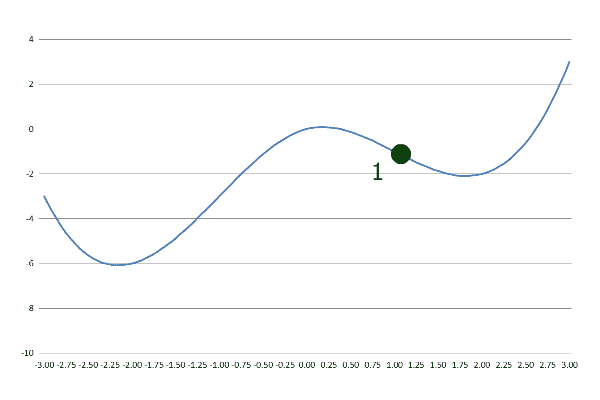

# Java 中的梯度下降

> 原文：<https://web.archive.org/web/20220930061024/https://www.baeldung.com/java-gradient-descent>

## 1.介绍

在本教程中，我们将学习[梯度下降](/web/20220802081127/https://www.baeldung.com/cs/understanding-gradient-descent)算法。我们将用 Java 实现这个算法，并一步一步地演示它。

## 2.什么是梯度下降？

**梯度下降是一种优化算法，用于寻找给定函数的局部最小值。**它广泛用于高级机器学习算法中，以最小化损失函数。

Gradient 是坡度的另一种说法，descent 是向下的意思。顾名思义，梯度下降就是沿着一个函数的斜率下降，直到到达终点。

## 3.梯度下降的性质

**梯度下降找到一个局部最小值，它可以不同于全局最小值。**起始局部点作为算法的参数给出。

**这是一个迭代算法**，在每一步中，它都试图沿着斜坡向下移动，越来越接近局部最小值。

**实际上，算法是回溯**。我们将在本教程中演示和实现回溯梯度下降。

## 4.一步一步的说明

梯度下降需要一个函数和一个起点作为输入。让我们定义并绘制一个函数:

 

我们可以从任何想要的点开始。让我们从`x` =1 开始:

在第一步中，梯度下降以预定义的步长下坡:

接下来，它以相同的步长走得更远。然而，这一次它结束于比上一步更大的`y`:

这表明算法已经通过了局部最小值，因此它以较低的步长后退:

随后，每当当前的`y`大于先前的`y`时，步长被降低并被取消。迭代继续进行，直到达到期望的精度。

正如我们所看到的，梯度下降在这里找到了一个局部最小值，但它不是全局最小值。如果我们从`x` =-1 而不是`x` =1 开始，就会找到全局最小值。

## 5.用 Java 实现

有几种方法可以实现梯度下降。这里我们不计算函数的导数来寻找斜率的方向，所以我们的实现也适用于不可微的函数。

让我们定义`precision`和`stepCoefficient`并给它们初始值:

[PRE0]

第一步，我们没有之前的`y`做对比。我们可以增加或减少`x`的值，看看`y`是降低还是升高。正值`stepCoefficient`意味着我们正在增加`x`的值。

现在让我们执行第一步:

[PRE1]

在上面的代码中，`f`是一个`Function<Double, Double>`，`initialX`是一个`double`，两者都是作为输入提供的。

另一个要考虑的要点是梯度下降并不保证收敛。为了避免陷入循环，我们来限制迭代次数:

[PRE2]

稍后，我们将在每次迭代中把`iter`减 1。因此，我们将在最多 100 次迭代后退出循环。

现在我们有了一个`previousX`，我们可以设置我们的循环:

[PRE3]

在每次迭代中，我们计算新的`y`，并与之前的`y`进行比较。如果`currentY`大于`previousY`，我们改变方向并减小步长。

循环继续，直到我们的步长小于期望的`precision`。最后，我们可以返回`currentX`作为局部最小值:

[PRE4]

## 6.结论

在本文中，我们一步一步地演示了梯度下降算法。

我们还在 Java 中实现了梯度下降。代码可以在 GitHub 上的[处获得。](https://web.archive.org/web/20220802081127/https://github.com/eugenp/tutorials/tree/master/algorithms-modules/algorithms-miscellaneous-6)