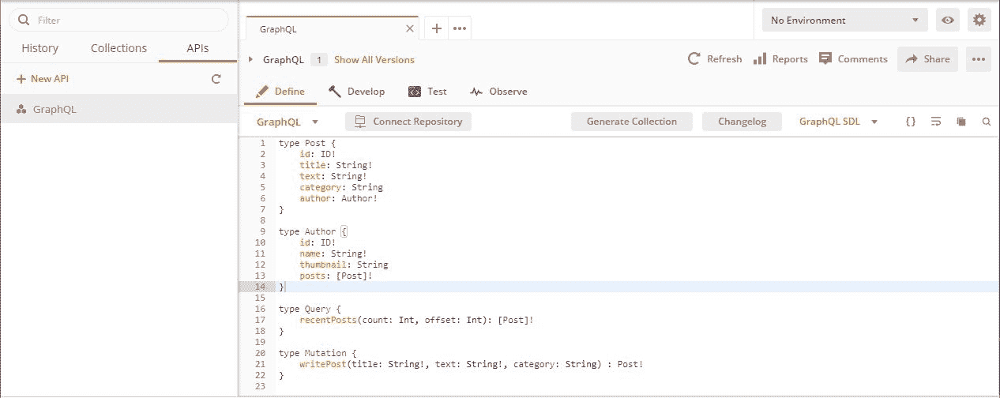
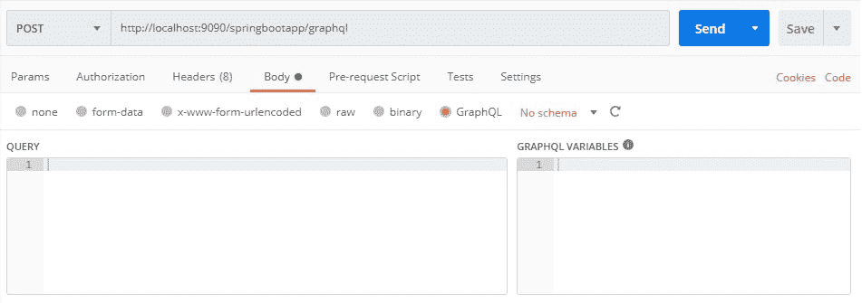

# 如何使用 Postman 测试 GraphQL

> 原文:[https://web . archive . org/web/20220930061024/https://www . bael dung . com/graph QL-postman](https://web.archive.org/web/20220930061024/https://www.baeldung.com/graphql-postman)

## 1.概观

在这个简短的教程中，我们将展示如何使用 Postman 测试 GraphQL 端点。

## 2.模式概述和方法

我们将使用在我们的 [GraphQL](/web/20221129021102/https://www.baeldung.com/spring-graphql) 教程中创建的端点。提醒一下，模式包含描述文章和作者的定义:

```
type Post {
    id: ID!
    title: String!
    text: String!
    category: String
    author: Author!
}

type Author {
    id: ID!
    name: String!
    thumbnail: String
    posts: [Post]!
}
```

此外，我们还有显示帖子和撰写新帖子的方法:

```
type Query {
    recentPosts(count: Int, offset: Int): [Post]!
}

type Mutation {
    createPost(title: String!, text: String!, category: String) : Post!
}
```

当使用变异保存数据时，**必填字段标有感叹号**。还要注意，在我们的`Mutation`中，返回的类型是`Post`，但是在`Query,`中，我们将得到一个`Post`对象的列表。

上述模式可以在 Postman API 部分加载—只需添加**类型为`GraphQL `的新 API** ，并按**生成集合**:

[](/web/20221129021102/https://www.baeldung.com/wp-content/uploads/2020/04/graphql_schema_generator-1.jpg)

一旦我们加载了我们的模式，我们就可以使用 Postman 对 GraphQL 的自动完成支持来轻松地编写示例查询。

## 3.邮递员中的 GraphQL 请求

首先，Postman 允许我们以 GraphQL 格式发送**正文——我们只需选择下面的 GraphQL 选项:**

[](/web/20221129021102/https://www.baeldung.com/wp-content/uploads/2020/04/GraphQL-1.jpg)

然后，我们可以编写一个原生的 GraphQL 查询，比如将`title`、`category`和作者`name` 放入查询部分:

```
query {
    recentPosts(count: 1, offset: 0) {
        title
        category
        author {
            name
        }
    }
}
```

结果，我们会得到:

```
{
    "data": {
        "recentPosts": [
            {
                "title": "Post",
                "category": "test",
                "author": {
                    "name": "Author 0"
                }
            }
        ]
    }
}
```

也有可能**使用原始格式**发送请求，但是我们必须将`Content-Type: application/graphql`添加到 headers 部分。在这种情况下，身体看起来是一样的。

例如，我们可以更新*标题、文本、* *类别、*得到一个`id`和`title`作为响应:

```
mutation {
    createPost (
        title: "Post", 
        text: "test", 
        category: "test",
    ) {
        id
        title
    }
}
```

只要我们使用简写语法，操作类型——如`query`和`mutation`——可以从查询体中省略。在这种情况下，我们不能使用操作的名称和变量，但是建议使用操作名称，以便于日志记录和调试。

## 4.使用变量

在 variables 部分，我们可以创建一个 JSON 格式的模式，为变量赋值。这避免了在查询字符串中键入参数:

[](/web/20221129021102/https://www.baeldung.com/wp-content/uploads/2020/04/graphql-variables-1.jpg)

因此，我们可以修改查询部分中的`recentPosts `主体，以动态分配变量的值:

```
query recentPosts ($count: Int, $offset: Int) {
    recentPosts (count: $count, offset: $offset) {
        id
        title
        text
        category
    }
}
```

我们可以编辑 GRAPHQL 变量部分，将变量设置为:

```
{
  "count": 1,
  "offset": 0
}
```

## 5.摘要

我们可以使用 Postman 轻松测试 GraphQL，它还允许我们导入模式并生成查询。

在 GitHub 上可以找到一个请求集合[。](https://web.archive.org/web/20221129021102/https://github.com/eugenp/tutorials/tree/master/spring-boot-modules/spring-boot-graphql)