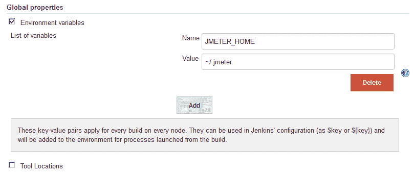
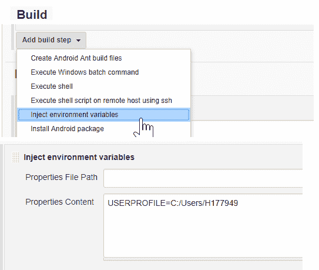

# 如何在 Jenkins 中设置环境变量？

> 原文：<https://web.archive.org/web/20220930061024/https://www.baeldung.com/ops/jenkins-environment-variables>

## 1.介绍

在本教程中，我们将展示在 [Jenkins](https://web.archive.org/web/20221110183239/https://jenkins.io/) 中设置和使用环境变量的不同方式。

要了解更多关于 Jenkins 和 Pipelines 的信息，请参考我们的[Jenkins 简介](/web/20221110183239/https://www.baeldung.com/jenkins-pipelines)。

## 2.全局属性

我们可以通过导航到“管理 Jenkins ->配置系统->全局属性选项”来设置全局属性。

让我们首先选中“环境变量”复选框，然后在“变量列表”部分添加变量及其各自的值:

[](/web/20221110183239/https://www.baeldung.com/wp-content/uploads/2020/05/Jenkins-environment-variables-global-properties.png)

这是设置环境变量的最简单和最少干扰的方法之一。

## 3.`Jenkinsfile`

我们可以通过在我们的`Jenkinsfile`的**环境指令中声明环境变量来全局设置它们。
**

让我们看看如何设置两个变量，`DISABLE_AUTH`和`DB_ENGINE`:

```
Jenkinsfile (Declarative Pipeline)
pipeline {
    //Setting the environment variables DISABLE_AUTH and DB_ENGINE
    environment {
        DISABLE_AUTH = 'true'
        DB_ENGINE    = 'mysql'
    }

}
```

这种在 Jenkins 文件中定义变量的方法对于指导脚本很有用；例如，生成文件。

## 4.`EnvInject`

我们可以安装并使用 [EnvInject 插件](https://web.archive.org/web/20221110183239/https://wiki.jenkins-ci.org/display/JENKINS/EnvInject+Plugin)在构建启动时注入环境变量。

在构建配置窗口中，我们选择“添加构建步骤”组合框中的“注入环境变量”选项。

然后，我们可以在属性内容文本框中添加所需的环境变量。

例如，我们可以指定用户配置文件:

## [](/web/20221110183239/https://www.baeldung.com/wp-content/uploads/2020/05/Inject-Environment-Variables.png)

## 5.使用

现在，我们可以通过将名称括在`${}`中来使用我们的任何环境变量:

```
echo "Database engine is ${DB_ENGINE}"
```

## 6.结论

在本文中，我们看到了如何在 Jenkins 中设置和使用环境变量。