# 秋田犬的春天安全

> 原文：<https://web.archive.org/web/20220930061024/https://www.baeldung.com/spring-security-okta>

## 1.概观

Okta 为 web、移动或 API 服务提供认证、授权和社交登录等功能。此外，它对 Spring 框架有强大的**支持，使得集成变得非常简单。**

既然 **[Stormpath](https://web.archive.org/web/20220628161334/https://stormpath.com/) 已经与 Okta 联手为开发者提供更好的身份 APIs】，它现在是一种在 web 应用程序中启用身份验证的流行方式。**

在本教程中，我们将探索 Okta 的 Spring 安全性以及 Okta 开发者帐户的最小化设置。

## 2.建立 Okta

### 2.1.开发者帐户注册

首先，我们将 **[注册一个免费的 Okta 开发者账户](https://web.archive.org/web/20220628161334/https://developer.okta.com/signup/)，该账户为每月多达 1k 的活跃用户提供访问**。但是，如果我们已经有了一个，我们可以跳过这一部分:

[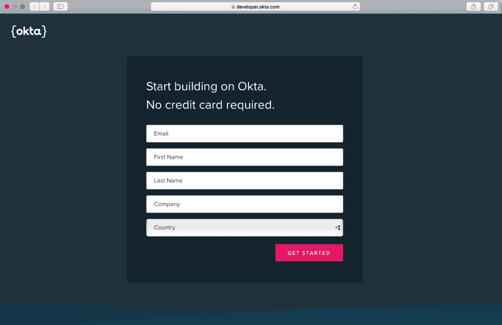](/web/20220628161334/https://www.baeldung.com/wp-content/uploads/2020/05/Screen-Shot-2020-04-30-at-11.52.36-AM.png)

### 2.2.仪表盘

登录 Okta 开发者账户后，我们将进入仪表板屏幕，向我们简要介绍用户数量、认证和失败登录。

此外，它还显示系统的详细日志条目:

[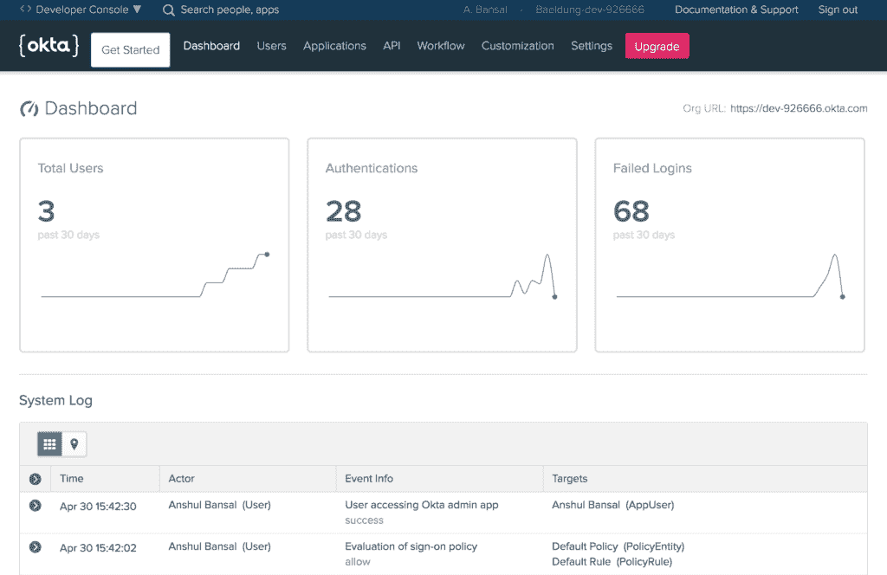](/web/20220628161334/https://www.baeldung.com/wp-content/uploads/2020/05/Screen-Shot-2020-04-30-at-3.48.49-PM.png)

此外，我们将注意到仪表板右上角的`Org URL`，这是我们稍后将创建的 [Spring Boot 应用程序](/web/20220628161334/https://www.baeldung.com/spring-boot-start)中 Okta 设置所需的。

### 2.3.创建新的应用程序

然后，让我们使用应用程序菜单创建一个新的应用程序，为 Spring Boot 创建 [OpenID Connect (OIDC)应用程序。](/web/20220628161334/https://www.baeldung.com/spring-security-openid-connect)

此外，我们将从`Native`、`Single-Page App`和`Service`、等可用选项中选择 **`Web`平台:**

[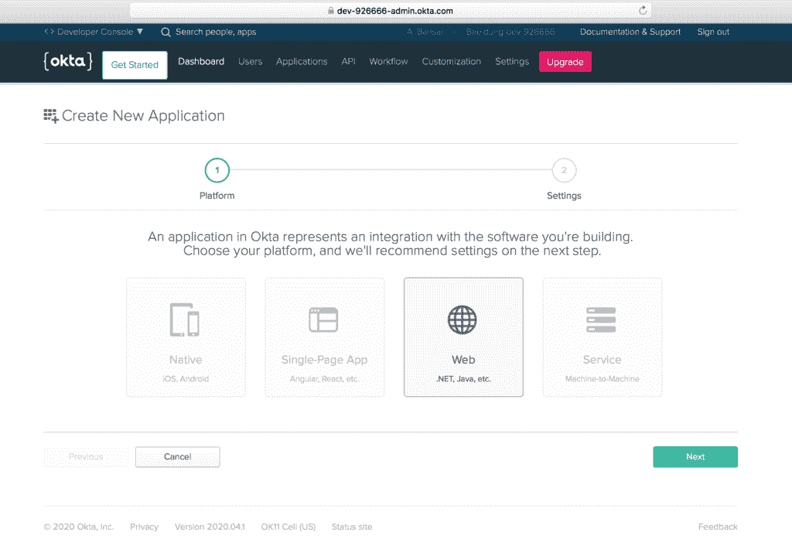](/web/20220628161334/https://www.baeldung.com/wp-content/uploads/2020/05/Screen-Shot-2020-04-30-at-11.58.42-AM.png)

### 2.4.应用程序设置

接下来，让我们配置一些应用程序设置，如指向我们应用程序的`Base URIs`和`Login redirect URIs` :

[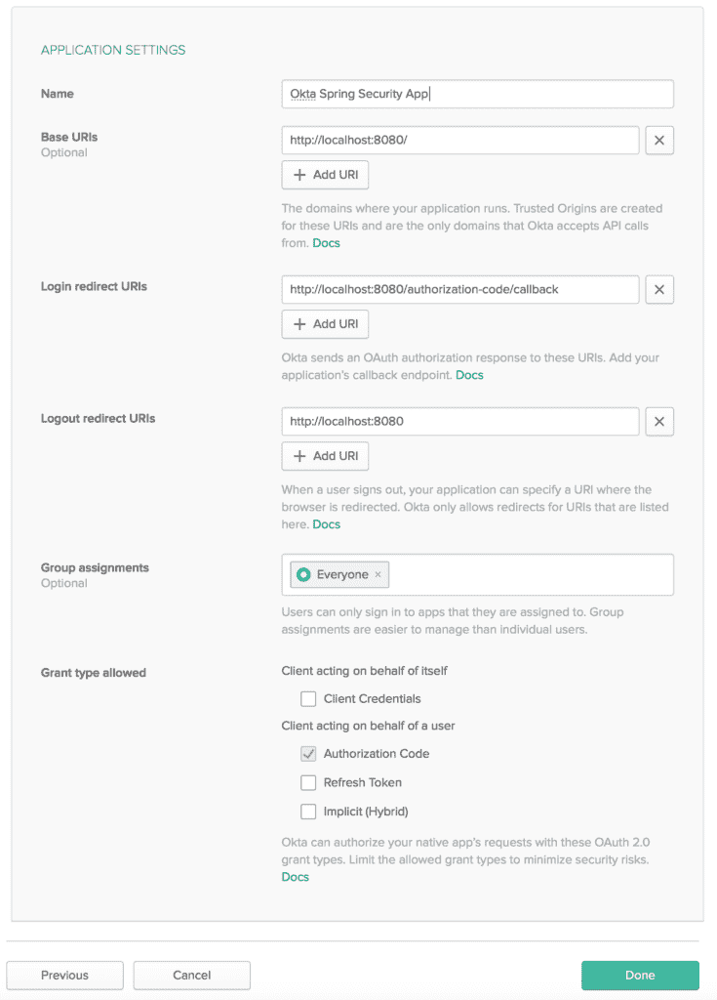](/web/20220628161334/https://www.baeldung.com/wp-content/uploads/2020/05/Screen-Shot-2020-04-30-at-12.08.56-PM.png)

此外，确保**为 web 应用程序启用 [OAuth2 认证](/web/20220628161334/https://www.baeldung.com/spring-security-5-oauth2-login)所需的** `**Grant type allowed**,`标记`Authorization code`。

### 2.5.客户端凭据

然后，我们将获得与我们的应用程序相关联的`Client ID`和`Client secret` 的值:

[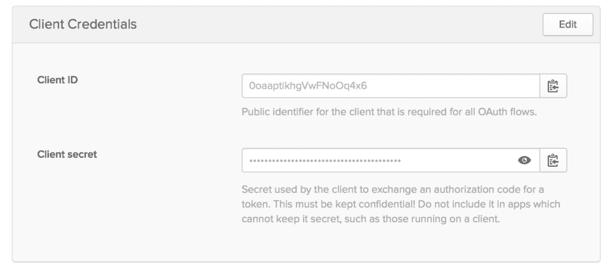](/web/20220628161334/https://www.baeldung.com/wp-content/uploads/2020/05/Screen-Shot-2020-04-30-at-12.10.59-PM.png)

请准备好这些凭证，因为 Okta 设置需要它们。

## 3.Spring Boot 应用程序设置

现在我们的 Okta 开发者账户已经准备好了基本配置，我们准备将 Okta 安全支持集成到 Spring Boot 应用中。

### 3.1.专家

首先，让我们将最新的`[okta-spring-boot-starter](https://web.archive.org/web/20220628161334/https://search.maven.org/search?q=g:com.okta.spring%20AND%20a:okta-spring-boot-starter)` Maven 依赖项添加到我们的`pom.xml`中:

[PRE0]

### 3.2\. Gradle

类似地，当使用 Gradle 时，我们可以在`build.gradle`中添加`okta-spring-boot-starter` 依赖项:

[PRE1]

### 3.3.`application.properties`

然后，我们将在`application.properties`中配置 Okta oauth2 属性:

[PRE2]

在这里，我们可以**使用`default`授权服务器(如果没有的话)来访问指向 [`{orgURL}/oauth2/default`](https://web.archive.org/web/20220628161334/https://{youroktadomain}/oauth2/default) 的`issuer` URL** 。

此外，我们可以使用`API`菜单在 Okta 开发者帐户中创建一个新的授权服务器:

[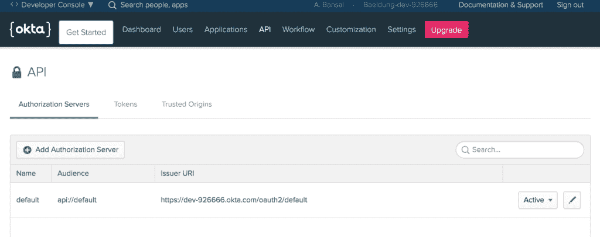](/web/20220628161334/https://www.baeldung.com/wp-content/uploads/2020/05/Screen-Shot-2020-05-02-at-8.21.07-PM.png)

然后，我们将添加在前面部分生成的 Okta 应用程序的`Client Id`和`Client secret`。

最后，我们已经配置了与应用程序设置中设置的相同的`redirect-uri`。

## 4.`HomeController`

之后，让我们创建`HomeController`类:

[PRE3]

这里，我们添加了带有`Base Uri` (/)映射的`home`方法，在应用程序设置中配置。

还有，`home`方法的参数是 [Spring Security 提供的](/web/20220628161334/https://www.baeldung.com/spring-security-openid-connect#1-accessing-user-information) [`OidcUser`](https://web.archive.org/web/20220628161334/https://docs.spring.io/spring-security/site/docs/current/api/org/springframework/security/oauth2/core/oidc/user/OidcUser.html) 类的一个实例，用于访问用户信息。

就是这样！我们的 Spring Boot 应用程序已经准备好了 Okta 安全支持。让我们使用 Maven 命令运行我们的应用程序:

[PRE4]

在`[localhost:8080](https://web.archive.org/web/20220628161334/http://localhost:8080/),`访问应用程序时，我们会看到 Okta 提供的默认登录页面:

[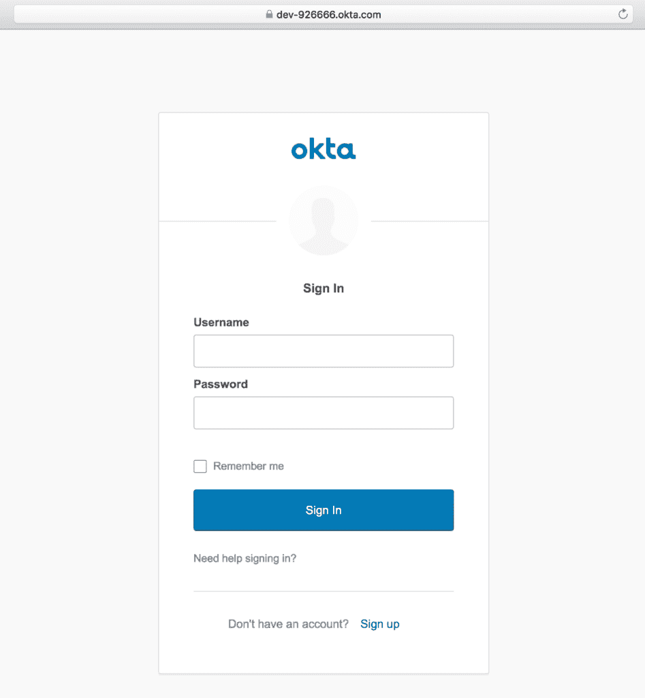](/web/20220628161334/https://www.baeldung.com/wp-content/uploads/2020/05/Screen-Shot-2020-05-01-at-6.54.18-PM.png)

使用注册用户的凭据登录后，将显示一条欢迎消息，其中包含用户的全名:

此外，我们会在默认登录屏幕的底部找到一个“注册”链接，用于自行注册。

## 5.签约雇用

### 5.1.自行注册

第一次，我们可以使用“注册”链接创建一个 Okta 帐户，然后提供电子邮件、名字和姓氏等信息:

[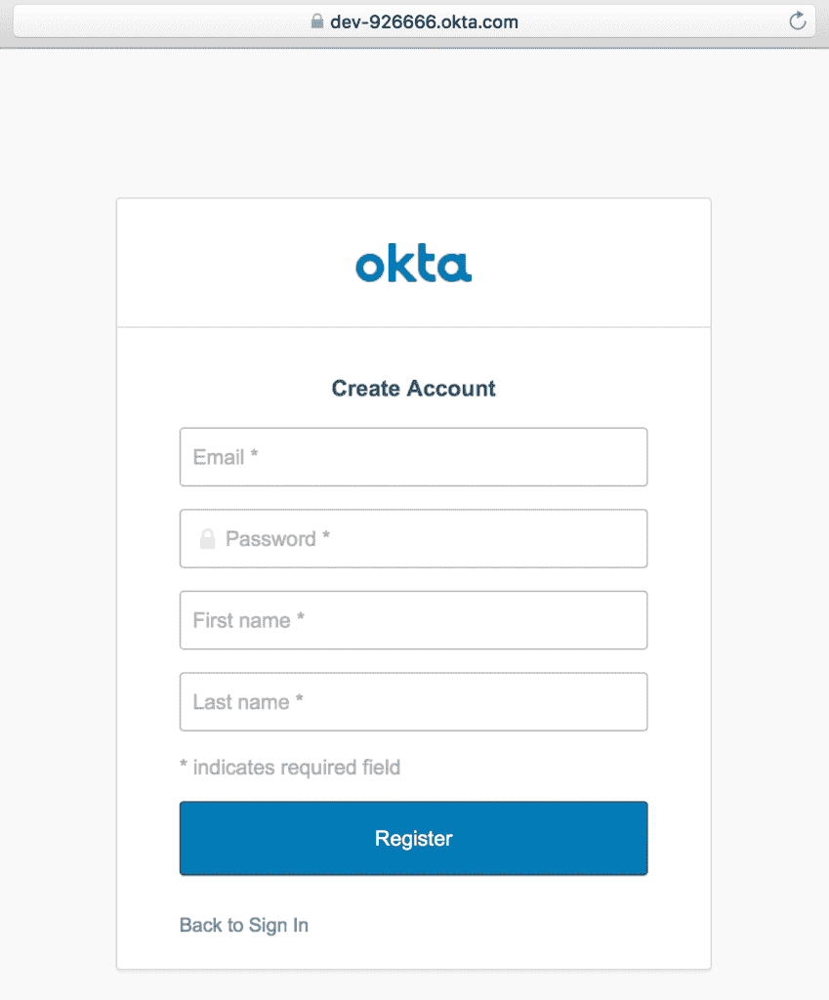](/web/20220628161334/https://www.baeldung.com/wp-content/uploads/2020/05/Screen-Shot-2020-05-03-at-12.06.36-PM.png)

### 5.2.创建用户

或者，我们可以在 Okta 开发者账户的`Users`菜单中创建一个新用户:

[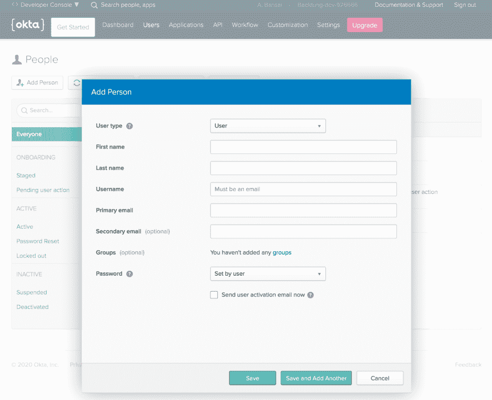](/web/20220628161334/https://www.baeldung.com/wp-content/uploads/2020/05/Screen-Shot-2020-05-03-at-12.04.33-PM.png)

### 5.3.自助注册设置

此外，可以在 Okta 开发者账户的`Users`菜单中配置注册设置:

[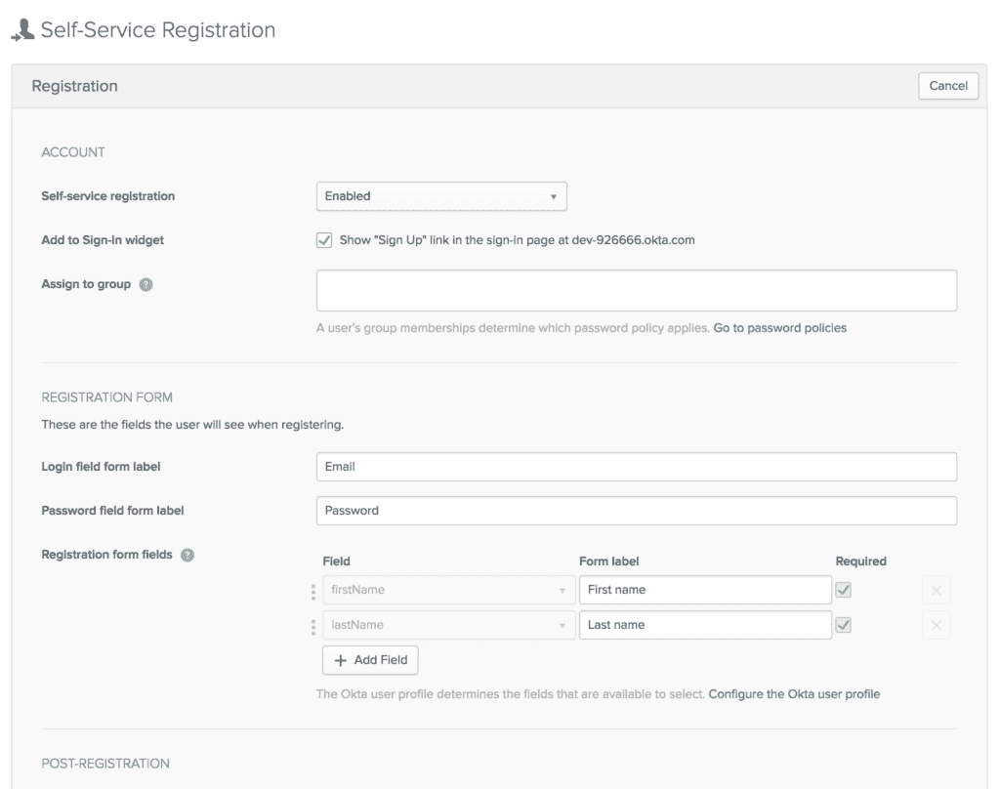](/web/20220628161334/https://www.baeldung.com/wp-content/uploads/2020/05/Screen-Shot-2020-05-03-at-12.05.47-PM.png)

## 6.Okta Spring SDK

既然我们已经看到了 Spring Boot 应用程序中的 Okta 安全集成，让我们在同一个应用程序中与 Okta 管理 API 进行交互。

首先，我们应该使用 Okta 开发者帐户中的`API`菜单创建一个`Token`:

[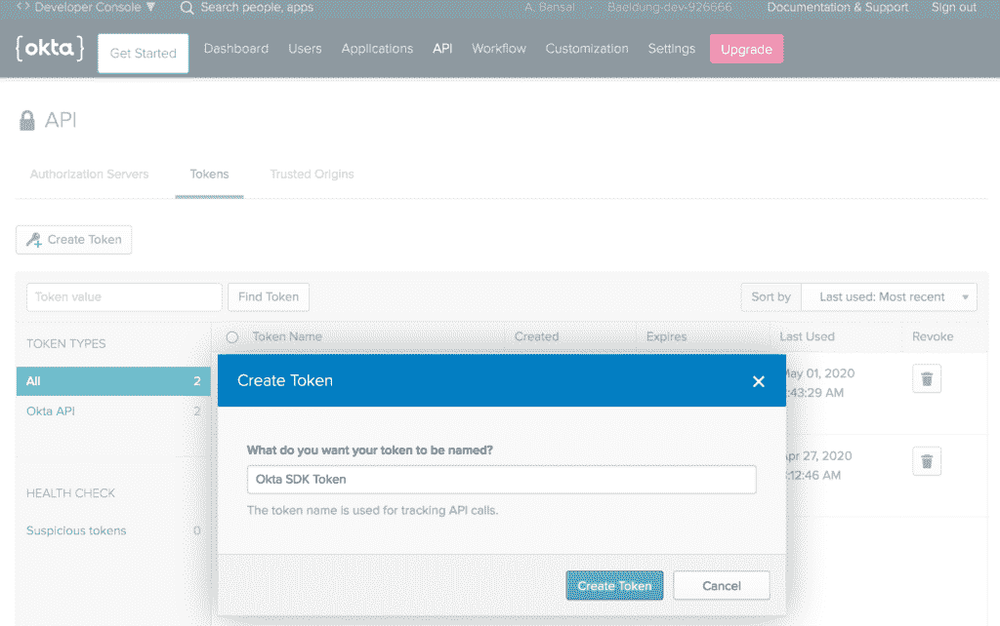](/web/20220628161334/https://www.baeldung.com/wp-content/uploads/2020/05/Screen-Shot-2020-05-01-at-6.23.53-PM.png)

确保**记下`Token`，因为它在生成**后只显示一次。然后，为了保护我们，它会被存储为一个哈希。

### 6.1.设置

然后，让我们将最新的 [`okta-spring-sdk`](https://web.archive.org/web/20220628161334/https://search.maven.org/search?q=g:com.okta.spring%20a:okta-spring-sdk) Maven 依赖添加到我们的`pom.xml`:

[PRE5]

### 6.2.`application.properties`

接下来，我们将添加一些基本的 Okta 客户端属性:

[PRE6]

这里，我们添加了上一节中提到的令牌。

### 6.3.`AdminController`

最后，让我们创建`AdminController`，注入 [`Client`](https://web.archive.org/web/20220628161334/https://developer.okta.com/okta-sdk-java/apidocs/index.html?com/okta/sdk/client/Client.html) 实例:

[PRE7]

就是这样！我们准备调用`Client`实例上的方法向 Okta API 发出请求。

### 6.4.列出用户

让我们创建`getUsers`方法来获取我们组织中所有用户的列表，使用`listUsers`方法返回一个 [`UserList`](https://web.archive.org/web/20220628161334/https://developer.okta.com/okta-sdk-java/apidocs/com/okta/sdk/resource/user/UserList.html) 对象:

[PRE8]

之后，我们可以访问 [`localhost:8080/users`](https://web.archive.org/web/20220628161334/http://localhost:8080/users) 来接收包含所有用户的 JSON 响应:

[PRE9]

### 6.5.搜索用户

类似地，我们可以使用`firstName`、`lastName`或`email`作为查询参数，通过**来过滤用户:**

[PRE10]

让我们使用`[localhost:8080/[email protected]](https://web.archive.org/web/20220628161334/http://localhost:8080/user?query=ansh@bans.com)`通过`email`来搜索用户:

[PRE11]

### 6.6.创造用户

同样，我们可以使用 [`UserBuilder`](https://web.archive.org/web/20220628161334/https://developer.okta.com/okta-sdk-java/apidocs/com/okta/sdk/resource/user/UserBuilder.html) 界面的`instance`方法创建一个新用户:

[PRE12]

因此，让我们访问 [`localhost:8080/createUser`](https://web.archive.org/web/20220628161334/http://localhost:8080/createUser) 并验证新用户的详细信息:

[PRE13]

类似地，我们可以执行**一系列操作，比如列出所有应用程序、创建应用程序、列出所有组以及创建组**。

## 7.结论

在这个快速教程中，我们探索了 Okta 的春季安全性。

首先，我们用基本配置设置 Okta 开发者账户。然后，我们创建了一个 Spring Boot 应用程序，并配置了与 Okta 进行 Spring 安全集成的`application.properties`。

接下来，我们集成了 Okta Spring SDK 来管理 Okta API。最后，我们研究了列出所有用户、搜索用户和创建用户等特性。

像往常一样，所有的代码实现都可以在 GitHub 上获得[。](https://web.archive.org/web/20220628161334/https://github.com/eugenp/tutorials/tree/master/spring-security-modules/spring-security-okta)