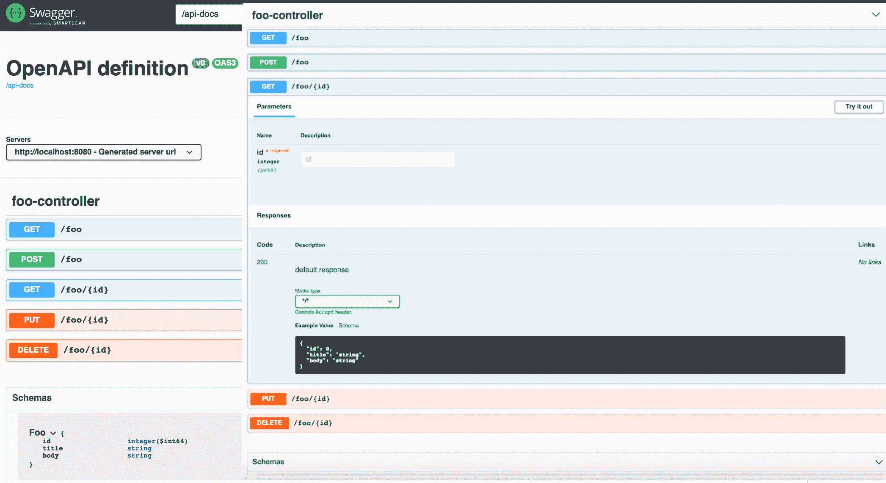

# Spring REST 文档与 OpenAPI

> 原文：<https://web.archive.org/web/20220930061024/https://www.baeldung.com/spring-rest-docs-vs-openapi>

## 1.概观

**[Spring REST Docs](https://web.archive.org/web/20221129001819/https://docs.spring.io/spring-restdocs/docs/2.0.2.RELEASE/reference/html5/#introduction) 和 [OpenAPI 3.0](https://web.archive.org/web/20221129001819/http://spec.openapis.org/oas/v3.0.3) 是为 REST API 创建 API 文档**的两种方式。

在本教程中，我们将检查它们的相对优势和劣势。

## 2.起源的简要概述

Spring REST Docs 是由 Spring 社区开发的一个框架，目的是为 RESTful APIs 创建准确的文档。**它采用测试驱动的方法，**其中文档要么被写成 Spring MVC 测试，Spring Webflux 的`WebTestClient,`或者放心。

运行测试的输出被创建为 [AsciiDoc](https://web.archive.org/web/20221129001819/http://asciidoc.org/) 文件，可以使用 [Asciidoctor](https://web.archive.org/web/20221129001819/https://asciidoctor.org/) 将这些文件放在一起，以生成描述我们的 API 的 HTML 页面。**由于它遵循 TDD 方法，Spring REST Docs 自动带来了它的所有优势**，比如更少的易错代码、减少的返工、更快的反馈周期等等。

[OpenAPI](/web/20221129001819/https://www.baeldung.com/spring-rest-openapi-documentation) 则是脱胎于 Swagger 2.0 的规范。在撰写本文时，它的最新版本是 3.0，有许多已知的[实现](https://web.archive.org/web/20221129001819/https://github.com/OAI/OpenAPI-Specification/blob/master/IMPLEMENTATIONS.md)。

和其他任何规范一样，OpenAPI 为其实现提供了一些基本规则。简单地说，所有的 **OpenAPI 实现都应该以 JSON 或 YAML 格式**将文档生成为 JSON 对象。

还有许多工具接受这个 JSON/YAML，并给出一个 UI 来可视化和导航 API。例如，这在验收测试中很方便。在我们这里的代码示例中，我们将使用`[springdoc](https://web.archive.org/web/20221129001819/https://springdoc.org/)`——Spring Boot 的 OpenAPI 3 库。

在详细查看这两者之前，让我们快速设置一个要记录的 API。

## 3.REST API

让我们用 Spring Boot 组装一个基本的 CRUD API。

### 3.1.仓库

这里，我们将使用的存储库是一个基本的`PagingAndSortingRepository`接口，模型为`Foo`:

[PRE0]

我们还将使用一个`schema.sql`和一个`data.sql`来[加载存储库](/web/20221129001819/https://www.baeldung.com/spring-boot-data-sql-and-schema-sql)。

### 3.2.控制器

接下来，让我们看看控制器，为了简洁起见，跳过它的实现细节:

[PRE1]

### 3.3.应用程序

最后，启动应用程序:

[PRE2]

## 4.OpenAPI / Springdoc

现在让我们看看`springdoc`如何向我们的`Foo` REST API 添加文档。

回想一下**，它将生成一个 JSON 对象和基于该对象**的 API 的 UI 可视化。

### 4.1.基本用户界面

首先，我们将只添加几个 Maven 依赖项——`[springdoc-openapi-data-rest](https://web.archive.org/web/20221129001819/https://mvnrepository.com/artifact/org.springdoc/springdoc-openapi-data-rest)`用于生成 JSON，以及 [`springdoc-openapi-ui`](https://web.archive.org/web/20221129001819/https://mvnrepository.com/artifact/org.springdoc/springdoc-openapi-ui) 用于呈现 UI。

该工具将为我们的 API 自省代码，并读取控制器方法的注释。在此基础上，它将生成 API JSON，并在 [`http://localhost:8080/api-docs/`](https://web.archive.org/web/20221129001819/http://localhost:8080/api-docs/) 运行。它还将在`[http://localhost:8080/swagger-ui-custom.html](https://web.archive.org/web/20221129001819/http://localhost:8080/swagger-ui-custom.html)`提供一个基本的用户界面:

正如我们所看到的，在没有添加任何代码的情况下，我们获得了 API 的漂亮可视化，一直到`Foo`模式。使用`Try it out`按钮，我们甚至可以执行操作并查看结果。

现在，**如果我们想在 API 中添加一些真正的文档会怎么样？**关于 API 是什么，它的所有操作意味着什么，应该输入什么，以及期待什么样的响应？

我们将在下一节中讨论这一点。

### 4.2.详细用户界面

让我们首先看看如何向 API 添加一个通用描述。

为此，我们将在引导应用程序中添加一个`OpenAPI` bean:

[PRE3]

接下来，为了给我们的 API 操作添加一些信息，我们将用一些特定于 OpenAPI 的注释来修饰我们的映射。

让我们看看如何描述`getFooById.`我们将在另一个控制器`FooBarController`中这样做，它类似于我们的`FooController`:

[PRE4]

现在让我们看看对用户界面的影响:

因此，有了这些最小的配置，我们的 API 的用户现在可以看到它是关于什么的，如何使用它，以及预期的结果。我们所要做的就是编译代码并运行引导程序。

## 5.春假文件

REST docs 完全不同于 API 文档。如前所述，该过程是测试驱动的，输出是静态 HTML 页面的形式。

在我们的例子中，**我们将使用 [Spring MVC 测试](/web/20221129001819/https://www.baeldung.com/integration-testing-in-spring)来创建文档片段**。

首先，我们需要将`[spring-restdocs-mockmvc](https://web.archive.org/web/20221129001819/https://mvnrepository.com/artifact/org.springframework.restdocs/spring-restdocs-mockmvc)`依赖项和 [`asciidoc` Maven 插件](/web/20221129001819/https://www.baeldung.com/spring-rest-docs#asciidocs)添加到我们的`pom`中。

### 5.1.六月五日考试

现在让我们看看 JUnit5 测试，其中包括我们的文档:

[PRE5]

}

在运行这个测试之后，我们在我们的`targets/generated-snippets`目录中获得了几个文件，这些文件包含了关于给定 API 操作的信息。特别是，`whenGetFooById_thenSuccessful`将在目录的一个`getAFoo`文件夹中给我们八个`adoc`。

这里有一个示例`http-response.adoc`，当然包含响应体:

[PRE6]

### 5.2.`fooapi.adoc`

现在我们需要一个主文件，将所有这些片段编织在一起，形成一个结构良好的 HTML。

姑且称之为`fooapi.adoc`看一小部分:

[PRE7]

**执行`asciidoctor-maven-plugin`后，我们在`target/generated-docs`文件夹**中得到最终的 HTML 文件`fooapi.html`。

这是它在浏览器中打开时的样子:

## 6.关键要点

既然我们已经看了这两种实现，让我们总结一下它们的优点和缺点。

有了`springdoc`，**，我们不得不使用的注释使我们的 rest 控制器的代码变得混乱，降低了它的可读性**。此外，文档与代码紧密耦合，并且将进入生产环境。

不用说，维护文档是另一个挑战——如果 API 中的某些内容发生了变化，程序员会记得更新相应的 OpenAPI 注释吗？

另一方面， **REST Docs 既不像其他 UI 那样吸引人，也不能用于验收测试**。但是它有它的优点。

值得注意的是，Spring MVC 测试的成功完成不仅给了我们代码片段，也像其他单元测试一样验证了我们的 API。这迫使我们根据 API 修改(如果有的话)对文档进行修改。此外，文档代码与实现完全分离。

但是，另一方面，**我们不得不编写更多的代码来生成文档**。首先，测试本身可以说和 OpenAPI 注释一样冗长，其次，主测试`adoc`。

它还需要更多的步骤来生成最终的 HTML——首先运行测试，然后运行插件。仅要求我们运行启动应用程序。

## 7.结论

在本教程中，我们看了基于 OpenAPI 的`springdoc`和 Spring REST 文档之间的区别。我们还看到了如何实现这两者来生成基本 CRUD API 的文档。

总之，两者各有利弊，决定使用哪一个取决于我们的具体要求。

和往常一样，源代码可以在 GitHub 上找到[。](https://web.archive.org/web/20221129001819/https://github.com/eugenp/tutorials/tree/master/spring-boot-modules/spring-boot-springdoc)