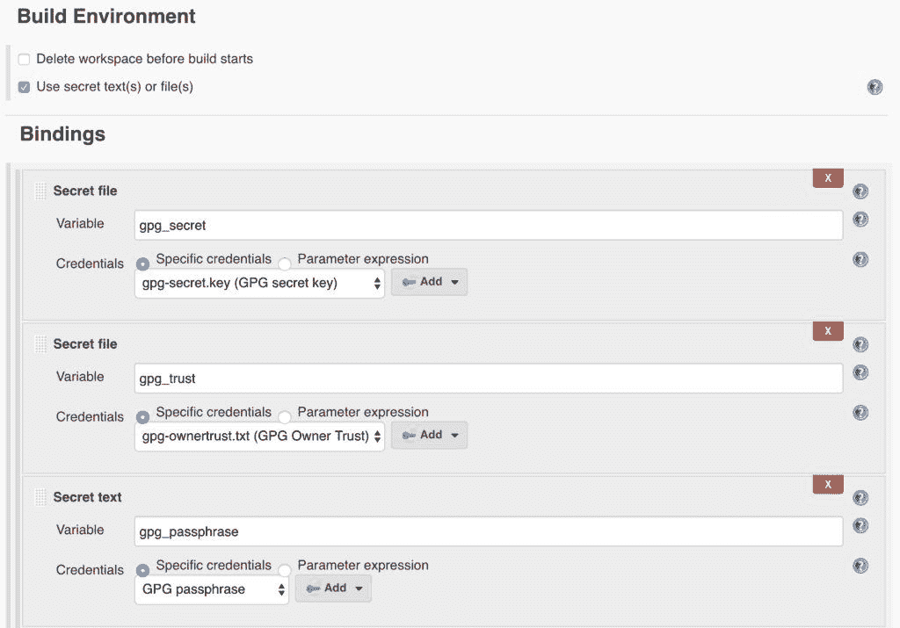

# 如何在 Jenkins 中注入 Git 秘密

> 原文:[https://web . archive . org/web/20220930061024/https://www . bael dung . com/ops/Jenkins-inject-git-secrets](https://web.archive.org/web/20220930061024/https://www.baeldung.com/ops/jenkins-inject-git-secrets)

## 1.介绍

Jenkins 是一个自动化软件构建和交付的优秀工具，尤其是在使用 T2 git 进行软件配置管理的时候。**然而，使用 Jenkins 时的一个常见问题是如何处理敏感数据，如密码或令牌**。

在本教程中，我们将看看如何安全地将 git 秘密注入 Jenkins 管道和作业。

## 2.Git 秘密

首先，我们将首先看看如何生成 git 秘密。

### 2.1.创建 GPG 键

因为 git 秘密使用 GPG 密钥，我们必须首先确保我们有一个有效的密钥可以使用:

```
$ gpg --gen-key
```

这将提示我们输入全名、电子邮件以及密码。请记住此密码，因为我们稍后配置 Jenkins 时会用到它。

这将在我们的主目录中创建一个公钥和私钥对，这足以开始创建秘密。稍后，我们将看到如何导出供 Jenkins 使用的密钥。

### 2.2.初始化机密

git-secret 实用程序是 git 的一个附件，可以在 git 存储库中存储敏感数据。这不仅是存储凭证的安全方式，而且我们还获得了 git 固有的版本控制和访问控制的好处。

要开始，我们必须首先[安装 git-secret 实用程序](https://web.archive.org/web/20220727020730/https://git-secret.io/installation)。注意，这不是大多数 git 发行版的一部分，必须单独安装。

安装后，我们可以初始化任何 git 存储库中的秘密:

```
$ git secret init
```

这类似于`git init`命令。它在存储库中创建了一个新的`.gitsecret`目录。

作为最佳实践，我们应该将`.gitignore`目录中的所有文件添加到源代码控制中，除了`random_seed`文件。**上面的 init 命令应该确保我们的`.gitignore`为我们**处理这件事，但是值得仔细检查。

接下来，我们需要向 git secret repo 密匙环添加一个用户:

```
$ git secret tell [[email protected]](/web/20220727020730/https://www.baeldung.com/cdn-cgi/l/email-protection)
```

我们现在准备在回购中存储秘密。

### 2.3.存储和检索机密

`git secret`命令通过加密 repo 中的特定文件来工作。这些文件被赋予了一个`.secret`扩展名，原始文件名被添加到`.gitignore`中，以防止它被提交到存储库中。

举个例子，假设我们想在一个名为`dbpassword.txt`的文件中存储数据库的密码。我们首先创建文件:

```
$ echo "Password123" > dbpassword.txt
```

现在我们加密文件:

```
$ git secret add dbpassword.txt
```

最后，我们必须使用`hide`命令提交秘密:

```
$ git secret hide
```

此时，我们应该提交我们的更改，以确保文件安全地存储在我们的 repo 中。这是使用标准 git 命令完成的:

```
$ git add .
$ git commit -m "Add encrypted DB password"
$ git push
```

请注意，未加密的文件在本地仍然可用。然而，它已经被 git 自动忽略了，所以我们不能意外地签入它。

为了证实这一点，如果我们要对存储库进行另一次签出，我们将看到以下内容:

```
$ ls
dbpassword.txt.secret
```

**注意，`.secret`文件的内容是加密的，无法读取**。在我们能阅读它们之前，我们必须解密文件:

```
$ git secret reveal -p <PASSPHRASE>
$ git secret cat dbpassword.txt
```

`PASSPHRASE`是我们在生成 GPG 密钥时使用的 GPG 密码。

## 3.与 Jenkins 一起使用 Git 秘密

我们现在已经看到了使用`git secret`存储和检索凭证所需的步骤。接下来，我们将看到如何与 Jenkins 一起使用加密的秘密。

### 3.1.创建凭据

首先，我们必须导出之前生成的 GPG 私钥:

```
$ gpg -a --export-secret-keys [[email protected]](/web/20220727020730/https://www.baeldung.com/cdn-cgi/l/email-protection) > gpg-secret.key
$ gpg --export-ownertrust > gpg-ownertrust.txt
```

保证这个私钥的安全是很重要的。千万不要分享或保存到公共场所。

接下来，我们需要将这个私钥存储在 Jenkins 内部。为此，我们将创建多个 Jenkins 凭证来存储我们刚刚导出的 GPG 私钥和信任存储。

首先，导航到`Credentials` > `System` > `Global Credentials`，点击`Add Credentials`。我们需要设置以下字段:

*   `Kind`:秘密文件
*   `File`:上传我们上面导出的`gpg-secret.key`
*   `ID` : gpg-secret
*   `Description` : GPG 秘钥

[](/web/20220727020730/https://www.baeldung.com/wp-content/uploads/2020/05/git-secret-jenkins-secret-key.jpg)

保存凭据，并为信任存储文件创建另一个凭据:

*   `Kind`:秘密文件
*   `File`:上传我们上面导出的`gpg-ownertrust.txt`
*   `ID` : gpg-ownertrust
*   `Description` : GPG 业主信托

[](/web/20220727020730/https://www.baeldung.com/wp-content/uploads/2020/05/git-secret-jenkins-owner-trust-scaled.jpg)

保存凭据并为 GPG 密码创建最终凭据:

*   `Kind`:秘密文本
*   `Text` : <用于生成 GPG 密钥的密码>
*   `ID`:gpg-密码短语
*   `Description` : GPG 密码

[](/web/20220727020730/https://www.baeldung.com/wp-content/uploads/2020/05/git-secret-jenkins-passphrase-scaled-1.jpg)

### 3.2.在管道中使用凭据

现在我们有了作为凭证的 GPG 密钥，我们可以创建或修改一个 Jenkins 管道来使用这个密钥。记住**我们必须在 Jenkins 代理**上安装 git-secret 工具，这样才能工作。

为了访问管道中的加密数据，我们必须向管道脚本添加一些内容。

首先，我们添加一个`environment`声明:

```
environment {
    gpg_secret = credentials("gpg-secret")
    gpg_trust = credentials("gpg-ownertrust")
    gpg_passphrase = credentials("gpg-passphrase")
}
```

这使得我们之前创建的三个凭证可用于后续的管道阶段。

接下来，我们将 GPG 密钥和信任导入本地代理环境:

```
steps {
    sh """
        gpg --batch --import $gpg_secret
        gpg --import-ownertrust $gpg_trust
    """
}
```

最后，我们可以在 repo 内部执行`git secret`命令:

```
steps {
    sh """
        cd $WORKSPACE
        git secret reveal -p '$gpg_passphrase'
        git secret cat dbpassword.txt
    """
}
```

当我们执行管道时，我们应该在最后看到数据库密码输出:

```
+ git secret cat dbpassword.txt
Password123
```

### 3.3.詹金斯·乔布斯

我们也可以使用传统的 Jenkins 作业来使用 git 秘密。

就像管道一样，我们必须为我们的 GPG 密钥、信任和密码短语配置 3 个 Jenkins 凭证。

与管道的主要区别在于，我们使用 Jenkins 环境配置面板注入 GPG 凭证:

[](/web/20220727020730/https://www.baeldung.com/wp-content/uploads/2020/05/git-secret-jenkins-job.jpg)

然后，我们可以将 GPG 导入和 git 秘密命令添加到 shell 命令中:

[](/web/20220727020730/https://www.baeldung.com/wp-content/uploads/2020/05/git-secret-jenkins-job-shell-scripts.jpg)

与管道一样，我们应该看到在作业执行结束时打印的数据库密码:

```
+ git secret cat dbpassword.txt
Password123
Finished: SUCCESS
```

## 4.结论

在本教程中，我们看到了如何在 Jenkins 管道和传统作业中使用 git secrets。这是向 CI/CD 管道提供敏感数据访问的一种简单方法。

然而，请注意，虽然 Git secrets 是存储密钥的一种选择，但其他专用的安全解决方案，如 [Hashicorp Vault](/web/20220727020730/https://www.baeldung.com/vault) 提供了更强的替代方案。