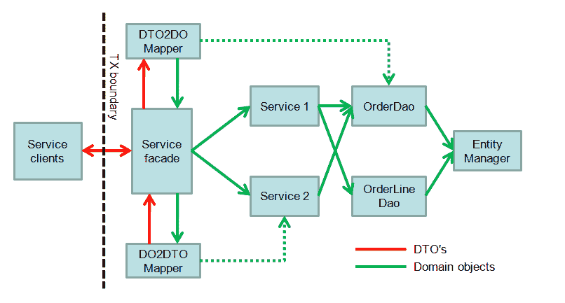

# 如何跨微服务分享 DTO

> 原文:[https://web . archive . org/web/20220930061024/https://www . bael dung . com/Java-micro services-share-dto](https://web.archive.org/web/20220930061024/https://www.baeldung.com/java-microservices-share-dto)

## 1.概观

微服务近年来开始流行。微服务的一个本质特征是模块化、隔离且易于扩展。**微服务需要协同工作并交换数据。**为了实现这一点，我们创建了名为 dto 的共享数据传输对象。

在本文中，我们将介绍在微服务之间共享 dto 的方法。

## 2.将域对象公开为 DTO

代表应用领域的模型使用微服务进行管理。领域模型是不同的关注点，我们将它们从 DAO 层的数据模型中分离出来。

这样做的主要原因是，我们不想通过向客户提供服务来暴露我们领域的复杂性。相反，我们在通过 REST APIs 服务应用客户端的服务之间公开了**dto。当 dto 在这些服务之间传递时，我们将它们转换成域对象**。

[](/web/20220526054207/https://www.baeldung.com/wp-content/uploads/2020/06/application_architecture_with_dtos_and_service_facade_original-1.png)

上面的[面向服务的架构](https://web.archive.org/web/20220526054207/https://xebia.com/blog/jpa-implementation-patterns-service-facades-and-data-transfers-objects/)示意性地显示了 DTO 到域对象的组件和流程。

## 3.微服务之间的 DTO 共享

以客户订购产品的过程为例。这个过程基于`Customer-Order`模型。让我们从服务架构的角度来看这个过程。

假设客户服务向订单服务发送请求数据，如下所示:

```
"order": {
    "customerId": 1,
    "itemId": "A152"
}
```

**客户和订单服务使用** **合同** `**.**` 相互通信。合同，也就是服务请求，以 JSON 格式显示。作为一个 Java 模型，`OrderDTO`类表示客户服务和订单服务之间的契约:

```
public class OrderDTO {
    private int customerId;
    private String itemId;

    // constructor, getters, setters
}
```

### 3.1.使用客户端模块(库)共享 DTO

微服务需要来自其他服务的某些信息来处理任何请求。假设有第三个微服务接收订单支付请求。与订单服务不同，此服务需要不同的客户信息:

```
public class CustomerDTO {
    private String firstName;
    private String lastName;
    private String cardNumber;

    // constructor, getters, setters
}
```

如果我们还添加了送货服务，客户信息将会:

```
public class CustomerDTO {
    private String firstName;
    private String lastName;
    private String homeAddress;
    private String contactNumber;

    // constructor, getters, setters
}
```

因此，将`CustomerDTO`类放在共享模块中不再符合预期目的。为了解决这个问题，我们采用了一种不同的方法。

**在每个微服务模块中，让我们创建一个客户端模块(库)** **，并在其旁边创建一个服务器模块**:

```
order-service
|__ order-client
|__ order-server
```

`order-client`模块包含一个与客户服务共享的 DTO。因此，`order-client`模块的结构如下:

```
order-service
└──order-client
     OrderClient.java
     OrderClientImpl.java
     OrderDTO.java 
```

`OrderClient`是定义用于处理订单请求的`order`方法的接口:

```
public interface OrderClient {
    OrderResponse order(OrderDTO orderDTO);
}
```

为了实现`order`方法，我们使用`RestTemplate`对象向订单服务发送 POST 请求:

```
String serviceUrl = "http://localhost:8002/order-service";
OrderResponse orderResponse = restTemplate.postForObject(serviceUrl + "/create", 
  request, OrderResponse.class);
```

此外，`order-client`模块已经可以使用了。它现在成为了`customer-service`模块的依赖库:

```
[INFO] --- maven-dependency-plugin:3.1.2:list (default-cli) @ customer-service ---
[INFO] The following files have been resolved:
[INFO]    com.baeldung.orderservice:order-client:jar:1.0-SNAPSHOT:compile
```

当然，如果没有`order-server`模块向订单客户端公开“/create”服务端点，这是没有意义的:

```
@PostMapping("/create")
public OrderResponse createOrder(@RequestBody OrderDTO request)
```

由于有了这个服务端点，客户服务可以通过它的订单客户端发送订单请求。通过使用客户端模块，微服务以更加隔离的方式相互通信。**DTO 中的属性在客户端模块中更新。因此，契约破坏仅限于使用相同客户端模块的服务。**

## 4.结论

在本文中，我们解释了一种在微服务之间共享 DTO 对象的方法。最好的情况是，我们通过将特殊合同作为微服务客户端模块(库)的一部分来实现这一点。这样，我们将服务客户机与包含 API 资源的服务器部分分离开来。**因此，有一些好处**:

*   服务之间的 DTO 码没有冗余
*   契约破坏仅限于使用相同客户端库的服务

GitHub 上的[提供了一个 Spring Boot 应用程序的代码示例。](https://web.archive.org/web/20220526054207/https://github.com/eugenp/tutorials/tree/master/spring-cloud/spring-cloud-bootstrap)