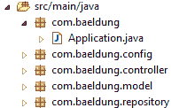

# 从春天迁徙到 Spring Boot

> 原文：<https://web.archive.org/web/20220930061024/https://www.baeldung.com/spring-boot-migration>

## **1。概述**

在本文中，我们将看看如何将现有的 Spring Framework 应用程序迁移到`Spring Boot`应用程序。

**`Spring Boot`并不是要取代 Spring，而是让使用它更快更容易。**因此，迁移应用程序所需的大多数更改都与配置有关。在很大程度上，我们的定制控制器和其他组件将保持不变。

用`Spring Boot`开发有几个好处:

*   更简单的依赖性管理
*   默认自动配置
*   嵌入式 web 服务器
*   应用指标和运行状况检查
*   高级外部化配置

## **2。`Spring Boot`首发**

首先，我们需要一组新的依赖项。 **`Spring Boot`提供了方便的启动依赖，它们是依赖描述符**，可以为某些功能引入所有必要的技术。

这样做的好处是，您不再需要为每个依赖项指定一个版本，而是让 starter 为您管理依赖项。

最快的开始方式是添加[弹簧启动启动器父母](https://web.archive.org/web/20220707143835/https://search.maven.org/classic/#search%7Cga%7C1%7Ca%3A%22spring-boot-starter-parent%22)

```
<parent>
    <groupId>org.springframework.boot</groupId>
    <artifactId>spring-boot-starter-parent</artifactId>
    <version>1.5.6.RELEASE</version>
</parent>
```

这将负责依赖性管理。

根据我们要迁移的功能，我们将在接下来的章节中介绍更多的入门知识。作为参考，你可以在这里找到首发球员的完整名单。

**作为一个更一般的注释，我们想要删除任何明确定义的依赖版本，它也由`Spring Boot`管理。否则，我们可能会遇到我们定义的版本和 Boot 使用的版本不兼容的问题。**

## **3。应用入口点**

使用`Spring Boot`构建的每个应用程序都需要定义主入口点。这通常是一个带有`main`方法的 Java 类，用`@SpringBootApplication`进行了注释:

```
@SpringBootApplication
public class Application {
    public static void main(String[] args) {
        SpringApplication.run(Application.class, args);
    }
}
```

`@SpringBootApplication`注释增加了以下注释:

*   `@Configuration`–将类标记为 bean 定义的来源
*   `@EnableAutoConfiguration`–告诉框架根据类路径上的依赖关系自动添加 beans
*   `@ComponentScan`–扫描与`Application`类或更低类相同的包中的其他配置和 beans

**默认情况下，`@SpringBootApplication`注释扫描同一包或更低包中的所有类。**因此，一个方便的包结构可以是这样的:

[](/web/20220707143835/https://www.baeldung.com/wp-content/uploads/2017/07/package.png)

如果您的应用程序是一个创建了`ApplicationContext`的非 web 应用程序，那么这段代码可以被删除并替换为上面的`@SpringBootApplication`类。

我们可能遇到的一个问题是多个配置类相互冲突。为了避免这种情况，我们可以过滤被扫描的类别:

```
@SpringBootAppliaction
@ComponentScan(excludeFilters = { 
  @ComponentScan.Filter(type = FilterType.REGEX, 
  pattern = "com.baeldung.config.*")})
public class Application {
    //...
}
```

## **4。导入配置和组件**

`Spring Boot`配置严重依赖注释，但是您仍然可以以注释和 XML 格式导入现有配置。

对于要挑选的现有`@Configuration`或组件类，您有两种选择:

*   将现有的类移动到与主`Application`类包相同或更低的包中
*   显式导入这些类

**要显式导入类，您可以在主类上使用`@ComponentScan`或`@Import`注释**:

```
@SpringBootApplication
@ComponentScan(basePackages="com.baeldung.config")
@Import(UserRepository.class)
public class Application {
    //...
}
```

官方文档建议在 XML 配置中使用注释。但是，如果您已经有了不希望转换成 Java 配置的 XML 文件，您仍然可以使用`@ImportResource`导入这些文件:

```
@SpringBootApplication
@ImportResource("applicationContext.xml")
public class Application {
    //...
}
```

## **5。迁移应用程序资源**

默认情况下，`Spring Boot`在以下位置之一查找资源文件:

*   `/resources`
*   `/public`
*   `/static`
*   `/META-INF/resources`

为了进行迁移，我们可以将所有的资源文件移动到其中一个位置，或者我们可以通过设置`spring.resources.static-locations`属性来自定义资源位置:

```
spring.resources.static-locations=classpatimg/,classpath:/jsp/
```

## **6。迁移应用程序属性**

框架将自动加载位于以下位置之一的名为`application.properties`或`application.yml`的文件中定义的任何属性:

*   当前目录的一个`/config`子目录
*   当前目录
*   类路径上的一个`/config`目录
*   类路径根

为了避免显式加载属性，我们可以将它们移动到这些位置之一的同名文件中。例如，到应该出现在类路径上的`/resources`文件夹中。

我们还可以从名为`application-{profile}.properties`的文件中自动加载特定于概要文件的属性。

此外，大量的[预定义属性名](https://web.archive.org/web/20220707143835/https://docs.spring.io/spring-boot/docs/current/reference/html/appendix-application-properties.html)可用于配置不同的应用程序行为。

您在应用程序中使用的每个 Spring 框架模块都需要稍微修改，主要是与配置相关的修改。让我们来看看一些最常用的功能。

## 7 .**。迁移一个 Spring Web 应用程序**

### 7.1。网络启动器

为 web 应用程序提供了一个起点，它将带来所有必要的依赖。这意味着我们可以从 Spring 框架中移除所有特定于 web 的依赖项，并用 [`spring-boot-starter-web`](https://web.archive.org/web/20220707143835/https://search.maven.org/classic/#search%7Cga%7C1%7Ca%3A%22spring-boot-starter-web%22%20AND%20g%3A%22org.springframework.boot%22) 替换它们:

```
<dependency>
    <groupId>org.springframework.boot</groupId>
    <artifactId>spring-boot-starter-web</artifactId>
</dependency>
```

由于`Spring Boot`试图根据类路径尽可能地自动配置应用程序，添加这种依赖关系将导致将`@EnableWebMvc`注释添加到主`Application`类中，并设置一个`DispatcherServlet` bean。

如果你有一个设置了一个`DispatcherServlet`的`WebApplicationInitializer`类，这就不再必要了，也不再需要`@EnableWebMvc`注释。

当然，如果我们想要自定义行为，我们可以定义我们的 bean，在这种情况下，我们的 bean 将被使用。

**如果我们在`@Configuration`类上显式使用`@EnableWebMvc`注释，那么 MVC 自动配置将不再启用。**

添加 web starter 还会确定以下 beans 的自动配置:

*   支持从类路径上名为`/static`、`/public`、`/resources`或`/META-INF/resources`的目录中提供静态内容
*   `HttpMessageConverter`常见用例的 beans，如 JSON 和 XML
*   处理所有错误的`/error`映射

### 7.2。查看技术

至于构建网页，官方文档建议不要使用 JSP 文件，而使用模板引擎。以下模板引擎包含自动配置:`Thymeleaf`、`Groovy`、`FreeMarker`、`Mustache`。要使用其中一个，我们需要做的就是添加特定的启动器:

```
<dependency>
    <groupId>org.springframework.boot</groupId>
    <artifactId>spring-boot-starter-thymeleaf</artifactId>
</dependency>
```

模板文件应该放在`/resources/templates`文件夹中。

如果我们想继续使用 JSP 文件，我们需要配置应用程序，以便它可以解析 JSP。例如，如果我们的文件在`/webapp/WEB-INF/views`中，那么我们需要设置以下属性:

```
spring.mvc.view.prefix=/WEB-INF/views/
spring.mvc.view.suffix=.jsp
```

### 7.3。嵌入式网络服务器

此外，我们还可以使用嵌入式 Tomcat 服务器运行我们的应用程序，该服务器将通过添加 [`spring-boot-starter-tomcat`](https://web.archive.org/web/20220707143835/https://search.maven.org/classic/#search%7Cga%7C1%7Ca%3A%22spring-boot-starter-tomcat%22%20AND%20g%3A%22org.springframework.boot%22) 依赖项在端口 8080 上自动配置:

```
<dependency>
    <groupId>org.springframework.boot</groupId>
    <artifactId>spring-boot-starter-tomcat</artifactId>
</dependency>
```

其他`Spring Boot`提供自动配置的 web 服务器有`Jetty`和`Undertow`。

## **8。迁移一个 Spring 安全应用程序**

启用春季安全的启动器是 [`spring-boot-starter-security`](https://web.archive.org/web/20220707143835/https://search.maven.org/classic/#search%7Cga%7C1%7Ca%3A%22spring-boot-starter-security%22%20AND%20g%3A%22org.springframework.boot%22) :

```
<dependency>
    <groupId>org.springframework.boot</groupId>
    <artifactId>spring-boot-starter-security</artifactId>
</dependency>
```

默认情况下，这将创建一个名为“user”的用户，在启动时使用随机生成的密码登录，并使用基本身份验证保护所有端点。然而，我们通常希望添加我们的安全配置，它不同于默认配置。

出于这个原因，我们将保留我们现有的用`@EnableWebSecurity`注释的类，它扩展了`WebSecurityConfigurerAdapter`并定义了一个定制配置:

```
@Configuration
@EnableWebSecurity
public class SecurityConfig extends WebSecurityConfigurerAdapter {
    // ...
}
```

## **9。迁移一个 Spring 数据应用程序**

根据我们使用的`Spring Data`实现，我们将需要添加相应的启动器。例如，对于 JPA，我们可以添加 [`spring-boot-starter-data-jpa`](https://web.archive.org/web/20220707143835/https://search.maven.org/classic/#search%7Cga%7C1%7Ca%3A%22spring-boot-starter-data-jpa%22%20AND%20g%3A%22org.springframework.boot%22) 依赖项:

```
<dependency>
    <groupId>org.springframework.boot</groupId>
    <artifactId>spring-boot-starter-data-jpa</artifactId>
</dependency>
```

如果我们想要使用内存中的数据库，那么为类型为`H2`、`Derby`和`HSQLDB`的数据库添加相应的依赖项启用自动配置。

例如，要使用一个`H2`内存数据库，我们所需要的就是 [h2](https://web.archive.org/web/20220707143835/https://search.maven.org/classic/#search%7Cga%7C1%7Ca%3A%22h2%22%20AND%20g%3A%22com.h2database%22) 依赖关系:

```
<dependency>
    <groupId>com.h2database</groupId>
    <artifactId>h2</artifactId>
</dependency>
```

如果我们想要使用不同的数据库类型和配置，比如一个`MySQL`数据库，那么我们需要依赖关系以及定义一个配置。

为此，我们可以保留我们的`DataSource` bean 定义，或者利用预定义的属性:

```
spring.datasource.driver-class-name=com.mysql.cj.jdbc.Driver
spring.datasource.url=jdbc:mysql://localhost:3306/myDb?createDatabaseIfNotExist=true
spring.datasource.username=user
spring.datasource.password=pass
```

`Spring Boot`将自动配置`Hibernate`作为默认的 JPA 提供者，以及一个`transactionManager` bean。

## 10。结论

在本文中，我们展示了将现有的 Spring 应用程序迁移到新的`Spring Boot`框架时遇到的一些常见场景。

总的来说，您的迁移体验当然在很大程度上取决于您构建的应用程序。