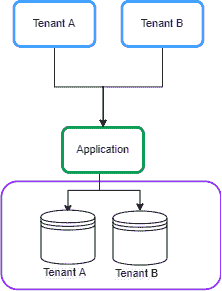
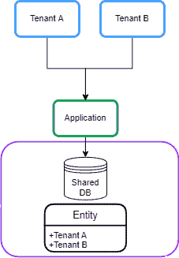
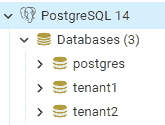

# 具有 Spring 数据的多租户 JPA

> 原文：<https://web.archive.org/web/20220930061024/https://www.baeldung.com/multitenancy-with-spring-data-jpa>

## 1.概观

多租户指的是一种架构，其中一个软件应用程序的单个实例服务于多个租户或客户。

它支持租户之间所需的隔离程度，以便租户使用的数据和资源与其他租户分开。

在本教程中，我们将了解如何使用 Spring Data JPA 在 Spring Boot 应用程序中配置多租户。此外，我们使用 [JWT](/web/20221016180342/https://www.baeldung.com/java-json-web-tokens-jjwt#JWT) 为租户增加安全性。

## 2.多租户模型

多租户系统有三种主要方法:

*   独立数据库
*   共享数据库和独立模式
*   共享数据库和共享模式

### 2.1.独立数据库

在这种方法中，每个租户的数据都保存在单独的数据库实例中，并与其他租户隔离。这也被称为`Database per Tenant`:

### 2.2.共享数据库和独立模式

在这种方法中，每个租户的数据都保存在共享数据库的不同模式中。这有时被称为`Schema per Tenant`:

### 2.3.共享数据库和共享模式

在这种方法中，所有租户共享一个数据库，每个表都有一个包含租户标识符的列:

## 3.Maven 依赖性

让我们从在 Spring Boot 应用程序的`pom.xml`中声明 [`spring-boot-starter-data-jpa`](https://web.archive.org/web/20221016180342/https://search.maven.org/search?q=a:spring-boot-starter-data-jpa) 依赖关系开始:

[PRE0]

此外，我们将使用一个`PostgreSQL`数据库，所以我们也将 [`postgresql`](https://web.archive.org/web/20221016180342/https://search.maven.org/search?q=g:org.postgresql%20%26%20a:postgresql) 依赖项添加到`pom.xml`文件中:

[PRE1]

独立数据库、共享数据库和独立模式方法在 Spring Boot 应用程序中的配置是相似的。在本教程中，**我们主要关注独立的数据库方法**。

## 4.动态`DataSource`路由

在这一节中，我们将描述`Database per Tenant`模型背后的一般思想。

### 4.1.`AbstractRoutingDataSource`

使用 Spring Data JPA 实现多租户的一般思想是**在运行时基于当前租户标识符路由数据源。**

为此，我们可以使用 [`AbstractRoutingDatasource`](/web/20221016180342/https://www.baeldung.com/spring-abstract-routing-data-source) 作为根据当前租户动态确定实际`DataSource`的方法。

让我们创建一个扩展了`AbstractRoutingDataSource`类的`MultitenantDataSource `类:

[PRE2]

`AbstractRoutingDataSource`根据查找关键字将`getConnection`呼叫路由到不同目标`DataSources`中的一个。

查找键通常通过一些线程绑定的事务上下文来确定。因此，**我们创建了一个`TenantContext `类来存储每个请求**中的当前租户:

[PRE3]

我们使用一个 [`ThreadLocal`](/web/20221016180342/https://www.baeldung.com/java-threadlocal) 对象来保存当前请求的租户 ID。此外，我们使用`set`方法存储租户 ID，使用`get()`方法检索它。

### 4.2.为每个请求设置租户 ID

在这个配置设置之后，**当我们执行任何租户操作时，我们需要在创建任何事务之前知道租户 ID**。所以，我们需要在到达控制器端点之前，在 [`Filter`](/web/20221016180342/https://www.baeldung.com/spring-boot-add-filter) 或 [`Interceptor`](/web/20221016180342/https://www.baeldung.com/spring-mvc-handlerinterceptor) 中设置租户 ID。

让我们在`TenantContext`中添加一个用于设置当前租户的`TenantFilter `:

[PRE4]

在这个过滤器中，我们从请求头`X-TenantID `中获取租户 ID，并将其设置在`TenantContext`中。我们通过过滤器链传递控制。我们的`finally`块确保当前租户在下一次请求前被重置。这避免了任何跨租户请求污染的风险。

在下一节中，我们将在`Database per Tenant`模型中实现租户和数据源声明。

## 5.数据库方法

在本节中，我们将基于`Database per Tenant`模型实现多租户。

### 5.1.租户声明

在这种方法中，我们有多个数据库，所以我们需要在 Spring Boot 应用程序中声明多个数据源。

我们可以在单独的租户文件中配置`DataSources`。因此，我们在`allTenants`目录下创建`tenant_1.properties `文件，并声明租户的数据源:

[PRE5]

此外，我们为另一个租户创建了一个`tenant_2.properties`文件:

[PRE6]

我们将为每个租户创建一个文件:

### 5.2.`DataSource`声明

现在我们需要**读取租户的数据，并使用`DataSourceBuilder`** 类**创建`DataSource`。另外，我们在`AbstractRoutingDataSource`类中设置了`DataSources`。**

让我们为此添加一个`MultitenantConfiguration`类:

[PRE7]

首先，我们从`allTenants`目录中读取租户的定义，并使用`DataSourceBuilder `类创建`DataSource ` bean。之后，我们需要为`MultitenantDataSource`类设置一个默认数据源和目标数据源，分别使用`setDefaultTargetDataSource`和`setTargetDataSources`连接。我们使用`defaultTenant`属性从`application.properties`文件中设置一个租户的名字作为默认数据源。为了完成数据源的初始化，我们调用了`afterPropertiesSet()`方法。

现在我们的设置已经准备好了。

## 6.试验

### 6.1.为租户创建数据库

首先，我们需要在`PostgreSQL:`中定义两个数据库

之后，我们使用下面的脚本在每个数据库中创建一个`employee`表:

[PRE8]

### 6.2.样本控制器

让我们创建一个`EmployeeController `类，用于在请求头中的指定租户中创建和保存`Employee`实体:

[PRE9]

### 6.3.样品申请

让我们创建一个 post 请求，使用[邮递员](/web/20221016180342/https://www.baeldung.com/postman-testing-collections)在租户 ID `tenant_1`中插入一个`employee`实体:

此外，我们向`tenant_2`发送请求:

之后，当我们检查数据库时，我们看到每个请求都保存在相关租户的数据库中。

## 7.安全性

多租户应该在共享环境中保护客户的数据。这意味着每个租户只能访问他们的数据。因此，我们需要为我们的租户增加安全性。让我们构建一个系统，用户必须登录到应用程序并**获得一个 JWT，然后用它来证明访问租赁的权利。**

### 7.1.Maven 依赖性

让我们从在`pom.xml`中添加 [`spring-boot-starter-security`](https://web.archive.org/web/20221016180342/https://search.maven.org/search?q=a:spring-boot-starter-security) 依赖项开始:

[PRE10]

此外，我们需要生成并验证 JWT。为此，我们将 [`jjwt`](https://web.archive.org/web/20221016180342/https://search.maven.org/search?q=a:jjwt) 添加到我们的`pom.xml`:

[PRE11]

### 7.2.安全配置

首先，我们需要为租户的用户提供身份验证功能。为了简单起见，让我们使用`SecurityConfiguration`类中的内存用户声明:

[PRE12]

我们为两个租户添加了两个用户。此外，我们认为租户是一个角色。根据上面的代码，用户名`user`和`admin`分别可以访问`tenant_1`和`tenant_2`。

现在，我们为用户身份验证创建一个过滤器。让我们添加`LoginFilter`类:

[PRE13]

`LoginFilter`类扩展了`AbstractAuthenticationProcessingFilter`。`AbstractAuthenticationProcessingFilter` 拦截一个请求，并尝试使用`attemptAuthentication()`方法执行认证。在这个方法中，我们将用户凭证映射到`AccountCredentials` [DTO](/web/20221016180342/https://www.baeldung.com/java-dto-pattern) 类，并根据内存中的身份验证管理器对用户进行身份验证:

[PRE14]

### 7.3.JWT

现在我们需要生成 JWT 并添加租户 ID。为了做到这一点，我们重写了`successfulAuthentication()`方法。此方法在成功认证后执行:

[PRE15]

根据上面的代码，我们得到用户的角色，并将其添加到 JWT。为此，我们创建了`AuthenticationService`类和`addToken()`方法:

[PRE16]

`addToken`方法生成包含租户 ID 的 JWT 作为`audience`声明，并将其添加到响应的`Authorization`头中。

最后，我们将`LoginFilter`添加到`SecurityConfiguration` 类中:

[PRE17]

此外，我们添加了`AuthenticationFilter `类，用于在`SecurityContextHolder` 类中设置`Authentication`:

[PRE18]

### 7.4.从 JWT 获取租户 ID

让我们修改`TenantContext`中设置当前租户的`TenantFilter`:

[PRE19]

在这种情况下，我们使用来自`AuthenticationService` 类的`getTenant()` 方法从 JWT 获取租户 ID:

[PRE20]

## 8.安全测试

### 8.1.JWT 一代

让我们为用户名`user`生成 JWT。为此，我们将凭证发布到`/login`端点:

让我们检查一下令牌:

[PRE21]

当我们[解码令牌](https://web.archive.org/web/20221016180342/https://jwt.io/)时，我们发现租户 ID 设置为`audience` 声明:

[PRE22]

### 8.2.样品申请

让我们创建一个 post 请求，使用生成的令牌插入一个`employee`实体:

我们在`Authorization`头中设置生成的令牌。租户 ID 已经从令牌中提取出来，并设置在`TenantContext`中。

## 9.结论

在本文中，我们研究了不同的多租户模型。

我们描述了在 Spring Boot 应用程序中使用 Spring Data JPA 为单独的数据库、共享数据库和单独的模式模型添加多租户所需的类。

然后，我们在 PostgreSQL 数据库中设置测试多租户所需的环境。

最后，我们为使用 JWT 的租户增加了安全性。

和往常一样，本教程的完整源代码可以在 GitHub 上的[处获得。](https://web.archive.org/web/20221016180342/https://github.com/eugenp/tutorials/tree/master/persistence-modules/spring-jpa-2)