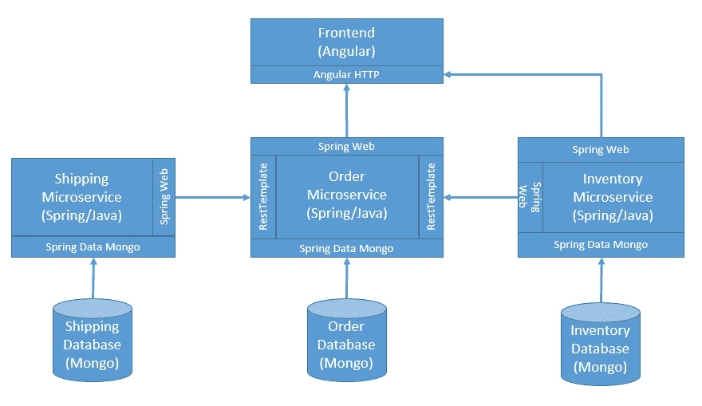
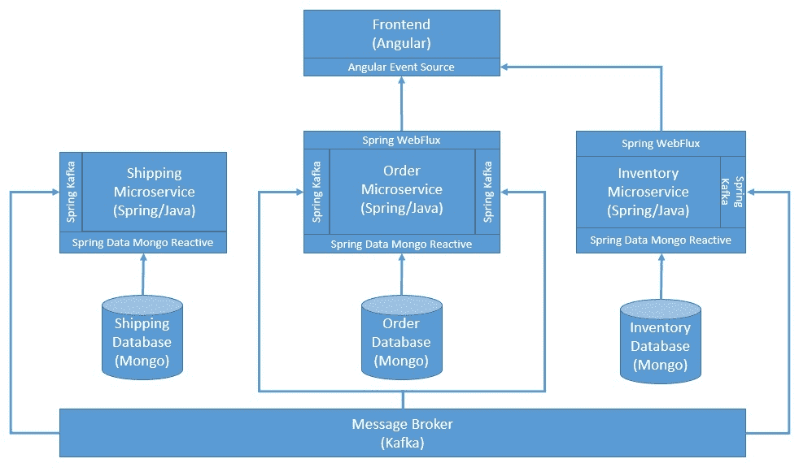

# Java 中的反应式系统

> 原文：<https://web.archive.org/web/20220930061024/https://www.baeldung.com/java-reactive-systems>

## 1.介绍

在本教程中，我们将了解使用 Spring 和其他工具和框架在 Java 中创建反应式系统的基础。

在这个过程中，我们将讨论反应式编程是如何成为创建反应式系统的驱动力的。这将有助于我们理解创建反应式系统的基本原理，以及它所激发的不同规范、库和标准。

## 2.什么是反应式系统？

在过去的几十年里，技术领域经历了几次颠覆，导致我们看待技术价值的方式发生了彻底的转变。在互联网出现之前，计算机世界永远无法想象它会以何种方式改变我们的今天。

随着互联网的普及和它所承诺的不断发展的体验，应用程序架构师需要时刻准备着满足他们的需求。

从根本上说，这意味着我们再也不能用以前的方式设计应用程序了。高度响应的应用程序不再是奢侈品，而是必需品。

这也是面对随机故障和不可预测的负载。现在需要的不仅仅是得到正确的结果，而是尽快得到正确的结果！推动我们承诺提供的令人惊叹的用户体验非常重要。

这就产生了对一种能给我们反应式系统的架构风格的需求。

### 2.1.反应宣言

早在 2013 年，**由 Jonas Boner 领导的一个开发团队在一份名为[的文档中定义了一套核心原则](https://web.archive.org/web/20220831185610/https://www.reactivemanifesto.org/)**。这是创建反应式系统的架构风格的基础。从那时起，这个宣言已经引起了开发人员社区的极大兴趣。

基本上，这个文档规定了**一个灵活的、松散耦合的、可伸缩的反应式系统的方法**。这使得这样的系统易于开发，容错，最重要的是高度响应，这是难以置信的用户体验的基础。

那么这个秘方是什么呢？嗯，这几乎不是什么秘密！该宣言定义了反应系统的基本特征或原则:

*   反应式系统应该提供快速一致的响应时间，从而提供一致的服务质量
*   通过复制和隔离，反应式系统应在随机故障的情况下保持响应
*   这样的系统应该通过经济高效的可伸缩性在不可预测的工作负载下保持响应
*   `Message-Driven`:它应该依赖于系统组件之间的异步消息传递

这些原则听起来简单明了，但在复杂的企业架构中并不总是容易实现。在本教程中，我们将牢记这些原则，用 Java 开发一个示例系统！

## 3.什么是反应式编程？

在我们继续之前，理解反应式编程和反应式系统之间的区别是很重要的。我们经常使用这两个术语，很容易把一个误解为另一个。正如我们前面看到的，反应式系统是特定架构风格的结果。

相比之下，**反应式编程是一种编程范式，其重点是开发异步和非阻塞组件**。反应式编程的核心是数据流，我们可以观察数据流并对其做出反应，甚至施加反压力。这将导致非阻塞执行，从而以更少的执行线程获得更好的可伸缩性。

这并不意味着反应式系统和反应式编程是相互排斥的。事实上，反应式编程是实现反应式系统的重要一步，但它不是一切！

### 3.1.反应流

[反应流](https://web.archive.org/web/20220831185610/http://www.reactive-streams.org/)是一个社区倡议，始于 2013 年，旨在**提供一个具有非阻塞背压的异步流处理标准**。这里的目标是定义一组接口、方法和协议来描述必要的操作和实体。

从那以后，出现了多种编程语言的几种实现，它们符合反应流规范。其中包括 Akka Streams、Ratpack 和 Vert.x 等等。

### 3.2.Java 的反应库

反应流背后的最初目标之一是最终作为一个官方的 Java 标准库被包含进来。因此，反应流规范在语义上等同于 Java 9 中引入的 Java 流库。

除此之外，用 Java 实现反应式编程还有一些流行的选择:

*   反应式扩展(Reactive Extensions):俗称 ReactiveX，它们为带有可观察流的异步编程提供 API。这些可用于多种编程语言和平台，包括 Java，它被称为 [RxJava](https://web.archive.org/web/20220831185610/https://github.com/ReactiveX/RxJava)
*   Project Reactor :这是另一个基于 reactive streams 规范的 reactive 库，目标是在 JVM 上构建非应用。这也恰好是春季生态系统中[反应堆的基础](https://web.archive.org/web/20220831185610/https://spring.io/reactive)

## 4.一个简单的应用

出于本教程的目的，我们将开发一个基于微服务架构的简单应用程序，它具有最小的前端。应用程序架构应该有足够的元素来创建一个反应系统。

对于我们的应用程序，我们将采用端到端的反应式编程和其他模式和工具来实现反应式系统的基本特征。

### 4.1.体系结构

我们将从定义一个简单的应用架构开始，这个架构不一定表现出反应式系统的特征。从那时起，我们将进行必要的更改来逐一实现这些特性。

首先，让我们从定义一个简单的架构开始:

[](/web/20220831185610/https://www.baeldung.com/wp-content/uploads/2020/07/Blocking-Architecture.jpg)

这是一个非常简单的架构，有一堆微服务来促进我们可以下订单的商业用例。它还有一个用户体验的前端，所有的通信都通过 HTTP 以 REST 的形式进行。此外，每个微服务在单独的数据库中管理它们的数据，这种做法被称为每个服务一个数据库。

我们将在接下来的小节中创建这个简单的应用程序。这将是我们**理解这种架构**的谬误以及采用原则和实践的方法和手段的基础，以便我们可以将其转化为一个反应系统。

### 4.3.库存微服务

库存微服务将**负责管理产品列表及其当前库存**。它还允许在订单处理过程中改变库存。我们将使用 [Spring Boot](/web/20220831185610/https://www.baeldung.com/spring-boot) 和 MongoDB 来开发这个服务。

让我们首先定义一个控制器来公开一些端点:

```
@GetMapping
public List<Product> getAllProducts() {
    return productService.getProducts();
}

@PostMapping
public Order processOrder(@RequestBody Order order) {
    return productService.handleOrder(order);
}

@DeleteMapping
public Order revertOrder(@RequestBody Order order) {
    return productService.revertOrder(order);
}
```

以及封装我们业务逻辑的服务:

```
@Transactional
public Order handleOrder(Order order) {       
    order.getLineItems()
      .forEach(l -> {
          Product> p = productRepository.findById(l.getProductId())
            .orElseThrow(() -> new RuntimeException("Could not find the product: " + l.getProductId()));
          if (p.getStock() >= l.getQuantity()) {
              p.setStock(p.getStock() - l.getQuantity());
              productRepository.save(p);
          } else {
              throw new RuntimeException("Product is out of stock: " + l.getProductId());
          }
      });
    return order.setOrderStatus(OrderStatus.SUCCESS);
}

@Transactional
public Order revertOrder(Order order) {
    order.getLineItems()
      .forEach(l -> {
          Product p = productRepository.findById(l.getProductId())
            .orElseThrow(() -> new RuntimeException("Could not find the product: " + l.getProductId()));
          p.setStock(p.getStock() + l.getQuantity());
          productRepository.save(p);
      });
    return order.setOrderStatus(OrderStatus.SUCCESS);
}
```

注意，我们在事务中**持久化实体，这确保了在异常情况下不会导致不一致的状态。**

除此之外，我们还必须定义域实体、存储库接口和一系列必要的配置类，以便一切正常工作。

但是由于这些大多是样板文件，我们将避免浏览它们，它们可以在本文最后一节提供的 GitHub 资源库中引用。

### 4.4.运输微服务

运输微服务也不会有很大的不同。这将由**负责检查是否可以为订单**生成装运，并在可能的情况下创建一个。

像以前一样，我们将定义一个控制器来公开我们的端点，实际上只是一个端点:

```
@PostMapping
public Order process(@RequestBody Order order) {
    return shippingService.handleOrder(order);
}
```

以及封装与订单发货相关的业务逻辑的服务:

```
public Order handleOrder(Order order) {
    LocalDate shippingDate = null;
    if (LocalTime.now().isAfter(LocalTime.parse("10:00"))
      && LocalTime.now().isBefore(LocalTime.parse("18:00"))) {
        shippingDate = LocalDate.now().plusDays(1);
    } else {
        throw new RuntimeException("The current time is off the limits to place order.");
    }
    shipmentRepository.save(new Shipment()
      .setAddress(order.getShippingAddress())
      .setShippingDate(shippingDate));
    return order.setShippingDate(shippingDate)
      .setOrderStatus(OrderStatus.SUCCESS);
}
```

我们简单的运输服务只是检查下订单的有效时间窗口。我们将避免像以前一样讨论样板代码的其余部分。

### 4.5.订单微服务

最后，我们将定义一个订单微服务，它将**负责创建一个新订单，而不负责其他事情**。有趣的是，它还将充当 orchestrator 服务，与订单的库存服务和运输服务进行通信。

让我们用所需的端点来定义控制器:

```
@PostMapping
public Order create(@RequestBody Order order) {
    Order processedOrder = orderService.createOrder(order);
    if (OrderStatus.FAILURE.equals(processedOrder.getOrderStatus())) {
        throw new RuntimeException("Order processing failed, please try again later.");
    }
    return processedOrder;
}
@GetMapping
public List<Order> getAll() {
    return orderService.getOrders();
}
```

以及封装与订单相关的业务逻辑的服务:

```
public Order createOrder(Order order) {
    boolean success = true;
    Order savedOrder = orderRepository.save(order);
    Order inventoryResponse = null;
    try {
        inventoryResponse = restTemplate.postForObject(
          inventoryServiceUrl, order, Order.class);
    } catch (Exception ex) {
        success = false;
    }
    Order shippingResponse = null;
    try {
        shippingResponse = restTemplate.postForObject(
          shippingServiceUrl, order, Order.class);
    } catch (Exception ex) {
        success = false;
        HttpEntity<Order> deleteRequest = new HttpEntity<>(order);
        ResponseEntity<Order> deleteResponse = restTemplate.exchange(
          inventoryServiceUrl, HttpMethod.DELETE, deleteRequest, Order.class);
    }
    if (success) {
        savedOrder.setOrderStatus(OrderStatus.SUCCESS);
        savedOrder.setShippingDate(shippingResponse.getShippingDate());
    } else {
        savedOrder.setOrderStatus(OrderStatus.FAILURE);
    }
    return orderRepository.save(savedOrder);
}

public List<Order> getOrders() {
    return orderRepository.findAll();
}
```

我们对库存和运输服务呼叫的订单处理远非理想。具有多个微服务的分布式**事务本身是一个复杂的主题，超出了本教程**的范围。

然而，我们将在本教程的后面看到反应式系统如何在一定程度上避免对分布式事务的需求。

像以前一样，我们将不会通过样板代码的其余部分。但是，这可以在 GitHub repo 中引用。

### 4.6.前端

让我们也添加一个用户界面来完成讨论。用户界面将基于 Angular，并将是一个简单的单页应用程序。

我们需要**在 Angular 中创建一个简单的组件来处理创建和获取命令**。特别重要的是我们调用 API 来创建订单的部分:

```
createOrder() {
    let headers = new HttpHeaders({'Content-Type': 'application/json'});
    let options = {headers: headers}
    this.http.post('http://localhost:8080/api/orders', this.form.value, options)
      .subscribe(
        (response) => {
          this.response = response
        },
        (error) => {
          this.error = error
        }
      )
}
```

上面的代码片段**期望订单数据以一种形式被捕获，并且在组件**的范围内可用。Angular 为使用[反应式和模板驱动的表单](https://web.archive.org/web/20220831185610/https://angular.io/guide/forms-overview)创建简单到复杂的表单提供了极好的支持。

同样重要的是我们获得以前创建的订单的部分:

```
getOrders() {
  this.previousOrders = this.http.get(''http://localhost:8080/api/orders'')
}
```

请注意， [Angular HTTP 模块](https://web.archive.org/web/20220831185610/https://angular.io/guide/http)本质上是**异步的，因此返回 RxJS `Observable` s** 。我们可以在视图中通过异步管道传递响应:

```
<div class="container" *ngIf="previousOrders !== null">
  <h2>Your orders placed so far:</h2>
  <ul>
    <li *ngFor="let order of previousOrders | async">
      <p>Order ID: {{ order.id }}, Order Status: {{order.orderStatus}}, Order Message: {{order.responseMessage}}</p>
    </li>
  </ul>
</div>
```

当然，Angular 将需要模板、样式和配置才能工作，但这些可以在 GitHub 资源库中引用。请注意，我们已经将所有东西都打包在一个组件中，这不是我们应该做的事情。

但是，对于本教程，这些问题不在讨论范围之内。

### 4.7.部署应用程序

既然我们已经创建了应用程序的所有独立部分，我们应该如何着手部署它们呢？嗯，我们可以手动操作。但我们应该小心，它很快就会变得乏味。

对于本教程，我们将使用 [Docker Compose](/web/20220831185610/https://www.baeldung.com/docker-compose) 来**在 Docker 机器**上构建和部署我们的应用程序。这将要求我们在每个服务中添加一个标准的 Docker 文件，并为整个应用程序创建一个 Docker 合成文件。

让我们看看这个`docker-compose.yml`文件是什么样子的:

```
version: '3'
services:
  frontend:
    build: ./frontend
    ports:
      - "80:80"
  order-service:
    build: ./order-service
    ports:
      - "8080:8080"
  inventory-service:
    build: ./inventory-service
    ports:
      - "8081:8081"
  shipping-service:
    build: ./shipping-service
    ports:
      - "8082:8082"
```

这是 Docker Compose 中相当标准的服务定义，不需要特别注意。

### 4.8.这种架构的问题

现在我们已经有了一个简单的应用程序，其中有多个服务相互交互，我们可以讨论这个架构中的问题了。在接下来的几节中，我们将尝试解决一些问题，并最终达到将应用程序转变为反应式系统的状态！

虽然这个应用程序离产品级软件还很远，并且有几个问题，但是我们将**关注与反应式系统**的动机相关的问题:

*   库存服务或运输服务的失败会产生连锁反应
*   对外部系统和数据库的调用本质上都是阻塞的
*   部署不能自动处理故障和波动负载

## 5.反应式编程

在任何程序中阻塞调用通常会导致关键资源等待事情发生。这些调用包括数据库调用、web 服务调用和文件系统调用。如果我们能够从这种等待中释放出执行线程，并提供一种一旦结果可用就返回的机制，将会产生更好的资源利用率。

这就是采用反应式编程范例为我们做的事情。虽然对于许多这样的调用来说，切换到反应式库是可能的，但并不是对所有的调用都可能。对我们来说，幸运的是，Spring 使得使用 MongoDB 和 REST APIs 进行反应式编程变得更加容易:

[](/web/20220831185610/https://www.baeldung.com/wp-content/uploads/2020/07/Reactive-Architecture.jpg)

[Spring Data Mongo](/web/20220831185610/https://www.baeldung.com/spring-data-mongodb-tutorial) 通过 MongoDB Reactive Streams Java 驱动程序支持反应式访问。它提供了`ReactiveMongoTemplate`和`ReactiveMongoRepository`，两者都具有丰富的映射功能。

[Spring WebFlux](/web/20220831185610/https://www.baeldung.com/spring-webflux) 为 Spring 提供了 reactive-stack web 框架，支持非阻塞代码和 Reactive Streams 背压。它利用反应器作为其反应库。此外，它提供了`WebClient`来执行带有反应流背压的 HTTP 请求。它使用 Reactor Netty 作为 HTTP 客户端库。

### 5.1.库存服务

我们将从更改端点以发出反应性发布者开始:

```
@GetMapping
public Flux<Product> getAllProducts() {
    return productService.getProducts();
}
```

```
@PostMapping
public Mono<Order> processOrder(@RequestBody Order order) {
    return productService.handleOrder(order);
}

@DeleteMapping
public Mono<Order> revertOrder(@RequestBody Order order) {
    return productService.revertOrder(order);
}
```

显然，我们还必须对服务进行必要的更改:

```
@Transactional
public Mono<Order> handleOrder(Order order) {
    return Flux.fromIterable(order.getLineItems())
      .flatMap(l -> productRepository.findById(l.getProductId()))
      .flatMap(p -> {
          int q = order.getLineItems().stream()
            .filter(l -> l.getProductId().equals(p.getId()))
            .findAny().get()
            .getQuantity();
          if (p.getStock() >= q) {
              p.setStock(p.getStock() - q);
              return productRepository.save(p);
          } else {
              return Mono.error(new RuntimeException("Product is out of stock: " + p.getId()));
          }
      })
      .then(Mono.just(order.setOrderStatus("SUCCESS")));
}

@Transactional
public Mono<Order> revertOrder(Order order) {
    return Flux.fromIterable(order.getLineItems())
      .flatMap(l -> productRepository.findById(l.getProductId()))
      .flatMap(p -> {
          int q = order.getLineItems().stream()
            .filter(l -> l.getProductId().equals(p.getId()))
            .findAny().get()
            .getQuantity();
          p.setStock(p.getStock() + q);
          return productRepository.save(p);
      })
      .then(Mono.just(order.setOrderStatus("SUCCESS")));
}
```

### 5.2.航运服务

类似地，我们将更改我们的运输服务的端点:

```
@PostMapping
public Mono<Order> process(@RequestBody Order order) {
    return shippingService.handleOrder(order);
}
```

以及服务中的相应变化，以利用反应式编程:

```
public Mono<Order> handleOrder(Order order) {
    return Mono.just(order)
      .flatMap(o -> {
          LocalDate shippingDate = null;
          if (LocalTime.now().isAfter(LocalTime.parse("10:00"))
            && LocalTime.now().isBefore(LocalTime.parse("18:00"))) {
              shippingDate = LocalDate.now().plusDays(1);
          } else {
              return Mono.error(new RuntimeException("The current time is off the limits to place order."));
          }
          return shipmentRepository.save(new Shipment()
            .setAddress(order.getShippingAddress())
            .setShippingDate(shippingDate));
      })
      .map(s -> order.setShippingDate(s.getShippingDate())
        .setOrderStatus(OrderStatus.SUCCESS));
    }
```

### 5.3.订单服务

我们必须在订单服务的端点中进行类似的更改:

```
@PostMapping
public Mono<Order> create(@RequestBody Order order) {
    return orderService.createOrder(order)
      .flatMap(o -> {
          if (OrderStatus.FAILURE.equals(o.getOrderStatus())) {
              return Mono.error(new RuntimeException("Order processing failed, please try again later. " + o.getResponseMessage()));
          } else {
              return Mono.just(o);
          }
      });
}

@GetMapping
public Flux<Order> getAll() {
    return orderService.getOrders();
}
```

对服务的更改将更加复杂，因为我们将不得不使用 Spring `WebClient`来调用库存和运输反应端点:

```
public Mono<Order> createOrder(Order order) {
    return Mono.just(order)
      .flatMap(orderRepository::save)
      .flatMap(o -> {
          return webClient.method(HttpMethod.POST)
            .uri(inventoryServiceUrl)
            .body(BodyInserters.fromValue(o))
            .exchange();
      })
      .onErrorResume(err -> {
          return Mono.just(order.setOrderStatus(OrderStatus.FAILURE)
            .setResponseMessage(err.getMessage()));
      })
      .flatMap(o -> {
          if (!OrderStatus.FAILURE.equals(o.getOrderStatus())) {
              return webClient.method(HttpMethod.POST)
                .uri(shippingServiceUrl)
                .body(BodyInserters.fromValue(o))
                .exchange();
          } else {
              return Mono.just(o);
          }
      })
      .onErrorResume(err -> {
          return webClient.method(HttpMethod.POST)
            .uri(inventoryServiceUrl)
            .body(BodyInserters.fromValue(order))
            .retrieve()
            .bodyToMono(Order.class)
            .map(o -> o.setOrderStatus(OrderStatus.FAILURE)
              .setResponseMessage(err.getMessage()));
      })
      .map(o -> {
          if (!OrderStatus.FAILURE.equals(o.getOrderStatus())) {
              return order.setShippingDate(o.getShippingDate())
                .setOrderStatus(OrderStatus.SUCCESS);
          } else {
              return order.setOrderStatus(OrderStatus.FAILURE)
                .setResponseMessage(o.getResponseMessage());
          }
      })
      .flatMap(orderRepository::save);
}

public Flux<Order> getOrders() {
    return orderRepository.findAll();
}
```

这种带有反应式 API 的**编排不是一件容易的事情，经常容易出错，并且很难调试**。我们将在下一节中看到如何简化这一点。

### 5.4.前端

现在，我们的 API 能够在事件发生时流式传输事件，很自然地，我们也应该能够在前端利用这一点。幸运的是，Angular 支持 [EventSource](https://web.archive.org/web/20220831185610/https://developer.mozilla.org/en-US/docs/Web/API/EventSource) ，**服务器发送事件的接口**。

让我们看看如何将我们之前的所有订单作为一个事件流进行提取和处理:

```
getOrderStream() {
    return Observable.create((observer) => {
        let eventSource = new EventSource('http://localhost:8080/api/orders')
        eventSource.onmessage = (event) => {
            let json = JSON.parse(event.data)
            this.orders.push(json)
            this._zone.run(() => {
                observer.next(this.orders)
            })
        }
        eventSource.onerror = (error) => {
            if(eventSource.readyState === 0) {
                eventSource.close()
                this._zone.run(() => {
                    observer.complete()
                })
            } else {
                this._zone.run(() => {
                    observer.error('EventSource error: ' + error)
                })
            }
        }
    })
}
```

## 6.消息驱动架构

我们要解决的第一个问题与服务到服务的通信有关。现在，**这些通信是同步的，这带来了几个问题**。这些问题包括级联故障、复杂的编排和分布式事务等等。

解决这个问题的一个显而易见的方法是使这些通信异步。一个用于促进所有服务对服务通信的**消息代理**可以为我们做到这一点。我们将使用 Kafka 作为我们的消息代理，并使用 Kafka 的[Spring](/web/20220831185610/https://www.baeldung.com/spring-kafka)来生产和消费消息:

[](/web/20220831185610/https://www.baeldung.com/wp-content/uploads/2020/07/Message-Driven-Architecture.jpg)

我们将使用单个主题来生成和消费具有不同订单状态的订单消息，以便服务做出反应。

让我们看看每个服务需要如何改变。

### 6.1.库存服务

让我们首先为我们的库存服务定义消息生产者:

```
@Autowired
private KafkaTemplate<String, Order> kafkaTemplate;

public void sendMessage(Order order) {
    this.kafkaTemplate.send("orders", order);
}
```

接下来，我们必须为库存服务定义一个消息消费者，以对主题的不同消息做出反应:

```
@KafkaListener(topics = "orders", groupId = "inventory")
public void consume(Order order) throws IOException {
    if (OrderStatus.RESERVE_INVENTORY.equals(order.getOrderStatus())) {
        productService.handleOrder(order)
          .doOnSuccess(o -> {
              orderProducer.sendMessage(order.setOrderStatus(OrderStatus.INVENTORY_SUCCESS));
          })
          .doOnError(e -> {
              orderProducer.sendMessage(order.setOrderStatus(OrderStatus.INVENTORY_FAILURE)
                .setResponseMessage(e.getMessage()));
          }).subscribe();
    } else if (OrderStatus.REVERT_INVENTORY.equals(order.getOrderStatus())) {
        productService.revertOrder(order)
          .doOnSuccess(o -> {
              orderProducer.sendMessage(order.setOrderStatus(OrderStatus.INVENTORY_REVERT_SUCCESS));
          })
          .doOnError(e -> {
              orderProducer.sendMessage(order.setOrderStatus(OrderStatus.INVENTORY_REVERT_FAILURE)
                .setResponseMessage(e.getMessage()));
          }).subscribe();
    }
}
```

这也意味着我们现在可以安全地从控制器中删除一些冗余端点。这些变化足以在我们的应用程序中实现异步通信。

### 6.2.航运服务

运输服务中的变化与我们之前在库存服务中所做的相对相似。消息生产者是相同的，而消息消费者特定于运输逻辑:

```
@KafkaListener(topics = "orders", groupId = "shipping")
public void consume(Order order) throws IOException {
    if (OrderStatus.PREPARE_SHIPPING.equals(order.getOrderStatus())) {
        shippingService.handleOrder(order)
          .doOnSuccess(o -> {
              orderProducer.sendMessage(order.setOrderStatus(OrderStatus.SHIPPING_SUCCESS)
                .setShippingDate(o.getShippingDate()));
          })
          .doOnError(e -> {
              orderProducer.sendMessage(order.setOrderStatus(OrderStatus.SHIPPING_FAILURE)
                .setResponseMessage(e.getMessage()));
          }).subscribe();
    }
}
```

我们现在可以安全地删除控制器中的所有端点，因为我们不再需要它们。

### 6.3.订单服务

订单服务的更改会稍微复杂一些，因为这是我们之前进行所有编排的地方。

尽管如此，消息生产者保持不变，而消息消费者采用特定于订单服务的逻辑:

```
@KafkaListener(topics = "orders", groupId = "orders")
public void consume(Order order) throws IOException {
    if (OrderStatus.INITIATION_SUCCESS.equals(order.getOrderStatus())) {
        orderRepository.findById(order.getId())
          .map(o -> {
              orderProducer.sendMessage(o.setOrderStatus(OrderStatus.RESERVE_INVENTORY));
              return o.setOrderStatus(order.getOrderStatus())
                .setResponseMessage(order.getResponseMessage());
          })
          .flatMap(orderRepository::save)
          .subscribe();
    } else if ("INVENTORY-SUCCESS".equals(order.getOrderStatus())) {
        orderRepository.findById(order.getId())
          .map(o -> {
              orderProducer.sendMessage(o.setOrderStatus(OrderStatus.PREPARE_SHIPPING));
              return o.setOrderStatus(order.getOrderStatus())
                .setResponseMessage(order.getResponseMessage());
          })
          .flatMap(orderRepository::save)
          .subscribe();
    } else if ("SHIPPING-FAILURE".equals(order.getOrderStatus())) {
        orderRepository.findById(order.getId())
          .map(o -> {
              orderProducer.sendMessage(o.setOrderStatus(OrderStatus.REVERT_INVENTORY));
              return o.setOrderStatus(order.getOrderStatus())
                .setResponseMessage(order.getResponseMessage());
          })
          .flatMap(orderRepository::save)
          .subscribe();
    } else {
        orderRepository.findById(order.getId())
          .map(o -> {
              return o.setOrderStatus(order.getOrderStatus())
                .setResponseMessage(order.getResponseMessage());
          })
          .flatMap(orderRepository::save)
          .subscribe();
    }
}
```

这里的**消费者仅仅是对具有不同订单状态**的订单消息做出反应。这给了我们不同服务之间的编排。

最后，我们的订单服务也必须进行更改以支持这种编排:

```
public Mono<Order> createOrder(Order order) {
    return Mono.just(order)
      .flatMap(orderRepository::save)
      .map(o -> {
          orderProducer.sendMessage(o.setOrderStatus(OrderStatus.INITIATION_SUCCESS));
          return o;
      })
      .onErrorResume(err -> {
          return Mono.just(order.setOrderStatus(OrderStatus.FAILURE)
            .setResponseMessage(err.getMessage()));
      })
      .flatMap(orderRepository::save);
}
```

请注意，这比我们在上一节中使用反应端点编写的服务要简单得多。异步的**编排通常会产生更简单的代码，尽管这是以最终的一致性和复杂的调试和监控为代价的。正如我们可能猜测的那样，我们的前端将不再立即获得订单的最终状态。**

## 7.容器编排服务

我们想要解决的最后一个难题与部署有关。

我们在应用程序中想要的是足够的冗余，以及根据需要自动伸缩的趋势。

我们已经通过 Docker 实现了服务的容器化，并通过 Docker Compose 管理它们之间的依赖关系。虽然这些工具本身就很棒，但它们并不能帮助我们实现我们想要的。

因此，我们**需要一个容器编排服务，它可以在我们的应用**中处理冗余和可伸缩性。虽然有几种选择，其中一个流行的包括 Kubernetes。Kubernetes 为我们提供了一种与云供应商无关的方式来实现高度可扩展的容器化工作负载部署。

[Kubernetes](/web/20220831185610/https://www.baeldung.com/kubernetes) 将 Docker 这样的容器包装成 pod，这是最小的部署单位。此外，我们可以使用[部署](https://web.archive.org/web/20220831185610/https://kubernetes.io/docs/concepts/workloads/controllers/deployment/)来声明性地描述期望的状态。

部署创建复制集，复制集在内部负责启动 pod。我们可以描述在任何时间点应该运行的相同 pod 的最小数量。这提供了冗余，从而提供了高可用性。

让我们看看如何为我们的应用程序定义一个 Kubernetes 部署:

```
apiVersion: apps/v1
kind: Deployment
metadata: 
  name: inventory-deployment
spec: 
  replicas: 3
  selector:
    matchLabels:
      name: inventory-deployment
  template: 
    metadata: 
      labels: 
        name: inventory-deployment
    spec: 
      containers:
      - name: inventory
        image: inventory-service-async:latest
        ports: 
        - containerPort: 8081
---
apiVersion: apps/v1
kind: Deployment
metadata: 
  name: shipping-deployment
spec: 
  replicas: 3
  selector:
    matchLabels:
      name: shipping-deployment
  template: 
    metadata: 
      labels: 
        name: shipping-deployment
    spec: 
      containers:
      - name: shipping
        image: shipping-service-async:latest
        ports: 
        - containerPort: 8082
---
apiVersion: apps/v1
kind: Deployment
metadata: 
  name: order-deployment
spec: 
  replicas: 3
  selector:
    matchLabels:
      name: order-deployment
  template: 
    metadata: 
      labels: 
        name: order-deployment
    spec: 
      containers:
      - name: order
        image: order-service-async:latest
        ports: 
        - containerPort: 8080
```

在这里，我们声明我们的部署在任何时候都维护三个相同的 pod 副本。虽然这是增加冗余的好方法，但对于变化的负载来说可能是不够的。Kubernetes 提供了另一种称为[水平机架自动缩放器](https://web.archive.org/web/20220831185610/https://kubernetes.io/docs/tasks/run-application/horizontal-pod-autoscale/)的资源，它可以根据观察到的指标如 CPU 利用率来**缩放部署中的机架数量。**

请注意，我们刚刚讨论了 Kubernetes 集群上托管的应用程序的可伸缩性。这并不一定意味着底层集群本身是可伸缩的。创建一个高可用性 Kubernetes 集群是一项重要的任务，超出了本教程的范围。

## 8.最终反应系统

既然我们已经在架构上做了一些改进，也许是时候根据反应式系统的定义来评估一下了。我们将根据之前在教程中讨论的反应式系统的四个特征进行评估:

*   反应式编程范例的采用应该有助于我们实现端到端的无阻塞，从而实现一个响应迅速的应用程序
*   `Resilient` : Kubernetes 部署所需数量的副本集应能提供针对随机故障的弹性
*   `Elastic` : Kubernetes 集群和资源应该为我们提供必要的支持，以便在面对不可预测的负载时保持弹性
*   通过 Kafka 代理异步处理所有服务到服务的通信应该对我们有所帮助

虽然这看起来很有希望，但还远远没有结束。老实说，**寻求一个真正的反应式系统应该是一个不断改进的过程**。在一个高度复杂的基础设施中，我们永远不能先发制人，因为我们的应用程序只是其中的一小部分。

因此，一个反应式系统**需要构成整体**的每个部分都具有可靠性。从物理网络到基础设施服务(如 DNS ),它们都应该能够帮助我们实现最终目标。

通常，我们可能无法管理所有这些部分并为其提供必要的保证。这就是托管云基础设施帮助我们减轻痛苦的地方。我们可以从 IaaS(企业即服务)、BaaS(后端即服务)和 PaaS(平台即服务)等一系列服务中进行选择，将责任委托给外部方。这让我们尽可能地承担应用程序的责任。

## 9.结论

在本教程中，我们介绍了反应式系统的基础知识，以及它与反应式编程的比较。我们用多个微服务创建了一个简单的应用程序，并强调了我们打算用一个反应式系统来解决的问题。

此外，我们继续前进，在架构中引入反应式编程、基于消息的架构和容器编排服务来实现反应式系统。

最后，我们讨论了由此产生的架构，以及它是如何成为反应式系统的！本教程没有向我们介绍所有可以帮助我们创建一个反应式系统的工具、框架或模式，但是它向我们介绍了这个旅程。

像往常一样，这篇文章的源代码可以在 GitHub 上找到[。](https://web.archive.org/web/20220831185610/https://github.com/eugenp/tutorials/tree/master/reactive-systems)