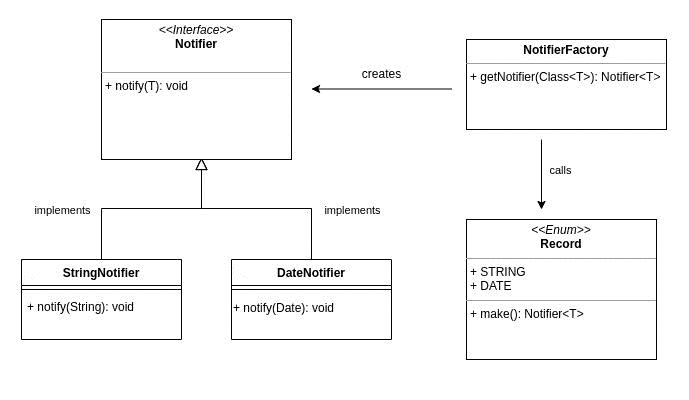

# 用 Java 中的泛型实现工厂模式

> 原文：<https://web.archive.org/web/20220930061024/https://www.baeldung.com/java-factory-pattern-generics>

## 1.概观

在本教程中，我们将学习如何在 Java 中用泛型实现工厂模式。

## 2.什么是工厂模式？

在面向对象编程中，工厂模式是一个[创造性的设计模式](/web/20221028202706/https://www.baeldung.com/creational-design-patterns)，它负责在被调用时创建对象。

**工厂是一个类，它通过方法调用创建原型类的对象，即接口:**

当我们想要创建一个公共接口的对象，同时对用户隐藏创建逻辑时，工厂模式是很好的。

## 3.是如何实现的？

现在让我们来学习如何实现它。首先，让我们看一下类图:

现在让我们实现图中的每个类。

### 3.1.实现`Notifier`接口

`Notifier`接口是一个原型，其他通知程序类实现了它:

[PRE0]

正如我们所见，`Notifier`类是一个泛型类，它有一个名为`notify`的方法。

### 3.2.实现`Notifier`类

现在让我们实现另外两个通知程序类:

[PRE1]

现在我们有两个使用`Notifier `接口的类——一个将输出简单的文本，另一个将发布日期。

### 3.3.实现工厂

每次调用工厂类的唯一方法`getNotifier()`时，它都会生成一个通知程序实例:

[PRE2]

在上面的代码中，`Record `是一个带有两个名为`STRING`和`DATE`的常量的枚举。

### 3.4.实施`Record`

**`Record`枚举保存有效通知类的记录，并在工厂类每次调用它时创建一个实例**:

[PRE3]

我们已经成功地实现了工厂模式。

## 4.使用工厂

让我们使用我们的`Main`类中的工厂:

[PRE4]

现在我们应该编译并运行我们的代码:

[PRE5]

正如我们所看到的，工厂已经成功地创建了两个适当类型的通知程序实例。

## 5.摘要

在本文中，我们学习了如何在 Java 中实现和使用工厂模式。

和往常一样，源代码可以在 GitHub 上的[处获得。](https://web.archive.org/web/20221028202706/https://github.com/eugenp/tutorials/tree/master/patterns-modules/design-patterns-creational)