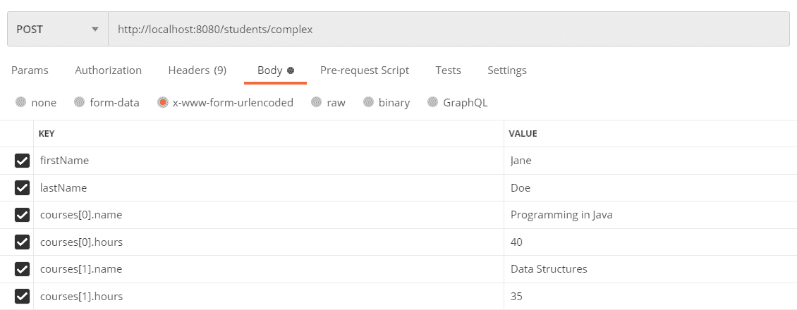

# 使用 Postman 将数组作为 x-www-form-urlencoded 的一部分发送

> 原文：<https://web.archive.org/web/20220930061024/https://www.baeldung.com/java-postman-send-array>

## 1.概观

在本教程中，我们将探索使用 Postman 发送数组作为`x-www-form-urlencoded`的一部分的方法。

W3C 委员会已经定义了多种格式，我们可以用它们在网络层发送数据。这些格式包括`form-data`、`raw`和`x-www-form-urlencoded`数据。默认情况下，我们使用后一种格式发送数据。

## 2.`x-www-form-urlencoded`

列出的格式描述了在 HTTP 消息正文中作为一个块发送的表单数据。它发送一个编码的表单数据集提交给服务器。**编码后的数据具有键值对的格式。**服务器必须支持内容类型。

使用此内容类型提交的表单符合以下编码模式:

*   控件名和值被转义。
*   “，”符号将分隔多个值。
*   “+”符号将替换所有空格字符。
*   保留字符应该遵循 RFC 17.38 符号。
*   所有非字母数字字符都使用百分比编码。
*   键用等号(' = ')与值分开，键-值对用&符号(' & ')彼此分开。

此外，数据的长度没有规定。但是，使用`x-www-form-urlencoded`数据类型有数据限制。因此，媒体服务器将拒绝超过配置中指定大小的请求。

此外，当发送二进制数据或包含非字母数字字符的值时，效率变得很低。**包含非字母数字字符的键和值是[百分比编码](https://web.archive.org/web/20221207012128/https://en.wikipedia.org/wiki/Percent-encoding#The_application/x-www-form-urlencoded_type)(也称为 URL 编码)，所以这种类型不适合二进制数据。**因此，我们应该考虑使用`form-data`内容类型来代替。

此外，我们不能用它来编码文件。它只能对 URL 参数或请求体中的数据进行编码。

## 3.发送数组

要在 Postman 中使用`x-www-form-urlencoded`类型，我们需要在请求的 body 选项卡中选择具有相同名称的单选按钮。

如前所述，请求由键值对组成。Postman 会在将数据发送到服务器之前对其进行编码。此外，它将对键和值进行编码。

现在，让我们看看如何在 Postman 中发送数组。

### 3.1.发送简单数组对象

我们将首先展示如何发送一个包含简单对象类型的简单数组对象，例如，`String`元素。

首先，让我们创建一个将数组作为实例变量的`Student`类:

```
class StudentSimple {

   private String firstName;
   private String lastName;
   private String[] courses;

   // getters and setters
}
```

其次，我们将定义一个将公开 REST 端点的控制器类:

```
@PostMapping(
  path = "/simple", 
  consumes = {MediaType.APPLICATION_FORM_URLENCODED_VALUE})
public ResponseEntity<StudentSimple> createStudentSimple(StudentSimple student) {
    return ResponseEntity.ok(student);
}
```

**当我们使用消费属性时，我们需要将`x-www-form-urlencoded`定义为控制器将从客户端接受的媒体类型。**否则，我们会得到 [`415 Unsupported Media Type`](/web/20221207012128/https://www.baeldung.com/spring-415-unsupported-mediatype) 错误。另外，我们需要省略`@RequestBody`注释，因为该注释不支持`x-www-form-urlencoded`内容类型。

最后，让我们在 Postman 中创建一个请求。最简单的方法是使用逗号('，')分隔值:

[](/web/20221207012128/https://www.baeldung.com/wp-content/uploads/2022/10/simple-array-postman-1.png)

但是，如果值本身包含逗号符号，这种方法可能会导致问题。我们可以通过分别设置每个值来解决这个问题。为了将元素设置到`courses`数组，我们需要使用同一个键提供键-值对:

[](/web/20221207012128/https://www.baeldung.com/wp-content/uploads/2022/10/simple-array-postman.png)

数组中元素的顺序将遵循请求中提供的顺序。

另外，方括号是可选的。另一方面，如果我们想向数组中的特定索引添加一个元素，我们可以通过在方括号中指定索引来实现:

[](/web/20221207012128/https://www.baeldung.com/wp-content/uploads/2022/10/simple-array-postman-index.png)

我们可以使用 [cURL](/web/20221207012128/https://www.baeldung.com/curl-rest) 请求来测试我们的应用程序:

```
curl -X POST \
  http://localhost:8080/students/simple \
  -H 'Content-Type: application/x-www-form-urlencoded' \
  -d 'firstName=Jane&lastName;=Doe&
        courses[2]=Programming+in+Java&
        courses[1]=Data+Structures&
        courses[0]=Linux+Basics'
```

### 3.2.发送复杂数组对象

现在，让我们来看看发送包含复杂对象的数组的方式。

首先，让我们定义代表单一课程的`Course`类:

```
class Course {

    private String name;
    private int hours;

    // getters and setters
}
```

接下来，我们将创建一个代表学生的类:

```
class StudentComplex {

    private String firstName;
    private String lastName;
    private Course[] courses;

    // getters and setters
}
```

让我们在控制器类中添加一个新的端点:

```
@PostMapping(
  path = "/complex",
  consumes = {MediaType.APPLICATION_FORM_URLENCODED_VALUE})
public ResponseEntity<StudentComplex> createStudentComplex(StudentComplex student) {
    return ResponseEntity.ok(student);
}
```

最后，让我们在 Postman 中创建一个请求。和前面的例子一样，为了向数组添加元素，我们需要使用同一个键提供键-值对:

[](/web/20221207012128/https://www.baeldung.com/wp-content/uploads/2022/10/complex-array-postman.png)

**这里，带索引的方括号是强制的。**为了给每个实例变量设置值，我们需要使用点('.')运算符，后跟变量名。

同样，我们可以使用 cURL 请求测试端点:

```
curl -X POST \
  http://localhost:8080/students/complex \
  -H 'Content-Type: application/x-www-form-urlencoded' \
  -d 'firstName=Jane&lastName;=Doe&
        courses[0].name=Programming+in+Java&
        courses[0].hours=40&
        courses[1].name=Data+Structures&
        courses[1].hours=35'
```

## 4.结论

在本文中，我们已经了解了如何在服务器端充分设置`Content-Type`以避免`Unsupported Media Type`错误。此外，我们已经解释了如何在 Postman 中使用`x-www-form-urlencoded`内容类型发送简单和复杂的数组。

和往常一样，所有的代码片段都可以在 GitHub 上找到[。](https://web.archive.org/web/20221207012128/https://github.com/eugenp/tutorials/tree/master/spring-web-modules/spring-rest-http-3)