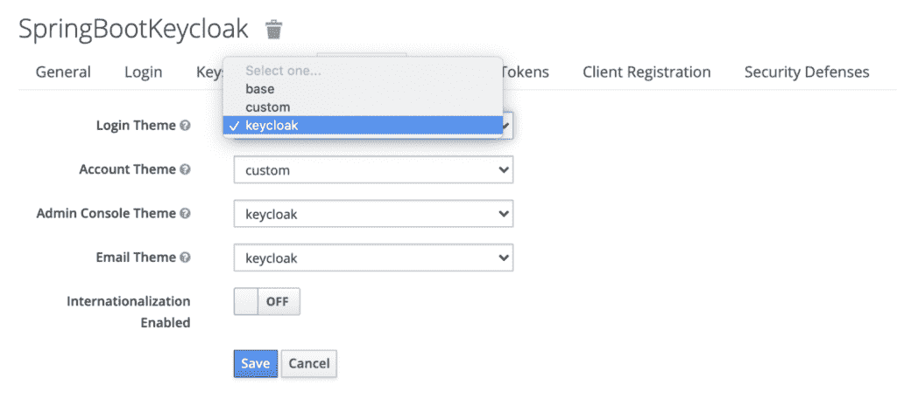
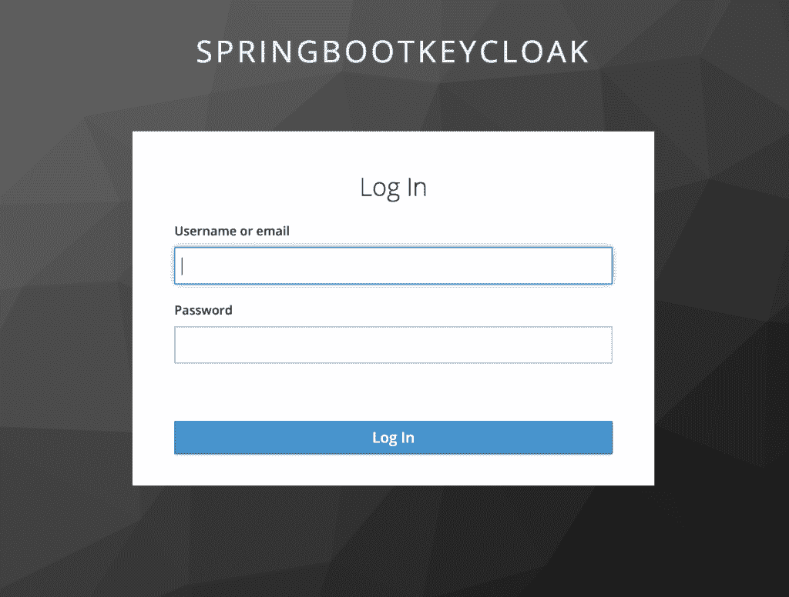
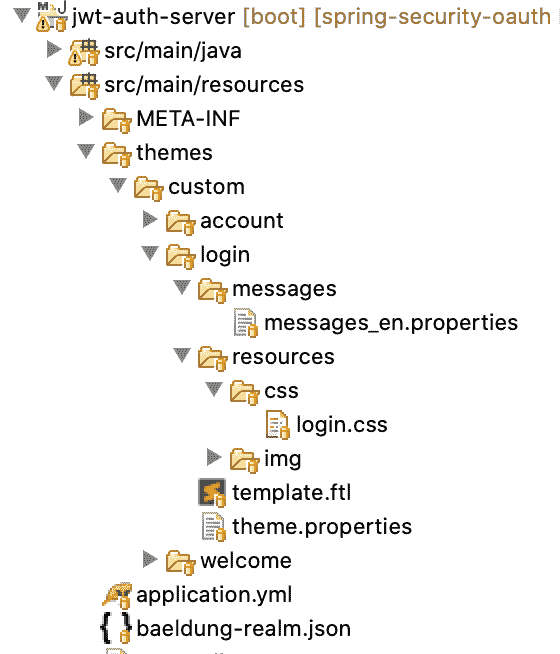
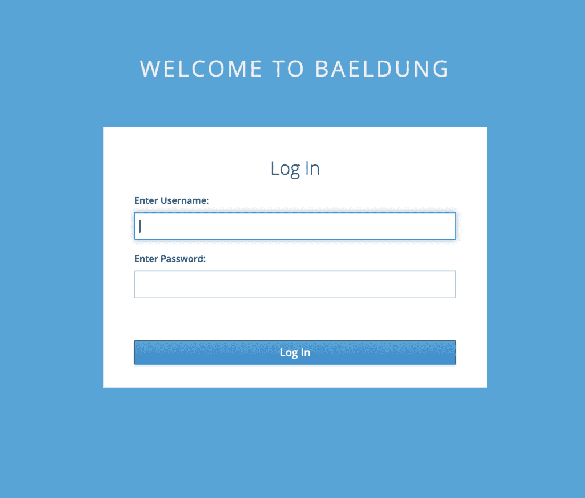

# 自定义 Keycloak 的登录页面

> 原文：<https://web.archive.org/web/20220930061024/https://www.baeldung.com/keycloak-custom-login-page>

## 1.概观

[Keycloak](https://web.archive.org/web/20221025121005/https://www.keycloak.org/) 是一个第三方授权服务器，用于管理我们的 web 或移动应用程序的认证和授权要求。它使用默认登录页面代表我们的应用程序登录用户。

在本教程中，我们将重点关注如何为我们的 Keycloak 服务器定制登录页面，这样我们就可以有不同的外观和感觉。我们将在独立服务器和嵌入式服务器中看到这种情况。

我们将在[的基础上为 Keycloak 教程](/web/20221025121005/https://www.baeldung.com/spring-keycloak-custom-themes)定制主题。

## 2.自定义独立的 Keycloak 服务器

继续我们的 [`custom`](/web/20221025121005/https://www.baeldung.com/spring-keycloak-custom-themes#default-themes) 主题的例子，让我们先看看独立服务器。

### 2.1.管理控制台设置

要启动服务器，让我们导航到保存 Keycloak 发行版的目录，并从它的`bin`文件夹中运行这个命令:

[PRE0]

一旦服务器启动，我们只需要刷新页面就可以看到我们的更改，这要感谢我们之前对 [`standalone.xml`](/web/20221025121005/https://www.baeldung.com/spring-keycloak-custom-themes#customization-example) 所做的修改。

现在让我们在`themes/custom`目录中创建一个名为`login`的新文件夹。为了简单起见，我们首先将`themes/keycloak/login`目录的所有内容复制到这里。这是默认的登录页面主题。

然后，我们将转到[管理控制台](https://web.archive.org/web/20221025121005/http://localhost:8180/auth/admin)，键入`initial1` / `zaq1!QAZ` 凭证，并转到我们领域的`Themes`选项卡:

我们将为`Login Theme`选择`custom`，并保存我们的更改。

有了这个设置，我们现在可以尝试一些定制。但在此之前，我们先来看看默认的[登录页面](https://web.archive.org/web/20221025121005/http://localhost:8180/auth/realms/SpringBootKeycloak/protocol/openid-connect/auth?response_type=code&client_id=login-app&scope=openid&redirect_uri=http://localhost:8081/):

### 2.2.添加自定义

现在假设我们需要改变背景。为此，我们将打开`login/resources/css/login.css`并更改类定义:

[PRE1]

要查看效果，让我们刷新页面:

接下来，让我们尝试更改用户名和密码的标签。

为此，我们需要在`theme/login/messages` 文件夹中创建一个新文件`messages_en.properties`。该文件覆盖给定属性使用的默认消息包:

[PRE2]

要进行测试，请再次刷新页面:

假设我们想要改变整个 HTML 或者它的一部分，我们需要覆盖 Keycloak 默认使用的 freemarker 模板。登录页面的默认模板保存在`base/login`目录中。

假设我们希望显示`WELCOME TO BAELDUNG`来代替`SPRINGBOOTKEYCLOAK`。

为此，我们需要将`base/login/template.ftl`复制到我们的`custom/login`文件夹中。

在复制的文件中，更改以下行:

[PRE3]

收件人:

[PRE4]

登录页面现在将显示我们的自定义消息，而不是域名。

## 3.定制嵌入式 Keycloak 服务器

这里的第一步是将我们为独立服务器更改的所有工件添加到我们的嵌入式授权服务器的源代码中。

因此，让我们在`src/main/resources/themes/custom`中创建一个新文件夹`login`，包含以下内容:

现在我们需要做的就是在我们的领域定义文件`baeldung-realm.json`中添加指令，以便`custom`用于我们的登录主题类型:

[PRE5]

我们已经将[重定向到`custom`主题目录](/web/20221025121005/https://www.baeldung.com/spring-keycloak-custom-themes#redirection)，这样我们的服务器就知道从哪里获取登录页面的主题文件。

为了测试，让我们点击[登录页面](8084/):

正如我们所看到的，之前为独立服务器所做的所有定制，比如背景、标签名称和页面标题，都出现在这里。

## 4.绕过 Keycloak 登录页面

从技术上来说，我们完全可以通过使用[密码或者直接访问授权](https://web.archive.org/web/20221025121005/https://oauth.net/2/grant-types/password/)流程来绕过 Keycloak 登录页面。然而，**强烈建议根本不要使用这种资助类型。**

在这种情况下，没有获得授权码，然后作为交换接收访问令牌的中间步骤。相反，我们可以通过 REST API 调用直接发送用户凭证，并获得访问令牌作为响应。

这实际上意味着我们可以使用我们的登录页面来收集用户的 id 和密码，以及客户端 id 和密码，并通过发送到其`token`端点的邮件将其发送给 Keycloak。

但是，由于 Keycloak 提供了丰富的登录选项功能集——如记住我、密码重置和 MFA——仅举几例，所以没有理由忽略它。

## 5.结论

在本教程中，**我们学习了如何更改 Keycloak 的默认登录页面并添加我们的定制**。

我们在独立实例和嵌入式实例中都看到了这一点。

最后，我们简要介绍了如何完全绕过 Keycloak 的登录页面，以及为什么不这样做。

和往常一样，源代码可以在 GitHub 上获得。对于独立服务器，它在[教程 GitHub](https://web.archive.org/web/20221025121005/https://github.com/eugenp/tutorials/tree/master/spring-boot-modules/spring-boot-keycloak) 上，对于嵌入式实例，它在 [OAuth GitHub](https://web.archive.org/web/20221025121005/https://github.com/Baeldung/spring-security-oauth/tree/master/oauth-jwt) 上。