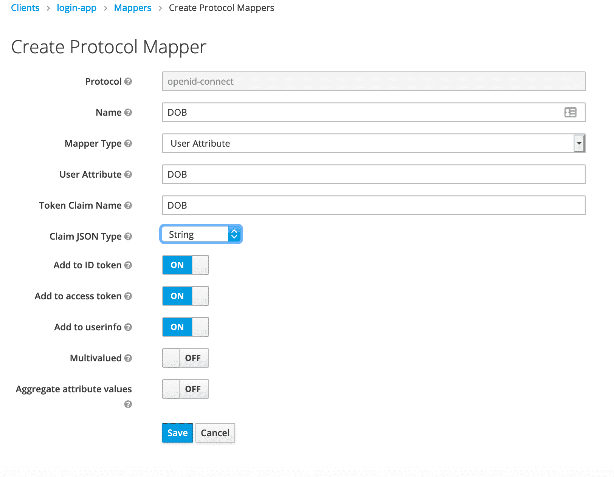

# 使用 Keycloak 自定义用户属性

> 原文:[https://web . archive . org/web/20220930061024/https://www . bael dung . com/key cloak-custom-user-attributes](https://web.archive.org/web/20220930061024/https://www.baeldung.com/keycloak-custom-user-attributes)

## 1.概观

Keycloak 是一个第三方授权服务器，管理我们的网络或移动应用程序的用户。

它提供了一些默认属性，比如为任何给定用户存储的名字、姓氏和电子邮件。但是很多时候，这些还不够，我们可能需要添加一些特定于我们的应用程序的额外用户属性。

在本教程中，我们将看到**如何向我们的 Keycloak 授权服务器添加自定义用户属性，并在基于 Spring 的后端**中访问它们。

首先，我们将看到一个独立的 Keycloak 服务器，然后是一个嵌入式的[服务器。](/web/20220625235456/https://www.baeldung.com/keycloak-embedded-in-spring-boot-app)

## 2.独立服务器

### 2.1.添加自定义用户属性

这里的第一步是进入 Keycloak 的管理控制台。为此，我们需要从 Keycloak 发行版的`bin`文件夹中运行这个命令来启动服务器:

```
./standalone.sh -Djboss.socket.binding.port-offset=100
```

然后我们需要去[管理控制台](https://web.archive.org/web/20220625235456/http://localhost:8180/auth/admin)，输入`initial1` / `zaq1!QAZ` 凭证。

接下来，我们将点击`Manage`选项卡下的`Users`，然后点击`View all users`:

[](/web/20220625235456/https://www.baeldung.com/wp-content/uploads/2020/09/ViewAllUsers-2048x902-1.png)

在这里我们可以看到我们之前添加的[用户](/web/20220625235456/https://www.baeldung.com/spring-boot-keycloak#create-userrole) : `user1`。

现在让我们点击它的`ID`并转到`Attributes`选项卡添加一个新的，`DOB`代表出生日期:

[](/web/20220625235456/https://www.baeldung.com/wp-content/uploads/2020/09/AddDOB-2048x519-1.png)

点击`Save`后，自定义属性被添加到用户信息中。

接下来，我们需要为这个属性添加一个映射作为自定义声明，以便它可以在用户令牌的 JSON 有效负载中使用。

为此，我们需要在管理控制台上访问应用程序的客户端。回想一下，前面我们已经创建了一个客户端， [`login-app`](/web/20220625235456/https://www.baeldung.com/spring-boot-keycloak#create-client) :

[](/web/20220625235456/https://www.baeldung.com/wp-content/uploads/2020/09/client_LoginApp-2048x521-1.png)

现在，让我们点击它并转到它的`Mappers`选项卡来创建一个新的映射:

[](/web/20220625235456/https://www.baeldung.com/wp-content/uploads/2020/09/mapper.png)

首先，我们将选择`Mapper Type`为`User Attribute`，然后将`Name`、`User Attribute`和`Token Claim Name`设置为`DOB`。`Claim JSON Type`应设置为`String`。

点击`Save`，我们的映射就准备好了。所以现在，我们可以从 Keycloak 端接收`DOB`作为自定义用户属性。

在下一节中，**我们将看到如何通过 API 调用**来访问它。

### 2.2.访问自定义用户属性

在我们的 [Spring Boot 应用程序](/web/20220625235456/https://www.baeldung.com/spring-boot-keycloak#springboot)的基础上，让我们添加一个新的 REST 控制器来获得我们添加的用户属性:

```
@Controller
public class CustomUserAttrController {

    @GetMapping(path = "/users")
    public String getUserInfo(Model model) {
        KeycloakAuthenticationToken authentication = (KeycloakAuthenticationToken) 
          SecurityContextHolder.getContext().getAuthentication();

        Principal principal = (Principal) authentication.getPrincipal();        
        String dob="";

        if (principal instanceof KeycloakPrincipal) {
            KeycloakPrincipal kPrincipal = (KeycloakPrincipal) principal;
            IDToken token = kPrincipal.getKeycloakSecurityContext().getIdToken();

            Map<String, Object> customClaims = token.getOtherClaims();

            if (customClaims.containsKey("DOB")) {
                dob = String.valueOf(customClaims.get("DOB"));
            }
        }

        model.addAttribute("username", principal.getName());
        model.addAttribute("dob", dob);
        return "userInfo";
    }
} 
```

正如我们所看到的，这里我们首先从安全上下文中获得了`KeycloakAuthenticationToken`，然后从中提取了`Principal`。铸造成`KeycloakPrincipal`后，我们获得了它的`IDToken`。

`DOB`然后可以从这个`IDToken`的`OtherClaims`中提取出来。

这是一个名为`userInfo.html,`的模板，我们将使用它来显示这些信息:

```
<div id="container">
    <h1>Hello, <span th:text="${username}">--name--</span>.</h1>
    <h3>Your Date of Birth as per our records is <span th:text="${dob}"/>.</h3>
</div>
```

### 2.3.测试

在启动启动应用程序时，我们应该导航到`[http://localhost:8081/users](https://web.archive.org/web/20220625235456/http://localhost:8081/users).` ,我们将首先被要求输入凭证。

输入`user1`的凭证后，我们应该会看到这个页面:

[](/web/20220625235456/https://www.baeldung.com/wp-content/uploads/2020/09/DOB.png)

## 3.嵌入式服务器

现在让我们看看如何在嵌入式 Keycloak 实例上实现同样的事情。

### 3.1.添加自定义用户属性

基本上，我们需要在这里做同样的步骤，只是**我们需要在我们的领域定义文件`baeldung-realm.json`** 中将它们保存为[预配置](/web/20220625235456/https://www.baeldung.com/keycloak-embedded-in-spring-boot-app#keycloak-config)。

要将属性`DOB`添加到我们的用户`[[email protected]](/web/20220625235456/https://www.baeldung.com/cdn-cgi/l/email-protection)`，首先，我们需要配置它的属性:

```
"attributes" : {
    "DOB" : "1984-07-01"
},
```

然后为`DOB`添加协议映射器:

```
"protocolMappers": [
    {
    "id": "c5237a00-d3ea-4e87-9caf-5146b02d1a15",
    "name": "DOB",
    "protocol": "openid-connect",
    "protocolMapper": "oidc-usermodel-attribute-mapper",
    "consentRequired": false,
    "config": {
        "userinfo.token.claim": "true",
        "user.attribute": "DOB",
        "id.token.claim": "true",
        "access.token.claim": "true",
        "claim.name": "DOB",
        "jsonType.label": "String"
        }
    }
]
```

这就是我们所需要的。

既然我们已经看到了添加定制用户属性的授权服务器部分，那么是时候看看[资源服务器](/web/20220625235456/https://www.baeldung.com/spring-security-oauth-resource-server)如何访问用户的`DOB`。

### 3.2.访问自定义用户属性

在资源服务器端，自定义属性将简单地作为 [`AuthenticationPrincipal`](https://web.archive.org/web/20220625235456/https://docs.spring.io/spring-security/site/docs/current/api/org/springframework/security/core/annotation/AuthenticationPrincipal.html) 中的声明值供我们使用。

让我们为它编写一个 API:

```
@RestController
public class CustomUserAttrController {
    @GetMapping("/user/info/custom")
    public Map<String, Object> getUserInfo(@AuthenticationPrincipal Jwt principal) {
        return Collections.singletonMap("DOB", principal.getClaimAsString("DOB"));
    }
}
```

### 3.3.测试

现在让我们使用 JUnit 来测试它。

我们首先需要获得一个访问令牌，然后调用资源服务器上的`/user/info/custom` API 端点:

```
@Test
public void givenUserWithReadScope_whenGetUserInformationResource_thenSuccess() {
    String accessToken = obtainAccessToken("read");
    Response response = RestAssured.given()
      .header(HttpHeaders.AUTHORIZATION, "Bearer " + accessToken)
      .get(userInfoResourceUrl);

    assertThat(response.as(Map.class)).containsEntry("DOB", "1984-07-01");
}
```

如我们所见，这里我们验证了**得到的`DOB`值与我们添加到用户属性**中的值相同。

## 4.结论

在本教程中，我们学习了如何在 Keycloak 中为用户添加额外的属性。

我们在独立实例和嵌入式实例中都看到了这一点。我们还看到了在两种场景中如何在后端的 REST API 中访问这些自定义声明。

和往常一样，源代码可以在 GitHub 上获得。对于独立服务器，它在[教程 GitHub](https://web.archive.org/web/20220625235456/https://github.com/eugenp/tutorials/tree/master/spring-boot-modules/spring-boot-keycloak) 上，对于嵌入式实例，它在 [OAuth GitHub](https://web.archive.org/web/20220625235456/https://github.com/Baeldung/spring-security-oauth/tree/master/oauth-jwt) 上。