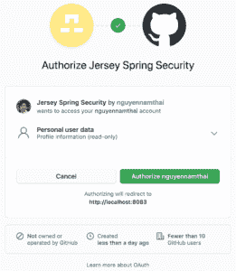

# 在 Jersey 应用程序中使用 Spring Security 进行社交登录

> 原文:[https://web . archive . org/web/20220930061024/https://www . bael dung . com/spring-security-social-log in-jersey](https://web.archive.org/web/20220930061024/https://www.baeldung.com/spring-security-social-login-jersey)

## 1.概观

安全是春天生态系统中的一等公民。所以，OAuth2 几乎不需要配置就能和 Spring Web MVC 一起工作也就不足为奇了。

然而，原生 Spring 解决方案并不是实现表示层的唯一方式。兼容 JAX-RS 的实现 Jersey T1 也可以与 Spring OAuth2 协同工作。

在本教程中，**我们将了解如何使用 Spring Social Login 保护 Jersey 应用程序，**它是使用 OAuth2 标准实现的。

## 2.Maven 依赖性

让我们添加[spring-boot-starter-jersey](https://web.archive.org/web/20220930101318/https://search.maven.org/search?q=g:org.springframework.boot%20a:spring-boot-starter-jersey)工件，将 Jersey 集成到 Spring Boot 应用程序中:

```
<dependency>
    <groupId>org.springframework.boot</groupId>
    <artifactId>spring-boot-starter-jersey</artifactId>
</dependency>
```

要配置安全 OAuth2，我们需要[spring-boot-starter-Security](https://web.archive.org/web/20220930101318/https://search.maven.org/search?q=g:org.springframework.boot%20a:spring-boot-starter-security)和[spring-Security-oauth 2-client](https://web.archive.org/web/20220930101318/https://search.maven.org/search?q=g:org.springframework.security%20a:spring-security-oauth2-client):

```
<dependency>
    <groupId>org.springframework.boot</groupId>
    <artifactId>spring-boot-starter-security</artifactId>
</dependency>
<dependency>
    <groupId>org.springframework.security</groupId>
    <artifactId>spring-security-oauth2-client</artifactId>
</dependency> 
```

我们将使用[Spring Boot 启动器父版本 2](https://web.archive.org/web/20220930101318/https://search.maven.org/search?q=g:org.springframework.boot%20a:spring-boot-dependencies)来管理所有这些依赖关系

## 3.运动衫表示层

我们需要一个带有几个端点的资源类来使用 Jersey 作为表示层。

### 3.1.资源类

下面是包含端点定义的类:

```
@Path("/")
public class JerseyResource {
    // endpoint definitions
}
```

这个类本身非常简单——它只有一个`@Path`注释。这个注释**的值标识了类体中所有端点的基路径。**

值得一提的是，这个资源类没有为组件扫描提供原型注释。其实连春豆都不需要。原因是我们不依赖 Spring 来处理请求映射。

### 3.2.登录页面

下面是处理登录请求的方法:

```
@GET
@Path("login")
@Produces(MediaType.TEXT_HTML)
public String login() {
    return "Log in with <a href=\"/oauth2/authorization/github\">GitHub</a>";
}
```

这个方法为目标为`/login`端点的 GET 请求返回一个字符串。`text/html`内容类型指示用户的浏览器显示带有可点击链接的响应。

**我们将使用 GitHub 作为 OAuth2 提供者，因此有了链接`/oauth2/authorization/github`。**这个链接会触发到 GitHub 授权页面的重定向。

### 3.3.主页

让我们定义另一种方法来处理对根路径的请求:

```
@GET
@Produces(MediaType.TEXT_PLAIN)
public String home(@Context SecurityContext securityContext) {
    OAuth2AuthenticationToken authenticationToken = (OAuth2AuthenticationToken) securityContext.getUserPrincipal();
    OAuth2AuthenticatedPrincipal authenticatedPrincipal = authenticationToken.getPrincipal();
    String userName = authenticatedPrincipal.getAttribute("login");
    return "Hello " + userName;
}
```

该方法返回主页，主页是包含登录用户名的字符串。注意，在本例中，**我们从`login`属性中提取了用户名。**另一个 OAuth2 提供商可能会对用户名使用不同的属性。

显然，上述方法只适用于经过身份验证的请求。**如果请求未经认证，它将被重定向到`login`端点。**我们将在第 4 节看到如何配置这个重定向。

### 3.4.向 Spring 容器注册球衣

让我们向 servlet 容器注册资源类，以启用 Jersey 服务。幸运的是，这很简单:

```
@Component
public class RestConfig extends ResourceConfig {
    public RestConfig() {
        register(JerseyResource.class);
    }
}
```

通过在一个`ResourceConfig`子类中注册`JerseyResource`，我们通知 servlet 容器该资源类中的所有端点。

最后一步是**向 Spring 容器注册`ResourceConfig`子类，在本例中是`RestConfig`。**我们用`@Component`注释实现了这个注册。

## 4.配置 Spring 安全性

我们可以像配置普通 Spring 应用程序一样配置 Jersey 的安全性:

```
@Configuration
public class SecurityConfig extends WebSecurityConfigurerAdapter {
    @Override
    protected void configure(HttpSecurity http) throws Exception {
        http
          .authorizeRequests()
          .antMatchers("/login")
          .permitAll()
          .anyRequest()
          .authenticated()
          .and()
          .oauth2Login()
          .loginPage("/login");
    }
}
```

给定链中最重要的方法是`oauth2Login`。这个方法**使用 OAuth 2.0 提供者配置认证支持。**在本教程中，提供者是 GitHub。

另一个值得注意的配置是登录页面。通过向`loginPage`方法提供字符串`“/login”`，我们告诉 Spring**将未经认证的请求重定向到`/login`端点。**

请注意，默认安全配置还提供了一个在`/login`自动生成的页面。因此，即使我们没有配置登录页面，未经身份验证的请求仍然会被重定向到该端点。

默认配置和显式设置的区别在于，在默认情况下，应用程序返回生成的页面，而不是我们的自定义字符串。

## 5.应用程序配置

为了拥有一个受 OAuth2 保护的应用程序，我们需要向 OAuth2 提供者注册一个客户端。之后，将客户端的凭证添加到应用程序中。

### 5.1.注册 OAuth2 客户端

让我们从[注册一个 GitHub 应用](https://web.archive.org/web/20220930101318/https://github.com/settings/developers)开始注册过程。登陆 GitHub 开发者页面后，点击`New OAuth App`按钮打开`Register a new OAuth application`表单。

接下来，用适当的值填写显示的表单。对于应用程序名称，输入任何使应用程序可识别的字符串。首页网址可以是`http://localhost:8083,`，授权回调网址可以是`http://localhost:8083/login/oauth2/code/github`。

回调 URL 是用户通过 GitHub 验证并授予对应用程序的访问权限后，浏览器重定向到的路径。

注册表可能是这样的:

[](/web/20220930101318/https://www.baeldung.com/wp-content/uploads/2020/09/register-a-new-oauth-application-300x294-1.png)

现在，点击`Register application`按钮。**浏览器应该会重定向到 GitHub 应用程序的主页，显示客户端 ID 和客户端密码。**

### 5.2.配置 Spring Boot 应用程序

让我们向类路径添加一个名为`jersey-application.properties`的属性文件:

```
server.port=8083
spring.security.oauth2.client.registration.github.client-id=<your-client-id>
spring.security.oauth2.client.registration.github.client-secret=<your-client-secret>
```

**记得用我们自己的 GitHub 应用程序中的值替换占位符`<your-client-id>`和`<your-client-secret>`。**

最后，将该文件作为属性源添加到 Spring Boot 应用程序中:

```
@SpringBootApplication
@PropertySource("classpath:jersey-application.properties")
public class JerseyApplication {
    public static void main(String[] args) {
        SpringApplication.run(JerseyApplication.class, args);
    }
}
```

## 6.行动中的认证

让我们看看如何在注册 GitHub 后登录我们的应用程序。

### 6.1.访问应用程序

让我们启动应用程序，然后访问地址为`localhost:8083`的主页。由于请求未经验证，我们将被重定向到`login`页面:

[](/web/20220930101318/https://www.baeldung.com/wp-content/uploads/2020/09/login-page-300x46-1.png)

现在，当我们点击 GitHub 链接时，浏览器将重定向到 GitHub 授权页面:

[](/web/20220930101318/https://www.baeldung.com/wp-content/uploads/2020/09/github-authorize-page-261x300-1.png)

通过查看 URL，我们可以看到重定向的请求携带了许多查询参数，如`response_type`、`client_id`和`scope`:

```
https://github.com/login/oauth/authorize?response_type=code&client;_id=c30a16c45a9640771af5&scope;=read:user&state;=dpTme3pB87wA7AZ--XfVRWSkuHD3WIc9Pvn17yeqw38%3D&redirect;_uri=http://localhost:8083/login/oauth2/code/github
```

`response_type`的值为`code`，表示 OAuth2 授权类型为授权码。同时，`client_id`参数有助于识别我们的应用程序。关于所有参数的含义，请前往[GitHub 开发者页面](https://web.archive.org/web/20220930101318/https://docs.github.com/en/developers/apps/authorizing-oauth-apps#parameters)。

当授权页面出现时，我们需要授权应用程序继续。授权成功后，浏览器将重定向到应用程序中预定义的端点，以及一些查询参数:

```
http://localhost:8083/login/oauth2/code/github?code=561d99681feeb5d2edd7&state;=dpTme3pB87wA7AZ--XfVRWSkuHD3WIc9Pvn17yeqw38%3D
```

在后台，应用程序将把授权码换成访问令牌。之后，它使用这个令牌获取登录用户的信息。

对`localhost:8083/login/oauth2/code/github`的请求返回后，浏览器回到主页。这一次，**我们应该会看到一条带有我们自己的用户名**的问候消息:

[](/web/20220930101318/https://www.baeldung.com/wp-content/uploads/2020/09/home-page-300x47-1.png)

### 6.2.如何获取用户名？

很明显，问候信息中的用户名是我们的 GitHub 用户名。此时，可能会出现一个问题:我们如何从经过身份验证的用户那里获取用户名和其他信息？

在我们的例子中，我们从`login`属性中提取了用户名。然而，这并不是所有 OAuth2 提供者都一样的。换句话说，**提供者可以根据自己的判断提供某些属性的数据。**因此，我们可以说在这方面根本没有标准。

在 GitHub 的例子中，我们可以在参考文档中找到我们需要的属性。同样，其他 OAuth2 提供者也提供了他们自己的参考。

另一个解决方案是**我们可以在调试模式下启动应用程序，并在`OAuth2AuthenticatedPrincipal`对象创建后设置一个断点。**当遍历这个对象的所有属性时，我们会洞察用户的信息。

## 7.测试

让我们编写一些测试来验证应用程序的行为。

### 7.1.设置环境

下面是保存我们的测试方法的类:

```
@RunWith(SpringRunner.class)
@SpringBootTest(webEnvironment = RANDOM_PORT)
@TestPropertySource(properties = "spring.security.oauth2.client.registration.github.client-id:test-id")
public class JerseyResourceUnitTest {
    @Autowired
    private TestRestTemplate restTemplate;

    @LocalServerPort
    private int port;

    private String basePath;

    @Before
    public void setup() {
        basePath = "http://localhost:" + port + "/";
    }

    // test methods
}
```

我们没有使用真正的 GitHub 客户端 ID，**而是为 OAuth2 客户端定义了一个测试 ID。**这个 ID 然后被设置为`spring.security.oauth2.client.registration.github.client-id`属性。

这个测试类中的所有注释在 Spring Boot 测试中都很常见，因此我们不会在本教程中涉及它们。如果有任何注释不清楚，请前往 Spring Boot 的[测试，春季](/web/20220930101318/https://www.baeldung.com/spring-boot-testing)的[集成测试，或](/web/20220930101318/https://www.baeldung.com/integration-testing-in-spring)[探索 Spring Boot TestRestTemplate](/web/20220930101318/https://www.baeldung.com/spring-boot-testresttemplate) 。

### 7.2.主页

我们将证明，当未经身份验证的用户试图访问主页时，**他们将被重定向到登录页面进行身份验证:**

```
@Test
public void whenUserIsUnauthenticated_thenTheyAreRedirectedToLoginPage() {
    ResponseEntity<Object> response = restTemplate.getForEntity(basePath, Object.class);
    assertThat(response.getStatusCode()).isEqualTo(HttpStatus.FOUND);
    assertThat(response.getBody()).isNull();

    URI redirectLocation = response.getHeaders().getLocation();
    assertThat(redirectLocation).isNotNull();
    assertThat(redirectLocation.toString()).isEqualTo(basePath + "login");
}
```

### 7.3.登录页面

让我们验证**访问登录页面将导致授权路径被返回:**

```
@Test
public void whenUserAttemptsToLogin_thenAuthorizationPathIsReturned() {
    ResponseEntity response = restTemplate.getForEntity(basePath + "login", String.class);
    assertThat(response.getHeaders().getContentType()).isEqualTo(TEXT_HTML);
    assertThat(response.getBody()).isEqualTo("Log in with <a href="\"/oauth2/authorization/github\"">GitHub</a>");
}
```

### 7.4.授权端点

最后，当向授权端点发送请求时，**浏览器将使用适当的参数重定向到 OAuth2 提供者的授权页面:**

```
@Test
public void whenUserAccessesAuthorizationEndpoint_thenTheyAresRedirectedToProvider() {
    ResponseEntity response = restTemplate.getForEntity(basePath + "oauth2/authorization/github", String.class);
    assertThat(response.getStatusCode()).isEqualTo(HttpStatus.FOUND);
    assertThat(response.getBody()).isNull();

    URI redirectLocation = response.getHeaders().getLocation();
    assertThat(redirectLocation).isNotNull();
    assertThat(redirectLocation.getHost()).isEqualTo("github.com");
    assertThat(redirectLocation.getPath()).isEqualTo("/login/oauth/authorize");

    String redirectionQuery = redirectLocation.getQuery();
    assertThat(redirectionQuery.contains("response_type=code"));
    assertThat(redirectionQuery.contains("client_id=test-id"));
    assertThat(redirectionQuery.contains("scope=read:user"));
}
```

## 8.结论

在本教程中，我们已经用一个 Jersey 应用程序设置了 Spring Social Login。本教程还包括向 GitHub OAuth2 提供者注册应用程序的步骤。

完整的源代码可以在 GitHub 上找到[。](https://web.archive.org/web/20220930101318/https://github.com/eugenp/tutorials/tree/master/spring-security-modules/spring-security-oauth2)