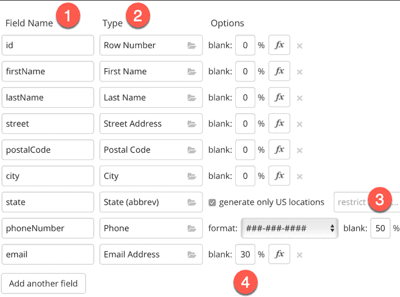

# 减少 JSON 数据大小

> 原文：<https://web.archive.org/web/20220930061024/https://www.baeldung.com/json-reduce-data-size>

## 1.介绍

Java 应用程序经常使用 JSON 作为发送和接收数据的通用格式。此外，它还被用作存储数据的序列化协议。随着 JSON 数据变小，我们的应用程序变得更便宜、更快。

在本教程中，我们将看看在我们的 Java 应用程序中减少 [JSON](/web/20221016015348/https://www.baeldung.com/java-org-json) 大小的各种方法。

## 2.领域模型和测试数据

让我们用一些联系数据为`Customer`创建一个域模型:

[PRE0]

请注意，除了`phoneNumber`和`email`之外，所有字段都是必填的。

为了正确测试 JSON 数据大小的差异，我们至少需要几百个`Customer`实例。他们必须有不同的数据，使我们的测试更加逼真。数据生成网站`[mockaroo](https://web.archive.org/web/20221016015348/https://www.mockaroo.com/)`可以帮助我们。我们可以在那里免费创建 1000 个 JSON 数据记录，采用我们自己的格式，并带有真实的测试数据。

让我们为我们的领域模型配置`mockaroo`:

以下是一些需要记住的事项:

*   这是我们指定字段名称的地方
*   这里我们选择了字段的数据类型
*   模拟数据中 50%的电话号码是空的
*   30%的电子邮件地址也是空的

下面的所有代码示例都使用了来自`mockaroo`的 1000 名客户的相同数据。我们使用工厂方法`Customer.fromMockFile()` 读取该文件，并将其转换成`Customer`对象。

我们将使用 [Jackson](/web/20221016015348/https://www.baeldung.com/jackson) 作为我们的 JSON 处理库。

## 3.带有 Jackson 默认选项的 JSON 数据大小

让我们用默认的 Jackson 选项为 JSON 编写一个 Java 对象:

[PRE1]

让我们看看第一个`Customer`的模拟数据:

[PRE2]

**当使用默认 Jackon 选项时，所有 1000 个客户的 JSON 数据字节数组的大小为 181.0 KB**。

## 4.用`gzip`压缩

作为文本数据，JSON 数据可以很好地压缩。这就是为什么`gzip` 是我们减少 JSON 数据大小的第一选择。而且，它可以自动应用于发送和接收 JSON 的通用协议 HTTP 中。

**让我们用默认的 Jackson 选项生成 JSON，并用`gzip`压缩它。这导致 45.9 KB，仅为原始大小的 25.3%**。因此，如果我们能够通过配置启用`gzip`压缩，我们将在不改变 Java 代码的情况下将 JSON 数据大小减少 75%!

如果我们的 Spring Boot 应用程序将 JSON 数据交付给其他服务或前端，那么我们将在 Spring Boot 配置中启用`gzip`压缩。让我们看看 YAML 语法中的典型压缩配置:

[PRE3]

首先，我们通过将`enabled`设置为 true 来启用压缩。然后，我们通过将`application/json`添加到`mime-types`列表中，专门启用了 JSON 数据压缩。最后，注意我们将`min-response-size`设置为 1024 字节长。这是因为如果我们压缩少量数据，我们可能会产生比原始数据更大的数据。

通常，代理如 NGINX T1 或 web 服务器如 T2 Apache HTTP Server T3 会将 JSON 数据传递给其他服务或前端。在这些工具中配置 JSON 数据压缩超出了本教程的范围。

[之前关于`gzip`](/web/20221016015348/https://www.baeldung.com/linux/gzip-and-gunzip) 的教程告诉我们`gzip`有各种压缩级别。我们的代码示例使用默认 Java 压缩级别的`gzip`。对于相同的 JSON 数据，Spring Boot、代理或 web 服务器可能会得到不同的压缩结果。

如果我们使用 JSON 作为序列化协议来存储数据，我们将需要自己压缩和解压缩数据。

## 5.JSON 中较短的字段名

最佳实践是使用既不太短也不太长的字段名。为了便于演示，我们省略这一点:我们将在 JSON 中使用单字符字段名，但是我们不会更改 Java 字段名。这减少了 JSON 数据的大小，但是降低了 JSON 的可读性。因为它还需要更新所有服务和前端，所以我们可能只在存储数据时使用这些短字段名:

[PRE4]

用 Jackson 很容易改变 JSON 字段名，同时保持 Java 字段名不变。我们将使用`@JsonProperty`注释:

[PRE5]

**使用单字符字段名会导致数据是原始大小的 72.5%。此外，使用`gzip will` 压缩到 23.8%。**这比我们用`gzip`简单压缩原始数据得到的 25.3%小不了多少。我们总是需要寻找一个合适的成本效益关系。在大多数情况下，不建议为了小的尺寸增益而失去可读性。

## 6.序列化为数组

让我们看看如何通过完全省略字段名来进一步减小 JSON 数据的大小。我们可以通过在 JSON 中存储一个`customers`数组来实现这一点。请注意，我们还会降低可读性。我们还需要更新所有使用我们 JSON 数据的服务和前端:

[PRE6]

**将`Customer`存储为数组导致输出是原始大小的 53.1%，使用`gzip`压缩后是 22.0%。**这是我们迄今为止最好的成绩。尽管如此，22%并不比我们仅仅用`gzip`压缩原始数据得到的 25.3%小很多。

为了将客户序列化为数组，我们需要完全控制 JSON 序列化。再次参考我们的[杰克逊](/web/20221016015348/https://www.baeldung.com/jackson-object-mapper-tutorial)教程获得更多的例子。

## 7.不包括`null`值

Jackson 和其他 JSON 处理库在读写 JSON 时可能无法正确处理 JSON `null`值。例如，当遇到 Java `null`值时，Jackson 默认写入一个 JSON `null`值。这就是为什么**删除 JSON 数据中的空字段**是个好习惯。这将空值的初始化留给了每个 JSON 处理库，并减少了 JSON 数据的大小。

在我们的模拟数据中，我们将 50%的电话号码和 30%的电子邮件地址设置为空。省略这些`null`值会将我们的 JSON 数据大小减少到 166.8kB 或原始数据大小的 92.1%。然后，`gzip` 压缩会把它降到 24.9%。

现在，**如果我们将忽略的`null`值与上一节中较短的字段名结合起来，那么我们将获得更显著的节省:原始大小的 68.3%，使用`gzip`** 的 23.4%。

我们可以在 Jackson [中为每个类](/web/20221016015348/https://www.baeldung.com/jackson-ignore-null-fields#on-class)或者为所有类全局配置[中`null`值字段的省略。](/web/20221016015348/https://www.baeldung.com/jackson-ignore-null-fields#globally)

## 8.新域类

到目前为止，我们通过将 JSON 数据序列化为数组，实现了最小的 JSON 数据大小。进一步减少这种情况的一个方法是一个新的领域模型，它包含更少的字段。但是我们为什么要这么做呢？

让我们设想一个 JSON 数据的前端，它将所有客户显示为一个包含两列的表:姓名和街道地址。让我们专门为这个前端编写 JSON 数据:

[PRE7]

注意我们是如何将姓名字段连接到`name`并将地址字段连接到`address`的。另外，我们漏掉了`email`和`phoneNumber`。

这应该会产生更小的 JSON 数据。它还节省了前端连接`Customer`字段的时间。但不利的一面是，这个**将我们的后端与前端**紧密耦合。

让我们为这个前端创建一个新的域类`CustomerSlim`:

[PRE8]

如果我们将测试数据转换成这个新的`CustomerSlim`域类，我们将把它减少到原始大小的 46.1%。将使用默认的杰克逊设置。如果我们使用`gzip`，它会下降到 15.1%。这个最后的结果已经比之前的最好结果 22.0%有了很大的提高。

接下来，如果我们也使用单个字符的字段名，这将使我们减少到原始大小的 40.7%，而`gzip`将进一步减少到 14.7%。这个结果只是我们用 Jackson 默认设置达到的超过 15.1%的小增益。

`CustomerSlim` 中没有字段是可选的，因此省略空值对 JSON 数据大小没有影响。

我们最后的优化是数组的序列化。**通过将`CustomerSlim`序列化为一个数组，我们获得了最好的结果:原始大小的 34.2%，使用`gzip`时为 14.2%。**因此，即使没有压缩，我们也会删除将近三分之二的原始数据。压缩将我们的 JSON 数据缩小到原来的七分之一！

## 9.结论

在本文中，我们首先看到了为什么我们需要减少 JSON 数据的大小。接下来，我们学习了减少 JSON 数据大小的各种方法。最后，我们学习了如何使用一个定制到一个前端的域模型来进一步减少 JSON 数据的大小。

完整的代码一如既往地在 GitHub 上[可用。](https://web.archive.org/web/20221016015348/https://github.com/eugenp/tutorials/tree/master/json-modules/json)