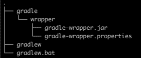

# Gradle 包装指南

> 原文:[https://web . archive . org/web/20220930061024/https://www . bael dung . com/grad le-wrapper](https://web.archive.org/web/20220930061024/https://www.baeldung.com/gradle-wrapper)

## 1.概观

开发人员通常使用 Gradle 来管理他们项目的构建生命周期。这是所有新 Android 项目的默认构建工具。

在本教程中，我们将了解 Gradle Wrapper，一个附带的实用程序，它使项目的分发变得更加容易。

## 2.度包装器

要构建一个基于 Gradle 的项目，我们需要在我们的机器上安装 Gradle。然而，如果我们安装的版本与项目的版本不匹配，我们可能会面临许多不兼容的问题。

Gradle Wrapper，简称`Wrapper` ，解决了这个问题。这是一个运行 Gradle 任务的脚本，声明了版本。如果没有安装声明的版本，Wrapper 会安装所需的版本。

包装器的主要好处是我们可以:

*   **在任何机器上用包装器构建一个项目，而不需要先安装 Gradle**
*   有一个固定的版本。这在 CI 管道上产生了可重用的和更健壮的构建
*   通过更改包装定义，轻松升级到新的 Gradle 版本

在接下来的部分中，我们将运行要求本地安装 [Gradle 的 Gradle 任务](https://web.archive.org/web/20221013192236/https://gradle.org/install/)。

### 2.1.生成包装文件

要使用包装器，我们需要生成一些特定的文件。**我们将使用名为`wrapper.`** 的内置 Gradle 任务生成这些文件。注意，我们只需要生成这些文件一次。

现在，让我们运行项目目录中的`wrapper`任务:

```
$ gradle wrapper 
```

让我们看看这个命令的输出:

[](/web/20221013192236/https://www.baeldung.com/wp-content/uploads/2020/09/gradle-wrapper.png)

让我们看看这些文件是什么:

*   `gradle-wrapper.jar`包含下载`gradle-wrapper.properties `文件中指定的梯度分布的代码
*   包含包装器运行时属性——最重要的是，与当前项目兼容的 Gradle 发行版的版本
*   是用包装器执行 Gradle 任务的脚本
*   `gradlew.bat`是用于 Windows 机器的`gradlew`等价批处理脚本

默认情况下，`wrapper`任务使用机器上当前安装的 Gradle 版本生成包装文件。如果需要，我们可以指定另一个版本:

```
$ gradle wrapper --gradle-version 6.3 
```

**我们建议将包装文件签入** **像 GitHub 这样的源代码控制系统**。通过这种方式，我们确保其他开发人员可以运行该项目，而无需安装 Gradle。

### 2.2.使用包装器运行 Gradle 命令

**用** `**gradlew**.`替换`gradle`，我们可以用包装器运行任何 Gradle 任务

要列出可用的任务，我们可以使用`gradlew tasks`命令:

```
$ gradlew tasks
```

让我们来看看输出:

```
Help tasks
----------
buildEnvironment - Displays all buildscript dependencies declared in root project 'gradle-wrapper'.
components - Displays the components produced by root project 'gradle-wrapper'. [incubating]
dependencies - Displays all dependencies declared in root project 'gradle-wrapper'.
dependencyInsight - Displays the insight into a specific dependency in root project 'gradle-wrapper'.
dependentComponents - Displays the dependent components of components in root project 'gradle-wrapper'. [incubating]
help - Displays a help message.
model - Displays the configuration model of root project 'gradle-wrapper'. [incubating]
outgoingVariants - Displays the outgoing variants of root project 'gradle-wrapper'.
projects - Displays the sub-projects of root project 'gradle-wrapper'.
properties - Displays the properties of root project 'gradle-wrapper'.
tasks - Displays the tasks runnable from root project 'gradle-wrapper'.
```

正如我们所看到的，输出与使用`gradle`命令运行该任务时得到的输出相同。

## 3.常见问题

现在，让我们看看使用包装器时可能会遇到的一些常见问题。

### 3.1.**全球。忽略所有 Jar 文件的 gitignore】**

一些组织不允许开发人员将 jar 文件签入他们的源代码控制系统。通常，这样的项目在全局`.gitignore`文件中有一个忽略所有 jar 文件的规则。因此，`gradle-wrapper.jar`文件不会被签入 git 存储库。因此，包装任务无法在其他机器上运行。在这种情况下，**我们需要添加`gradle-wrapper.jar`文件来强制 git**:

```
git add -f gradle/wrapper/gradle-wrapper.jar
```

类似地，我们可能有一个忽略 jar 文件的特定于项目的`.gitignore`文件。我们可以通过放松`.gitignore`规则或者通过强制添加包装器 jar 文件来修复它，如上所示。

### **3.2。缺少包装文件夹**

当签入一个基于包装器的项目时，我们可能会忘记包含存在于`gradle`文件夹中的`wrapper`文件夹。但是正如我们在上面看到的，`wrapper`文件夹包含两个关键文件:`gradle-wrapper.jar` 和`gradle-wrapper.properties.`

如果没有这些文件，我们在用包装器运行 Gradle 任务时会出错。因此，**我们必须将`wrapper`文件夹检查到源代码控制系统**中。

### **3.3。移除包装文件**

基于 Gradle 的项目包含一个`.gradle`文件夹，存储缓存以加速 Gradle 任务。有时，我们需要清除缓存 来解决 Gradle 构建问题。 通常，我们会移除整个`.gradle`文件夹。但是我们可能会将包装 *gradle* 文件夹与*文件夹混淆。gradle* 文件夹，也将其删除。之后，当我们试图用包装器运行 Gradle 任务时，肯定会遇到问题。

**我们可以通过从源头**拉取最新的变更来解决这个问题。或者，我们可以重新生成包装文件。

## 4.结论

在本教程中，我们学习了 Gradle Wrapper 及其基本用法。我们还了解了使用 Gradle Wrapper 时可能会遇到的一些常见问题。

像往常一样，我们可以通过 GitHub 上生成的 Gradle 包装文件[来检查项目。](https://web.archive.org/web/20221013192236/https://github.com/eugenp/tutorials/tree/master/gradle-modules/gradle/gradle-wrapper)