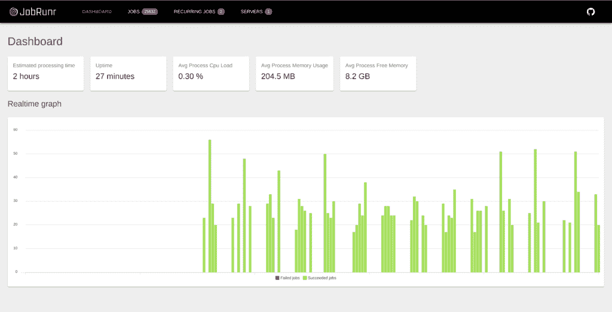
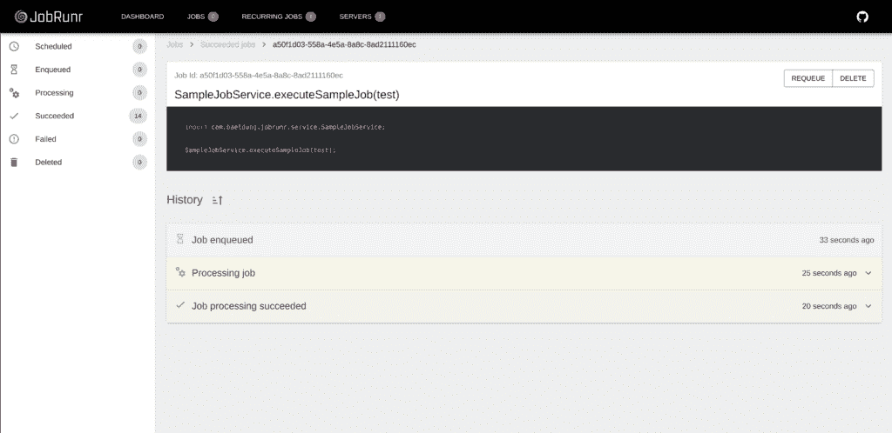

# JobRunr 春季后台作业

> 原文:[https://web . archive . org/web/20220930061024/https://www . bael dung . com/Java-job runr-spring](https://web.archive.org/web/20220930061024/https://www.baeldung.com/java-jobrunr-spring)

## 1.概观

在本教程中，我们将使用 JobRunr 研究 Java 中的分布式后台作业调度和处理，并将其与 Spring 集成。

## 2.关于 JobRunr

JobRunr 是一个我们可以嵌入到应用程序中的库，它允许我们使用 Java 8 lambda 调度后台作业。我们可以使用 Spring 服务的任何现有方法来创建作业，而无需实现接口。一个作业可以是一个短期或长期运行的进程，它会自动卸载到一个后台线程，这样当前的 web 请求就不会被阻塞。

为了完成工作，JobRunr 分析了 Java 8 lambda。它将其序列化为 JSON，并存储到关系数据库或 NoSQL 数据存储中。

## 3.JobRunr 功能

如果我们发现我们正在生成太多的后台作业，我们的服务器无法处理负载，我们可以通过添加额外的应用程序实例来轻松地进行水平扩展。JobRunr 将自动分担负载，并将所有作业分配给应用程序的不同实例。

它还包含一个**自动重试功能，以及一个针对失败作业的指数后退策略**。还有一个**内置的仪表盘**，可以让我们监控所有的工作。JobRunr 是自我维护的-**成功的作业将在一段可配置的时间后自动删除**，因此无需执行手动存储清理。

## 4.设置

为了简单起见，我们将使用内存中的数据存储来存储所有与作业相关的信息。

### 4.1.Maven 配置

让我们直接跳到 Java 代码。但是在此之前，我们需要在我们的`pom.xml`文件中声明下面的 [Maven 依赖关系](https://web.archive.org/web/20220628132518/https://search.maven.org/search?q=g:org.jobrunr%20AND%20a:jobrunr-spring-boot-starter):

```
<dependency>
    <groupId>org.jobrunr</groupId>
    <artifactId>jobrunr-spring-boot-starter</artifactId>
    <version>3.1.2</version>
</dependency>
```

### 4.2.弹簧集成

在我们直接跳到如何创建后台作业之前，我们需要初始化 JobRunr。由于我们使用了`jobrunr-spring-boot-starter`依赖关系，这很容易。我们只需要给`application.properties`添加一些属性:

```
org.jobrunr.background-job-server.enabled=true
org.jobrunr.dashboard.enabled=true
```

第一个属性告诉 JobRunr 我们想要启动一个负责处理作业的`BackgroundJobServer`实例。第二个属性告诉 JobRunr 启动嵌入式仪表板。

默认情况下，`jobrunr-spring-boot-starter`将尝试使用现有的`DataSource`来存储所有与工作相关的信息。

然而，由于我们将使用内存中的数据存储，我们需要提供一个`StorageProvider` bean:

```
@Bean
public StorageProvider storageProvider(JobMapper jobMapper) {
    InMemoryStorageProvider storageProvider = new InMemoryStorageProvider();
    storageProvider.setJobMapper(jobMapper);
    return storageProvider;
}
```

## 5.使用

现在，让我们看看如何使用 JobRunr 在 Spring 中创建和调度后台作业。

### 5.1.注入依赖项

当我们想要创建工作时，我们需要注入 [`JobScheduler`](https://web.archive.org/web/20220628132518/https://www.javadoc.io/doc/org.jobrunr/jobrunr/latest/org/jobrunr/scheduling/JobScheduler.html) 和我们现有的包含我们想要创建工作的方法的 Spring 服务，在本例中是`SampleJobService`:

```
@Inject
private JobScheduler jobScheduler;

@Inject
private SampleJobService sampleJobService;
```

JobRunr 的`JobScheduler`类允许我们对新的后台作业进行排队或调度。

`SampleJobService`可以是我们现有的任何 Spring 服务，包含一个在 web 请求中可能需要很长时间来处理的方法。它也可以是一个调用一些其他外部服务的方法，我们希望在这些外部服务中添加弹性，因为如果发生异常，JobRunr 将重试该方法。

### 5.2.创造一劳永逸的工作

现在我们有了依赖项，我们可以使用`enqueue`方法创建一次性工作:

```
jobScheduler.enqueue(() -> sampleJobService.executeSampleJob());
```

作业可以有参数，就像任何其他 lambda 一样:

```
jobScheduler.enqueue(() -> sampleJobService.executeSampleJob("some string"));
```

这一行确保 lambda——包括类型、方法和参数——作为 JSON 序列化到持久存储(一个 RDBMS，如 Oracle、Postgres、MySql 和 MariaDB 或 NoSQL 数据库)。

然后，在所有不同的`BackgroundJobServer`中运行的线程的专用工作池将以先进先出的方式尽快执行这些排队的后台作业。 **JobRunr 通过乐观锁定的方式保证单个工人执行您的作业。**

### 5.3.计划未来的作业

我们还可以使用`schedule`方法安排未来的作业:

```
jobScheduler.schedule(LocalDateTime.now().plusHours(5), () -> sampleJobService.executeSampleJob());
```

### 5.4.重复调度作业

如果我们想要有循环作业，我们需要使用`scheduleRecurrently`方法:

```
jobScheduler.scheduleRecurrently(Cron.hourly(), () -> sampleJobService.executeSampleJob());
```

### 5.5.使用`@Job`注释进行注释

为了控制作业的所有方面，我们可以用`@Job`注释来注释我们的服务方法。这允许在仪表板中设置显示名称，并配置作业失败时的重试次数。

```
@Job(name = "The sample job with variable %0", retries = 2)
public void executeSampleJob(String variable) {
    ...
}
```

我们甚至可以使用通过`String.format()`语法在显示名称中传递给我们的作业的变量。

如果我们有非常具体的用例，我们希望只在某个异常时重试特定的作业，我们可以编写自己的 [`ElectStateFilter`](https://web.archive.org/web/20220628132518/https://www.javadoc.io/doc/org.jobrunr/jobrunr/latest/org/jobrunr/jobs/filters/ElectStateFilter.html) ，这样我们就可以访问`Job`并完全控制如何继续。

## 6.仪表盘

JobRunr 带有一个内置的仪表板，允许我们监控我们的作业。我们可以在 [http://localhost:8000](https://web.archive.org/web/20220628132518/http://localhost:8000/) 找到它，并检查所有作业，包括所有重复的作业，以及估计处理完所有排队的作业需要多长时间:

[](/web/20220628132518/https://www.baeldung.com/wp-content/uploads/2020/10/jobrunr-overview-1024x524-1.png)

可能会发生不好的事情，例如，SSL 证书过期，或者磁盘已满。默认情况下，JobRunr 将使用指数后退策略重新调度后台作业。如果后台作业继续失败十次，那么它才会进入`Failed`状态。然后，当根本原因得到解决时，您可以决定将失败的作业重新排队。

所有这些都可以在仪表板中看到，包括每次重试时的确切错误消息以及作业失败原因的完整堆栈跟踪:

[](/web/20220628132518/https://www.baeldung.com/wp-content/uploads/2020/10/jobrunr-baeldung-1024x498-1.png)

## 7.结论

在本文中，我们使用带有`jobrunr-spring-boot-starter`的 JobRunr 构建了第一个基本调度程序。从本教程中得到的关键收获是，我们能够只用一行代码创建一个作业，不需要任何基于 XML 的配置，也不需要实现接口。

该示例的完整源代码可以在 GitHub 上的[处获得。](https://web.archive.org/web/20220628132518/https://github.com/eugenp/tutorials/tree/master/spring-boot-modules/spring-boot-libraries-2)