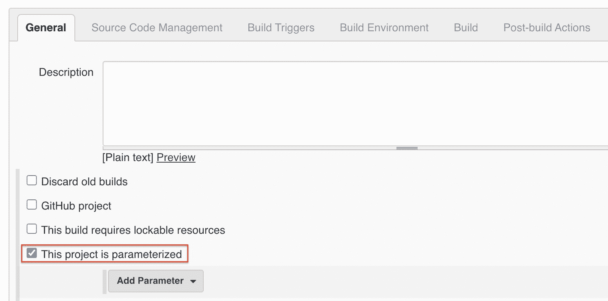
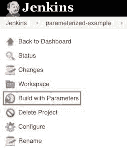
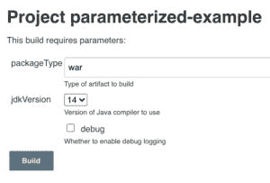

# Jenkins 参数化构建指南

> 原文：<https://web.archive.org/web/20220930061024/https://www.baeldung.com/ops/jenkins-parameterized-builds>

## 1.介绍

Jenkins 是当今最流行的 CI/CD 工具之一。它允许我们自动化软件生命周期的每个方面，从构建一直到部署。

在本教程中，我们将重点关注 Jenkins 的一个更强大的功能，参数化构建。

## 2.定义构建参数

**构建参数允许我们将数据传递到 Jenkins 作业中**。使用构建参数，我们可以传递任何想要的数据:git 分支名称、秘密凭证、主机名和端口等等。

任何詹金斯作业或[管道](/web/20221107193203/https://www.baeldung.com/jenkins-pipelines)都可以参数化。我们需要做的就是选中常规设置选项卡上的复选框，“`This project is parameterized”`:

然后我们点击`Add Parameter`按钮。从这里，我们必须指定几条信息:

*   `Type`:参数的数据类型(字符串、布尔等)。)
*   `Name`:标识参数的名称
*   `Default value`:可选值，用户未指定时使用
*   `Description`:描述如何使用参数的可选文本

**一个 Jenkins 作业或管道可以有多个参数**。唯一的限制是参数名必须唯一。

### 2.1.参数类型

Jenkins 支持几种参数类型。下面列出了最常见的参数类型，但是请记住，不同的插件可能会添加新的参数类型:

*   `String`:字符和数字的任意组合
*   `Choice`:一组预定义的字符串，用户可以从中选择一个值
*   `Credentials`:预定义的詹金斯凭证
*   `File`:文件系统上文件的完整路径
*   `Multi-line String`:与`String`相同，但允许换行符
*   `Password`:类似于`Credentials`类型，但是允许我们传递一个特定于作业或管道的纯文本参数
*   `Run`:另一个作业的单次运行的绝对 URL

## 3.使用构建参数

一旦我们定义了一个或多个参数，下一步就是利用它们。下面，我们将看看访问参数值的不同方法。

### 3.1.传统工作

对于传统的 Jenkins 工作，我们定义一个或多个构建`steps`。**最常见的构建步骤是执行 shell 脚本或 Windows 批处理命令**。

假设我们有一个名为`packageType`的构建参数。在 shell 脚本中，我们可以像访问任何其他环境变量一样使用 shell 语法来访问构建参数:

[PRE0]

对于批处理命令，我们使用本机 Windows 语法:

[PRE1]

我们还可以创建执行 Gradle 任务或 Maven 目标的构建步骤。**这两种步骤类型都可以像访问任何其他环境变量一样访问构建参数。**

### 3.2.管道

在 Jenkins 管道中，我们可以通过多种方式访问构建参数。

首先，所有构建参数都被放入一个`params`变量中。这意味着我们可以使用点符号来访问参数值:

[PRE2]

其次，将构建参数添加到管道的环境中。这意味着我们可以在执行 shell 脚本的步骤中使用较短的 shell 语法:

[PRE3]

## 4.设置参数值

到目前为止，我们已经看到了如何在 Jenkins 作业中定义和使用参数。最后一步是在执行作业时传递参数值。

### 4.1.詹金斯 UI

用 Jenkins UI 启动一个作业是传递构建参数的最简单的方法。我们只需登录，导航到我们的工作，然后点击`Build with Parameters` 链接:

这将把我们带到一个要求输入每个参数的屏幕。**根据参数的类型，我们输入其值的方式会有所不同**。

例如，`String`参数将显示为纯文本字段，`boolean` 参数显示为复选框，`Choice`参数显示为下拉列表:

一旦我们为每个参数提供了一个值，我们所要做的就是点击`Build`按钮，Jenkins 开始执行工作。

### 4.2.远程执行

Jenkins 作业也可以通过[远程 API 调用](https://web.archive.org/web/20221107193203/https://www.jenkins.io/doc/book/using/remote-access-api/)来执行。为此，我们在 Jenkins 服务器上调用了一个特殊的作业 URL:

[PRE4]

**注意，我们必须将这些请求作为`POST`命令**发送。我们还必须使用 HTTP basic auth 提供凭证。

让我们看看使用`curl`的完整示例:

[PRE5]

`user`可以是任何 Jenkins 用户，`apiToken`是该用户的任何关联的 [API 令牌](https://web.archive.org/web/20221107193203/https://www.jenkins.io/blog/2018/07/02/new-api-token-system/)。

## 5.结论

在本文中，我们学习了如何对 Jenkins 作业和管道使用构建参数。构建参数是使任何 Jenkins 作业动态化的强大方法，对于构建现代 CI/CD 管道至关重要。